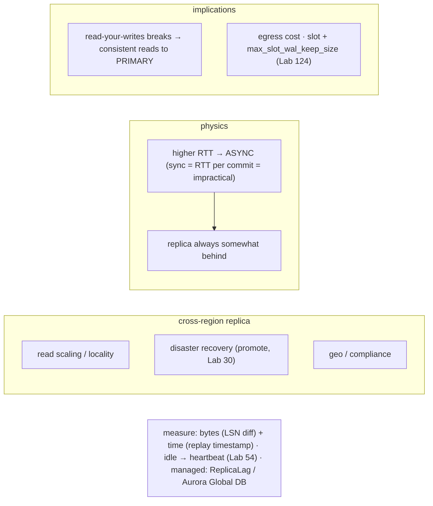

# Lab 137 — Read Replica Across Regions; Measure Cross-Region Lag

> **Track C · Cross-Cutting · C3 Cloud & Managed Services · Lab 4 of 5 (Lab 137/222)**
> Teaching package: concept → diagram → steps → verify → quick-ref → self-test → video script.
> **Depends on:** Lab 26 (streaming replication), Lab 54 (lag), Lab 124 (partition/lag), Lab 30 (promotion).

---

## 0. Lab Card (at a glance)

| Field | Value |
|---|---|
| **Objective** | Set up (or reason about) a cross-region read replica — self-managed streaming and managed (RDS/Aurora/Azure) — and measure the cross-region replication lag in bytes and time. |
| **Success criterion** | Lag is measured on the standby (LSN + time) and primary (`pg_stat_replication`); cross-region lag > same-region; the async / read-your-writes / DR implications are understood. |
| **Scope boundary** | Cross-region replicas + lag measurement. Failover/promotion mechanics are Lab 30. |
| **Prereqs** | Labs 26/54; two regions (or simulated latency) |
| **Time** | 35–50 min |
| **Difficulty** | ★★★★☆ |
| **Risk** | Low — read-mostly. |

---

## 1. Learning Objectives

1. **Why cross-region** — read scaling, DR, geo.
2. **Why async** — RTT vs commit latency.
3. **Measure lag** — bytes and time, both sides.
4. **Cross- vs same-region** — the RTT effect.
5. **Design implications** — read-your-writes, DR, cost.

---

## 2. Concept Primer — the "why"

**A cross-region read replica lives in a different geographic region than the primary.** Three reasons:
- **Read scaling / locality** — serve reads **close to regional users** (lower read latency for them).
- **Disaster recovery** — a warm standby in another region **survives a regional outage** and can be **promoted** (Lab 30) to become the new primary.
- **Geo-distribution / compliance** — data closer to regional users or in a required jurisdiction.

**Cross-region means higher RTT — so it's asynchronous.** The dominant factor is **network round-trip time** between regions (tens to hundreds of ms). **Synchronous** replication would make every commit **wait for the remote flush** — adding the full RTT to *every commit* — which is impractical over distance. So cross-region replicas are **async**: the replica is **always somewhat behind**, and lag grows with RTT and write volume. Use a **replication slot** (Lab 27) to retain WAL so the replica can catch up after a hiccup — but cap it with `max_slot_wal_keep_size` (Lab 124) so a slow cross-region link can't fill the primary's disk.

**Measuring lag (Lab 54) — both sides:**
- **On the replica:** bytes = `pg_wal_lsn_diff(pg_last_wal_receive_lsn(), pg_last_wal_replay_lsn())` (replay behind receive); time = `now() - pg_last_xact_replay_timestamp()`.
- **On the primary:** `pg_stat_replication` → `write_lag`, `flush_lag`, `replay_lag` (time), and the LSN diffs (`sent_lsn` vs `replay_lsn`); `application_name` identifies the cross-region replica.
- **Managed:** `ReplicaLag` (CloudWatch, seconds) / Azure's replica-lag metric.
Compare the measured lag to the **baseline network RTT** (`ping`/`mtr`) — lag ≈ transmit time + replay time; you can't beat the distance.

**The idle-lag trap (Lab 54):** on an idle system, `pg_last_xact_replay_timestamp()` doesn't advance, so the **time lag looks large falsely**. Fix with a **heartbeat** table the primary updates every few seconds, so the time metric stays accurate.

**Design implications (the practical takeaways):**
- **Read-your-writes consistency breaks.** Because the replica lags, a user who just wrote on the primary may **not see their own write** if the next read hits the cross-region replica. **Route consistency-sensitive reads to the primary** (or gate on LSN); use the replica for **eventually-consistent** reads.
- **DR promotion** — in a regional failover, promote the cross-region replica (Lab 30), fencing the old primary.
- **Egress cost** — cross-region data transfer is **billed**; monitor it.

**Managed cross-region options:**
- **AWS RDS** — a cross-region read replica (async). **Aurora Global Database** — a primary region + up to 5 secondaries, replicated via the storage layer, typically **<1s** cross-region lag (RPO ~1s, fast managed failover).
- **Azure** — cross-region read replicas for Flexible Server.

---

## 3. Diagrams

### 3.1 Cross-region flow

```mermaid
flowchart TD
    A["primary (region A)"] -->|async streaming (VPN/peering/SSL) + slot| B["read replica (region B)"]
    B --> C["measure baseline RTT (ping/mtr A↔B)"]
    B --> D["standby lag: receive_lsn vs replay_lsn (bytes) · now()-pg_last_xact_replay_timestamp (time)"]
    A --> E["primary: pg_stat_replication → write_lag/flush_lag/replay_lag · sent vs replay LSN"]
    D & E --> F["generate write load → observe lag rise"]
    F --> G["compare cross-region (higher) vs same-region · heartbeat for idle accuracy"]
    G --> H["managed: ReplicaLag metric / Aurora Global DB (<1s)"]
    H --> I([✔ cross-region lag measured])
```

### 3.2 Concept



---

## 4. Prerequisites — a cross-region (or latency-simulated) replica

```bash
# self-managed: a streaming standby in region B (Lab 129 script; primary_conninfo across regions, over SSL/VPN).
# to SIMULATE cross-region latency on a lab standby (add 80ms RTT toward the primary):
#   sudo tc qdisc add dev eth0 root netem delay 40ms   (40ms each way ≈ 80ms RTT)   [remove later: tc qdisc del dev eth0 root]
sudo -u postgres psql -p 5432 -c "SELECT application_name, state FROM pg_stat_replication;"   # replica connected
```

---

## 5. Step-by-Step

### Step 1 — Baseline the network RTT between regions

```bash
# from the standby host toward the primary (region A):
ping -c 5 <primary_ip> | tail -2      # note avg RTT (this bounds the minimum lag)
mtr -rwc 10 <primary_ip> 2>/dev/null | tail -5 || true
```

### Step 2 — Measure lag on the standby (bytes + time)

```bash
sudo -u postgres psql -p 5433 -x -c "
SELECT pg_last_wal_receive_lsn() AS received,
       pg_last_wal_replay_lsn()  AS replayed,
       pg_wal_lsn_diff(pg_last_wal_receive_lsn(), pg_last_wal_replay_lsn()) AS replay_behind_bytes,
       now() - pg_last_xact_replay_timestamp() AS time_lag;"
```

### Step 3 — Measure lag on the primary (pg_stat_replication)

```bash
sudo -u postgres psql -p 5432 -x -c "
SELECT application_name, client_addr, state,
       pg_size_pretty(pg_wal_lsn_diff(sent_lsn, replay_lsn)) AS behind_bytes,
       write_lag, flush_lag, replay_lag
FROM pg_stat_replication;"                                   # write/flush/replay_lag reflect the RTT
```

### Step 4 — Lag under write load (cross-region grows more)

```bash
sudo -u postgres pgbench -c 8 -T 30 benchdb -p 5432 >/dev/null 2>&1 &
sleep 15
sudo -u postgres psql -p 5432 -c "SELECT application_name, replay_lag FROM pg_stat_replication;"   # lag rises under load
sudo -u postgres psql -p 5433 -c "SELECT pg_wal_lsn_diff(pg_last_wal_receive_lsn(), pg_last_wal_replay_lsn()) AS bytes_behind;"
wait
```

### Step 5 — Heartbeat for accurate idle time-lag (Lab 54)

```bash
sudo -u postgres psql -p 5432 -d benchdb -c "
CREATE TABLE IF NOT EXISTS repl_heartbeat (id int PRIMARY KEY DEFAULT 1, ts timestamptz);
INSERT INTO repl_heartbeat (id, ts) VALUES (1, now()) ON CONFLICT (id) DO UPDATE SET ts=now();"
# on the standby, measure lag from the heartbeat (accurate even when otherwise idle):
sudo -u postgres psql -p 5433 -d benchdb -c "SELECT now() - ts AS heartbeat_lag FROM repl_heartbeat;"
```

### Step 6 — Read-your-writes demonstration + managed note

```bash
# write on primary, immediately read on the lagging cross-region replica:
sudo -u postgres psql -p 5432 -d benchdb -c "INSERT INTO repl_heartbeat (id, ts) VALUES (2, now()) ON CONFLICT (id) DO UPDATE SET ts=now();"
sudo -u postgres psql -p 5433 -d benchdb -c "SELECT count(*) FROM repl_heartbeat WHERE id=2;"   # may be 0 briefly (lag) → read-your-writes gap
echo "managed: RDS cross-region read replica · Aurora Global Database (<1s lag) · Azure read replica · lag = ReplicaLag metric"
# cleanup latency sim: sudo tc qdisc del dev eth0 root
```

---

## 6. Verification Checklist

- [ ] Baseline RTT measured (ping/mtr)
- [ ] Standby lag: `replay_behind_bytes` + `time_lag`
- [ ] Primary lag: `pg_stat_replication` write/flush/replay_lag
- [ ] Lag rises under write load
- [ ] Cross-region lag exceeds same-region (RTT effect)
- [ ] Heartbeat gives accurate idle time-lag
- [ ] Read-your-writes gap observed on the lagging replica

---

## 7. Troubleshooting

| Symptom | Cause | Fix |
|---|---|---|
| High cross-region lag | RTT/distance + bandwidth | Expected (async); ensure bandwidth; can't beat physics |
| Lag grows unbounded | Slow link / slot retaining WAL | `max_slot_wal_keep_size` (Lab 124); check bandwidth |
| Large time-lag on idle | No writes | Heartbeat table (Lab 54) |
| Read-your-writes inconsistency | Replica lags | Route consistent reads to the primary / gate on LSN |
| Sync cross-region too slow | Commit = RTT | Use **async** replication |
| Egress cost surprise | Cross-region transfer billed | Monitor; minimize replicated volume |
| Managed lag unclear | — | `ReplicaLag` (CloudWatch) / Azure metric; Aurora Global DB <1s |

---

## 8. Quick Reference Card (paste-ready)

```sql
-- STANDBY lag (bytes + time):
SELECT pg_wal_lsn_diff(pg_last_wal_receive_lsn(), pg_last_wal_replay_lsn()) AS replay_behind_bytes,
       now() - pg_last_xact_replay_timestamp() AS time_lag;
-- PRIMARY lag:
SELECT application_name, write_lag, flush_lag, replay_lag,
       pg_size_pretty(pg_wal_lsn_diff(sent_lsn, replay_lsn)) AS behind_bytes FROM pg_stat_replication;
-- heartbeat (accurate idle lag): primary UPSERTs now(); standby: SELECT now()-ts FROM repl_heartbeat;
```
```bash
# baseline: ping/mtr <primary>  (lag ≥ RTT) · cross-region = ASYNC (sync = RTT/commit = impractical)
# design: read-your-writes breaks → consistent reads to PRIMARY · slot + max_slot_wal_keep_size (Lab 124) · egress $$
# managed: RDS cross-region read replica · Aurora Global Database (<1s) · Azure read replica · lag = ReplicaLag metric
```

---

## 9. Self-Check

1. Why create a cross-region read replica?
2. Why is cross-region replication asynchronous?
3. How do you measure lag on the standby and primary?
4. Why is cross-region lag higher than same-region?
5. What's the read-your-writes implication?
6. What are the managed cross-region options?

<details>
<summary>Answers</summary>

1. Read scaling/locality for regional users, disaster recovery (survive a regional outage, promotable), and geo-distribution/compliance.
2. Synchronous replication would add the full RTT to **every commit** — impractical over distance — so cross-region is async.
3. Standby: `receive_lsn` vs `replay_lsn` (bytes) and `now() - pg_last_xact_replay_timestamp()` (time); primary: `pg_stat_replication` `write_lag`/`flush_lag`/`replay_lag` + LSN diffs.
4. The network **RTT/distance** dominates — WAL takes longer to travel between regions.
5. The async replica lags, so a user may **not see their own write** on it — route consistency-sensitive reads to the **primary**.
6. RDS cross-region read replica, **Aurora Global Database** (<1s lag), and Azure cross-region read replicas; lag is the `ReplicaLag` metric.
</details>

---

## 10. Video / Teaching Script

| # | On screen | Say (narration) |
|---|---|---|
| 1 | Title: "A replica an ocean away" | "Put a read replica in another region — closer to users, or a lifeboat for disaster recovery. But distance changes everything." |
| 2 | async | "You *can't* replicate synchronously across regions — every commit would wait a full round trip. So it's async, always a little behind." |
| 3 | measure | "Measure it two ways: bytes behind, and seconds behind. On the replica, and on the primary. Compare it to the raw ping — the network sets the floor." |
| 4 | load | "Add write load and the gap widens. That's expected — you're pushing more WAL across the ocean." |
| 5 | read-your-writes | "The gotcha: a user writes, then reads — and doesn't see it, because the read hit the lagging replica. Route reads that must be current to the primary." |
| 6 | managed | "Managed makes it a checkbox — and Aurora Global Database keeps it under a second. But the physics, and the design rules, are the same." |
| 7 | Outro | "Distance, measured and managed. Next: cost and right-sizing in the cloud." |

---

## 11. Glossary

- **Cross-region replica** — a read replica in another region.
- **RTT** — round-trip network time (bounds the lag).
- **Async replication** — replica lags; required cross-region.
- **`replay_lag` / LSN diff** — time / byte lag.
- **Read-your-writes** — seeing your own write (breaks on a lagging replica).
- **Aurora Global Database** — managed multi-region, <1s lag.
- **`ReplicaLag`** — the managed lag metric.

---
*NETAPORT lab series · PostgreSQL 17 on AlmaLinux 9 · Lab 137/222 · C3 Cloud & Managed Services*
