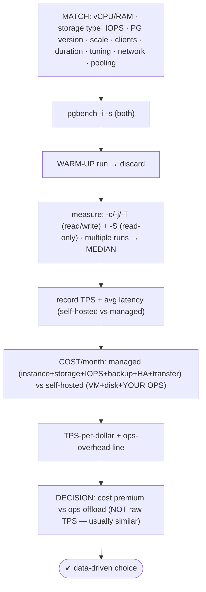
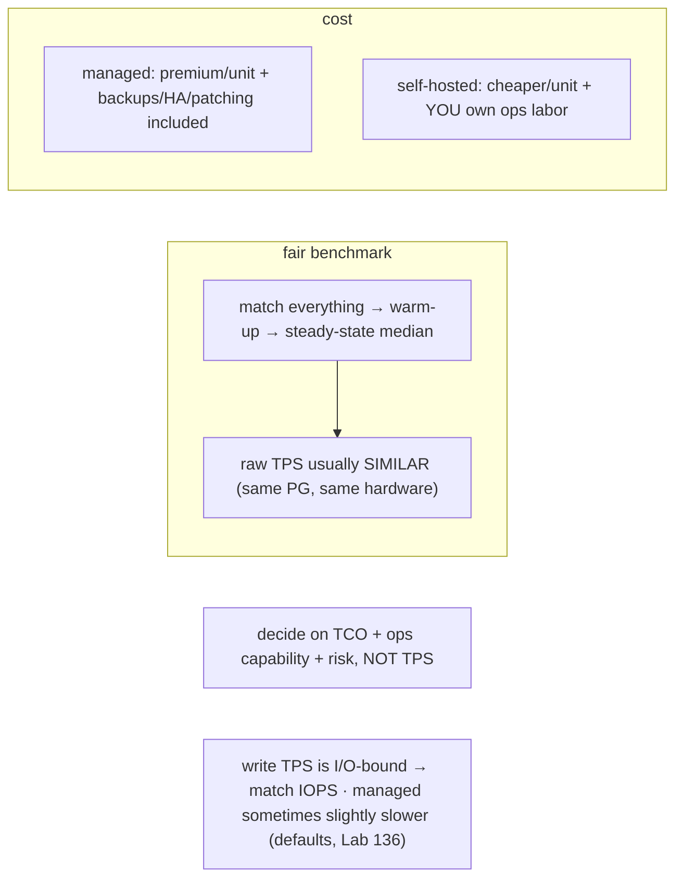

# Lab 138 — Cost/Benchmark: `pgbench` TPS on Self-Hosted vs Managed at Matched vCPU/RAM

> **Track C · Cross-Cutting · C3 Cloud & Managed Services · Lab 5 of 5 (Lab 138/222 · C3 complete)**
> Teaching package: concept → diagram → steps → verify → quick-ref → self-test → video script.
> **Depends on:** Lab 09 (pgbench/tuning), Lab 134 (cloud storage/IOPS), Lab 136 (managed gaps), Lab 37 (pooling).

---

## 0. Lab Card (at a glance)

| Field | Value |
|---|---|
| **Objective** | Benchmark `pgbench` TPS on a self-hosted and a managed instance sized to the same vCPU/RAM, compute TPS-per-dollar, and build a decision framework weighing cost vs operational burden. |
| **Success criterion** | A fair, matched benchmark yields comparable steady-state TPS; a cost table gives TPS/$; the decision hinges on cost premium vs ops offload, not raw throughput. |
| **Scope boundary** | Benchmark + cost comparison. Managed config gaps were Lab 136. |
| **Prereqs** | Lab 09; a self-hosted VM + a managed instance |
| **Time** | 40–60 min |
| **Difficulty** | ★★★★☆ |
| **Risk** | Low — benchmarking. |

---

## 1. Learning Objectives

1. **Fair-benchmark methodology** — what to match.
2. **`pgbench`** — init, warm-up, steady-state runs.
3. **Record TPS + latency** for both.
4. **The full cost model** — managed vs self-hosted.
5. **The decision framework** — cost vs ops.

---

## 2. Concept Primer — the "why"

**A fair comparison matches *everything* — or the numbers lie.** To compare self-hosted vs managed PostgreSQL honestly, hold constant:
- **vCPU + RAM** — the same instance class (e.g. 4 vCPU / 16 GB both).
- **Storage type + IOPS** — matched (gp3 with the same provisioned IOPS, Lab 134); **write TPS is I/O-bound**, so mismatched IOPS invalidates everything.
- **PostgreSQL version, scale factor, client count, duration.**
- **Tuning** — managed uses its defaults (Lab 136); either match settings (apples-to-apples) or tune self-hosted and accept managed defaults (real-world) — **document which**.
- **Network proximity** — run `pgbench` from a **client close to each DB** (same region/AZ) so network latency doesn't skew results; connect over **TCP to both** for fairness (not a local socket to only the self-hosted one).
- **Pooling** — if the target architecture uses a pooler (RDS Proxy / PgBouncer), benchmark with it.

**`pgbench` methodology (Lab 09, with rigor):**
- **Init:** `pgbench -i -s <scale>` — scale × 100k rows in `pgbench_accounts`. Pick the scale to match the workload's working-set-vs-RAM ratio (small scale = CPU-bound in-cache; large scale = I/O-bound).
- **Warm-up:** run once to fill the cache; **discard** it.
- **Measure:** `pgbench -c <clients> -j <threads> -T <duration> -P <interval>` — `-c` concurrency, `-j` worker threads (≤ cores), `-T` a long run (**≥ 300s** for steady state), `-P` progress. **`-S`** = select-only (read TPS); **default** = TPC-B-like read/write mix.
- **Repeat** several times and take the **median** — steady-state, reproducible.
- Report **TPS** (excluding connection establishment) and **average latency**.

**The full cost model — this is where they actually differ:**
- **Managed** ($/month): instance ($/hr) + storage ($/GB) + provisioned IOPS + **backup storage** + **Multi-AZ/HA (~2×)** + data transfer + support.
- **Self-hosted** ($/month): VM ($/hr) + disk ($/GB) + **your operational labor** — patching, backups, HA, monitoring (the Lab 136 gaps you now own). This "hidden" ops cost is real.
- **TPS-per-dollar** = TPS ÷ ($/month) — the price/performance number — **plus** an explicit line for the **operational overhead** managed offloads.

**The insight that reframes the decision.** At matched vCPU/RAM/IOPS, **raw TPS is usually *similar*** — it's the **same PostgreSQL** on the **same hardware class**. Managed doesn't make Postgres magically faster; it's sometimes **slightly slower** (conservative defaults, Lab 136; the storage/network layer). So **the decision is not about throughput.** It's:
- **Managed** — a **cost premium** per compute unit, in exchange for **offloaded operations** (automated backups/PITR, HA/failover, patching, durability enforced — Lab 136) and less staffing.
- **Self-hosted** — **cheaper per unit** and **full control**, but **you own all the operations**.

**Pick based on total cost of ownership + risk tolerance, not TPS.** For a small team, the managed premium often *saves money* once you price your own ops time; at scale, self-hosting's per-unit savings can dominate — if you have the ops capability.

---

## 3. Diagrams

### 3.1 Benchmark + cost flow



### 3.2 Concept



---

## 4. Prerequisites — matched instances

```bash
# self-hosted: a VM (e.g. 4 vCPU / 16 GB) + gp3 volume with matched IOPS (Lab 134)
# managed: an RDS/Azure instance of the SAME class (e.g. db.m6i.xlarge = 4 vCPU / 16 GB) + gp3 same IOPS
# a benchmark CLIENT near each DB (same region/AZ). Connect over TCP to BOTH for fairness.
which pgbench; nproc; free -h
```

---

## 5. Step-by-Step

### Step 1 — Initialize both at the same scale

```bash
# scale 100 ≈ ~1.5GB (in-cache on 16GB) → CPU-bound; scale 2000 ≈ ~30GB → I/O-bound. Match to your workload.
SCALE=200
sudo -u postgres pgbench -i -s $SCALE -h SELF_HOST  -U bench benchdb
sudo -u postgres pgbench -i -s $SCALE -h MANAGED_EP -U bench benchdb
```

### Step 2 — Warm-up (discard)

```bash
for H in SELF_HOST MANAGED_EP; do
  pgbench -h $H -U bench -c 8 -j 4 -T 60 benchdb >/dev/null 2>&1     # warm the cache; throw away
done
```

### Step 3 — Read/write benchmark (median of 3)

```bash
run_bench(){ # host clients duration [-S]
  local best; for i in 1 2 3; do
    tps=$(pgbench -h "$1" -U bench -c "$2" -j 4 -T "$3" ${4:-} benchdb 2>/dev/null | awk '/tps.*without/{print $3}')
    echo "  run $i: ${tps} tps"; best="${best:-$tps}"
  done
}
echo "== SELF-HOSTED read/write ==";  run_bench SELF_HOST  16 300
echo "== MANAGED   read/write ==";     run_bench MANAGED_EP 16 300
```

### Step 4 — Read-only benchmark (-S)

```bash
echo "== SELF-HOSTED read-only (-S) =="; run_bench SELF_HOST  16 120 -S
echo "== MANAGED   read-only (-S) ==";    run_bench MANAGED_EP 16 120 -S
# also capture latency: pgbench prints 'latency average = X ms'
```

### Step 5 — Record results (fill-in)

```bash
cat <<'EOF'
| Metric                 | Self-hosted | Managed | Notes                          |
|------------------------|-------------|---------|--------------------------------|
| Read/write TPS (median)|             |         | -c16 -j4 -T300                 |
| Read-only TPS (-S)     |             |         | -c16 -j4 -T120 -S              |
| Avg latency (ms)       |             |         |                                |
| Tuning                 | tuned       | default | Lab 136 gap — note which       |
EOF
```

### Step 6 — Cost + TPS-per-dollar + decision

```bash
cat <<'EOF'
=== COST / month (fill from your pricing) ===
  MANAGED:     instance $__ + storage $__ + IOPS $__ + backup $__ + Multi-AZ(×2) $__ + transfer $__  = $____
  SELF-HOSTED: VM $__ + disk $__ + OPS LABOR (patching/backups/HA/monitoring) $____                  = $____

=== TPS per dollar ===  TPS ÷ ($/month)   → managed $__/TPS   vs   self-hosted $__/TPS
  (+ price the OPS OVERHEAD managed offloads: backups, HA, patching, on-call)

=== DECISION ===
  raw TPS at matched hardware ≈ SIMILAR (same PostgreSQL) → decide on:
    • cost premium (managed higher $/unit)
    • ops burden offloaded (managed: backups/PITR/HA/patching) vs owned (self-hosted)
    • your team's ops capability + risk tolerance + scale
  small team → managed premium often pays for itself · large scale + ops capability → self-host for cost+control
EOF
```

---

## 6. Verification Checklist

- [ ] vCPU/RAM/storage/IOPS/PG-version/scale/clients/duration matched
- [ ] Warm-up run discarded
- [ ] Read/write + read-only TPS measured as medians of ≥3 runs
- [ ] Latency recorded; tuning difference documented
- [ ] Full cost tabulated (managed extras + self-hosted ops labor)
- [ ] TPS-per-dollar computed
- [ ] Decision framed on cost + ops, not raw TPS

---

## 7. Troubleshooting

| Symptom | Cause | Fix |
|---|---|---|
| Unstable TPS | Short run / cold cache | Warm up; `-T ≥ 300`; median of runs |
| Managed slower | Conservative defaults | Match the parameter group (Lab 136), or note the gap |
| Write TPS capped | IOPS limit | Match IOPS; write TPS is I/O-bound (Lab 09) |
| Latency skewed for managed | Distant client | Benchmark from a nearby client; TCP to both |
| Unfair comparison | Mismatched specs/tuning | Match all; document exceptions |
| Connection overhead dominates | `-C` reconnect per txn | Default reuses the connection |
| Cost not apples-to-apples | Missing components | Include HA/backup/transfer + self-hosted ops labor |

---

## 8. Quick Reference Card (paste-ready)

```bash
# FAIR benchmark: match vCPU/RAM · storage+IOPS · PG version · scale · clients · duration · tuning · network · pooling
pgbench -i -s <scale> -h <host> -U bench db          # init (scale → in-cache vs I/O-bound)
pgbench -h <host> -c 16 -j 4 -T 60  db               # WARM-UP (discard)
pgbench -h <host> -c 16 -j 4 -T 300 db               # read/write TPS (median of ≥3)
pgbench -h <host> -c 16 -j 4 -T 120 -S db            # read-only TPS
#   report: tps (without connection establishing) + latency average

# COST/month: managed (instance+storage+IOPS+backup+Multi-AZ×2+transfer) vs self-hosted (VM+disk+YOUR OPS labor)
# TPS/$ = tps ÷ ($/month) · + price the ops managed offloads
# INSIGHT: raw TPS ≈ similar at matched hardware → decide on COST PREMIUM vs OPS OFFLOAD, not throughput
```

---

## 9. Self-Check

1. What must you match for a fair benchmark?
2. What are the key `pgbench` options and why warm up?
3. Why take the median of multiple runs?
4. What are the cost components on each side?
5. What's the typical TPS finding at matched hardware?
6. What's the real decision driver?

<details>
<summary>Answers</summary>

1. vCPU, RAM, storage type + **IOPS**, PG version, scale, client count, duration, tuning, network proximity, and pooling.
2. `-i -s` (init/scale), `-c`/`-j`/`-T`/`-P` (clients/threads/time/progress), `-S` (read-only). Warm up to fill the cache so you measure **steady state**, not cold-cache I/O.
3. To get a **stable, reproducible** number (the median) rather than a noisy single run.
4. Managed: instance + storage + IOPS + backup + **HA (~2×)** + transfer + support; self-hosted: VM + disk + **your operational labor**.
5. **Similar** — it's the same PostgreSQL on the same hardware class; managed is sometimes slightly slower (defaults/storage/network).
6. Not raw TPS but the **cost premium** (managed higher $/unit) vs the **operational burden** managed offloads — decided on TCO, ops capability, and risk.
</details>

---

## 10. Video / Teaching Script

| # | On screen | Say (narration) |
|---|---|---|
| 1 | Title: "Managed vs self-hosted: the honest benchmark" | "Does managed Postgres run faster? Let's actually measure it — same CPU, same RAM, same storage — and then talk about what really matters: cost." |
| 2 | match | "The catch is fairness. Same everything — especially IOPS, because writes are I/O-bound. Mismatch that, and the benchmark's a lie." |
| 3 | run | "Warm up, then hammer both with pgbench for five minutes. Take the median, not a lucky run." |
| 4 | similar | "And the surprise? The TPS is *about the same*. It's the same Postgres on the same hardware. Managed isn't magic." |
| 5 | cost | "So the real difference is the bill — managed charges a premium — versus what self-hosting *actually* costs you: your time, patching, backups, on-call." |
| 6 | decide | "That's the decision. Pay the premium to offload operations, or self-host to save money and keep control — if your team can carry the ops." |
| 7 | Outro | "Decide with data. That completes the cloud track." |

---

## 11. Glossary

- **`pgbench` / TPS** — the standard benchmark / transactions per second.
- **Scale factor** — data size (in-cache vs I/O-bound).
- **Warm-up / steady-state** — fill cache / measure stable throughput.
- **Matched instance** — same vCPU/RAM/storage/IOPS.
- **TPS-per-dollar** — price/performance.
- **Operational cost** — the labor self-hosting adds.
- **Managed premium** — the extra $/unit for offloaded ops.

---
*NETAPORT lab series · PostgreSQL 17 on AlmaLinux 9 · Lab 138/222 · **C3 Cloud & Managed Services complete***
