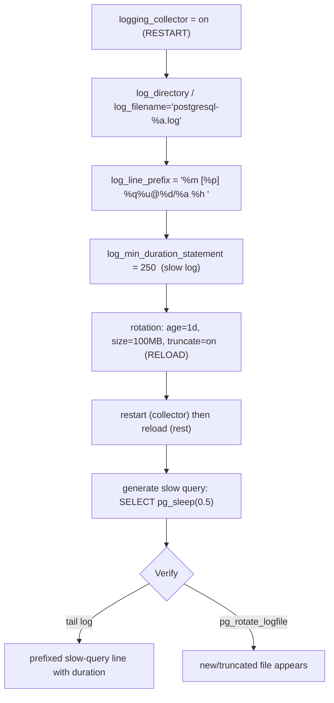
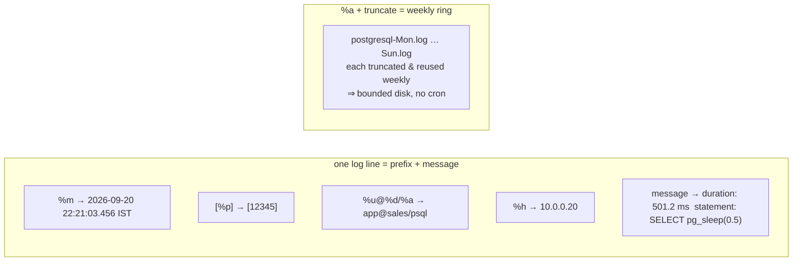

# Lab 14 — Configure Logging: `logging_collector`, `log_line_prefix`, `log_min_duration_statement`, Rotation

> **Track A · DBA · A2 Configuration & Tuning · Lab 6 of 7 (Lab 14/222)**
> Teaching package: concept → diagram → steps → verify → quick-ref → self-test → video script.
> **Depends on:** Labs 01–13 (running cluster; you know reload vs restart from Lab 13).
> **Feeds:** Lab 56 (pgBadger) — the prefix here is chosen to be pgBadger-parseable.

---

## 0. Lab Card (at a glance)

| Field | Value |
|---|---|
| **Objective** | Turn on the log collector, set an informative pgBadger-compatible `log_line_prefix`, enable a slow-query log via `log_min_duration_statement`, and configure self-managing rotation. |
| **Success criterion** | Log files appear in `log_directory`; a slow query is captured with the full prefix; rotation is configured (and a manual rotation produces a new/truncated file). |
| **Scope boundary** | Server logging config + rotation. Parsing logs into reports is Lab 56; wait-event analysis Lab 187. |
| **Prereqs** | Labs 01–13; superuser |
| **Time** | 20–30 min |
| **Difficulty** | ★★☆☆☆ |
| **Risk** | Low — over-logging (`=0`) fills disk; the lab uses a threshold + rotation to prevent that. |

---

## 1. Learning Objectives

1. **Own the collector** — `logging_collector` on, `log_directory`/`log_filename`, and why it needs a restart.
2. **Write a useful `log_line_prefix`** — the tokens that make a line self-describing *and* machine-parseable.
3. **Run a slow-query log** — `log_min_duration_statement` as a threshold, not an all-or-nothing switch.
4. **Rotate without cron** — the `%a` + `log_truncate_on_rotation` self-cleaning ring, plus size/age.
5. **Bonus: a production logging baseline** — checkpoints, lock waits, temp files.

---

## 2. Concept Primer — the "why"

**`logging_collector` (restart-only).** With it **on**, PostgreSQL captures stderr and writes rotating files into `log_directory`, managing rotation itself. Off, logs go to stderr/journald/syslog. For a server you'll analyze later, **on** with file output is what you want. It's a `postmaster` param (Lab 13) → **restart** to toggle. `log_directory` defaults to `log` (i.e. `$PGDATA/log`); `log_filename` is a strftime pattern.

**`log_line_prefix` (reload).** The text prepended to every log line. Tokens:

| Token | Meaning | Token | Meaning |
|---|---|---|---|
| `%m` | timestamp (ms) | `%u` | user |
| `%p` | PID | `%d` | database |
| `%a` | application_name | `%h` | client host |
| `%r` | remote host:port | `%e` | SQLSTATE |
| `%c` | session id | `%q` | stop here for non-session procs |

A good, **pgBadger-parseable** prefix:
```
log_line_prefix = '%m [%p] %q%u@%d/%a %h '
```
`%q` is the clever bit: background processes (checkpointer, autovacuum) have no user/db, so `%q` tells PostgreSQL to drop everything after it for them — clean lines either way.

**`log_min_duration_statement` (reload) — the slow-query log.** Logs any statement whose duration ≥ N ms, **with its duration and text**:
- `-1` = off (default)
- `0` = **every** statement (great for a dev deep-dive, disastrous on a busy prod — fills disk)
- `250` = statements ≥ 250 ms — the **production sweet spot** (your slow log)

Don't confuse it with `log_statement` (logs by *type*: `none`/`ddl`/`mod`/`all`, no timing) or `log_duration` (times everything). `log_min_duration_statement` is threshold + duration + text in one. (For sampling faster queries too, PG13+ adds `log_min_duration_sample` + `log_statement_sample_rate`.)

**Rotation (reload) — bounded disk, no cron.** The collector rotates on:
- `log_rotation_age` (e.g. `1d`) — time-based
- `log_rotation_size` (e.g. `100MB`) — size-based
- `log_truncate_on_rotation` (`on`) — overwrite a same-named existing file

The elegant pattern: `log_filename='postgresql-%a.log'` (`%a` = Mon…Sun) + `log_rotation_age='1d'` + `log_truncate_on_rotation=on` → **seven files, one per weekday, each truncated and reused weekly**. Disk stays bounded automatically, no external logrotate, no cron. (If you instead use unique names, pair with OS logrotate — but don't double-manage the collector's own files.)

**SELinux note.** Default `log_directory` inside `$PGDATA` is already correctly labeled. If you point it *outside* (e.g. `/var/log/postgresql`), create it owned by `postgres` and label it `postgresql_log_t` (`semanage fcontext` + `restorecon`, per Lab 4) or the collector can't write.

---

## 3. Diagrams

### 3.1 Configure + verify flow



### 3.2 A log line + the rotation ring



---

## 4. Prerequisites

```bash
PGDATA=/var/lib/pgsql/17/data
sudo -u postgres psql -c "SHOW logging_collector; SHOW log_directory; SHOW log_min_duration_statement;"
```

---

## 5. Step-by-Step

### Step 1 — Set all logging params via ALTER SYSTEM

```bash
sudo -u postgres psql <<'SQL'
ALTER SYSTEM SET logging_collector          = on;                      -- postmaster → restart
ALTER SYSTEM SET log_directory              = 'log';                   -- $PGDATA/log
ALTER SYSTEM SET log_filename               = 'postgresql-%a.log';     -- weekday ring
ALTER SYSTEM SET log_line_prefix            = '%m [%p] %q%u@%d/%a %h ';
ALTER SYSTEM SET log_min_duration_statement = '250ms';                 -- slow-query log
ALTER SYSTEM SET log_rotation_age           = '1d';
ALTER SYSTEM SET log_rotation_size          = '100MB';
ALTER SYSTEM SET log_truncate_on_rotation   = on;
SQL
```

### Step 2 — Restart (for the collector), which also loads the rest

```bash
sudo systemctl restart postgresql-17
sudo -u postgres psql -c "SHOW logging_collector;"     # on
ls -l "$PGDATA/log/"                                    # a postgresql-<Day>.log now exists
```

### Step 3 — Add a production logging baseline (bonus, reload-only)

```bash
sudo -u postgres psql <<'SQL'
ALTER SYSTEM SET log_checkpoints            = on;      -- checkpoint timing (I/O health)
ALTER SYSTEM SET log_lock_waits             = on;      -- sessions blocked > deadlock_timeout
ALTER SYSTEM SET log_temp_files             = '0';     -- any temp file (work_mem spills)
ALTER SYSTEM SET log_autovacuum_min_duration= '0';     -- autovacuum activity
ALTER SYSTEM SET log_connections            = on;
ALTER SYSTEM SET log_disconnections         = on;
SQL
sudo -u postgres psql -c "SELECT pg_reload_conf();"    -- all sighup → reload, no restart
```

### Step 4 — Generate a slow query and see it logged

```bash
sudo -u postgres psql -c "SELECT pg_sleep(0.5);"       # 500ms ≥ 250ms threshold
sudo tail -n 5 "$PGDATA/log/postgresql-$(date +%a).log"
#   → 2026-09-20 22:21:03.456 IST [12345] postgres@postgres/psql  LOG:  duration: 501.2 ms  statement: SELECT pg_sleep(0.5);
```

### Step 5 — Force a rotation to prove it works

```bash
sudo -u postgres psql -c "SELECT pg_rotate_logfile();"   # manual rotation now
ls -lt "$PGDATA/log/"                                    # observe the fresh/truncated file
```

---

## 6. Verification Checklist

- [ ] `SHOW logging_collector` → **on**; files present in `log_directory`
- [ ] Log lines carry the full prefix (timestamp, PID, user@db/app, host)
- [ ] A ≥250 ms statement is logged with `duration:` and its text
- [ ] `log_rotation_age`/`size` and `log_truncate_on_rotation` set
- [ ] `pg_rotate_logfile()` produces a new/truncated file
- [ ] Baseline extras active (`log_checkpoints`, `log_lock_waits`, `log_temp_files`)
- [ ] Prefix is pgBadger-parseable (for Lab 56)

---

## 7. Troubleshooting

| Symptom | Cause | Fix |
|---|---|---|
| No log files appear | `logging_collector` off (needs restart) or dir perms/SELinux | Restart; check `log_directory` ownership/label |
| Slow query not logged | `log_min_duration_statement=-1` or threshold too high, or not reloaded | Set a threshold (e.g. 250ms) and reload |
| Log dir outside `$PGDATA` won't write | Missing SELinux label / ownership | Own by `postgres`; `semanage fcontext -t postgresql_log_t` + `restorecon` (Lab 4) |
| Disk filling with logs | `=0` (log everything) and/or no rotation | Use a threshold >0; enable age+size+truncate |
| pgBadger can't parse | Prefix missing required tokens | Use a prefix with `%m %p %u %d` (Lab 56 details) |
| Logs go to journald, not files | Collector off under systemd | `logging_collector=on` + restart |
| Timestamps wrong zone | `log_timezone` | Set `log_timezone` to your zone |

---

## 8. Quick Reference Card (paste-ready)

```bash
PGDATA=/var/lib/pgsql/17/data
sudo -u postgres psql <<'SQL'
ALTER SYSTEM SET logging_collector          = on;
ALTER SYSTEM SET log_directory              = 'log';
ALTER SYSTEM SET log_filename               = 'postgresql-%a.log';
ALTER SYSTEM SET log_line_prefix            = '%m [%p] %q%u@%d/%a %h ';
ALTER SYSTEM SET log_min_duration_statement = '250ms';
ALTER SYSTEM SET log_rotation_age           = '1d';
ALTER SYSTEM SET log_rotation_size          = '100MB';
ALTER SYSTEM SET log_truncate_on_rotation   = on;
-- production baseline:
ALTER SYSTEM SET log_checkpoints=on;  ALTER SYSTEM SET log_lock_waits=on;
ALTER SYSTEM SET log_temp_files='0';  ALTER SYSTEM SET log_autovacuum_min_duration='0';
SQL
sudo systemctl restart postgresql-17        # collector needs restart; loads the rest too

# verify
sudo -u postgres psql -c "SELECT pg_sleep(0.5);"
sudo tail -n 5 "$PGDATA/log/postgresql-$(date +%a).log"
sudo -u postgres psql -c "SELECT pg_rotate_logfile();"

# log_min_duration_statement:  -1 off | 0 EVERYTHING (noisy) | 250 slow-log (recommended)
# rotation ring:  filename %a + truncate_on_rotation + rotation_age 1d  ⇒  7-file weekly ring, no cron
```

---

## 9. Self-Check

1. Which logging param needs a **restart**, and which need only a **reload**?
2. What do `log_min_duration_statement = -1 / 0 / 250` each do?
3. How do `%a` filename + `log_truncate_on_rotation` + `log_rotation_age` combine into a self-cleaning ring?
4. How does `log_min_duration_statement` differ from `log_statement`?
5. One command to force a rotation right now.
6. You point `log_directory` at `/var/log/postgresql` under Enforcing SELinux and the collector can't write — what's missing?

<details>
<summary>Answers</summary>

1. `logging_collector` (postmaster → restart); the rest — directory, filename, prefix, `log_min_duration_statement`, rotation — are `sighup` → reload.
2. `-1` off; `0` logs every statement (with durations — very noisy); `250` logs only statements ≥ 250 ms (the slow-query log).
3. `%a` names files by weekday (7 names), `log_truncate_on_rotation` overwrites a same-named file, and `log_rotation_age=1d` rotates daily — so each weekday's file is reused and truncated weekly, bounding disk with no cron.
4. `log_min_duration_statement` logs statements over a **duration threshold**, with timing and text; `log_statement` logs by **type** (`none`/`ddl`/`mod`/`all`) with no threshold or duration.
5. `SELECT pg_rotate_logfile();`.
6. The directory needs `postgres` ownership and the `postgresql_log_t` SELinux label (`semanage fcontext` + `restorecon`).
</details>

---

## 10. Video / Teaching Script

| # | On screen | Say (narration) |
|---|---|---|
| 1 | Title: "Logging you can actually use" | "Default logs are barely readable and grow forever. Let's fix both — and set up a slow-query log while we're at it." |
| 2 | `logging_collector=on` + restart | "Turn on the collector so PostgreSQL writes and rotates its own files. This one needs a restart." |
| 3 | `log_line_prefix` tokens | "Now make every line self-describing: time, process, who, which database, from where. And %q keeps background processes tidy." |
| 4 | `log_min_duration_statement=250` | "The star: a slow-query log. Not zero — that logs *everything* and floods your disk. 250 milliseconds is the sweet spot." |
| 5 | rotation ring | "Rotation, the clever way: name files by weekday and truncate on reuse. Seven files, bounded disk, no cron job." |
| 6 | `pg_sleep(0.5)` + tail | "Prove it — a half-second query, and there it is in the log with its duration and the full prefix." |
| 7 | baseline extras | "A few more worth having: checkpoints, lock waits, temp-file spills — the things you'll actually chase later." |
| 8 | `pg_rotate_logfile()` | "And rotation on demand, one command." |
| 9 | Outro | "Clean, bounded, parseable logs — exactly what pgBadger will turn into reports later. Next: WAL sync method benchmarking." |

---

## 11. Glossary

- **`logging_collector`** — captures stderr to rotating files (restart to toggle).
- **`log_directory` / `log_filename`** — where logs go / strftime name pattern.
- **`log_line_prefix`** — per-line prefix format; tokens like `%m %p %u %d %a %h %q`.
- **`log_min_duration_statement`** — slow-query threshold in ms (`-1` off, `0` all).
- **`log_rotation_age` / `_size` / `log_truncate_on_rotation`** — rotation controls.
- **`pg_rotate_logfile()`** — force a rotation now.
- **`log_lock_waits` / `log_temp_files` / `log_checkpoints`** — diagnostic baseline settings.

---
*NETAPORT lab series · PostgreSQL 17 on AlmaLinux 9 · Lab 14/222 · A2 Configuration & Tuning*
