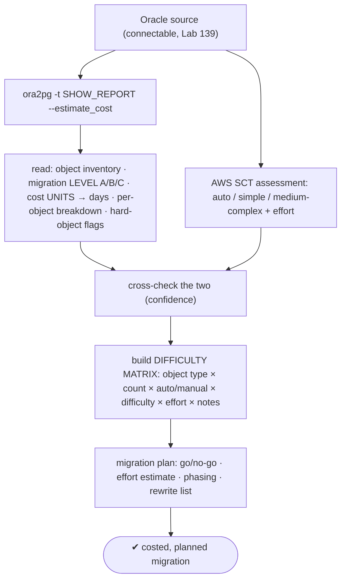
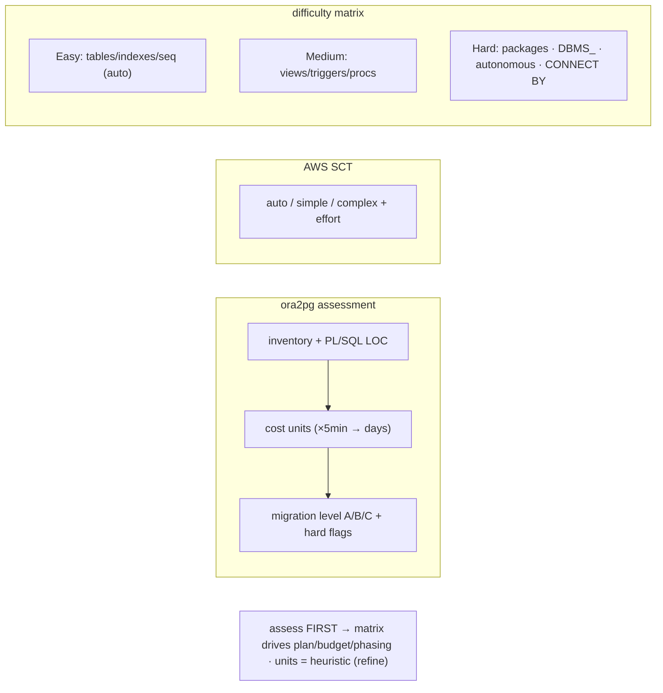

# Lab 140 — Assessment: `ora2pg SHOW_REPORT --estimate_cost` (+ SCT); Read the Score, Produce a Migration Difficulty Matrix

> **Track D · Migration · D1 Tooling & Assessment · Lab 2 of 8 (Lab 140/222)**
> Teaching package: concept → diagram → steps → verify → quick-ref → self-test → video script.
> **Depends on:** Lab 139 (tooling box), Lab 88 (recursive CTE = CONNECT BY target), Lab 110 (PL/pgSQL).

---

## 0. Lab Card (at a glance)

| Field | Value |
|---|---|
| **Objective** | Run the ora2pg assessment (and SCT) against an Oracle source, read the migration level / cost / per-object breakdown, cross-check, and build a migration difficulty matrix. |
| **Success criterion** | You produce an effort estimate (level + person-days), identify the hard objects, and deliver a difficulty matrix that drives the migration plan. |
| **Scope boundary** | Assessment + planning artifact. Actual schema/data conversion is Labs 141+. |
| **Prereqs** | Lab 139; a connectable Oracle source |
| **Time** | 35–50 min |
| **Difficulty** | ★★★★☆ |
| **Risk** | Low — read-only assessment. |

---

## 1. Learning Objectives

1. **Why assess first** — scope, effort, go/no-go.
2. **`SHOW_REPORT --estimate_cost`** — what it reports.
3. **Migration level + cost units** — reading the score.
4. **Hard-to-convert Oracle objects.**
5. **Build the difficulty matrix** (the deliverable).

---

## 2. Concept Primer — the "why"

**Assess before you migrate — the assessment is the plan.** You can't budget, schedule, or decide go/no-go on a heterogeneous migration without knowing: **how many** objects, **what converts automatically** vs **needs manual rewrite**, and the **effort estimate** in person-days. The assessment drives everything downstream — phasing, staffing, and whether to migrate-as-is or rewrite parts.

**`ora2pg -t SHOW_REPORT --estimate_cost` — the quantified assessment:**
```bash
ora2pg -t SHOW_REPORT --estimate_cost -c ora2pg.conf > assessment.txt
# HTML: add --dump_as_html
```
It reports:
- **An object inventory** — counts of tables, indexes, views, sequences, **triggers, procedures, functions, packages**, types, materialized views, synonyms, partitions — plus **PL/SQL lines of code** and data size.
- **A cost estimate in "units"** — each **unit ≈ 5 minutes** of work (default; tunable). It scores conversion difficulty per object type, weighting the **PL/SQL code** heavily (that's the hard part). **Total units × minutes → person-hours/days.**
- **A migration level: A / B / C** — **A** = trivial (mostly automatic), **B** = medium (some manual), **C** = difficult (significant manual PL/SQL rewrite) — with a human-days estimate.
- **Per-object difficulty flags** — Oracle features that are hard to convert (e.g. specific `DBMS_` calls, `CONNECT BY`, autonomous transactions), so you see *which* objects dominate the cost.
*(The units are **heuristics** — a starting estimate, not gospel; refine with experience and expert review.)*

**AWS SCT's assessment report** complements ora2pg by classifying each object's conversion as **automatically converted**, **simple actions** (minor edits), or **medium/complex actions** (significant manual work), with effort per category and descriptions of what needs manual conversion. **Cross-check both** — different heuristics, and agreement raises confidence.

**The hard-to-convert Oracle objects (where the effort concentrates):**
- **Packages** — no direct PostgreSQL equivalent → split into a **schema + functions** (biggest single source of effort).
- **`DBMS_*` built-in packages** → rewrite, replace with extensions, or reimplement.
- **Autonomous transactions** → `dblink`/pg_background workarounds (no native equivalent).
- **`CONNECT BY` hierarchical queries** → **recursive CTEs** (`WITH RECURSIVE`, Lab 88).
- **Synonyms** → views / `search_path`; **materialized views** → PG MVs (refresh differences); **sequences** (`NEXTVAL`) → PG sequences; **data types** (`NUMBER` precision, `DATE`→`timestamp`, `CLOB`/`BLOB`→`text`/`bytea`) → mapping, mostly automatic with edge cases.

**The deliverable — a migration difficulty matrix.** Turn the reports into a planning artifact classifying each object type:

| Object type | Count | Auto-convert | Manual effort | Difficulty | Notes |
|---|---|---|---|---|---|
| Tables / indexes / sequences | … | ✓ | low | **Easy** | type mapping edge cases |
| Views | … | mostly | some | Easy–Medium | Oracle-specific SQL |
| Triggers | … | partial | rewrite | **Medium** | PL/SQL → PL/pgSQL |
| Procedures / functions | … | partial | rewrite | **Medium** | depends on features used |
| Packages | … | ✗ | high | **Hard** | split → schema + functions |
| DBMS_/autonomous/CONNECT BY | … | ✗ | high | **Hard** | rewrite / extensions / recursive CTE |

Classify each as **Easy** (auto) / **Medium** (some manual) / **Hard** (significant rewrite), sum the effort, and you have the **costed, phased migration plan** — migrate the easy objects first, budget the hard ones.

---

## 3. Diagrams

### 3.1 Assessment flow



### 3.2 Concept



---

## 4. Prerequisites — the ora2pg connection

```bash
cat > /tmp/ora2pg.conf <<'EOF'
ORACLE_DSN   dbi:Oracle:host=ORA_HOST;sid=ORCL;port=1521
ORACLE_USER  miguser
ORACLE_PWD   migpass
ORACLE_COPIES 4
EOF
ora2pg -t SHOW_VERSION -c /tmp/ora2pg.conf     # confirm the source connects (Lab 139)
```

---

## 5. Step-by-Step

### Step 1 — Run the assessment with cost estimate

```bash
ora2pg -t SHOW_REPORT --estimate_cost -c /tmp/ora2pg.conf | tee /tmp/assessment.txt
# and an HTML version for stakeholders:
ora2pg -t SHOW_REPORT --estimate_cost --dump_as_html -c /tmp/ora2pg.conf > /tmp/assessment.html
```

### Step 2 — Read the headline numbers

```bash
grep -iE "Migration level|Total cost|human-days|units" /tmp/assessment.txt
#   Migration level : B (or A/C)
#   Total number of cost units : NNNN
#   Human days estimated : NN.N
```

### Step 3 — Read the object inventory + per-object cost

```bash
grep -iE "tables|indexes|views|sequences|triggers|functions|procedures|packages|types|materialized" /tmp/assessment.txt | head -20
# per-object costs show where the effort concentrates (usually PACKAGES / PROCEDURES)
```

### Step 4 — Identify the hard objects (Oracle-specific)

```bash
# ora2pg flags features that are costly to convert:
grep -iE "PACKAGE|DBMS_|CONNECT BY|AUTONOMOUS|GLOBAL TEMPORARY|OUTER JOIN \(\+\)" /tmp/assessment.txt | head
# these drive the "Hard" rows of the matrix (rewrite: packages→schemas, CONNECT BY→recursive CTE, etc.)
```

### Step 5 — Run the SCT assessment (cross-check)

```bash
# in AWS SCT (GUI/CLI), connect via JDBC to the same Oracle source → Assessment Report:
#   - counts of objects: automatically converted / simple / medium-complex
#   - effort estimate per category · manual-action descriptions
# export the report and compare its complex-action count to ora2pg's hard objects.
echo "SCT: auto vs simple vs medium/complex — cross-check against ora2pg's per-object costs"
```

### Step 6 — Build the migration difficulty matrix

```bash
cat > /tmp/difficulty-matrix.md <<'EOF'
| Object type              | Count | Auto | Manual | Difficulty | Notes / rewrite target                    |
|--------------------------|-------|------|--------|------------|-------------------------------------------|
| Tables / indexes         |       | ✓    | low    | Easy       | type mapping (NUMBER/DATE/CLOB) edge cases |
| Sequences                |       | ✓    | low    | Easy       | NEXTVAL → PG sequences                     |
| Views                    |       | most | some   | Easy–Med   | Oracle-specific SQL                        |
| Triggers                 |       | part | rewrite| Medium     | PL/SQL → PL/pgSQL (Lab 110)                |
| Procedures / functions   |       | part | rewrite| Medium     | depends on features                        |
| Packages                 |       | ✗    | high   | Hard       | split → schema + functions                 |
| DBMS_* / autonomous txn  |       | ✗    | high   | Hard       | rewrite / extensions / dblink              |
| CONNECT BY queries       |       | ✗    | high   | Hard       | recursive CTE (Lab 88)                     |
| --- TOTAL EFFORT ---     |       |      |        | Level A/B/C| ora2pg units→days + SCT complex count      |
EOF
cat /tmp/difficulty-matrix.md   # fill counts from the reports → this is the migration plan
```

---

## 6. Verification Checklist

- [ ] Assessment run (`SHOW_REPORT --estimate_cost`) + HTML produced
- [ ] Migration level (A/B/C) and cost units → days read
- [ ] Object inventory + per-object cost reviewed
- [ ] Hard objects flagged (packages, DBMS_, CONNECT BY, autonomous)
- [ ] SCT assessment run and cross-checked
- [ ] Difficulty matrix built (object × count × difficulty × effort × notes)
- [ ] Effort estimate + go/no-go + phasing derived

---

## 7. Troubleshooting

| Symptom | Cause | Fix |
|---|---|---|
| Huge cost / level C | Lots of PL/SQL / Oracle-specific | Expect major manual work; phase / rewrite; budget accordingly |
| Estimate feels off | Heuristic units | Tune the cost unit; add expert review |
| SCT ≠ ora2pg | Different heuristics | Cross-check; investigate discrepancies |
| Hard objects | Packages/DBMS_/CONNECT BY/autonomous | Plan rewrites (schema+functions, recursive CTE, extensions, dblink) |
| Can't connect | Tooling box | Fix the source connection (Lab 139) |
| Type edge cases | NUMBER/DATE/CLOB/BLOB | Map carefully (numeric/timestamp/text/bytea) |
| Underestimated level C | Optimism | Don't underestimate; phased approach |

---

## 8. Quick Reference Card (paste-ready)

```bash
# ASSESS FIRST — the report IS the plan:
ora2pg -t SHOW_REPORT --estimate_cost -c ora2pg.conf   # + --dump_as_html for stakeholders
#   read: Migration level (A/B/C) · Total cost units (×~5min → human-days) · per-object cost · hard-object flags

# HARD objects (drive effort): PACKAGES (→schema+functions) · DBMS_* (→rewrite/extensions) ·
#   AUTONOMOUS txn (→dblink) · CONNECT BY (→recursive CTE, Lab 88) · type edge cases

# SCT: assessment report → auto / simple / medium-complex + effort  → CROSS-CHECK with ora2pg

# DELIVERABLE — difficulty matrix: object type × count × auto/manual × difficulty (Easy/Med/Hard) × effort × notes
#   → go/no-go · person-days · phasing (easy first, budget the hard)
```

---

## 9. Self-Check

1. Why assess before migrating?
2. What does `SHOW_REPORT --estimate_cost` report?
3. What's a "cost unit," and how do you get an effort estimate?
4. Which Oracle objects are hardest to convert?
5. What are SCT's assessment categories?
6. What's the difficulty matrix, and what does it drive?

<details>
<summary>Answers</summary>

1. To understand **scope, difficulty, and effort** — for planning, budget, go/no-go, and strategy — before touching code.
2. An **object inventory**, a **migration level (A/B/C)**, a **cost estimate in units → person-days**, and **per-object difficulty flags** (hard PL/SQL/Oracle-specific features).
3. ~**5 minutes** of work (default, tunable); **total units × minutes → person-hours/days** — a heuristic starting estimate.
4. **Packages** (split into schema+functions), **`DBMS_*`** built-ins, **autonomous transactions**, **`CONNECT BY`** (→ recursive CTE), and some data types.
5. **Automatically converted / simple actions / medium-complex actions**, with effort per category.
6. A table of object type × count × auto/manual × difficulty × effort × notes — it **drives the migration plan** (go/no-go, person-days, phasing, rewrite list).
</details>

---

## 10. Video / Teaching Script

| # | On screen | Say (narration) |
|---|---|---|
| 1 | Title: "Never migrate blind" | "Before you convert a single table, you assess. How big, how hard, how many days. The report *is* the plan." |
| 2 | run it | "One command — ora2pg, show report, estimate cost — and it inventories everything and puts a number on it." |
| 3 | the score | "Migration level A, B, or C. Cost units that become person-days. Now you can budget and decide." |
| 4 | hard objects | "It flags the pain: packages, DBMS calls, connect-by queries. That's where your effort — and your rewrites — go." |
| 5 | cross-check | "Run AWS SCT too, and compare. Two tools agreeing is confidence; disagreeing is a question to investigate." |
| 6 | matrix | "Turn it all into a difficulty matrix — easy, medium, hard, with effort per row. That's your migration plan on one page." |
| 7 | Outro | "Assessed and planned. Next: convert the schema, Oracle to Postgres." |

---

## 11. Glossary

- **Migration assessment** — quantifying scope/effort before migrating.
- **`SHOW_REPORT --estimate_cost`** — ora2pg's assessment.
- **Cost unit** — ~5 min of work; total → person-days.
- **Migration level (A/B/C)** — easy / medium / difficult.
- **SCT assessment** — auto/simple/complex classification.
- **Hard objects** — packages, DBMS_, autonomous, CONNECT BY.
- **Difficulty matrix** — the planning deliverable.

---
*NETAPORT lab series · PostgreSQL 17 on AlmaLinux 9 · Lab 140/222 · D1 Tooling & Assessment*
