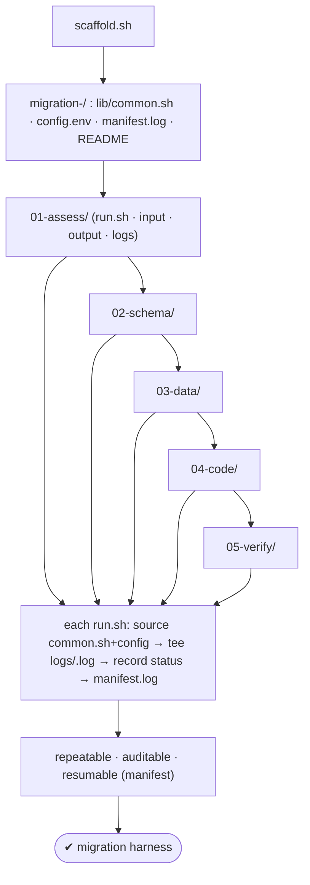
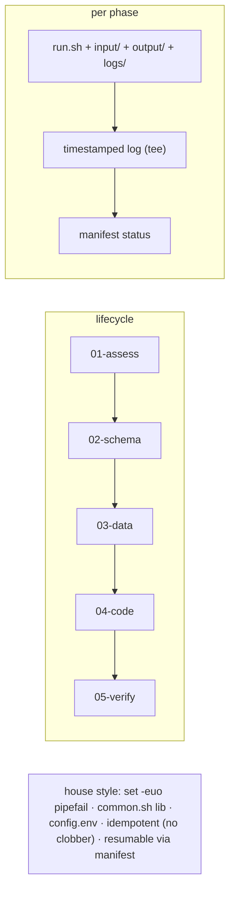

# Lab 141 — Build a Repeatable Migration Harness Dir: `01-assess/ 02-schema/ 03-data/ 04-code/ 05-verify/` with Logs per Phase

> **Track D · Migration · D1 Tooling & Assessment · Lab 3 of 8 (Lab 141/222)**
> Teaching package: concept → diagram → steps → verify → quick-ref → self-test → video script.
> **Depends on:** Lab 139 (tooling), Lab 140 (assessment), Lab 129 (house-style bash).

---

## 0. Lab Card (at a glance)

| Field | Value |
|---|---|
| **Objective** | Generate a structured, repeatable migration harness — five phase directories with per-phase logging, a shared lib, a config file, and a manifest tracking completion. |
| **Success criterion** | One scaffold script produces the harness; each phase logs timestamped output and records status to a manifest; re-running is safe and resumable. |
| **Scope boundary** | The harness scaffold + logging. The phase tools were Labs 139/140; conversions follow. |
| **Prereqs** | Lab 139/140; bash |
| **Time** | 25–35 min |
| **Difficulty** | ★★★☆☆ |
| **Risk** | Low — creates files. |

---

## 1. Learning Objectives

1. **Why a harness** — repeatable, auditable, resumable.
2. **The five phases** — the migration lifecycle.
3. **Per-phase structure** — run/input/output/logs.
4. **Logging + manifest** — traceability.
5. **Idempotent scaffold** in house style.

---

## 2. Concept Primer — the "why"

**A migration harness is a structured scaffold so every migration runs the same way.** Migrations are multi-phase, multi-tool, and high-stakes — without structure you get ad-hoc scripts, lost outputs, and no audit trail. A harness fixes the **directory layout, logging, and state tracking** once, so any migration is:
- **Repeatable** — the same five phases, same layout, every time.
- **Auditable** — each phase logs timestamped output; a manifest records what ran and when.
- **Resumable** — the manifest shows completed phases; re-run a failed one without redoing the rest.
- **Isolated** — each phase has its own inputs/outputs, so nothing bleeds across.

**The five phases = the migration lifecycle:**
1. **`01-assess/`** — assessment (ora2pg `SHOW_REPORT`, SCT report, difficulty matrix — Lab 140).
2. **`02-schema/`** — schema conversion (source DDL → PostgreSQL DDL → applied).
3. **`03-data/`** — data migration (bulk load / CDC, row counts).
4. **`04-code/`** — code conversion (PL/SQL → PL/pgSQL: functions, triggers, packages).
5. **`05-verify/`** — validation (row counts, checksums, comparison, app tests).

**Per-phase structure:** each phase directory holds a **`run.sh`**, an **`input/`**, an **`output/`**, and a **`logs/`**. Every `run.sh` sources a shared **`lib/common.sh`** and **`config.env`**, **tees** its output to a **timestamped log**, and records **start/end/status** to a top-level **`manifest.log`**. That gives one place to see the whole migration's state.

**House-style scaffold (Lab 129):** `set -euo pipefail`, shared logging functions, a `config.env` for source/target connection vars, and **idempotency** — the scaffold never clobbers an existing harness; re-running a phase preserves prior outputs.

---

## 3. Diagrams

### 3.1 Harness structure + flow



### 3.2 Concept



---

## 4. Prerequisites

```bash
mkdir -p ~/migrations && cd ~/migrations
```

---

## 5. Step-by-Step — the scaffold

### Step 1 — Write the scaffold generator (house style)

```bash
cat > scaffold.sh <<'SCRIPT'
#!/usr/bin/env bash
# scaffold.sh <migration-name> — generate a repeatable migration harness (idempotent).
set -euo pipefail
IFS=$'\n\t'
NAME="${1:?usage: scaffold.sh <migration-name>}"
ROOT="migration-${NAME}"
PHASES=(01-assess 02-schema 03-data 04-code 05-verify)

[[ -d "$ROOT" ]] && { echo "harness $ROOT already exists (not clobbering)"; exit 0; }
mkdir -p "$ROOT/lib"

# --- shared library ---
cat > "$ROOT/lib/common.sh" <<'LIB'
#!/usr/bin/env bash
set -euo pipefail
IFS=$'\n\t'
HARNESS_ROOT="$(cd "$(dirname "${BASH_SOURCE[0]}")/.." && pwd)"
source "$HARNESS_ROOT/config.env"
c(){ printf '\033[%sm' "$1"; }; NC=$(c 0)
ts(){ date '+%Y-%m-%d %H:%M:%S'; }
log_info(){ printf '%s [%sINFO%s] %s\n' "$(ts)" "$(c '0;34')" "$NC" "$*"; }
log_ok(){   printf '%s [%s OK %s] %s\n' "$(ts)" "$(c '0;32')" "$NC" "$*"; }
log_warn(){ printf '%s [%sWARN%s] %s\n' "$(ts)" "$(c '0;33')" "$NC" "$*" >&2; }
die(){      printf '%s [%sFAIL%s] %s\n' "$(ts)" "$(c '0;31')" "$NC" "$*" >&2; record FAIL; exit 1; }
PHASE=""; LOGF=""
record(){ printf '%s | %-10s | %s\n' "$(ts)" "$PHASE" "$1" >> "$HARNESS_ROOT/manifest.log"; }
phase_start(){ PHASE="$1"; mkdir -p "$HARNESS_ROOT/$PHASE/"{input,output,logs}
  LOGF="$HARNESS_ROOT/$PHASE/logs/$(date +%Y%m%d-%H%M%S).log"
  exec > >(tee -a "$LOGF") 2>&1                 # tee all output to the timestamped log
  trap 'die "error on line $LINENO"' ERR
  log_info "== phase $PHASE start =="; record START; }
phase_end(){ log_ok "== phase $PHASE done =="; record DONE; }
LIB

# --- config template ---
cat > "$ROOT/config.env" <<CFG
# connection + tool config for migration '${NAME}' (edit me)
export SOURCE_KIND=oracle            # oracle|mysql|mssql
export ORA2PG_CONF="\$HARNESS_ROOT/01-assess/input/ora2pg.conf"
export PGHOST=localhost
export PGDATABASE=${NAME}_target
export PGUSER=postgres
CFG

: > "$ROOT/manifest.log"

# --- per-phase run.sh stubs (wired to the tools) ---
declare -A CMD=(
 [01-assess]="ora2pg -t SHOW_REPORT --estimate_cost -c \"\$ORA2PG_CONF\" > \"\$HARNESS_ROOT/01-assess/output/assessment.txt\"   # Lab 140"
 [02-schema]="ora2pg -t TABLE -c \"\$ORA2PG_CONF\" -o \"\$HARNESS_ROOT/02-schema/output/schema.sql\"                            # Lab 142"
 [03-data]="echo 'pgloader / ora2pg COPY / CDC here → \$HARNESS_ROOT/03-data/output/'                                          # Lab 143"
 [04-code]="ora2pg -t FUNCTION,PROCEDURE,TRIGGER,PACKAGE -c \"\$ORA2PG_CONF\" -o \"\$HARNESS_ROOT/04-code/output/code.sql\"      # Lab 144"
 [05-verify]="echo 'row-count / checksum comparison here → \$HARNESS_ROOT/05-verify/output/'                                    # Lab 146"
)
for p in "${PHASES[@]}"; do
  mkdir -p "$ROOT/$p/"{input,output,logs}
  cat > "$ROOT/$p/run.sh" <<RUN
#!/usr/bin/env bash
source "\$(cd "\$(dirname "\${BASH_SOURCE[0]}")/../lib" && pwd)/common.sh"
phase_start "$p"
# ---- phase work ----
${CMD[$p]}
# --------------------
phase_end
RUN
  chmod +x "$ROOT/$p/run.sh"
done

# --- README ---
cat > "$ROOT/README.md" <<DOC
# Migration harness: ${NAME}
Phases: 01-assess → 02-schema → 03-data → 04-code → 05-verify
Each phase: ./NN-phase/run.sh  (logs → logs/<ts>.log · status → ../manifest.log)
Edit config.env first. Resumable: re-run any phase; manifest.log shows state.
DOC

echo "created $ROOT/ — edit config.env, then run ./$ROOT/01-assess/run.sh"
SCRIPT
chmod +x scaffold.sh
```

### Step 2 — Generate a harness

```bash
./scaffold.sh oracle-prod
find migration-oracle-prod -maxdepth 2 -type d | sort
```

### Step 3 — Edit config + assessment input

```bash
cat migration-oracle-prod/config.env          # set PG target + source
cp /tmp/ora2pg.conf migration-oracle-prod/01-assess/input/ora2pg.conf   # from Lab 139/140
```

### Step 4 — Run a phase (logs + manifest)

```bash
./migration-oracle-prod/01-assess/run.sh
ls migration-oracle-prod/01-assess/logs/       # timestamped log written
cat migration-oracle-prod/manifest.log         # START / DONE recorded
```

### Step 5 — Inspect outputs + state

```bash
ls migration-oracle-prod/01-assess/output/     # assessment.txt (Lab 140)
column -t -s'|' migration-oracle-prod/manifest.log
```

### Step 6 — Prove idempotency + resumability

```bash
./scaffold.sh oracle-prod                       # → "already exists (not clobbering)"
./migration-oracle-prod/01-assess/run.sh        # re-run → new timestamped log, prior outputs preserved
tail -4 migration-oracle-prod/manifest.log
```

---

## 6. Verification Checklist

- [ ] Scaffold generates `migration-<name>/` with lib/config/manifest/README
- [ ] Five phase dirs, each with run.sh + input/output/logs
- [ ] Each `run.sh` sources common.sh + config.env
- [ ] Phase output tee'd to a timestamped log
- [ ] `manifest.log` records START/DONE/FAIL per phase
- [ ] Re-running the scaffold doesn't clobber; phases resumable
- [ ] Phase stubs wired to the tools (ora2pg, etc.)

---

## 7. Troubleshooting

| Symptom | Cause | Fix |
|---|---|---|
| Scaffold clobbers | No guard | Skip if `$ROOT` exists (built in) |
| Phase fails mid-way | Tool/config error | `manifest.log` shows FAIL; log shows why; re-run |
| No log captured | tee/pipe | `set -o pipefail`; `exec > >(tee -a $LOGF)` |
| Config not applied | Not sourced | Each `run.sh` sources `common.sh` (which sources `config.env`) |
| Wrong phase order | Dependencies | Run in order (schema before data); document in README |
| Permissions | Ownership | Run as the right user; outputs writable |
| Can't resume | No state | `manifest.log` is the state; re-run incomplete phases |

---

## 8. Quick Reference Card (paste-ready)

```text
migration-<name>/
  lib/common.sh   # log_info/ok/warn/die · phase_start (tee → logs/<ts>.log) · phase_end · record → manifest.log
  config.env      # SOURCE/TARGET connection + tool vars
  manifest.log    # <ts> | <phase> | START|DONE|FAIL   ← state (resumable)
  01-assess/  02-schema/  03-data/  04-code/  05-verify/    each: run.sh · input/ · output/ · logs/
```
```bash
./scaffold.sh <name>                 # generate (idempotent — won't clobber)
# edit config.env + 01-assess/input/ora2pg.conf, then run phases in order:
./migration-<name>/01-assess/run.sh  # → tee to logs/<ts>.log, START/DONE to manifest.log
# resumable: re-run any phase; manifest.log shows what's done · outputs preserved per phase
```

---

## 9. Self-Check

1. Why build a migration harness?
2. What are the five phases?
3. What's inside each phase directory?
4. How does per-phase logging work?
5. How is the harness resumable?
6. What are the house-style essentials?

<details>
<summary>Answers</summary>

1. To make every migration **repeatable** (same phases/layout), **auditable** (per-phase logs + manifest), **resumable** (re-run a failed phase), and **isolated** (per-phase inputs/outputs).
2. `01-assess`, `02-schema`, `03-data`, `04-code`, `05-verify` — the migration lifecycle.
3. A `run.sh`, an `input/`, an `output/`, and a `logs/`.
4. Each `run.sh` sources `common.sh`, which `tee`s all output to a **timestamped log** and records **START/DONE/FAIL** to the top-level `manifest.log`.
5. The `manifest.log` tracks phase completion, and outputs are preserved per phase, so you re-run only the incomplete/failed phases.
6. `set -euo pipefail`, a shared `common.sh` lib, a `config.env` for connection vars, and an **idempotent** scaffold that never clobbers.
</details>

---

## 10. Video / Teaching Script

| # | On screen | Say (narration) |
|---|---|---|
| 1 | Title: "One structure for every migration" | "Migrations sprawl — scripts everywhere, outputs lost, no trail. So we scaffold it once: five phases, logged, resumable." |
| 2 | phases | "Assess, schema, data, code, verify. The lifecycle, as directories. Every migration looks the same." |
| 3 | per phase | "Each phase: a run script, an input folder, an output folder, and logs. Nothing bleeds across." |
| 4 | logging | "Run a phase and it tees everything to a timestamped log, and stamps start and done into one manifest. That's your audit trail." |
| 5 | resume | "A phase fails? The manifest shows it. Fix it, re-run just that phase. The rest stays done." |
| 6 | idempotent | "And the scaffold won't clobber a harness that exists. Safe to run, always." |
| 7 | Outro | "Structure first. Next: convert the Oracle schema into it." |

---

## 11. Glossary

- **Migration harness** — a structured, repeatable scaffold.
- **Phase directory** — `NN-phase/` with run/input/output/logs.
- **`common.sh`** — shared logging + phase wrappers.
- **`config.env`** — source/target connection vars.
- **`manifest.log`** — per-phase START/DONE/FAIL state.
- **Per-phase log** — timestamped, tee'd output.
- **Idempotent scaffold** — never clobbers an existing harness.

---
*NETAPORT lab series · PostgreSQL 17 on AlmaLinux 9 · Lab 141/222 · D1 Tooling & Assessment*
