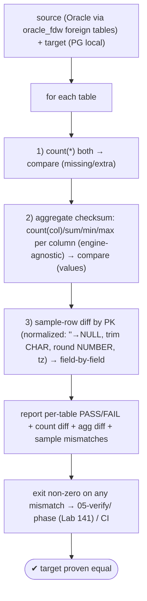
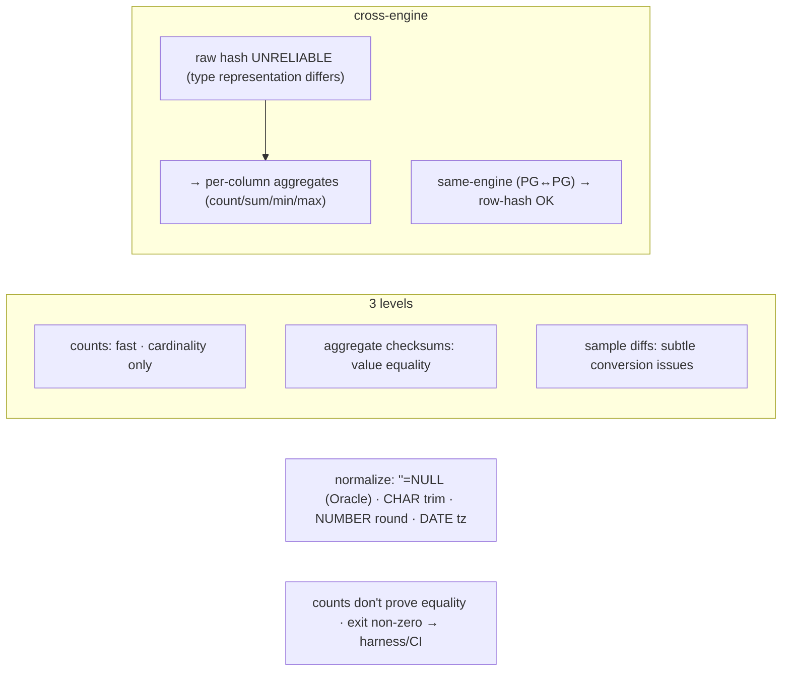

# Lab 142 — Row-Count + Checksum Reconciliation: Source-vs-Target Validator (Counts, Aggregate Checksums, Sample Diffs)

> **Track D · Migration · D1 Tooling & Assessment · Lab 4 of 8 (Lab 142/222)**
> Teaching package: concept → diagram → steps → verify → quick-ref → self-test → video script.
> **Depends on:** Lab 141 (harness/05-verify), Lab 139/71 (oracle_fdw), Lab 05 (checksums).

---

## 0. Lab Card (at a glance)

| Field | Value |
|---|---|
| **Objective** | Write a validator that reconciles a migrated target against its source at three levels — per-table counts, aggregate checksums, and sample-row diffs — and reports mismatches, exiting non-zero. |
| **Success criterion** | Counts, aggregates, and samples are compared per table; cross-engine gotchas are normalized; a mismatch is caught and flagged; output plugs into the harness's 05-verify phase. |
| **Scope boundary** | Data reconciliation. Data movement was the 03-data phase. |
| **Prereqs** | Lab 141; a migrated target + reachable source (oracle_fdw) |
| **Time** | 35–50 min |
| **Difficulty** | ★★★★☆ |
| **Risk** | Low — read-only validation. |

---

## 1. Learning Objectives

1. **Three validation levels** — counts / checksums / samples.
2. **Why counts alone are insufficient.**
3. **Cross-engine checksums** — aggregates, not raw hashes.
4. **The Oracle→PG normalization gotchas.**
5. **Exit-code integration** with the harness.

---

## 2. Concept Primer — the "why"

**A migration isn't done until the target is *proven* equal to the source.** After moving data, you validate at **three increasing levels of rigor** — each catches what the prior misses:

1. **Per-table row counts** — `count(*)` on both sides. **Fast**, catches **missing/extra** rows (incomplete load, a filter, CDC lag). But a count match proves only **cardinality**, not that the *data* is the same.
2. **Aggregate checksums** — because equal counts can hide **different values**. Compute a checksum over the actual data and compare. This catches value corruption a count never would.
3. **Sample-row diffs** — fetch a sample by PK from both sides and compare **field by field**. Catches **subtle conversion issues** (trailing spaces, number precision, date/timezone, encoding) that even aggregates can miss.

**Cross-engine checksums must use aggregates, not raw hashes.** Oracle and PostgreSQL represent types and compute hashes **differently**, so a raw `md5(row)` **won't match across engines** even for identical data. Instead, per table compute **engine-agnostic per-column aggregates**: `count(*)`, `count(col)` per column (non-null count), `sum(col)` for numerics, `min(col)`/`max(col)`. These compare cleanly across engines and catch most value discrepancies. *(For **same-engine** validation — e.g. PG↔PG after logical replication — a direct **row-hash** like `sum(hashtext(t::text))` works and is stronger.)*

**The Oracle→PostgreSQL normalization gotchas (what sample diffs expose):**
- **`'' = NULL` in Oracle, but `'' ≠ NULL` in PostgreSQL** — the classic trap. An Oracle empty string arrives as NULL; comparisons must **treat `''` as NULL** on both sides.
- **`CHAR` padding** — Oracle `CHAR(n)` pads with spaces; PostgreSQL may not → **trim** before comparing.
- **`NUMBER` precision/scale** → round/cast consistently.
- **`DATE`/`TIMESTAMP`** → normalize timezone and precision to a canonical form.
- **`CLOB`/`BLOB` → `text`/`bytea`**, charset (Oracle NLS vs UTF-8).
Normalize these on **both** sides before comparing, or you get false mismatches.

**The clean implementation — `oracle_fdw`.** Expose the Oracle source as **foreign tables** in PostgreSQL (Lab 71/139); then compare source (foreign) vs target (local) with **pure SQL** in one connection — counts, aggregates, and samples all become simple queries. *(Or query each side separately and diff in bash.)*

**Harness integration:** the validator **exits non-zero on any mismatch**, so it drops into the **`05-verify/`** phase (Lab 141) or a CI gate — a green reconciliation is the sign-off that the data migrated correctly.

---

## 3. Diagrams

### 3.1 Reconciliation flow



### 3.2 Concept



---

## 4. Prerequisites — source foreign tables + target

```bash
# expose the Oracle source via oracle_fdw (Lab 71/139), schema-imported into a 'src' schema:
sudo -u postgres psql -d oracle_prod_target <<'SQL'
CREATE EXTENSION IF NOT EXISTS oracle_fdw;
CREATE SERVER IF NOT EXISTS ora FOREIGN DATA WRAPPER oracle_fdw OPTIONS (dbserver '//ORA_HOST:1521/ORCL');
CREATE USER MAPPING IF NOT EXISTS FOR postgres SERVER ora OPTIONS (user 'miguser', password 'migpass');
CREATE SCHEMA IF NOT EXISTS src;
IMPORT FOREIGN SCHEMA "MIGUSER" FROM SERVER ora INTO src;   -- source tables now queryable as src.<table>
SQL
```

### The validator script

```bash
cat > validate.sh <<'SCRIPT'
#!/usr/bin/env bash
# validate.sh — reconcile target (local) vs source (src.* foreign tables). Exit non-zero on mismatch.
set -euo pipefail
IFS=$'\n\t'
DB="${DB:-oracle_prod_target}"
PSQL=(sudo -u postgres psql -qtAX -d "$DB")
TABLES="${*:-$(${PSQL[@]} -c "SELECT table_name FROM information_schema.tables WHERE table_schema='public' AND table_type='BASE TABLE'")}"
fail=0
for t in $TABLES; do
  # 1) counts
  sc=$("${PSQL[@]}" -c "SELECT count(*) FROM src.\"${t^^}\"")
  tc=$("${PSQL[@]}" -c "SELECT count(*) FROM public.\"$t\"")
  if [[ "$sc" != "$tc" ]]; then printf "  ✗ %-20s COUNT src=%s tgt=%s\n" "$t" "$sc" "$tc"; fail=1; continue
  else printf "  ✓ %-20s count=%s\n" "$t" "$tc"; fi
  # 2) aggregate checksum (numeric columns: sum; all: non-null counts) — engine-agnostic
  cols=$("${PSQL[@]}" -c "SELECT string_agg('sum(('||column_name||')::numeric)', '+') FROM information_schema.columns WHERE table_schema='public' AND table_name='$t' AND data_type IN ('numeric','integer','bigint','smallint','double precision','real')")
  if [[ -n "$cols" && "$cols" != " " ]]; then
    ss=$("${PSQL[@]}" -c "SELECT coalesce($cols,0) FROM src.\"${t^^}\"")
    ts=$("${PSQL[@]}" -c "SELECT coalesce($cols,0) FROM public.\"$t\"")
    [[ "$ss" != "$ts" ]] && { printf "  ✗ %-20s AGG src=%s tgt=%s\n" "$t" "$ss" "$ts"; fail=1; }
  fi
done
[[ $fail -eq 0 ]] && { echo "✔ reconciliation PASSED"; exit 0; } || { echo "✗ reconciliation FAILED"; exit 2; }
SCRIPT
chmod +x validate.sh
```

---

## 5. Step-by-Step

### Step 1 — Per-table row counts

```bash
sudo -u postgres psql -d oracle_prod_target -c "
SELECT 'employees' AS tbl,
       (SELECT count(*) FROM src.\"EMPLOYEES\") AS src_count,
       (SELECT count(*) FROM public.employees)   AS tgt_count;"    # mismatch → missing/extra rows
```

### Step 2 — Aggregate checksum (engine-agnostic)

```bash
sudo -u postgres psql -d oracle_prod_target -c "
SELECT (SELECT count(*) FILTER (WHERE salary IS NOT NULL) FROM src.\"EMPLOYEES\") AS src_sal_cnt,
       (SELECT count(*) FILTER (WHERE salary IS NOT NULL) FROM public.employees)   AS tgt_sal_cnt,
       (SELECT sum(salary::numeric) FROM src.\"EMPLOYEES\") AS src_sal_sum,
       (SELECT sum(salary::numeric) FROM public.employees)   AS tgt_sal_sum;"      # values must match
```

### Step 3 — Sample-row diff (normalized for Oracle→PG)

```bash
sudo -u postgres psql -d oracle_prod_target -c "
-- normalize: trim CHAR padding, treat '' as NULL, round NUMBER, cast timestamps
SELECT s.employee_id,
       nullif(trim(s.last_name),'') AS src_name, nullif(trim(t.last_name),'') AS tgt_name,
       round(s.salary::numeric,2)   AS src_sal,  round(t.salary::numeric,2)   AS tgt_sal
FROM src.\"EMPLOYEES\" s JOIN public.employees t USING (employee_id)
WHERE nullif(trim(s.last_name),'') IS DISTINCT FROM nullif(trim(t.last_name),'')
   OR round(s.salary::numeric,2)   IS DISTINCT FROM round(t.salary::numeric,2)
LIMIT 20;"      # rows listed here = actual mismatches (conversion issues)
```

### Step 4 — Run the full validator

```bash
DB=oracle_prod_target ./validate.sh; echo "exit: $?"
#   ✓/✗ per table (count + aggregate) → exit 0 (pass) or 2 (fail)
```

### Step 5 — Prove it catches a discrepancy

```bash
sudo -u postgres psql -d oracle_prod_target -c "DELETE FROM public.employees WHERE employee_id = (SELECT min(employee_id) FROM public.employees);"
DB=oracle_prod_target ./validate.sh; echo "exit: $?"    # → ✗ employees COUNT mismatch, exit 2
```

### Step 6 — Wire into the harness 05-verify phase

```bash
cp validate.sh migration-oracle-prod/05-verify/
# 05-verify/run.sh calls it; non-zero exit → manifest FAIL (Lab 141)
echo 'DB=oracle_prod_target ./validate.sh > output/reconciliation.txt' >> migration-oracle-prod/05-verify/run.sh
```

---

## 6. Verification Checklist

- [ ] Source reachable as foreign tables (oracle_fdw)
- [ ] Per-table counts compared
- [ ] Aggregate checksums (count/sum/min/max) compared
- [ ] Sample rows diffed with normalization (''→NULL, trim, round, tz)
- [ ] Validator exits non-zero on mismatch
- [ ] A seeded discrepancy is caught
- [ ] Wired into the harness 05-verify phase

---

## 7. Troubleshooting

| Symptom | Cause | Fix |
|---|---|---|
| Counts match, data wrong | Counts prove cardinality only | Add checksums + sample diffs |
| Cross-engine hash mismatch | Type representation differs | Use per-column aggregates, not raw hash |
| False mismatch: NULL vs '' | Oracle `''`=NULL | `nullif(trim(x),'')` both sides |
| False mismatch: trailing spaces | CHAR padding | `trim()` before compare |
| Number precision diff | NUMBER scale | `round()`/cast consistently |
| Date/timezone diff | Representation | Normalize to a canonical tz/format |
| Sample too small | Low coverage | Larger sample; full checksum for critical tables |
| FDW comparison slow | No pushdown | Pull aggregates; or dump-and-compare |

---

## 8. Quick Reference Card (paste-ready)

```sql
-- 1) COUNTS (fast, cardinality):  SELECT count(*) FROM src."T";  vs  SELECT count(*) FROM public.t;
-- 2) AGGREGATE CHECKSUM (engine-agnostic — cross-engine):
SELECT count(col), sum(col::numeric), min(col), max(col) FROM src."T";   -- vs target
--    same-engine (PG↔PG): SELECT sum(hashtext(t::text)) FROM t;         -- row hash OK
-- 3) SAMPLE DIFF (normalized):  JOIN ... USING (pk) WHERE
--       nullif(trim(s.c),'') IS DISTINCT FROM nullif(trim(t.c),'')      -- ''=NULL + CHAR trim (Oracle→PG)
--       OR round(s.n::numeric,2) IS DISTINCT FROM round(t.n::numeric,2) -- NUMBER precision
```
```bash
# counts don't prove equality → need checksums + samples · cross-engine = aggregates (NOT raw hash)
# normalize Oracle→PG: ''=NULL · CHAR trim · NUMBER round · DATE tz
# validator exits non-zero on mismatch → harness 05-verify / CI (Lab 141)
```

---

## 9. Self-Check

1. Why aren't row counts alone sufficient?
2. What are the three validation levels?
3. Why is cross-engine hashing unreliable, and what do you use instead?
4. What's the classic Oracle→PG normalization gotcha?
5. What works for same-engine validation?
6. How does the validator integrate with the harness?

<details>
<summary>Answers</summary>

1. Counts prove **cardinality**, not **value equality** — the same count with different data passes; you need checksums and samples too.
2. Per-table **counts** (fast, missing/extra), **aggregate checksums** (value equality), and **sample-row diffs** (subtle conversion issues).
3. Oracle and PG represent types/hashes differently, so a raw hash won't match; use **engine-agnostic per-column aggregates** (count/sum/min/max).
4. **`'' = NULL` in Oracle but not in PostgreSQL** (plus CHAR padding, NUMBER precision, DATE/tz) — normalize (`nullif(trim(x),'')`, `round`, tz) on both sides.
5. A direct **row-hash** (`sum(hashtext(t::text))`) — stronger, and valid because both sides are the same engine.
6. It **exits non-zero on mismatch**, so it drops into the `05-verify/` phase (manifest FAIL) or a CI gate.
</details>

---

## 10. Video / Teaching Script

| # | On screen | Say (narration) |
|---|---|---|
| 1 | Title: "Did the data really make it?" | "You moved the data. But is it *right*? A count that matches isn't proof. Let's actually reconcile source and target." |
| 2 | counts | "First, the cheap check: row counts per table. Missing rows? You'll see it instantly." |
| 3 | checksums | "But same count, different values, still passes. So we checksum — sums, min, max per column. Values have to match too." |
| 4 | cross-engine | "Here's the catch: you can't just hash a row across Oracle and Postgres — they encode differently. Aggregates, not hashes." |
| 5 | normalize | "And the classic trap — Oracle turns empty strings into NULL. Normalize both sides, or chase ghosts all day." |
| 6 | samples + exit | "Finally, diff real rows. Any mismatch, the validator fails — red light in your harness. Green means the data's proven." |
| 7 | Outro | "Reconciled and trusted. Next: converting the schema, Oracle to Postgres." |

---

## 11. Glossary

- **Reconciliation** — proving target equals source.
- **Row count** — cardinality check (fast, first pass).
- **Aggregate checksum** — count/sum/min/max per column (engine-agnostic).
- **Sample-row diff** — field-by-field on a PK sample.
- **Cross-engine** — Oracle vs PG (raw hashes don't match).
- **`''`=NULL** — Oracle empty-string gotcha.
- **Row hash** — `sum(hashtext(row))` for same-engine.

---
*NETAPORT lab series · PostgreSQL 17 on AlmaLinux 9 · Lab 142/222 · D1 Tooling & Assessment*
