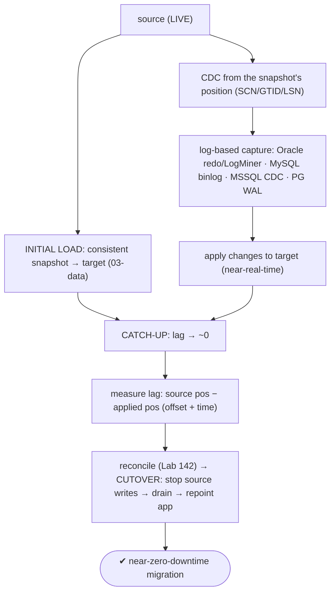
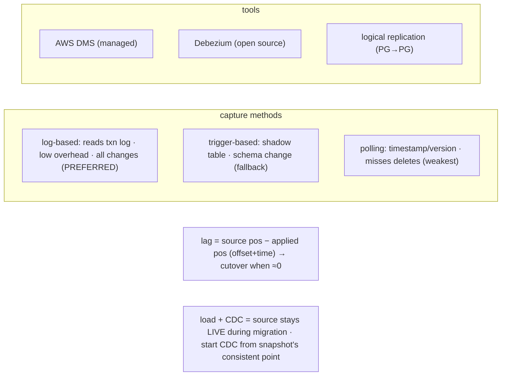

# Lab 143 — CDC Concept: Change-Data-Capture from a Source into PostgreSQL for Near-Zero-Downtime Cutover; Measure Lag

> **Track D · Migration · D1 Tooling & Assessment · Lab 5 of 8 (Lab 143/222)**
> Teaching package: concept → diagram → steps → verify → quick-ref → self-test → video script.
> **Depends on:** Lab 33 (logical replication), Lab 135 (managed migration), Lab 137 (lag), Lab 142 (reconciliation).

---

## 0. Lab Card (at a glance)

| Field | Value |
|---|---|
| **Objective** | Understand CDC for migration — initial load + change capture + catch-up + cutover — set up a concrete PG→PG CDC, measure replication lag, and map the heterogeneous methods/tools. |
| **Success criterion** | You run a CDC flow, see live changes applied, measure lag in bytes/time, and know the log-based/trigger/polling methods, per-engine log sources, and cutover-when-lag≈0 rule. |
| **Scope boundary** | CDC concept + lag. Engine-specific CDC (Oracle/MySQL/MSSQL) is in their tracks. |
| **Prereqs** | Lab 33/137; a source + target |
| **Time** | 35–50 min |
| **Difficulty** | ★★★★☆ |
| **Risk** | Low — read-mostly. |

---

## 1. Learning Objectives

1. **CDC** — what it captures and why for migration.
2. **The near-zero-downtime pattern** — load + CDC + cutover.
3. **Capture methods** — log-based / trigger / polling.
4. **Per-engine log sources + tools.**
5. **Measure lag** and cut over at ~0.

---

## 2. Concept Primer — the "why"

**CDC captures ongoing changes from a live source and applies them to the target in near-real-time.** That's the mechanism behind **near-zero-downtime** migration: you can't take a large source offline for hours to bulk-copy it, so instead you copy a **snapshot** while it's live, then **CDC keeps the target in sync** with every subsequent change until you cut over.

**The migration pattern (generalizing Lab 135 to heterogeneous):**
1. **Initial load** — bulk-copy a consistent **snapshot** of the source to the target (the `03-data` phase).
2. **CDC** — capture and apply the source's **ongoing changes** (INSERT/UPDATE/DELETE), keeping the target current. Crucially, CDC must **start from the snapshot's consistent point** (Oracle SCN / MySQL GTID / MSSQL LSN / PG LSN) so nothing is missed or double-applied — the tools handle this handoff.
3. **Catch-up** — CDC replays the backlog; **lag → ~0**.
4. **Cutover** — **stop writes** on the source, **drain** the last changes (lag 0), **repoint** the app to the target. Downtime = only this window (seconds/minutes). Validate with the reconciler (Lab 142) first.

**Three capture methods (increasing preference):**
- **Log-based CDC (preferred)** — reads the source's **transaction log**: low overhead, captures **everything** (including deletes), **no source schema changes**. This is what production CDC uses.
- **Trigger-based CDC (fallback)** — triggers on source tables write changes to a shadow/audit table you then read/apply. Higher overhead, **requires schema changes** on the source; used when log access isn't available.
- **Query-based polling (weakest)** — poll for rows changed since a timestamp/version column. Simplest but **misses deletes**, higher latency and load. Last resort.

**Per-engine log sources (details in the engine tracks):**
- **Oracle** — **redo logs** via **LogMiner** or **GoldenGate** (needs **supplemental logging** enabled).
- **MySQL** — the **binlog** (ROW format).
- **SQL Server** — the **CDC feature** (change tables) or the transaction log.
- **PostgreSQL** — the **WAL** via **logical decoding** (Lab 33).

**Heterogeneous CDC tools:**
- **AWS DMS** — managed full-load + CDC (Oracle/MySQL/MSSQL → PG/Aurora); pairs with SCT (Lab 139).
- **Debezium** — open-source, Kafka-Connect-based connectors per source → stream changes → apply to PG.
- **Native logical replication** — for **PG→PG** (Lab 33/135).

**Measuring lag (Lab 137) — and when to cut over.** Lag = source current log position − target applied position, in **offset** and **time**:
- **AWS DMS** — `CDCLatencySource` + `CDCLatencyTarget` (total = capture + apply latency).
- **Debezium** — `MilliSecondsBehindSource`.
- **PG-target apply** — `pg_stat_subscription` LSNs + a **heartbeat** for accurate time-lag (Lab 137).
**Cut over when lag ≈ 0** — never before, or you lose the un-applied tail.

---

## 3. Diagrams

### 3.1 CDC migration flow



### 3.2 Concept



---

## 4. Prerequisites — a concrete PG→PG CDC (logical decoding)

```bash
# source (5432) + target (5433). Source: wal_level=logical (Lab 33).
sudo -u postgres psql -p 5432 -c "SHOW wal_level;"    # logical
sudo -u postgres psql -p 5432 -d benchdb -c "CREATE TABLE IF NOT EXISTS orders (id bigint GENERATED ALWAYS AS IDENTITY PRIMARY KEY, amt numeric, ts timestamptz DEFAULT now());"
```

---

## 5. Step-by-Step

### Step 1 — Initial load (snapshot) + start CDC (publication/subscription)

```bash
# initial load: subscription's copy_data does the snapshot; then it streams (CDC) — one mechanism, Lab 33
sudo -u postgres psql -p 5432 -d benchdb -c "CREATE PUBLICATION cdc_pub FOR TABLE orders;"
sudo -u postgres pg_dump -p 5432 -d benchdb -t orders --schema-only | sudo -u postgres psql -p 5433 -d benchdb
sudo -u postgres psql -p 5433 -d benchdb -c "
CREATE SUBSCRIPTION cdc_sub CONNECTION 'host=127.0.0.1 port=5432 dbname=benchdb user=postgres'
PUBLICATION cdc_pub;"      # copy_data=true → snapshot + CDC from the consistent point
```

### Step 2 — Generate live changes on the source → see CDC apply them

```bash
sudo -u postgres psql -p 5432 -d benchdb -c "INSERT INTO orders (amt) SELECT (random()*100)::numeric FROM generate_series(1,1000);"
sleep 2
sudo -u postgres psql -p 5433 -d benchdb -c "SELECT count(*) FROM orders;"   # changes appeared on target (CDC)
```

### Step 3 — Measure lag: applied position (offset)

```bash
# on the TARGET (subscriber): how far applied vs source
sudo -u postgres psql -p 5433 -d benchdb -x -c "SELECT subname, received_lsn, latest_end_lsn FROM pg_stat_subscription;"
# on the SOURCE (publisher): behind bytes + time
sudo -u postgres psql -p 5432 -c "
SELECT application_name, pg_size_pretty(pg_wal_lsn_diff(sent_lsn, replay_lsn)) AS behind, replay_lag
FROM pg_stat_replication;"
```

### Step 4 — Time lag via a heartbeat (Lab 137)

```bash
sudo -u postgres psql -p 5432 -d benchdb -c "CREATE TABLE IF NOT EXISTS hb (id int PRIMARY KEY DEFAULT 1, ts timestamptz); INSERT INTO hb VALUES (1, now()) ON CONFLICT (id) DO UPDATE SET ts=now();"
sudo -u postgres psql -p 5432 -d benchdb -c "ALTER PUBLICATION cdc_pub ADD TABLE hb;" 2>/dev/null
sudo -u postgres psql -p 5433 -d benchdb -c "SELECT now() - ts AS cdc_time_lag FROM hb;"   # time behind
```

### Step 5 — Lag under sustained load, then catch-up to ~0

```bash
sudo -u postgres pgbench -p 5432 -c 8 -T 20 benchdb >/dev/null 2>&1 &
sleep 10; sudo -u postgres psql -p 5432 -c "SELECT application_name, replay_lag FROM pg_stat_replication;"  # lag rises
wait
sleep 3; sudo -u postgres psql -p 5432 -c "SELECT replay_lag FROM pg_stat_replication;"                     # catches up → ~0
```

### Step 6 — Cutover gate + heterogeneous mapping

```bash
cat <<'EOF'
CUTOVER (when lag ≈ 0):  stop source writes → confirm drained → reconcile (Lab 142) → repoint app → drop subscription
HETEROGENEOUS CDC (engine tracks):
  Oracle → redo logs (LogMiner/GoldenGate; supplemental logging) | tool: AWS DMS / Debezium
  MySQL  → binlog (ROW)                                          | tool: AWS DMS / Debezium
  MSSQL  → CDC feature / txn log                                 | tool: AWS DMS / Debezium
  PG     → WAL logical decoding (native logical replication)     | tool: pgoutput / Debezium
EOF
```

---

## 6. Verification Checklist

- [ ] Initial load (snapshot) + CDC started from a consistent point
- [ ] Live source changes applied to the target
- [ ] Lag measured in offset (LSN) on both sides
- [ ] Time lag measured via heartbeat
- [ ] Lag rose under load, then caught up to ~0
- [ ] Cutover-at-lag≈0 rule understood
- [ ] Heterogeneous methods/tools mapped

---

## 7. Troubleshooting

| Symptom | Cause | Fix |
|---|---|---|
| Lag grows | Apply slower than source change rate | Scale apply/batch; throttle source burst; monitor |
| Missed changes/deletes | Trigger/polling method | Use **log-based** CDC |
| Log access denied | Source not configured | Oracle supplemental logging; MySQL ROW binlog; MSSQL CDC enabled |
| Snapshot/CDC gap | Wrong start position | Start CDC from the snapshot's SCN/GTID/LSN (tools handle it) |
| Lag never reaches 0 | Continuous writes | Stop/throttle source writes at cutover to drain |
| Cutover data loss | Cut over before drain | Ensure lag=0; reconcile (Lab 142) first |
| DDL breaks CDC | Schema change mid-stream | Freeze DDL during migration |

---

## 8. Quick Reference Card (paste-ready)

```text
NEAR-ZERO-DOWNTIME = INITIAL LOAD (snapshot) → CDC (ongoing changes, from snapshot's position) → CATCH-UP (lag→0) → CUTOVER
```
```sql
-- concrete PG→PG CDC (logical decoding, Lab 33): CREATE PUBLICATION / CREATE SUBSCRIPTION (copy_data = snapshot + stream)
-- LAG: target  → SELECT received_lsn, latest_end_lsn FROM pg_stat_subscription;
--      source  → SELECT replay_lag, pg_wal_lsn_diff(sent_lsn, replay_lsn) FROM pg_stat_replication;
--      time    → heartbeat: primary UPSERTs now(); target: SELECT now()-ts FROM hb;   → CUTOVER when ≈ 0
```
```text
methods: log-based (preferred) > trigger-based (fallback) > polling (weakest, misses deletes)
sources: Oracle redo/LogMiner(+supplemental logging) · MySQL binlog(ROW) · MSSQL CDC/log · PG WAL logical decoding
tools:   AWS DMS · Debezium · native logical replication (PG→PG)   |   reconcile (Lab 142) before cutover
```

---

## 9. Self-Check

1. What is CDC and why use it for migration?
2. What's the near-zero-downtime pattern?
3. What are the three capture methods, and which is preferred?
4. What are the per-engine log sources?
5. What heterogeneous CDC tools exist?
6. How do you measure lag and decide to cut over?

<details>
<summary>Answers</summary>

1. CDC captures a live source's ongoing changes and applies them to the target in near-real-time, so the source **stays live** during the initial load and sync — enabling **near-zero-downtime** cutover.
2. **Initial load** (snapshot) → **CDC** (ongoing changes from the snapshot's consistent point) → **catch-up** (lag→0) → **cutover** (stop writes, drain, repoint).
3. **Log-based** (reads the txn log — low overhead, all changes, preferred), **trigger-based** (shadow table, schema change — fallback), **polling** (timestamp/version — misses deletes, weakest).
4. Oracle **redo logs** (LogMiner/GoldenGate + supplemental logging), MySQL **binlog** (ROW), MSSQL **CDC/log**, PostgreSQL **WAL** (logical decoding).
5. **AWS DMS**, **Debezium**, and **native logical replication** for PG→PG.
6. Compare the source log position to the applied position (offset + time — DMS CDCLatency / Debezium MillisBehindSource / PG heartbeat); **cut over when lag ≈ 0** (after reconciling).
</details>

---

## 10. Video / Teaching Script

| # | On screen | Say (narration) |
|---|---|---|
| 1 | Title: "Migrate while it's running" | "You can't take a busy database offline for hours to copy it. So you don't. Snapshot it live, then let CDC keep the copy in sync." |
| 2 | pattern | "Bulk-load a snapshot. Then change-data-capture streams every insert, update, delete on top — the source never stops." |
| 3 | log-based | "The good way reads the transaction log — redo, binlog, WAL. Low overhead, catches everything, even deletes. Triggers and polling are the fallbacks." |
| 4 | lag | "The number that matters is lag — how far behind the target is. Watch it under load; it rises, then catches up." |
| 5 | cutover | "When lag hits zero, and only then: stop writes, drain the last change, repoint. Seconds of downtime for a whole database." |
| 6 | tools | "Oracle, MySQL, SQL Server — DMS or Debezium do the capture. Postgres to Postgres? Logical replication, built in." |
| 7 | Outro | "Live migration, understood. Next: convert the Oracle schema." |

---

## 11. Glossary

- **CDC** — capturing a source's ongoing changes for the target.
- **Initial load** — the consistent snapshot before CDC.
- **Log-based / trigger / polling** — capture methods (best→worst).
- **Redo / binlog / WAL** — Oracle / MySQL / PostgreSQL logs.
- **LogMiner / Debezium / DMS** — CDC tooling.
- **SCN / GTID / LSN** — source log positions (CDC start point).
- **Cutover at lag ≈ 0** — drain then repoint.

---
*NETAPORT lab series · PostgreSQL 17 on AlmaLinux 9 · Lab 143/222 · D1 Tooling & Assessment*
