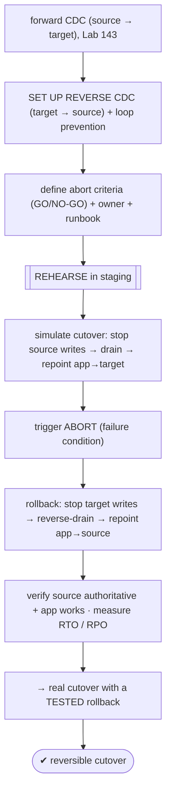
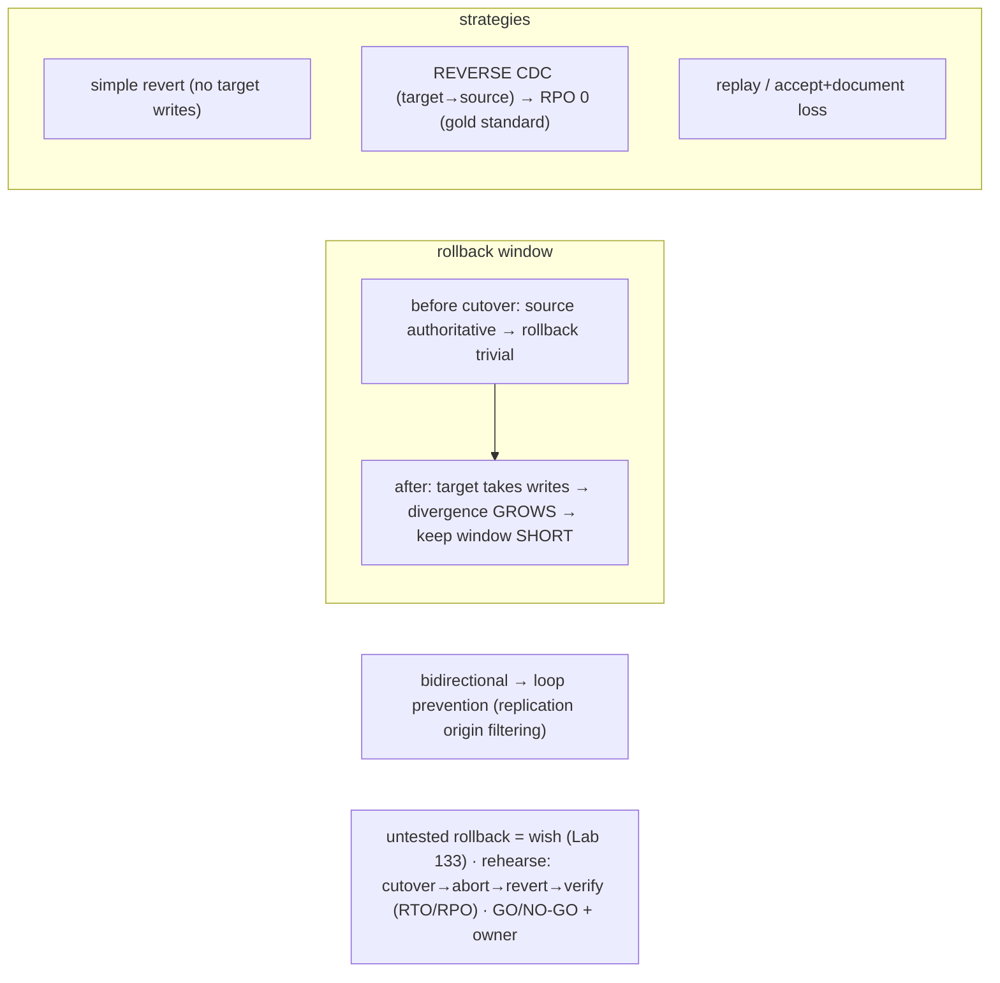

# Lab 144 — Rollback Plan: Define and Rehearse the Abort-and-Revert Path Before Any Real Cutover

> **Track D · Migration · D1 Tooling & Assessment · Lab 6 of 8 (Lab 144/222)**
> Teaching package: concept → diagram → steps → verify → quick-ref → self-test → video script.
> **Depends on:** Lab 143 (CDC/cutover), Lab 142 (reconciliation), Lab 135 (migration), Lab 133 (test-before-trust).

---

## 0. Lab Card (at a glance)

| Field | Value |
|---|---|
| **Objective** | Define a migration rollback plan (reverse CDC, abort criteria, runbook) and rehearse the abort-and-revert path before a real cutover, measuring rollback RTO/RPO. |
| **Success criterion** | Reverse CDC keeps the source current; a rehearsed abort reverts to the source with no data loss; the runbook, GO/NO-GO criteria, and RTO/RPO are documented. |
| **Scope boundary** | Rollback planning + rehearsal. Forward CDC/cutover was Lab 143. |
| **Prereqs** | Lab 143; a source + target with forward CDC |
| **Time** | 35–50 min |
| **Difficulty** | ★★★★☆ |
| **Risk** | Low — rehearsal in staging. |

---

## 1. Learning Objectives

1. **Why rollback** — cutover is the point of no return.
2. **The rollback window** — divergence over time.
3. **Reverse CDC** — the zero-loss revert path.
4. **Abort criteria + runbook.**
5. **Rehearse** — and measure RTO/RPO.

---

## 2. Concept Primer — the "why"

**Cutover is the point of no return — so plan the way back first.** At cutover you stop source writes and repoint the app to the target. If something breaks *after* (bad data, a performance cliff, an app bug, target instability), you need to **revert to the source fast, with minimal data loss**. That path — the **rollback plan** — must be **defined and rehearsed before** the real cutover. **An untested rollback is a wish**, exactly like an untested backup (Lab 133).

**The rollback window — why timing matters.** Before cutover the source is authoritative and rollback is trivial (just don't cut over). After cutover the **target receives new writes**, so reverting to the source means those writes are lost *unless* they were captured. **Divergence grows the longer you run on the target**, so the **rollback window** (the period during which rollback stays feasible) should be kept **short** and monitored closely.

**Rollback strategies, by divergence tolerance:**
- **Simple revert** — if you abort **immediately** (no significant target writes), just repoint the app **back to the source**; the source is unchanged (writes were *stopped*, not lost). Trivial.
- **Reverse CDC (the gold standard)** — set up CDC from the **new target back to the old source** *before* cutover. During the rollback window the source **stays current** with the target's new writes, so a rollback loses **nothing** (RPO 0). This is what makes a safe cutover safe.
- **Replay target changes** — capture target writes (audit/CDC) and replay them to the source on rollback.
- **Accept + document data loss** — with no reverse-sync, rolling back after target writes loses them (or needs manual reconciliation); document the RPO.

**The safe cutover pattern (with rollback capability):**
1. Initial load + **forward CDC** (source → target), Lab 143.
2. **Set up reverse CDC** (target → source) *before* cutover — with **loop prevention** (below).
3. **Cutover**: stop source writes → drain forward CDC → repoint app to target. **Reverse CDC now streams target writes back to the source**, keeping it current.
4. **Monitor.** If **abort**: repoint the app back to the source (current via reverse CDC) → minimal/zero loss.
5. If **success**: after the rollback window closes, tear down reverse CDC and decommission the source.

**Loop prevention for bidirectional CDC.** Forward + reverse replication can **echo** a change back and forth infinitely. Use **replication origin filtering** (`pg_replication_origin` / the tool's origin tracking) so each side **doesn't re-apply changes that originated from it**, and design so the **app writes only one side at a time** to avoid conflicting concurrent writes.

**Abort decision criteria (GO/NO-GO — define *before*):** reconciliation failure (Lab 142), application errors on the target, performance below an agreed threshold, or target instability — each with a **trigger and a named owner** who calls the abort. Ambiguity here is how a recoverable incident becomes a disaster.

**The rehearsal (the deliverable).** In staging, **simulate the cutover → trigger an abort → execute the rollback → verify the source is authoritative and the app works → time it** (rollback **RTO**) and confirm **RPO** (loss). Then write the **runbook**: exact steps, decision criteria, owners, timings. A rehearsed rollback turns cutover from a gamble into a reversible operation.

---

## 3. Diagrams

### 3.1 Rollback rehearsal flow



### 3.2 Concept



---

## 4. Prerequisites — forward CDC in place

```bash
# from Lab 143: source (5432) → target (5433) forward CDC (pub cdc_pub / sub cdc_sub) running, caught up.
sudo -u postgres psql -p 5433 -d benchdb -c "SELECT subname FROM pg_stat_subscription;"   # cdc_sub active
```

---

## 5. Step-by-Step

### Step 1 — Set up REVERSE CDC (target → source) with loop prevention

```bash
# publication on the TARGET, subscription on the SOURCE — with origin filtering to avoid echo loops
sudo -u postgres psql -p 5433 -d benchdb -c "CREATE PUBLICATION rev_pub FOR TABLE orders;"
sudo -u postgres psql -p 5432 -d benchdb -c "
CREATE SUBSCRIPTION rev_sub CONNECTION 'host=127.0.0.1 port=5433 dbname=benchdb user=postgres'
PUBLICATION rev_pub WITH (copy_data = false, origin = none);"   # origin=none → only locally-originated changes (no loop)
# (matching: forward sub should also use origin=none so each side ignores replayed changes)
```

### Step 2 — Define the abort criteria + runbook

```bash
cat > rollback-runbook.md <<'EOF'
# Rollback runbook — <migration>
## GO/NO-GO abort criteria (owner: <name>)
  - reconciliation FAILS (Lab 142 validator exit != 0)
  - application error rate > <X>% on target
  - p95 latency > <Y> ms sustained
  - target instability / failure
## Rollback steps
  1. STOP writes on target (app maintenance mode)
  2. Confirm reverse CDC drained (source current): lag = 0
  3. Repoint app connstring/DNS → SOURCE
  4. Verify source authoritative + smoke test
  5. Resume; post-incident review
## Targets:  RTO = <mins>   RPO = 0 (reverse CDC) / <loss> otherwise
EOF
cat rollback-runbook.md
```

### Step 3 — REHEARSE: simulate the cutover

```bash
# stop source writes, drain forward CDC, repoint app → target
sudo -u postgres psql -p 5432 -d benchdb -c "ALTER DATABASE benchdb SET default_transaction_read_only = on;"   # stop source writes
sleep 2   # forward CDC drains
# app now writes to TARGET (simulate):
sudo -u postgres psql -p 5433 -d benchdb -c "INSERT INTO orders (amt) VALUES (999);"   # a post-cutover target write
```

### Step 4 — Trigger the ABORT + roll back

```bash
# abort condition hit → execute rollback:
sudo -u postgres psql -p 5433 -d benchdb -c "ALTER DATABASE benchdb SET default_transaction_read_only = on;"   # stop target writes
sleep 2   # reverse CDC drains target's write (id 999) back to source
sudo -u postgres psql -p 5432 -d benchdb -c "ALTER DATABASE benchdb SET default_transaction_read_only = off;"   # source writable again
# repoint app → SOURCE (connstring/DNS)
```

### Step 5 — Verify source is authoritative + no data loss

```bash
sudo -u postgres psql -p 5432 -d benchdb -c "SELECT count(*) FROM orders WHERE amt = 999;"   # → 1: the post-cutover TARGET write is on the SOURCE (RPO 0 via reverse CDC)
sudo -u postgres psql -p 5432 -d benchdb -c "SELECT NOT current_setting('default_transaction_read_only')::bool AS source_writable;"
```

### Step 6 — Measure RTO/RPO + finalize

```bash
cat <<'EOF'
ROLLBACK RTO = time from abort-decision → app serving from source (measure during rehearsal; automate the repoint to shrink it)
ROLLBACK RPO = 0  (reverse CDC carried the target's post-cutover write back to the source)
→ real cutover now has a REHEARSED, zero-loss rollback. Keep the rollback window short; tear down reverse CDC only after sign-off.
EOF
```

---

## 6. Verification Checklist

- [ ] Reverse CDC (target→source) set up with loop prevention (origin filtering)
- [ ] Abort criteria (GO/NO-GO) + owner documented
- [ ] Rollback runbook written (steps, RTO, RPO)
- [ ] Rehearsal: simulated cutover → abort → rollback executed
- [ ] Post-cutover target write landed back on the source (RPO 0)
- [ ] Source verified authoritative + writable after rollback
- [ ] RTO measured; rollback window kept short

---

## 7. Troubleshooting

| Symptom | Cause | Fix |
|---|---|---|
| Rollback loses target writes | No reverse CDC | Set up reverse CDC before cutover; else document RPO |
| Replication loop | Forward+reverse echo | `origin = none` / replication-origin filtering |
| Bidirectional conflicts | Both sides written | App writes one side at a time |
| High rollback RTO | Manual steps | Automate the app repoint (DNS/connstring) |
| Abort called too late | Divergence grew | Keep the window short; monitor; clear criteria |
| Ambiguous abort decision | No GO/NO-GO owner | Define criteria + owner beforehand |
| Rehearsal skipped | — | Always rehearse — untested = risky (Lab 133) |

---

## 8. Quick Reference Card (paste-ready)

```text
CUTOVER = point of no return → have a TESTED rollback (untested = wish, Lab 133)
ROLLBACK WINDOW: after cutover the target takes writes → divergence grows → keep SHORT + monitor
```
```sql
-- REVERSE CDC (target → source) BEFORE cutover, with loop prevention:
--   target: CREATE PUBLICATION rev_pub FOR TABLE ...;
--   source: CREATE SUBSCRIPTION rev_sub ... PUBLICATION rev_pub WITH (copy_data=false, origin=none);
-- → source stays current with target's post-cutover writes → RPO 0 on rollback
```
```text
ABORT criteria (GO/NO-GO + owner): reconciliation fail (Lab 142) · app errors · perf threshold · instability
REHEARSE: simulate cutover → trigger abort → rollback (stop target, reverse-drain, repoint→source) → verify → measure RTO/RPO
strategies: simple revert (no target writes) · reverse CDC (RPO 0) · replay · accept+document loss
```

---

## 9. Self-Check

1. Why do you need a rollback plan?
2. What is the rollback window, and why keep it short?
3. What are the rollback strategies?
4. What's the safe cutover pattern?
5. What do you rehearse, and what do you measure?
6. What are the abort decision criteria?

<details>
<summary>Answers</summary>

1. Cutover is the **point of no return**; if the migration fails afterward you need a fast, **tested** revert path — an untested rollback is a wish (Lab 133).
2. The period after cutover during which rollback is feasible; the target accumulates writes, so **divergence grows** — keep it short and monitored.
3. **Simple revert** (no target writes), **reverse CDC** (target→source keeps the source current → RPO 0), **replay** target changes, or **accept + document** data loss.
4. Forward CDC + **reverse CDC set up before cutover** (with loop prevention) → cutover → if aborting, the source is current via reverse CDC → repoint back with minimal/zero loss.
5. Rehearse in staging: **simulate cutover → trigger abort → execute rollback → verify source authoritative + app works**; measure rollback **RTO** and **RPO**.
6. Reconciliation failure, application errors, performance below threshold, or target instability — with defined **GO/NO-GO criteria and an owner**.
</details>

---

## 10. Video / Teaching Script

| # | On screen | Say (narration) |
|---|---|---|
| 1 | Title: "Plan the way back — first" | "Cutover is a one-way door. Before you walk through it, know exactly how to walk back. And prove it works." |
| 2 | window | "The moment you cut over, the new database starts taking writes. Every minute, harder to undo. Keep that window short." |
| 3 | reverse CDC | "The trick: replicate *backwards* too — target to source — before you cut over. Now if you bail, the old database already has the new writes. Zero loss." |
| 4 | loops | "One gotcha: bidirectional replication can echo forever. Origin filtering — each side ignores what it already sent." |
| 5 | criteria | "Decide the abort triggers *now*, and who calls it. Reconciliation fails, errors spike, it's slow — someone says 'revert.'" |
| 6 | rehearse | "Then rehearse the whole thing in staging. Cut over, break it, roll back, time it. A rehearsed rollback makes cutover reversible." |
| 7 | Outro | "Safety net tested. That completes migration tooling and assessment." |

---

## 11. Glossary

- **Rollback plan** — the tested abort-and-revert path.
- **Cutover / point of no return** — repointing the app to the target.
- **Rollback window** — period rollback stays feasible (divergence grows).
- **Reverse CDC** — target→source replication for zero-loss rollback.
- **Replication origin filtering** — prevents bidirectional loops.
- **RTO / RPO** — rollback time / data loss.
- **GO/NO-GO criteria** — abort triggers + owner.

---
*NETAPORT lab series · PostgreSQL 17 on AlmaLinux 9 · Lab 144/222 · D1 Tooling & Assessment*
