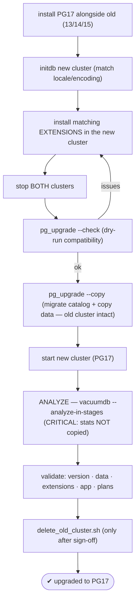
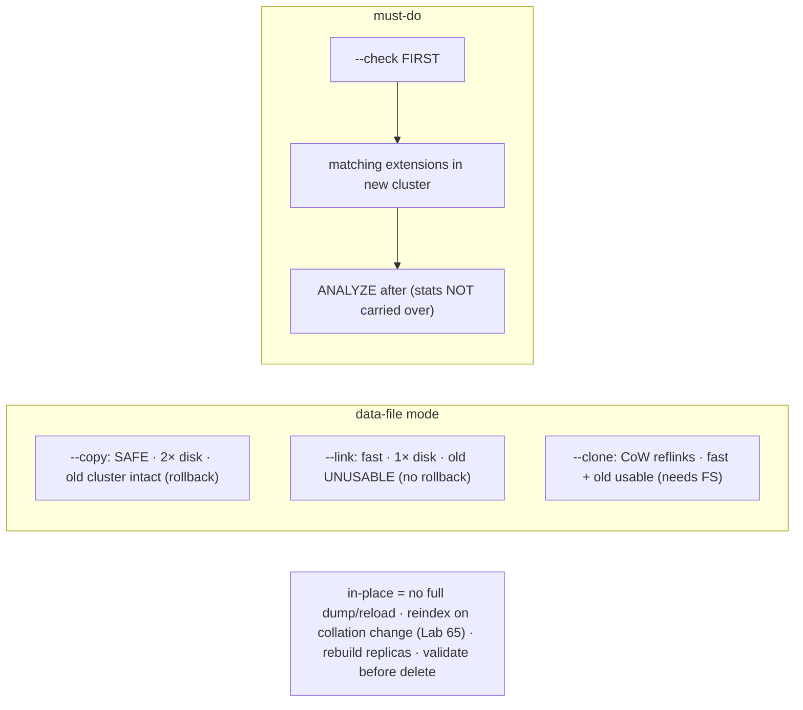

# Lab 145 — In-Place `pg_upgrade` from PG13/14/15 → PG17 (`--copy` mode); ANALYZE + Validate After

> **Track D · Migration · D2 PostgreSQL → PostgreSQL · Lab 1 of 6 (Lab 145/222)**
> Teaching package: concept → diagram → steps → verify → quick-ref → self-test → video script.
> **Depends on:** Lab 76 (logical-replication upgrade), Lab 65 (collation/reindex), Lab 70 (extensions). Opens D2.

---

## 0. Lab Card (at a glance)

| Field | Value |
|---|---|
| **Objective** | Upgrade an older major version to PG17 in place with `pg_upgrade --copy`, run the mandatory post-upgrade ANALYZE, validate, and know when to delete the old cluster. |
| **Success criterion** | `--check` passes; `pg_upgrade --copy` migrates; the new cluster starts as PG17 with data intact; ANALYZE restores stats; validation passes before old-cluster deletion. |
| **Scope boundary** | In-place upgrade. Zero-downtime logical upgrade was Lab 76. |
| **Prereqs** | Both major versions installed; 2× disk; a backup |
| **Time** | 35–50 min |
| **Difficulty** | ★★★★☆ |
| **Risk** | Medium — major upgrade; `--copy` keeps the old cluster (rollback). |

---

## 1. Learning Objectives

1. **What `pg_upgrade` does** and why it's fast.
2. **`--copy` vs `--link` vs `--clone`.**
3. **Pre-upgrade checks** — extensions, `--check`.
4. **The mandatory ANALYZE** — stats aren't copied.
5. **Validate, then delete** the old cluster.

---

## 2. Concept Primer — the "why"

**`pg_upgrade` does a fast in-place major-version upgrade — no full dump/reload.** Major versions have **incompatible on-disk catalog formats**, so you can't start a new binary on an old data directory. `pg_upgrade` bridges that: it builds the new cluster's **catalog**, then migrates the **user data files** — copying, linking, or cloning them. For large databases this is **dramatically faster** than `pg_dump`/restore.

**Three modes for the data files:**
- **`--copy`** (default, the lab's) — **copies** the data files. **Safe: the old cluster stays intact** (your rollback). Costs **2× disk** and time proportional to data size.
- **`--link`** — **hard-links** the files. **Fast, 1× disk**, but the old cluster becomes **unusable** afterward (files shared) → **no rollback**. For very large DBs where copy is too slow, accepting the risk.
- **`--clone`** (PG12+) — filesystem **reflinks (copy-on-write)** where supported (XFS/Btrfs/APFS) — fast like link **and** the old cluster stays usable. Best when the FS allows it.

**The process:**
1. Install **PG17 alongside** the old version (both binaries present).
2. `initdb` the **new** cluster (new data dir), matching **locale/encoding** to the old.
3. Install the **PG17 versions of every extension** the old cluster uses (pgvector, pg_stat_statements, …) into the new cluster — or `--check` will fail.
4. **Stop both** clusters.
5. **`pg_upgrade --check`** first — a dry-run that flags incompatibilities (missing extensions, deprecated objects) **without changing anything**.
6. **`pg_upgrade --copy`** — migrates.
7. It emits scripts: an analyze reminder and **`delete_old_cluster.sh`**.
8. **Start** the new cluster.

**The mandatory post-upgrade ANALYZE — the #1 gotcha.** `pg_upgrade` **does not copy optimizer statistics** (they're version-specific; PG17 doesn't preserve them — PG18 will). So the new cluster starts with **no stats** → the planner makes **terrible choices** and everything is slow until you fix it. **Run ANALYZE immediately:**
```bash
/usr/pgsql-17/bin/vacuumdb --all --analyze-in-stages
```
**`--analyze-in-stages`** runs three passes — **minimal stats fast** (so queries aren't catastrophic), then better, then full — so the database is **usable quickly** and improves. Skipping this is the classic "we upgraded and everything got slow" incident.

**Also handle:** **collation/glibc changes** across OS versions can corrupt text-index ordering → **reindex** affected indexes (Lab 65); **extension version updates** (`ALTER EXTENSION … UPDATE`); and **physical replicas**, which must be rebuilt or `rsync`'d from the upgraded primary.

**Validate before you delete.** Confirm PG17, data intact (row counts, key queries), extensions working, and an application smoke test with sane plans (post-ANALYZE). **Only then** run `delete_old_cluster.sh` — with `--copy`, the old cluster is your rollback until you remove it.

---

## 3. Diagrams

### 3.1 Upgrade flow



### 3.2 Mode + concept



---

## 4. Prerequisites — both versions installed

```bash
rpm -qa | grep -E "postgresql1[3457]-server"    # old (e.g. 15) + new (17) both present
df -h /var/lib/pgsql    # need 2× the data size for --copy
sudo -u postgres /usr/pgsql-15/bin/pg_dumpall -g > /backup/globals.sql   # + a real backup (safety)
```

---

## 5. Step-by-Step

### Step 1 — initdb the new cluster (matching locale/encoding)

```bash
sudo -u postgres /usr/pgsql-17/bin/initdb -D /var/lib/pgsql/17/data -k \
  --locale=$(sudo -u postgres psql -p 5432 -tAc "SHOW lc_collate") \
  -E $(sudo -u postgres psql -p 5432 -tAc "SHOW server_encoding")
```

### Step 2 — Install matching extensions in the new cluster

```bash
# whatever the old cluster uses must be available in PG17 (install the PG17 packages):
sudo -u postgres psql -p 5432 -tAc "SELECT extname FROM pg_extension WHERE extname<>'plpgsql';"
#   e.g. sudo dnf install -y pgvector_17 pg_stat_statements  (PG17 builds) — before --check
```

### Step 3 — Dry-run: pg_upgrade --check

```bash
sudo systemctl stop postgresql-15 postgresql-17 2>/dev/null
sudo -u postgres /usr/pgsql-17/bin/pg_upgrade \
  --old-datadir=/var/lib/pgsql/15/data --new-datadir=/var/lib/pgsql/17/data \
  --old-bindir=/usr/pgsql-15/bin --new-bindir=/usr/pgsql-17/bin \
  --check    # → "Clusters are compatible" or a list of issues to fix
```

### Step 4 — Run the upgrade (--copy)

```bash
cd /var/lib/pgsql
sudo -u postgres /usr/pgsql-17/bin/pg_upgrade \
  --old-datadir=/var/lib/pgsql/15/data --new-datadir=/var/lib/pgsql/17/data \
  --old-bindir=/usr/pgsql-15/bin --new-bindir=/usr/pgsql-17/bin \
  --copy    # safe: old cluster remains intact
#   → "Upgrade Complete" + generates delete_old_cluster.sh
```

### Step 5 — Start PG17 + the MANDATORY ANALYZE

```bash
sudo systemctl start postgresql-17
sudo -u postgres psql -c "SELECT version();"    # → PostgreSQL 17.x
# stats were NOT copied → analyze NOW (staged: usable fast, then refined):
sudo -u postgres /usr/pgsql-17/bin/vacuumdb --all --analyze-in-stages
```

### Step 6 — Validate, update extensions, then delete old

```bash
sudo -u postgres psql -c "SELECT count(*) FROM pg_stat_user_tables;"          # data present
sudo -u postgres psql -d benchdb -c "SELECT count(*) FROM pgbench_accounts;"    # row counts match pre-upgrade
sudo -u postgres psql -d benchdb -c "ALTER EXTENSION pg_stat_statements UPDATE;" 2>/dev/null  # bump extension versions
sudo -u postgres psql -d benchdb -c "EXPLAIN SELECT * FROM pgbench_accounts WHERE aid=1;"      # index scan (stats OK)
# collation change across OS? reindex affected (Lab 65). replicas? rebuild/rsync.
# ONLY after validation + app sign-off:
#   sudo -u postgres /var/lib/pgsql/delete_old_cluster.sh
echo "old cluster kept as rollback until delete_old_cluster.sh is run"
```

---

## 6. Verification Checklist

- [ ] PG17 installed alongside; 2× disk; backup taken
- [ ] New cluster initdb'd with matching locale/encoding
- [ ] Matching extensions installed in the new cluster
- [ ] `pg_upgrade --check` passed
- [ ] `pg_upgrade --copy` completed (old cluster intact)
- [ ] `SELECT version()` = 17; **ANALYZE (analyze-in-stages) run**
- [ ] Data/extensions/plans validated before deleting old cluster

---

## 7. Troubleshooting

| Symptom | Cause | Fix |
|---|---|---|
| `--check` fails | Missing extension / deprecated object | Install PG17 extension; drop/fix; re-check |
| Slow after upgrade | **No stats copied** | `vacuumdb --analyze-in-stages` — mandatory |
| Extension errors | Version mismatch | `ALTER EXTENSION … UPDATE` |
| Text index wrong order | Collation/glibc change | Reindex affected (Lab 65) |
| Disk full (`--copy`) | 2× space | Free space; or `--link`/`--clone` |
| Old cluster unusable | Used `--link` | `--copy` keeps it; that's link-mode behavior |
| Replicas broken | Not upgraded | Rebuild or `rsync` from the upgraded primary |
| Port conflict | Both on 5432 | Different ports during the upgrade |

---

## 8. Quick Reference Card (paste-ready)

```bash
# in-place major upgrade (no full dump/reload). Modes: --copy (safe, 2× disk, old intact) · --link (fast, no rollback) · --clone (CoW)
sudo systemctl stop postgresql-OLD postgresql-17
sudo -u postgres /usr/pgsql-17/bin/pg_upgrade \
  --old-datadir=/var/lib/pgsql/OLD/data --new-datadir=/var/lib/pgsql/17/data \
  --old-bindir=/usr/pgsql-OLD/bin --new-bindir=/usr/pgsql-17/bin --check   # dry-run FIRST
#   then re-run without --check --copy
sudo systemctl start postgresql-17

# ⚠ MANDATORY after upgrade (stats are NOT copied):
sudo -u postgres /usr/pgsql-17/bin/vacuumdb --all --analyze-in-stages       # quick → refined

# PRE: matching extensions in new cluster · same locale/encoding · 2× disk · backup
# POST: ALTER EXTENSION … UPDATE · reindex on collation change (Lab 65) · rebuild replicas · VALIDATE → then delete_old_cluster.sh
```

---

## 9. Self-Check

1. What does `pg_upgrade` do, and why is it fast?
2. What's the difference between `--copy`, `--link`, and `--clone`?
3. What's the critical post-upgrade step, and why?
4. What must you do before upgrading?
5. Why `--analyze-in-stages`?
6. When do you delete the old cluster?

<details>
<summary>Answers</summary>

1. An **in-place major-version upgrade** — migrates the catalog and data files instead of a full dump/reload — fast because it doesn't rewrite all the data.
2. **`--copy`**: copies files (safe, 2× disk, old cluster intact = rollback); **`--link`**: hard-links (fast, 1× disk, old unusable, no rollback); **`--clone`**: CoW reflinks (fast + old usable, needs a supporting FS).
3. **ANALYZE** — `pg_upgrade` doesn't copy optimizer statistics, so the new cluster has none and plans terribly until analyzed (`vacuumdb --analyze-in-stages`).
4. Install the **matching extensions** in the new cluster, match **locale/encoding**, ensure **2× disk** and a **backup**, and run **`pg_upgrade --check`** first.
5. It runs three passes — **minimal stats fast** (so the DB is immediately usable), then refines to full — avoiding a catastrophically slow window while analyzing.
6. **Only after** validating the upgrade and the application — the old cluster is your rollback with `--copy` until you delete it.
</details>

---

## 10. Video / Teaching Script

| # | On screen | Say (narration) |
|---|---|---|
| 1 | Title: "Major upgrade, in place" | "Dumping and reloading a big database takes forever. pg_upgrade migrates it in place — catalog and files — fast." |
| 2 | modes | "Copy mode is the safe one: your old cluster stays put as a rollback. Link is faster but burns the bridge behind you." |
| 3 | check | "Always dry-run first — pg_upgrade check tells you what'll break before you touch anything. Missing extensions, mostly." |
| 4 | run | "Stop both, run the upgrade, start seventeen. Minutes, not hours." |
| 5 | ANALYZE | "Now the step everyone forgets: it does *not* bring your statistics. Run analyze — in stages — or your shiny new database crawls." |
| 6 | validate | "Check the data, check the plans, run the app. *Then*, and only then, delete the old cluster." |
| 7 | Outro | "Upgraded and validated. Next: the zero-downtime path with logical replication." |

---

## 11. Glossary

- **`pg_upgrade`** — in-place major-version upgrade tool.
- **`--copy` / `--link` / `--clone`** — copy / hard-link / CoW data files.
- **`--check`** — pre-upgrade compatibility dry-run.
- **Optimizer statistics** — not copied → must ANALYZE.
- **`--analyze-in-stages`** — staged ANALYZE (fast then full).
- **`delete_old_cluster.sh`** — removes the old cluster (post-validation).
- **Collation change** — glibc shift → reindex (Lab 65).

---
*NETAPORT lab series · PostgreSQL 17 on AlmaLinux 9 · Lab 145/222 · D2 PostgreSQL → PostgreSQL*
