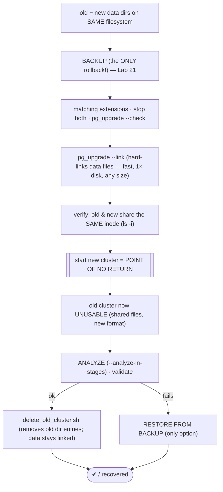
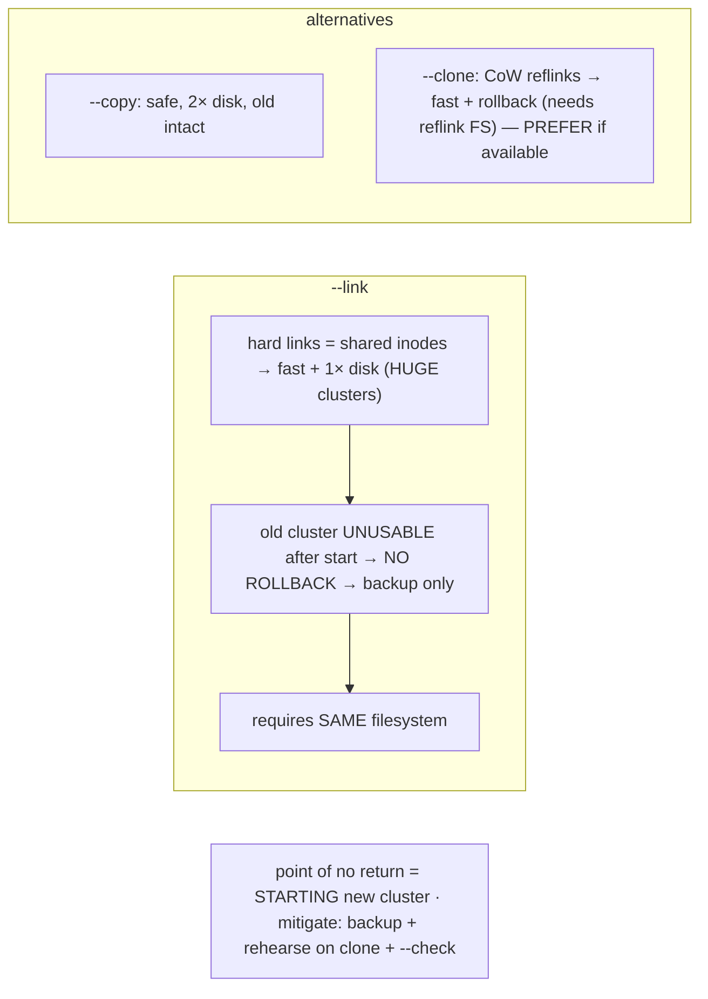

# Lab 146 — `pg_upgrade --link` (Hard-Link) Mode for a Huge Cluster; the No-Going-Back Tradeoff

> **Track D · Migration · D2 PostgreSQL → PostgreSQL · Lab 2 of 6 (Lab 146/222)**
> Teaching package: concept → diagram → steps → verify → quick-ref → self-test → video script.
> **Depends on:** Lab 145 (pg_upgrade --copy), Lab 21 (backup/PITR = the only rollback), Lab 65 (collation).

---

## 0. Lab Card (at a glance)

| Field | Value |
|---|---|
| **Objective** | Upgrade a large cluster with `pg_upgrade --link`, understand that it shares data files (fast, 1× disk) and is irreversible once started, and mitigate with a backup + same-filesystem layout. |
| **Success criterion** | `--link` completes fast; new and old share inodes; starting PG17 is the point of no return; ANALYZE + validation pass; backup is confirmed as the only rollback. |
| **Scope boundary** | `--link` mode + its tradeoff. `--copy` was Lab 145. |
| **Prereqs** | Lab 145; old+new on the **same filesystem**; a backup |
| **Time** | 30–45 min |
| **Difficulty** | ★★★★☆ |
| **Risk** | **High** — irreversible; requires a backup. Do on a lab/with a backup. |

---

## 1. Learning Objectives

1. **How `--link` works** — hard links, shared files.
2. **Why it's fast + 1× disk** for huge clusters.
3. **The no-rollback tradeoff** — point of no return.
4. **Same-filesystem requirement.**
5. **Mitigations** — backup, rehearse, `--clone`.

---

## 2. Concept Primer — the "why"

**`--link` shares the data files instead of copying them.** A **hard link** is a second directory entry pointing at the **same inode/data blocks** on disk. `pg_upgrade --link` migrates the catalog to the new cluster and creates **hard links** from the new data directory to the old data files — **no data is copied**. So the upgrade is **near-instant and uses only 1× disk** (just the new catalog), **regardless of database size**. For a **multi-TB cluster**, this is the difference between **minutes** and **hours** — `--copy` would have to physically duplicate every terabyte.

**The no-going-back tradeoff — the whole point of this lab.** Because the old and new clusters **share the same physical data files**, the moment you **start the new PG17 cluster**, it begins writing in the **new on-disk format** to those shared files. From that instant the **old cluster is unusable** — starting it would read/write the same blocks in the old format and **corrupt everything**. `pg_upgrade` treats this as committed and disables the old cluster's ability to start safely. **There is no rollback to the old cluster.** Your **only recovery** if the upgraded cluster is bad is **restore from backup** (Lab 21). Contrast with `--copy`, where the old cluster stays a clean rollback.

**The point of no return is starting the new cluster.** Immediately after `--link` completes but before starting, the files are linked but unmodified; but treat `--link` as committed the moment you run it — don't rely on the pre-start window.

**Same-filesystem requirement.** Hard links **cannot cross filesystems**, so the **old and new data directories must be on the same filesystem/mount**. If PGDATA-old and PGDATA-new are on different mounts, `--link` fails. Plan the new cluster's location accordingly.

**Choosing the mode:**

| Aspect | `--copy` | `--link` | `--clone` |
|---|---|---|---|
| Speed | slow (copies data) | **fast** (links) | fast (reflinks) |
| Disk | 2× | **1×** | ~1× (CoW grows on writes) |
| Old cluster after | intact (**rollback**) | **UNUSABLE (no rollback)** | intact (rollback) |
| FS requirement | any | **same FS** | same FS + **reflink** support |
| Best for | safety, moderate size | **huge cluster + backup** | huge + want rollback + reflink FS |

**`--clone`** (CoW reflinks on XFS-reflink/Btrfs/ZFS/APFS) is the ideal middle ground when available — as fast as `--link` **and** the old cluster survives (copy-on-write). Prefer `--clone` over `--link` if your filesystem supports it.

**Mandatory mitigations for `--link`:**
- **Take a backup first** — it is your *only* rollback (Lab 21).
- **Rehearse** on a clone with `--check` and a `--copy` dry-run before doing `--link` on production.
- Run **ANALYZE** after (stats aren't copied — same as Lab 145) and **validate before** running `delete_old_cluster.sh`.

---

## 3. Diagrams

### 3.1 --link flow + point of no return



### 3.2 Mode tradeoff



---

## 4. Prerequisites — same FS + backup

```bash
# old (e.g. 15) and new (17) data dirs MUST share a filesystem:
df /var/lib/pgsql/15/data /var/lib/pgsql/17/data    # same Filesystem column → OK for --link
# MANDATORY backup — the only rollback with --link:
sudo -u postgres /usr/pgsql-15/bin/pg_basebackup -D /backup/pre-upgrade -X stream -P    # (or pgBackRest, Lab 25)
```

---

## 5. Step-by-Step

### Step 1 — initdb new cluster on the SAME filesystem

```bash
sudo -u postgres /usr/pgsql-17/bin/initdb -D /var/lib/pgsql/17/data -k \
  --locale=$(sudo -u postgres psql -p 5432 -tAc "SHOW lc_collate") -E UTF8
df /var/lib/pgsql/15/data /var/lib/pgsql/17/data | awk '{print $1}'    # same device
```

### Step 2 — --check (compatibility), then confirm backup

```bash
sudo systemctl stop postgresql-15 postgresql-17
sudo -u postgres /usr/pgsql-17/bin/pg_upgrade \
  --old-datadir=/var/lib/pgsql/15/data --new-datadir=/var/lib/pgsql/17/data \
  --old-bindir=/usr/pgsql-15/bin --new-bindir=/usr/pgsql-17/bin --link --check
ls /backup/pre-upgrade/PG_VERSION && echo "backup present — proceeding"   # do NOT proceed without it
```

### Step 3 — Run --link (fast, regardless of size)

```bash
cd /var/lib/pgsql
time sudo -u postgres /usr/pgsql-17/bin/pg_upgrade \
  --old-datadir=/var/lib/pgsql/15/data --new-datadir=/var/lib/pgsql/17/data \
  --old-bindir=/usr/pgsql-15/bin --new-bindir=/usr/pgsql-17/bin --link
#   → completes in minutes even for a huge cluster (no data copied)
```

### Step 4 — Prove the files are shared (same inode)

```bash
# a table file in old and new should be the SAME inode (hard-linked):
OLD=$(sudo -u postgres find /var/lib/pgsql/15/data/base -name "1259" | head -1)
NEW=$(sudo -u postgres find /var/lib/pgsql/17/data/base -name "1259" | head -1)
sudo stat -c '%i %n' "$OLD" "$NEW"    # identical inode number → hard-linked (shared data)
```

### Step 5 — Start PG17 = POINT OF NO RETURN, then ANALYZE

```bash
sudo systemctl start postgresql-17    # ← from here, the OLD cluster is UNUSABLE (no rollback but backup)
sudo -u postgres psql -c "SELECT version();"    # PostgreSQL 17.x
sudo -u postgres /usr/pgsql-17/bin/vacuumdb --all --analyze-in-stages    # stats NOT copied (Lab 145)
```

### Step 6 — Validate; recovery = backup; then delete old

```bash
sudo -u postgres psql -d benchdb -c "SELECT count(*) FROM pgbench_accounts;"    # data intact
sudo -u postgres psql -d benchdb -c "EXPLAIN SELECT * FROM pgbench_accounts WHERE aid=1;"   # plans OK post-ANALYZE
# ⚠ if validation FAILS: the old cluster is gone → restore /backup/pre-upgrade (Lab 21) is the ONLY rollback
# after sign-off, reclaim the old directory (data blocks stay linked to the new cluster):
sudo -u postgres /var/lib/pgsql/delete_old_cluster.sh
echo "old cluster removed — new PG17 references the linked data"
```

---

## 6. Verification Checklist

- [ ] Old + new data dirs on the **same filesystem**
- [ ] Backup taken (the only rollback) **before** `--link`
- [ ] `--check` passed
- [ ] `--link` completed fast; old/new share inodes
- [ ] Starting PG17 understood as the point of no return
- [ ] ANALYZE (`--analyze-in-stages`) run; data/plans validated
- [ ] `delete_old_cluster.sh` run only after sign-off

---

## 7. Troubleshooting

| Symptom | Cause | Fix |
|---|---|---|
| `--link` "different filesystem" | Cross-mount | Put the new cluster on the **same FS** |
| Need to roll back after start | No rollback with `--link` | **Restore from backup** (Lab 21) — the only path |
| Validation fails post-`--link` | Committed | Restore from backup; can't revert to old cluster |
| Old cluster won't start | Shared files, new format | Expected — don't start it; use the new cluster |
| Want speed **and** rollback | — | Use `--clone` (reflink FS) instead of `--link` |
| No backup taken | — | **Do not proceed** with `--link` without a backup |
| Disk still needed | Catalog + WAL | `--link` is 1× data, but the new catalog/WAL need space |

---

## 8. Quick Reference Card (paste-ready)

```bash
# --link: hard-links data files → FAST + 1× disk for HUGE clusters · but OLD CLUSTER UNUSABLE after start → NO ROLLBACK
# requires OLD+NEW on the SAME filesystem · BACKUP first (only rollback) · prefer --clone if the FS has reflinks

df old_datadir new_datadir              # same filesystem?
pg_basebackup -D /backup/pre-upgrade -X stream   # MANDATORY backup (Lab 21)
pg_upgrade --old-datadir=OLD --new-datadir=NEW --old-bindir=OLDBIN --new-bindir=NEWBIN --link --check   # dry-run
pg_upgrade ... --link                   # fast, regardless of size
stat -c '%i' OLD/base/... NEW/base/...   # same inode → shared (hard-linked)
systemctl start postgresql-17           # ← POINT OF NO RETURN (old cluster now unusable)
vacuumdb --all --analyze-in-stages       # stats NOT copied — mandatory (Lab 145)
# validate → delete_old_cluster.sh   |   if bad: RESTORE FROM BACKUP (only option)
```

---

## 9. Self-Check

1. What does `--link` do, and why is it fast?
2. What's the no-going-back tradeoff?
3. What's the filesystem requirement?
4. When would you use `--link` vs `--copy` vs `--clone`?
5. What's the point of no return?
6. What's the mandatory mitigation?

<details>
<summary>Answers</summary>

1. It creates **hard links** from the new cluster to the old data files (shared inodes) instead of copying — so it's near-instant and uses **1× disk** regardless of database size (ideal for huge clusters).
2. Old and new **share the files**, so once you **start the new cluster** (new on-disk format), the **old cluster is unusable** — **no rollback**; a **backup** is the only recovery.
3. Old and new data dirs must be on the **same filesystem** — hard links can't cross filesystems.
4. **`--link`**: huge cluster + a backup + accept no-rollback; **`--copy`**: want the old cluster as rollback and can afford 2× disk; **`--clone`**: huge + want rollback + a reflink-capable filesystem.
5. **Starting the new cluster** after `--link` — it writes new-format changes to the shared files, corrupting the old cluster.
6. Take a **backup before `--link`** (the only rollback) and **rehearse** on a clone with `--check` first.
</details>

---

## 10. Video / Teaching Script

| # | On screen | Say (narration) |
|---|---|---|
| 1 | Title: "The fast upgrade with no undo" | "A ten-terabyte cluster? Copying it takes all night. Link mode takes *minutes* — because it copies nothing at all." |
| 2 | hard links | "It just points the new cluster at the old files. Same blocks on disk, two names. Instant." |
| 3 | the catch | "But that's the catch. Share the files, and the moment you start the new database, the old one is *toast*. No going back." |
| 4 | inode | "Look — same inode, old and new. One copy of the data, shared. Elegant, and unforgiving." |
| 5 | backup | "So the rule is absolute: back up first. That backup is your *only* rollback now. No backup, no link mode." |
| 6 | clone | "And if your filesystem does reflinks — use clone instead. Just as fast, and the old cluster survives. Best of both." |
| 7 | Outro | "Fast, committed, backed up. Next: the zero-downtime path with logical replication." |

---

## 11. Glossary

- **`--link`** — hard-link data files (shared, fast, 1× disk).
- **Hard link / inode** — two names, one on-disk copy.
- **Point of no return** — starting the new cluster after `--link`.
- **No rollback** — old cluster unusable; backup is the only recovery.
- **Same filesystem** — required for hard links.
- **`--clone`** — CoW reflinks: fast **and** keeps the old cluster.
- **`--analyze-in-stages`** — mandatory post-upgrade ANALYZE.

---
*NETAPORT lab series · PostgreSQL 17 on AlmaLinux 9 · Lab 146/222 · D2 PostgreSQL → PostgreSQL*
