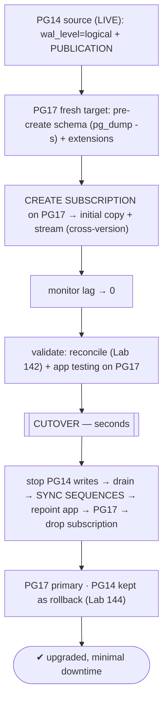
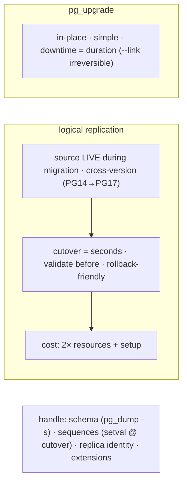

# Lab 147 — Logical-Replication Upgrade: Replicate PG14 → PG17 Live, Then Cutover with Minimal Downtime

> **Track D · Migration · D2 PostgreSQL → PostgreSQL · Lab 3 of 6 (Lab 147/222)**
> Teaching package: concept → diagram → steps → verify → quick-ref → self-test → video script.
> **Depends on:** Lab 33 (logical replication), Lab 135 (migration cutover), Lab 142 (reconcile), Lab 144 (rollback), Lab 145 (pg_upgrade).

---

## 0. Lab Card (at a glance)

| Field | Value |
|---|---|
| **Objective** | Upgrade PG14→PG17 with near-zero downtime by replicating live via logical replication, then cutting over — handling schema, extensions, and sequences. |
| **Success criterion** | PG17 catches up via logical replication; validation passes; a cutover (stop-writes→drain→sync-sequences→repoint) moves the app in seconds; PG14 stays available as rollback. |
| **Scope boundary** | Cross-version logical-replication upgrade. In-place `pg_upgrade` was Labs 145/146. |
| **Prereqs** | Lab 33/135; PG14 source + fresh PG17 |
| **Time** | 45–70 min |
| **Difficulty** | ★★★★★ |
| **Risk** | Medium — cutover; sequence sync is critical. |

---

## 1. Learning Objectives

1. **Why logical replication for an upgrade** vs `pg_upgrade`.
2. **Cross-version** — PG14 publisher → PG17 subscriber.
3. **Setup** — publication, schema pre-create, subscription.
4. **The minimal-downtime cutover.**
5. **Rollback-friendliness.**

---

## 2. Concept Primer — the "why"

**Logical replication upgrades with near-zero downtime — the source stays live.** `pg_upgrade` (Labs 145/146) is in-place but needs a **downtime window** (the full upgrade duration for `--copy`; `--link` is fast but **irreversible**). Logical replication instead stands up a **fresh PG17**, replicates PG14's data to it **while PG14 keeps serving**, lets it catch up, and cuts over with only **seconds** of downtime. You also get to **validate PG17 thoroughly before cutover** and keep **PG14 as an easy rollback**.

**It works because logical replication is version-independent.** Logical decoding is row-based over a stable protocol, so a **PG14 publisher → PG17 subscriber** works — older→newer is the standard, well-supported upgrade direction. (Physical replication can't do this; it's binary-format-locked to one major version.)

**The process (same shape as Labs 33/135, for a version upgrade):**
1. **PG14 source:** `wal_level=logical` + `CREATE PUBLICATION … FOR ALL TABLES`.
2. **PG17 target:** fresh install + `initdb`; **pre-create the schema** (`pg_dump --schema-only` from PG14 → apply; globals via `pg_dumpall -g`) — logical replication replicates **data, not DDL**; ensure **extensions** exist on PG17.
3. **Subscription** on PG17 → **initial copy + stream** (CDC).
4. **Catch up** (lag → 0).
5. **Validate** — reconcile (Lab 142) + application testing on PG17.
6. **Cutover** (minimal downtime).

**The minimal-downtime cutover** (Labs 76/135):
1. **Stop writes** on PG14.
2. **Drain** the subscription (lag 0).
3. **Sync sequences** — logical replication does **not** replicate sequence values, so PG17's sequences sit at initial values; without syncing, new inserts reuse old IDs → **duplicate-key errors**. `setval` from PG14's `last_value`.
4. **Repoint** the app to PG17.
5. **Drop** the subscription.
Downtime = only this window (seconds to a minute).

**Same must-handle gotchas:** schema/DDL (pre-create + mirror any DDL applied mid-migration), **sequences** (sync at cutover), **replica identity** (PK for UPDATE/DELETE), large objects (separate).

**`pg_upgrade` vs logical replication — the decision:**

| | `pg_upgrade` (`--copy`/`--link`) | Logical replication |
|---|---|---|
| Downtime | upgrade duration (`--link` faster, irreversible) | **seconds** (cutover only) |
| Cross-version | in-place bump | **any older→newer** |
| Rollback | old cluster (`--copy`) / backup (`--link`) | **PG14 intact** / reverse CDC |
| Validate first | limited | **full pre-cutover validation** |
| Cost | simple, 1–2× disk | more setup, **2× resources** during migration |

Use logical replication for **large/critical** databases where downtime matters; `pg_upgrade` for **simpler/smaller** upgrades.

**Rollback-friendly (Lab 144):** PG14 is untouched until cutover → immediate rollback (repoint back) if you abort before target writes; set up **reverse CDC (PG17→PG14)** for **zero-loss** rollback after cutover.

---

## 3. Diagrams

### 3.1 Upgrade flow



### 3.2 vs pg_upgrade



---

## 4. Prerequisites — PG14 source + fresh PG17

```bash
sudo -u postgres psql -p 5414 -c "ALTER SYSTEM SET wal_level='logical';" && sudo systemctl restart postgresql-14
sudo -u postgres psql -p 5414 -c "SHOW wal_level;"      # logical
sudo -u postgres psql -p 5417 -c "SELECT version();"    # fresh PG17 (Lab 1), ready as target
```

---

## 5. Step-by-Step

### Step 1 — Publication on PG14

```bash
sudo -u postgres psql -p 5414 -d appdb -c "CREATE PUBLICATION upg_pub FOR ALL TABLES;"
```

### Step 2 — Pre-create schema + extensions on PG17 (DDL not replicated)

```bash
sudo -u postgres pg_dumpall -p 5414 -g | sudo -u postgres psql -p 5417                      # globals/roles
sudo -u postgres pg_dump  -p 5414 -d appdb --schema-only | sudo -u postgres psql -p 5417 -d appdb   # schema
sudo -u postgres psql -p 5414 -d appdb -tAc "SELECT extname FROM pg_extension WHERE extname<>'plpgsql';"  # ensure each exists on PG17
```

### Step 3 — Subscription on PG17 (initial copy + stream)

```bash
sudo -u postgres psql -p 5417 -d appdb -c "
CREATE SUBSCRIPTION upg_sub
CONNECTION 'host=127.0.0.1 port=5414 dbname=appdb user=postgres'
PUBLICATION upg_pub;"      # cross-version copy + stream begins
```

### Step 4 — Monitor catch-up

```bash
sudo -u postgres psql -p 5417 -d appdb -x -c "SELECT subname, received_lsn, latest_end_lsn FROM pg_stat_subscription;"
sudo -u postgres psql -p 5414 -c "SELECT application_name, state, replay_lag FROM pg_stat_replication;"   # lag → 0
```

### Step 5 — Validate (reconcile + app) then CUTOVER

```bash
# validate PG17 against PG14 (Lab 142), then cut over:
sudo -u postgres psql -p 5414 -d appdb -c "ALTER DATABASE appdb SET default_transaction_read_only = on;"   # 1) stop writes
sleep 2   # 2) drain
# 3) SYNC SEQUENCES (not replicated):
sudo -u postgres psql -p 5414 -d appdb -tAc "
SELECT format('SELECT setval(%L,%s,true);', schemaname||'.'||sequencename, last_value)
FROM pg_sequences WHERE last_value IS NOT NULL;" | sudo -u postgres psql -p 5417 -d appdb
# 4) repoint app → PG17 (connstring/DNS); 5) drop subscription:
sudo -u postgres psql -p 5417 -d appdb -c "DROP SUBSCRIPTION upg_sub;"
```

### Step 6 — Verify PG17 serving + ANALYZE

```bash
sudo -u postgres psql -p 5417 -d appdb -c "SELECT version(); SELECT count(*) FROM some_table;"   # PG17, data intact
sudo -u postgres psql -p 5417 -d appdb -c "INSERT INTO some_table DEFAULT VALUES RETURNING id;" 2>/dev/null || true  # no dup-key → sequences OK
sudo -u postgres /usr/pgsql-17/bin/vacuumdb -p 5417 --all --analyze   # fresh stats on the new version
# PG14 kept read-only as rollback until sign-off (Lab 144); reverse CDC optional for post-cutover safety
```

---

## 6. Verification Checklist

- [ ] PG14 `wal_level=logical` + publication
- [ ] PG17 schema/globals pre-created; extensions present
- [ ] Subscription created; cross-version copy + stream working
- [ ] Lag caught up to ~0; validated (reconcile + app)
- [ ] Cutover: writes stopped, drained, **sequences synced**, repointed
- [ ] PG17 serving; no duplicate-key (sequences OK); ANALYZE run
- [ ] PG14 retained as rollback

---

## 7. Troubleshooting

| Symptom | Cause | Fix |
|---|---|---|
| Subscription won't connect | wal_level/hba/network | `logical` on PG14; allow PG17; connectivity |
| Tables missing on PG17 | Schema not pre-created | `pg_dump --schema-only` first |
| Duplicate key after cutover | Sequences not synced | `setval` from PG14 before writes |
| UPDATE/DELETE not replicating | No replica identity | PK / `REPLICA IDENTITY FULL` |
| Slow initial copy | Large DB | `max_sync_workers_per_subscription`; split |
| Resource strain | 2× clusters during migration | Plan capacity for the overlap |
| Extension missing on PG17 | Not installed | Install PG17 build first |

---

## 8. Quick Reference Card (paste-ready)

```sql
-- cross-version, near-zero downtime: PG14 publisher → PG17 subscriber (logical rep is version-independent)
-- PG14:  ALTER SYSTEM SET wal_level='logical'; (restart)   CREATE PUBLICATION upg_pub FOR ALL TABLES;
-- PG17:  pg_dumpall -g | psql ; pg_dump --schema-only | psql ; create extensions   (DDL NOT replicated)
--        CREATE SUBSCRIPTION upg_sub CONNECTION '...port=5414...' PUBLICATION upg_pub;   -- copy + stream
-- CUTOVER (seconds): stop PG14 writes → drain (lag 0) → SYNC SEQUENCES (setval) → repoint app → DROP SUBSCRIPTION → ANALYZE
```
```text
vs pg_upgrade: logical rep = near-zero downtime + cross-version + validate-first + rollback-friendly, BUT 2× resources + setup
rollback (Lab 144): PG14 intact until cutover · reverse CDC (PG17→PG14) for zero-loss after
```

---

## 9. Self-Check

1. Why use logical replication for a major upgrade?
2. Does PG14→PG17 logical replication work, and why?
3. What's the setup?
4. What are the cutover steps?
5. How does it compare to `pg_upgrade`?
6. How do you roll back?

<details>
<summary>Answers</summary>

1. **Near-zero downtime** — the source stays live during migration — plus cross-version support, full pre-cutover validation, and easy rollback (vs `pg_upgrade`'s downtime window).
2. Yes — logical replication is **version-independent** (row-based logical decoding), so a PG14 publisher → PG17 subscriber (older→newer) is the standard supported direction.
3. PG14: `wal_level=logical` + publication; PG17: pre-create schema/globals + extensions + a subscription (initial copy + stream).
4. Stop PG14 writes → drain lag → **sync sequences** → repoint the app → drop the subscription.
5. Logical rep = near-zero downtime, cross-version, validate-first, rollback-friendly, but more setup and **2× resources**; `pg_upgrade` = in-place, simpler, but downtime = duration (`--link` irreversible).
6. PG14 is untouched until cutover → repoint back; set up **reverse CDC (PG17→PG14)** for zero-loss rollback after cutover (Lab 144).
</details>

---

## 10. Video / Teaching Script

| # | On screen | Say (narration) |
|---|---|---|
| 1 | Title: "Upgrade with the lights on" | "pg_upgrade means downtime. But logical replication lets you upgrade a live database — fourteen to seventeen — while it keeps serving." |
| 2 | cross-version | "It works because logical replication doesn't care about versions. Old publishes, new subscribes. Data flows across the gap." |
| 3 | setup | "Stand up seventeen, copy the schema over, subscribe. It backfills, then streams every change. Both running, users none the wiser." |
| 4 | validate | "And here's the luxury: test the new version *fully* before you commit. pg_upgrade never gives you that." |
| 5 | cutover | "Cutover's the same few seconds: stop writes, drain, sync the sequences — don't skip that — repoint, done." |
| 6 | rollback | "Fourteen's still sitting there, untouched. Something's wrong? Point back. That's your safety net." |
| 7 | Outro | "Live upgrade, minimal downtime. Next: cross-platform migration." |

---

## 11. Glossary

- **Logical-replication upgrade** — cross-version upgrade via publish/subscribe.
- **Cross-version** — PG14 publisher → PG17 subscriber (older→newer).
- **Publication / subscription** — source / target logical-rep objects.
- **Cutover** — stop-writes→drain→sync-seq→repoint (seconds).
- **Sequence sync** — `setval` (not replicated).
- **Reverse CDC** — PG17→PG14 for zero-loss rollback (Lab 144).
- **2× resources** — both clusters run during migration.

---
*NETAPORT lab series · PostgreSQL 17 on AlmaLinux 9 · Lab 147/222 · D2 PostgreSQL → PostgreSQL*
