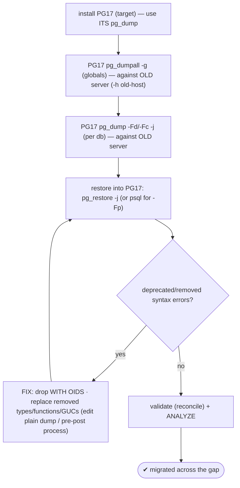
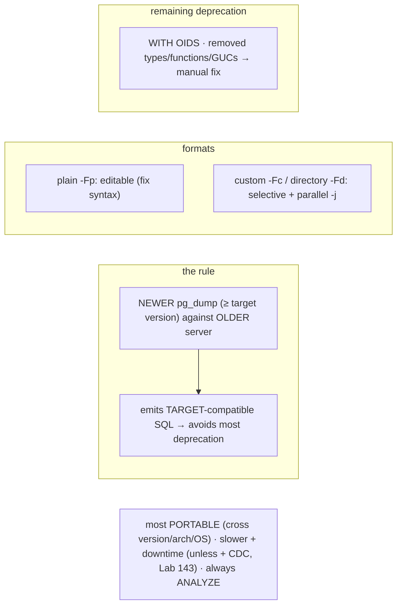

# Lab 148 — Dump/Restore Across a Version Gap (`pg_dump` from New Binaries Against Old Server); Handle Deprecated Syntax

> **Track D · Migration · D2 PostgreSQL → PostgreSQL · Lab 4 of 6 (Lab 148/222)**
> Teaching package: concept → diagram → steps → verify → quick-ref → self-test → video script.
> **Depends on:** Lab 18 (pg_dump/restore), Lab 145 (pg_upgrade), Lab 143 (CDC for the delta).

---

## 0. Lab Card (at a glance)

| Field | Value |
|---|---|
| **Objective** | Migrate across a major-version gap with dump/restore, using the newer `pg_dump` against the older server, choosing formats/parallelism, and remediating deprecated/removed syntax. |
| **Success criterion** | The newer `pg_dump` dumps the old server; the restore loads into PG17; deprecated-syntax errors are found and fixed; data validates. |
| **Scope boundary** | Dump/restore version-gap migration. In-place upgrade was Lab 145. |
| **Prereqs** | Lab 18; an old source server + PG17 target |
| **Time** | 35–50 min |
| **Difficulty** | ★★★★☆ |
| **Risk** | Low-Medium — logical export/reload. |

---

## 1. Learning Objectives

1. **Why dump/restore** — the portable path.
2. **The version-gap rule** — newer dump, older server.
3. **Why it handles most deprecation.**
4. **Formats + parallelism** for large DBs.
5. **Remediate remaining deprecated syntax.**

---

## 2. Concept Primer — the "why"

**Dump/restore is the most portable migration path.** `pg_dump` exports a **logical** representation (SQL or an archive format); `pg_restore`/`psql` loads it. Unlike `pg_upgrade` and physical replication — which are locked to one binary format/architecture — dump/restore works **across major versions, CPU architectures, and operating systems**, and across **very large version gaps**. It's slower for big databases (full export + reload) but it's the **universal fallback that always works**, and it lets you migrate a **subset** or rebuild cleanly.

**The critical version-gap rule: run the *newer* `pg_dump` against the *older* server.** To migrate **PG13 → PG17**, use **PG17's** `pg_dump`/`pg_dumpall`, pointed at the PG13 server over the network — **not** PG13's `pg_dump`:
```bash
/usr/pgsql-17/bin/pg_dump -h old-pg13-host -p 5432 -U postgres -Fc -d appdb -f appdb.dump
```
The rule of thumb from the PostgreSQL docs: **the `pg_dump` version should be ≥ the target server version**, and it can dump from servers **older than itself**.

**Why this handles most deprecation.** A newer `pg_dump` **knows current syntax** and emits output **compatible with the newer target** it will restore into — so it avoids the deprecated/removed constructs an *older* `pg_dump` would emit. Using the old server's `pg_dump` is the classic mistake: it produces SQL the new server **rejects** (old function signatures, removed clauses).

**But a big gap still leaves manual fixes.** If the **source uses features removed in newer versions**, the dump carries them and the new server rejects them. Common ones across gaps:
- **`WITH OIDS`** (removed PG12) → drop it.
- **Removed types** — `abstime`/`reltime`/`tinterval` (PG12), `xml2` quirks → replace/remove.
- **Removed/changed functions, operators, GUCs**; **`CREATE RULE`** deprecations; `password_encryption` md5→scram.
Remediate by **capturing restore errors and fixing** the offending statements (edit a plain dump, or pre-/post-process).

**Formats + parallelism (Lab 18):**
- **Plain (`-Fp`)** — SQL text; **editable** (best for fixing deprecated syntax); restore with `psql`.
- **Custom (`-Fc`)** — compressed archive; **selective** restore + **parallel** (`-j`) restore.
- **Directory (`-Fd`)** — one file per table; **parallel dump *and* restore** (`-j N`). Fastest for large DBs.
Use **directory/custom + `-j`** for big migrations.

**Downtime.** Dump/restore needs a consistent snapshot — for a clean cutover: **stop writes → dump → restore → repoint**, so downtime = dump+restore duration. To shrink it on a large DB, combine with **logical replication/CDC for the delta** (Lab 143): dump/restore the bulk, then CDC the changes since the snapshot.

**When to choose it:** cross-platform/arch/OS, very old→new, selective migration, or a clean rebuild — where `pg_upgrade` (same platform, in-place) or logical replication (network path) don't fit. **Always ANALYZE** after (fresh stats on the new server).

---

## 3. Diagrams

### 3.1 Version-gap dump/restore flow



### 3.2 Concept



---

## 4. Prerequisites — old source + PG17 target

```bash
/usr/pgsql-17/bin/pg_dump --version    # 17.x — the binary we use (target version)
/usr/pgsql-17/bin/psql -h old-pg13-host -p 5432 -U postgres -c "SELECT version();"   # old server reachable
```

### Pre-scan the source for removed features

```bash
# check for constructs that won't survive the gap (adjust per source version):
/usr/pgsql-17/bin/psql -h old-pg13-host -U postgres -d appdb -tAc "
SELECT relname FROM pg_class WHERE relhasoids;" 2>/dev/null    # WITH OIDS tables (removed PG12)
/usr/pgsql-17/bin/psql -h old-pg13-host -U postgres -d appdb -tAc "
SELECT typname FROM pg_type WHERE typname IN ('abstime','reltime','tinterval');"   # removed types
```

## 5. Step-by-Step

### Step 1 — Dump globals with the NEWER pg_dumpall

```bash
/usr/pgsql-17/bin/pg_dumpall -h old-pg13-host -p 5432 -U postgres -g > globals.sql   # roles/tablespaces
```

### Step 2 — Dump the database (directory format, parallel)

```bash
/usr/pgsql-17/bin/pg_dump -h old-pg13-host -p 5432 -U postgres \
  -Fd -j 4 -d appdb -f appdb.dir    # newer pg_dump, older server, parallel directory dump
```

### Step 3 — Load globals + restore into PG17

```bash
sudo -u postgres /usr/pgsql-17/bin/psql -f globals.sql
sudo -u postgres /usr/pgsql-17/bin/createdb appdb
sudo -u postgres /usr/pgsql-17/bin/pg_restore -d appdb -j 4 appdb.dir 2> restore-errors.log
grep -iE "error|does not exist|syntax" restore-errors.log | head    # capture deprecation errors
```

### Step 4 — Fix deprecated/removed syntax (if any)

```bash
# example fixes if the restore log flags them:
#   WITH OIDS  → newer pg_dump omits it; if a hand-edited/plain dump has it, strip:
#     sed -i 's/ WITH OIDS//g; s/ WITHOUT OIDS//g' dump.sql
#   removed type (e.g. abstime) → replace with timestamptz in the plain dump, or fix the source object
#   deprecated GUC in dump (e.g. per-role SET) → remove/adjust the SET line
# then re-run the affected statements / re-restore that object
echo "fix flagged statements, re-apply, iterate until clean"
```

### Step 5 — Validate + ANALYZE

```bash
sudo -u postgres psql -d appdb -c "SELECT count(*) FROM pg_stat_user_tables;"    # objects present
sudo -u postgres psql -d appdb -c "SELECT count(*) FROM some_table;"              # row counts (reconcile, Lab 142)
sudo -u postgres /usr/pgsql-17/bin/vacuumdb -d appdb --analyze                    # fresh stats
```

### Step 6 — (Large DB) shrink downtime with a CDC delta

```bash
# for minimal downtime on a big DB: dump/restore the bulk at a snapshot LSN, then CDC the delta (Lab 143)
echo "bulk = dump/restore snapshot · delta = logical replication from the snapshot's position → cutover at lag 0"
```

---

## 6. Verification Checklist

- [ ] Used **PG17's** `pg_dump`/`pg_dumpall` (≥ target) against the old server
- [ ] Pre-scanned source for removed features
- [ ] Directory/custom format + `-j` for speed
- [ ] Globals loaded; database restored into PG17
- [ ] Restore errors captured; deprecated syntax fixed
- [ ] Data validated (reconcile) + `ANALYZE` run
- [ ] Large-DB downtime plan (dump + CDC delta) understood

---

## 7. Troubleshooting

| Symptom | Cause | Fix |
|---|---|---|
| Restore rejects old syntax | Used the **older** `pg_dump` | Re-dump with the **newer** (target) `pg_dump` |
| `WITH OIDS` error | Removed PG12 | Newer `pg_dump` omits; else `sed` it out |
| Removed type/function | Source uses removed feature | Replace in source or edit the dump |
| Slow dump/restore | Large DB | Directory/custom format + `-j` parallel |
| Server too old for pg_dump | Beyond support (~<9.2) | Intermediate-version hop |
| Globals missing | Not dumped | `pg_dumpall -g` separately |
| Long downtime | Full export/reload | Add a **CDC delta** (Lab 143) |
| Encoding mismatch | Target differs | Match target encoding/locale |

---

## 8. Quick Reference Card (paste-ready)

```bash
# RULE: newer pg_dump (>= target version) against the OLDER server → target-compatible SQL (handles most deprecation)
/usr/pgsql-17/bin/pg_dumpall -h OLD_HOST -U postgres -g > globals.sql
/usr/pgsql-17/bin/pg_dump    -h OLD_HOST -U postgres -Fd -j 4 -d appdb -f appdb.dir   # directory + parallel
psql -f globals.sql ; createdb appdb ; pg_restore -d appdb -j 4 appdb.dir 2> errors.log

# formats: -Fp plain (editable, fix syntax) · -Fc custom (selective+parallel) · -Fd directory (parallel dump+restore)
# remaining deprecation (big gaps): WITH OIDS · removed types (abstime/reltime) · removed funcs/GUCs → capture errors, fix, re-apply
# portable (cross version/arch/OS) · slower + downtime (unless + CDC delta, Lab 143) · ANALYZE after
```

---

## 9. Self-Check

1. Why choose dump/restore?
2. What's the critical version-gap rule?
3. Why does the newer `pg_dump` handle most deprecation?
4. How do you handle remaining deprecated syntax?
5. Which formats/options for large DBs?
6. How does downtime compare to `pg_upgrade`, and how do you shrink it?

<details>
<summary>Answers</summary>

1. It's the **most portable** — cross-version, cross-architecture, cross-OS, large gaps, and selective — the universal fallback when `pg_upgrade`/physical replication can't.
2. Use the **newer `pg_dump`** (version ≥ the target) against the **older source server**; it can dump older servers and emits target-compatible SQL.
3. It knows **current syntax** and produces output compatible with the **newer target**, avoiding the deprecated constructs an older `pg_dump` would emit.
4. Capture restore errors and **fix the offending statements** — drop `WITH OIDS`, replace removed types/functions/GUCs (edit a plain dump or pre/post-process), then re-apply.
5. **Directory (`-Fd`)** or **custom (`-Fc`)** format with **parallel `-j`** for dump/restore speed.
6. Dump/restore is **slower + more downtime** (full export/reload); shrink it by combining the bulk dump/restore with a **CDC delta** (Lab 143) → cut over at lag 0.
</details>

---

## 10. Video / Teaching Script

| # | On screen | Say (narration) |
|---|---|---|
| 1 | Title: "The migration that always works" | "Different OS? Different CPU? Ten versions apart? Dump and restore doesn't care. It's the universal path." |
| 2 | the rule | "One rule people get backwards: use the *new* pg_dump against the *old* server. Seventeen's dump tool, pointed at thirteen. Not the other way." |
| 3 | why | "Because the new tool speaks the new dialect — it won't emit syntax your new server has since dropped." |
| 4 | deprecation | "Big gaps still bite: with-oids, dead types, removed functions. Catch the errors, fix the lines, re-apply." |
| 5 | parallel | "For big databases, directory format and parallel jobs — dump and restore, many tables at once." |
| 6 | downtime | "It's slower than pg_upgrade, so pair it with CDC for the delta — bulk it, then stream the changes, cut over clean." |
| 7 | Outro | "Portable and reliable. Next: cross-platform, cross-endian migration." |

---

## 11. Glossary

- **Dump/restore** — logical export/reload (most portable path).
- **Version-gap rule** — newer `pg_dump` (≥ target) against the older server.
- **Deprecated/removed syntax** — `WITH OIDS`, removed types/functions/GUCs.
- **Plain / custom / directory** — editable / selective+parallel / parallel formats.
- **`-j`** — parallel jobs (dump/restore).
- **CDC delta** — stream changes to shrink downtime (Lab 143).

---
*NETAPORT lab series · PostgreSQL 17 on AlmaLinux 9 · Lab 148/222 · D2 PostgreSQL → PostgreSQL*
