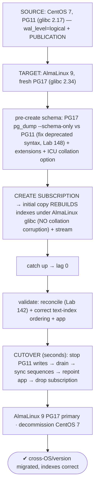
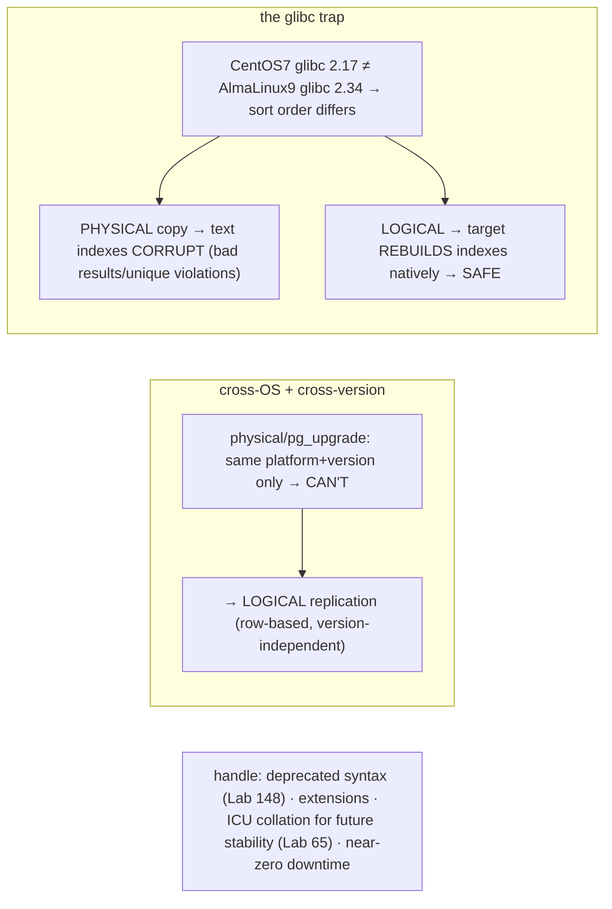

# Lab 149 — Cross-Architecture / Cross-OS Move (CentOS 7 PG11 → AlmaLinux 9 PG17) via Logical Replication

> **Track D · Migration · D2 PostgreSQL → PostgreSQL · Lab 5 of 6 (Lab 149/222)**
> Teaching package: concept → diagram → steps → verify → quick-ref → self-test → video script.
> **Depends on:** Lab 147 (logical-rep upgrade), Lab 65 (collation/glibc), Lab 148 (version-gap schema), Lab 142 (reconcile).

---

## 0. Lab Card (at a glance)

| Field | Value |
|---|---|
| **Objective** | Migrate CentOS 7 PG11 → AlmaLinux 9 PG17 (cross-OS + 6-version gap) with logical replication, understanding why physical methods fail (glibc collation) and cutting over with minimal downtime. |
| **Success criterion** | The target rebuilds indexes under AlmaLinux 9's collation (no corruption); schema is pre-created across the gap; replication catches up; cutover moves the app; data validates. |
| **Scope boundary** | Cross-OS/version logical migration. Same-platform upgrade was Lab 145. |
| **Prereqs** | Lab 147/65; CentOS 7 PG11 source + AlmaLinux 9 PG17 target |
| **Time** | 50–75 min |
| **Difficulty** | ★★★★★ |
| **Risk** | Medium — cutover + the collation trap. |

---

## 1. Learning Objectives

1. **Why cross-OS/version needs logical** (not physical).
2. **The glibc collation gotcha** — the #1 cross-OS disaster.
3. **Why logical replication avoids it** — target rebuilds indexes.
4. **Handling the 6-version gap** — schema, extensions.
5. **ICU collation** for future OS-move stability.

---

## 2. Concept Primer — the "why"

**Cross-OS + cross-version rules out physical methods.** Moving CentOS 7/PG11 → AlmaLinux 9/PG17 changes **two dimensions at once**: the **OS** (different glibc/system libraries) and the **major version** (six apart). Neither physical path works:
- **`pg_upgrade`** is same-platform, in-place — it doesn't move between hosts and is binary-format-locked.
- **Physical/streaming replication** requires the **same major version and platform**.
So the path is **logical replication** (row-based, version-independent, Lab 147) or dump/restore (Lab 148). Logical replication gives near-zero downtime.

**The glibc collation gotcha — the #1 cross-OS PostgreSQL disaster.** CentOS 7 ships **glibc 2.17**; AlmaLinux 9 ships **glibc 2.34**. The **default glibc collation** (the sort order used by text `ORDER BY` and **text-column B-tree indexes**) **changed** between those glibc versions. If you moved the data *physically* (file copy, physical replication, or even a restore that carried the old ordering), the **text indexes built under CentOS 7's collation would be corrupt** under AlmaLinux 9's collation — wrong sort order means **wrong query results, missed rows, and unique-constraint violations** (Lab 65). Admins hit this constantly on OS upgrades.

**Why logical replication avoids it — the target rebuilds indexes natively.** Logical replication replicates **data (rows)**, not index files. The **target** builds its **own indexes** using **AlmaLinux 9's collation** during the initial copy — so every text index is **correct for the new OS**. There's **no collation corruption**, by construction. This is *the* reason logical replication (or dump/restore) is the **correct cross-OS path**: the target rebuilds everything natively. A physical copy would carry the old ordering and break; a logical rebuild is safe.

**Handle the 6-version gap (PG11→PG17):**
- **Schema**: pre-create with **PG17's `pg_dump --schema-only` against the PG11 server** (the Lab 148 rule — newer dump, older server → target-compatible SQL) and **fix deprecated/removed syntax** across the gap (`WITH OIDS` removed PG12, etc.).
- **Extensions**: some PG11-era extensions differ or are gone in PG17 — verify each exists on AlmaLinux 9 PG17.
- **Network/SSL**: the CentOS 7 source must be reachable from the AlmaLinux 9 target (pg_hba, firewall, SSL). PG11 supports publications (since PG10), so it can be a source.

**ICU collation for the future.** To make the *next* OS move painless, initialize the target (or key text columns/indexes) with **ICU collations** (Lab 65) instead of the glibc default — ICU collation versions are **stable across OSes**, so a future glibc change won't threaten your indexes.

**Downtime is near-zero** (logical rep + cutover, Lab 147) — and the OS change is **transparent to the app**, which simply repoints to the new AlmaLinux 9 host.

---

## 3. Diagrams

### 3.1 Cross-OS migration flow



### 3.2 Concept



---

## 4. Prerequisites — source + target reachable

```bash
# SOURCE (CentOS 7, PG11): enable logical replication
sudo -u postgres psql -c "ALTER SYSTEM SET wal_level='logical';" && sudo systemctl restart postgresql-11
sudo -u postgres psql -c "SHOW wal_level; SELECT version();"    # logical · PG11 on CentOS 7 (glibc 2.17)
# TARGET (AlmaLinux 9): fresh PG17, reachable to the source over the network (pg_hba/firewall/SSL)
psql -h centos7-host -U postgres -c "SELECT version();"          # target can reach source
```

## 5. Step-by-Step

### Step 1 — Publication on the CentOS 7 / PG11 source

```bash
sudo -u postgres psql -d appdb -c "CREATE PUBLICATION xos_pub FOR ALL TABLES;"   # PG11 supports publications (PG10+)
```

### Step 2 — Pre-create schema on AlmaLinux 9 PG17 (newer dump, older server)

```bash
# newer pg_dump against the older server (Lab 148 rule) → PG17-compatible schema:
/usr/pgsql-17/bin/pg_dumpall -h centos7-host -U postgres -g | sudo -u postgres psql       # globals
/usr/pgsql-17/bin/pg_dump  -h centos7-host -U postgres -d appdb --schema-only \
  | sudo -u postgres psql -d appdb 2> schema-errors.log
grep -iE "error|WITH OIDS|does not exist" schema-errors.log    # fix deprecated syntax across the 6-version gap
```

### Step 3 — (Optional) ICU collation for stability + extensions

```bash
# key text indexes with ICU (version-stable across OSes) instead of glibc default (Lab 65):
#   CREATE INDEX ON t (name COLLATE "und-x-icu");
sudo -u postgres psql -d appdb -c "CREATE EXTENSION IF NOT EXISTS pg_stat_statements;"    # ensure PG11-used extensions exist on PG17
```

### Step 4 — Subscription → initial copy REBUILDS indexes natively

```bash
sudo -u postgres psql -d appdb -c "
CREATE SUBSCRIPTION xos_sub
CONNECTION 'host=centos7-host port=5432 dbname=appdb user=postgres sslmode=require'
PUBLICATION xos_pub;"
#   ← the initial copy builds PG17's text indexes under AlmaLinux 9's glibc → CORRECT ordering (no collation corruption)
```

### Step 5 — Catch up, then validate index ordering

```bash
sudo -u postgres psql -d appdb -x -c "SELECT subname, received_lsn, latest_end_lsn FROM pg_stat_subscription;"  # lag → 0
# confirm text ordering is correct on the new OS (would be wrong if indexes had been physically copied):
sudo -u postgres psql -d appdb -c "SELECT name FROM customers ORDER BY name LIMIT 5;"      # correct AlmaLinux 9 collation order
sudo -u postgres psql -d appdb -c "SELECT count(*) FROM customers;"                         # reconcile (Lab 142)
```

### Step 6 — Cutover + finalize

```bash
sudo -u postgres psql -h centos7-host -d appdb -c "ALTER DATABASE appdb SET default_transaction_read_only = on;"  # stop source writes
sleep 2   # drain
# sync sequences (not replicated):
psql -h centos7-host -d appdb -tAc "SELECT format('SELECT setval(%L,%s,true);', schemaname||'.'||sequencename, last_value) FROM pg_sequences WHERE last_value IS NOT NULL;" | sudo -u postgres psql -d appdb
# repoint app → AlmaLinux 9 host; drop subscription:
sudo -u postgres psql -d appdb -c "DROP SUBSCRIPTION xos_sub;"
sudo -u postgres /usr/pgsql-17/bin/vacuumdb -d appdb --analyze     # fresh stats
```

---

## 6. Verification Checklist

- [ ] Understood: cross-OS/version → logical (physical can't)
- [ ] Source `wal_level=logical` + publication on PG11
- [ ] Schema pre-created via PG17 `pg_dump` vs PG11; deprecated syntax fixed
- [ ] Extensions present on AlmaLinux 9 PG17
- [ ] Subscription copied + streamed; **indexes rebuilt under AlmaLinux glibc**
- [ ] Text-index ordering correct on the new OS (no collation corruption)
- [ ] Cutover: writes stopped, drained, **sequences synced**, repointed

---

## 7. Troubleshooting

| Symptom | Cause | Fix |
|---|---|---|
| Text index corruption / wrong results | glibc collation mismatch (if physical) | Use **logical** (target rebuilds); or reindex; ICU for stability |
| Unique-constraint violations after move | Collation ordering changed | The reason to use logical replication |
| Schema errors on PG17 | 6-version deprecation | PG17 `pg_dump` vs PG11; fix removed features (Lab 148) |
| Extension missing on PG17 | Gone/changed since PG11 | Verify availability; find alternative |
| Subscription can't connect | Cross-host network | pg_hba/firewall/SSL between CentOS 7 and AlmaLinux 9 |
| Duplicate key after cutover | Sequences not synced | `setval` before target writes |
| Future OS move risks indexes again | glibc default collation | Adopt **ICU collation** (Lab 65) |

---

## 8. Quick Reference Card (paste-ready)

```text
CROSS-OS + CROSS-VERSION → LOGICAL replication (physical/pg_upgrade can't: platform+version locked)
GLIBC TRAP: CentOS7 (2.17) ≠ AlmaLinux9 (2.34) → collation differs → PHYSICAL copy = CORRUPT text indexes
  → LOGICAL rep: target REBUILDS indexes under new glibc → SAFE (this is why it's the correct path)
```
```sql
-- SOURCE (PG11): ALTER SYSTEM SET wal_level='logical'; (restart)  CREATE PUBLICATION xos_pub FOR ALL TABLES;
-- TARGET (PG17): PG17 pg_dump --schema-only vs PG11 (fix deprecated, Lab 148) + extensions + optional ICU collation
--   CREATE SUBSCRIPTION xos_sub CONNECTION '...sslmode=require' PUBLICATION xos_pub;   -- copy rebuilds indexes natively
-- CUTOVER: stop source writes → drain → SYNC SEQUENCES → repoint app → DROP SUBSCRIPTION → ANALYZE
-- future-proof: ICU collations (version-stable across OSes, Lab 65) · near-zero downtime · app just repoints
```

---

## 9. Self-Check

1. Why must cross-OS/cross-version use logical replication?
2. What's the glibc/collation gotcha?
3. Why does logical replication avoid it?
4. How do you handle the 6-version gap?
5. How do you make future OS moves safe?
6. What's the downtime?

<details>
<summary>Answers</summary>

1. `pg_upgrade` and physical replication are **same-platform + same-version** (binary/glibc-locked); cross-OS + cross-version needs **logical** (row-based) replication or dump/restore.
2. **CentOS 7 glibc 2.17 vs AlmaLinux 9 glibc 2.34** — the default collation sort order differs, so physically-copied **text indexes are corrupt** on the new OS (wrong results, unique-constraint violations).
3. It replicates **data (rows)**, and the **target rebuilds its own indexes** using AlmaLinux 9's collation → correct by construction.
4. Pre-create the schema with **PG17's `pg_dump` against the PG11 server** (Lab 148 rule), fix deprecated/removed syntax, and verify extensions exist on PG17.
5. Use **ICU collations** (version-stable across OSes) instead of the glibc default (Lab 65).
6. **Near-zero** — logical replication + a seconds-long cutover; the OS change is transparent (the app just repoints to the new host).
</details>

---

## 10. Video / Teaching Script

| # | On screen | Say (narration) |
|---|---|---|
| 1 | Title: "CentOS 7 is dead — move it right" | "New OS, six versions of Postgres to jump. You cannot copy the files across. And if you try, you'll corrupt every text index." |
| 2 | glibc | "Here's why: the OS changed glibc, and glibc changed how text sorts. Old indexes, new collation — wrong order, wrong answers, broken constraints." |
| 3 | logical | "Logical replication sidesteps it. It ships rows, and the *new* server builds its *own* indexes — correct for its own collation. That's the trick." |
| 4 | gap | "Six versions apart, so use seventeen's dump tool against eleven, and clean up the dead syntax." |
| 5 | cutover | "Then it's the usual: catch up, validate, stop writes, sync sequences, repoint. Minutes of downtime for a whole OS and version jump." |
| 6 | ICU | "And future-proof it — switch to ICU collations, so the *next* OS move doesn't threaten a single index." |
| 7 | Outro | "Off CentOS, onto AlmaLinux, indexes intact. Next: consolidating clusters." |

---

## 11. Glossary

- **Cross-OS migration** — moving between different operating systems.
- **glibc collation** — OS text sort order (changes between glibc versions).
- **Collation corruption** — wrong index order after a glibc change.
- **Logical replication** — row-based; target rebuilds indexes natively.
- **ICU collation** — version-stable collation across OSes (Lab 65).
- **Version gap** — PG11→PG17 (schema/deprecation handling, Lab 148).
- **Cutover** — stop-writes→drain→sync-seq→repoint.

---
*NETAPORT lab series · PostgreSQL 17 on AlmaLinux 9 · Lab 149/222 · D2 PostgreSQL → PostgreSQL*
