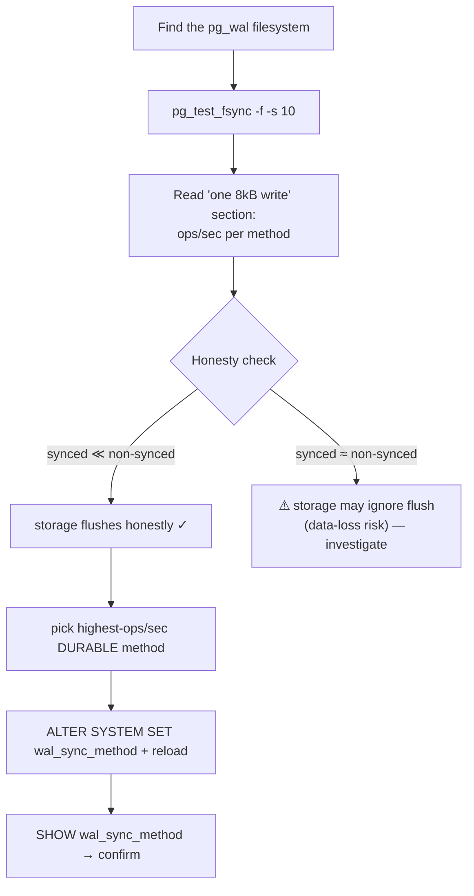
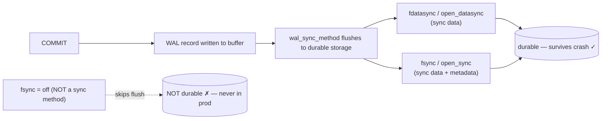

# Lab 15 — Benchmark `wal_sync_method` with `pg_test_fsync`; Pick the Fastest Safe One

> **Track A · DBA · A2 Configuration & Tuning · Lab 7 of 7 (Lab 15/222 · A2 complete)**
> Teaching package: concept → diagram → steps → verify → quick-ref → self-test → video script.
> **Depends on:** Labs 01–14 (running cluster; you know reload vs restart, ALTER SYSTEM).

---

## 0. Lab Card (at a glance)

| Field | Value |
|---|---|
| **Objective** | Measure each `wal_sync_method` on the real WAL storage with `pg_test_fsync`, choose the fastest **safe** (durable) one, apply it, and confirm. |
| **Success criterion** | A recorded ops/sec table per method (from the WAL filesystem); `wal_sync_method` set to the fastest durable option; `SHOW` confirms it. |
| **Scope boundary** | Choosing the WAL flush method. Broader WAL/checkpoint tuning is Lab 57; `synchronous_commit` trade-offs are adjacent (noted, not the focus). |
| **Prereqs** | Labs 01–14; `pg_test_fsync` (contrib/server); know where `pg_wal` lives |
| **Time** | 20–30 min |
| **Difficulty** | ★★☆☆☆ |
| **Risk** | Low — measurement + a reloadable setting. **Never** "fix" slow fsync by disabling durability. |

---

## 1. Learning Objectives

1. **What `wal_sync_method` does** — how PostgreSQL forces WAL to durable storage at commit, and the available methods.
2. **Measure on the *right* storage** — why `pg_test_fsync` must run on the `pg_wal` filesystem.
3. **Read the results** — the single-8 kB-write comparison, ops/sec, and picking the fastest **durable** method.
4. **Storage honesty** — spot a lying write cache that would silently risk data loss.
5. **The durability line** — `wal_sync_method` is *not* `fsync=off`; never trade correctness for speed.

---

## 2. Concept Primer — the "why"

**Every commit must reach durable storage.** On `COMMIT`, PostgreSQL flushes the write-ahead log so the transaction survives a crash. `wal_sync_method` selects the syscall pattern used to force that flush. The candidates (availability is platform-dependent; Linux typically offers the first, second, third, and last):

| Method | Mechanism |
|---|---|
| `open_datasync` | open WAL with `O_DSYNC` — writes are synchronous (data) |
| `fdatasync` | `write()` then `fdatasync()` — sync data (Linux default, usually) |
| `fsync` | `write()` then `fsync()` — sync data **and** metadata |
| `fsync_writethrough` | fsync that also flushes the drive cache (macOS/Windows) |
| `open_sync` | open with `O_SYNC` — synchronous data + metadata |

**All of these are *safe*** — each forces data to durable storage. The **unsafe** setting is a *different* parameter: `fsync = off` disables syncing entirely (huge speedup, **data loss / corruption on crash**). It is **not** a `wal_sync_method` value and has no place in production. This lab chooses among the *durable* methods only.

**They differ in speed, and only your storage knows by how much.** On battery-backed RAID or enterprise SSDs with power-loss protection, honest fsync is fast; on consumer SSDs without it, a real flush is slow (that's the true cost of durability). Which method is fastest depends on your exact disks/hypervisor — so you **measure**, you don't assume.

**`pg_test_fsync` measures it — on the storage that matters.** It writes a small file and times each sync method, reporting **ops/sec** (higher = faster) and usecs/op. Two rules:
- **Run it on the same filesystem as `pg_wal`.** Point `-f` at a path under the WAL device; results from another disk are irrelevant.
- **Run long enough to be stable** (`-s 10` or more) and when the box is idle.

The section that decides `wal_sync_method` is **"Compare file sync methods using one 8 kB write."** Pick the method with the highest ops/sec among those shown.

**Bonus — the storage-honesty check.** `pg_test_fsync` also reports "Non-sync'ed 8 kB writes." If that (unsafe) number is *not dramatically higher* than the synced methods — i.e. syncing appears "free" — your storage is probably **ignoring flush requests** (a lying volatile write cache in the disk or hypervisor). That's a silent data-loss risk worth investigating before you trust the box with a database.

**Applying it is cheap.** `wal_sync_method` is a `sighup` param (Lab 13) — set with `ALTER SYSTEM`, **reload**, no restart.

*(Adjacent lever, not this lab: `synchronous_commit = off` skips the per-commit wait entirely — faster, with a small window of losing recent commits on crash, but no corruption. Different trade-off from choosing a sync method.)*

---

## 3. Diagrams

### 3.1 Measure → choose → apply flow



### 3.2 The commit → durable-WAL path



---

## 4. Prerequisites

```bash
which pg_test_fsync                                  # from contrib/server
sudo -u postgres psql -c "SHOW wal_sync_method;"     # current method
# where is pg_wal? (default $PGDATA/pg_wal; may be a symlink to a separate device)
sudo -u postgres psql -c "SHOW data_directory;"; readlink -f /var/lib/pgsql/17/data/pg_wal
df -h /var/lib/pgsql/17/data/pg_wal                  # the storage that actually matters
```

---

## 5. Step-by-Step

### Step 1 — Benchmark on the WAL filesystem

```bash
WALDIR=/var/lib/pgsql/17/data/pg_wal
sudo -u postgres /usr/pgsql-17/bin/pg_test_fsync -f "$WALDIR/pg_test_fsync.tmp" -s 10 | tee /tmp/fsync.txt
sudo rm -f "$WALDIR/pg_test_fsync.tmp"
```
*`-f` puts the test file on the same device as WAL; `-s 10` = 10 s per test for stable numbers.*

### Step 2 — Read the decisive section

```bash
sed -n '/one 8kB write/,/two 8kB writes/p' /tmp/fsync.txt
#   Compare file sync methods using one 8kB write:
#       open_datasync         <ops/sec>   <usecs/op>
#       fdatasync             <ops/sec>   <usecs/op>
#       fsync                 <ops/sec>   <usecs/op>
#       fsync_writethrough              n/a
#       open_sync             <ops/sec>   <usecs/op>
#   → the method with the HIGHEST ops/sec is your candidate
```

### Step 3 — Storage-honesty check

```bash
grep -A2 "Non-sync" /tmp/fsync.txt
#   Non-sync'ed 8kB writes:  <very high ops/sec>
#   If synced methods are NOT far below this, the storage may be ignoring flushes — investigate.
```

### Step 4 — Apply the fastest safe method

```bash
# Replace with your winner (example: fdatasync):
sudo -u postgres psql -c "ALTER SYSTEM SET wal_sync_method = 'fdatasync';"
sudo -u postgres psql -c "SELECT pg_reload_conf();"      # sighup — no restart
```

### Step 5 — Confirm

```bash
sudo -u postgres psql -c "SHOW wal_sync_method;"         # your chosen method
sudo -u postgres psql -c "SELECT name,setting,context,pending_restart FROM pg_settings WHERE name='wal_sync_method';"
```

### Step 6 — (Optional) confirm real-world impact

```bash
# a write-heavy pgbench is fsync-bound and reflects commit throughput:
sudo -u postgres pgbench -c 16 -j 4 -T 60 benchdb | grep tps      # compare vs before, if you changed method
```

---

## 6. Verification Checklist & Results Table

- [ ] `pg_test_fsync` was run with `-f` on the **pg_wal** filesystem
- [ ] Recorded ops/sec for each available method (table below)
- [ ] Confirmed synced ops/sec are well below the non-synced number (storage flushes honestly)
- [ ] `wal_sync_method` set to the highest-ops/sec durable method; reloaded
- [ ] `SHOW wal_sync_method` confirms; `pending_restart=false`

| Method (one 8 kB write) | ops/sec | usecs/op |
|---|---|---|
| open_datasync | | |
| fdatasync | | |
| fsync | | |
| open_sync | | |
| **Chosen →** | | |

---

## 7. Troubleshooting

| Symptom | Cause | Fix |
|---|---|---|
| Numbers look meaningless / too good | Ran on the wrong filesystem | Use `-f` pointing at the `pg_wal` device |
| Some methods show `n/a` | Not supported on this OS | Normal; choose among the supported ones |
| Synced ≈ non-synced ops/sec | Storage ignoring flush (volatile cache lying) | Investigate disk/hypervisor cache + FUA; durability at risk |
| No TPS change after switching | Workload not fsync-bound, or methods near-equal | Fine — keep the marginal winner or default |
| `pg_test_fsync: command not found` | Package missing | Install `postgresql17-contrib`/server |
| Permission denied writing test file | Ran as root into WAL dir | Run as `postgres`; write under a path it owns |
| Change didn't take effect | Forgot reload (it's sighup) | `SELECT pg_reload_conf();` |

---

## 8. Quick Reference Card (paste-ready)

```bash
WALDIR=/var/lib/pgsql/17/data/pg_wal

# benchmark ON the WAL filesystem, stable duration
sudo -u postgres /usr/pgsql-17/bin/pg_test_fsync -f "$WALDIR/pg_test_fsync.tmp" -s 10 | tee /tmp/fsync.txt
sudo rm -f "$WALDIR/pg_test_fsync.tmp"

# decisive section + honesty check
sed -n '/one 8kB write/,/two 8kB writes/p' /tmp/fsync.txt
grep -A2 "Non-sync" /tmp/fsync.txt        # synced should be MUCH lower; else storage may lie

# apply the highest-ops/sec DURABLE method (example) + reload (sighup)
sudo -u postgres psql -c "ALTER SYSTEM SET wal_sync_method='fdatasync';"
sudo -u postgres psql -c "SELECT pg_reload_conf();"
sudo -u postgres psql -c "SHOW wal_sync_method;"

# NEVER trade durability for speed:  fsync=off / full_page_writes=off are NOT options here.
# Adjacent (different trade-off): synchronous_commit=off — faster, small crash-loss window, no corruption.
```

---

## 9. Self-Check

1. What does `wal_sync_method` control, and does changing it need a restart?
2. Why must `pg_test_fsync` run on the same filesystem as `pg_wal`?
3. Which section of the output decides the method, and is higher or lower ops/sec better?
4. Is `fsync=off` a `wal_sync_method` value? Should you ever use it in production?
5. Non-synced and synced ops/sec are nearly equal — what does that indicate?
6. How do you apply the chosen method and confirm it took effect?

<details>
<summary>Answers</summary>

1. It selects how WAL is flushed to durable storage at commit; it's a `sighup` param → **reload**, no restart.
2. Results reflect the actual storage device; measuring elsewhere gives numbers unrelated to your real WAL performance.
3. "Compare file sync methods using one 8 kB write"; **higher** ops/sec is better.
4. No — `fsync=off` is a separate parameter that disables syncing entirely; never use it in production (data loss/corruption on crash).
5. The storage is likely ignoring flush requests (a lying volatile write cache) — a silent durability risk to investigate.
6. `ALTER SYSTEM SET wal_sync_method='<winner>'` then `SELECT pg_reload_conf();`; confirm with `SHOW wal_sync_method;`.
</details>

---

## 10. Video / Teaching Script

| # | On screen | Say (narration) |
|---|---|---|
| 1 | Title: "How fast can PostgreSQL safely commit?" | "Every commit must reach the disk durably. *How* it does that — the sync method — has a measurable speed cost. Let's find the fastest safe one." |
| 2 | `SHOW wal_sync_method` + find pg_wal | "First, what are we using, and — crucially — which disk holds the WAL. That's the only storage that matters here." |
| 3 | `pg_test_fsync -f … -s 10` | "We benchmark *on that disk*. Ten seconds per method for stable numbers." |
| 4 | one-8kB-write table | "This is the deciding table. Highest operations-per-second wins — that's your commit throughput ceiling." |
| 5 | honesty check | "A hidden gem: if 'non-synced' isn't far faster than synced, your storage is lying about flushing — a real data-loss risk. Catch it here, not after an outage." |
| 6 | the durability line | "One rule: we choose among *safe* methods. Turning fsync off is not tuning — it's trading your data for speed. Never." |
| 7 | `ALTER SYSTEM` + reload + `SHOW` | "Apply the winner — reload, no restart — and confirm." |
| 8 | Outro | "Fastest *safe* commits, chosen by measurement. That completes Configuration and Tuning. Next section: backup and recovery." |

---

## 11. Glossary

- **WAL** — write-ahead log; must be durable before a commit is acknowledged.
- **`wal_sync_method`** — the syscall pattern used to flush WAL (`fdatasync`, `open_datasync`, `fsync`, `open_sync`, …).
- **`pg_test_fsync`** — benchmarks sync methods on real storage (ops/sec, usecs/op).
- **fsync / fdatasync / O_DSYNC / O_SYNC** — kernel calls/flags that force data (and maybe metadata) to disk.
- **Write cache / FUA** — volatile disk cache; honest storage flushes it on sync.
- **`fsync = off`** — disables syncing (unsafe; not a sync-method choice).
- **`synchronous_commit`** — adjacent durability/latency trade-off.

---
*NETAPORT lab series · PostgreSQL 17 on AlmaLinux 9 · Lab 15/222 · **A2 Configuration & Tuning complete***
