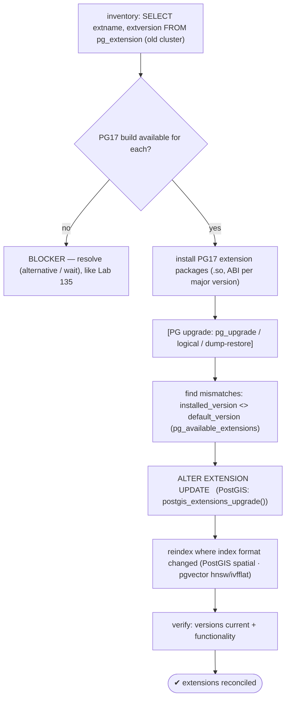
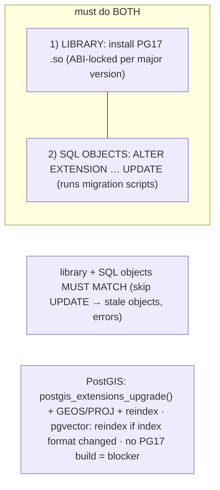

# Lab 150 — Extension-Version Reconciliation: Upgrade `postgis`/`pgvector`/etc. as Part of the Jump; `ALTER EXTENSION ... UPDATE`

> **Track D · Migration · D2 PostgreSQL → PostgreSQL · Lab 6 of 6 (Lab 150/222 · D2 complete)**
> Teaching package: concept → diagram → steps → verify → quick-ref → self-test → video script.
> **Depends on:** Lab 70 (extensions), Lab 145 (pg_upgrade), Lab 100/119 (GIN/pgvector indexes), Lab 135 (extension availability).

---

## 0. Lab Card (at a glance)

| Field | Value |
|---|---|
| **Objective** | Reconcile extension versions as part of a PG17 upgrade — install the PG17 extension libraries, run `ALTER EXTENSION … UPDATE`, and reindex where index formats changed. |
| **Success criterion** | Every used extension has a PG17 build; SQL objects are updated to match the new library; PostGIS/pgvector specifics handled; extensions functional and current. |
| **Scope boundary** | Extension reconciliation during an upgrade. Data migration was Labs 145–149. |
| **Prereqs** | Labs 70/145; a cluster with extensions to upgrade |
| **Time** | 30–45 min |
| **Difficulty** | ★★★★☆ |
| **Risk** | Low-Medium — extension objects + possible reindex. |

---

## 1. Learning Objectives

1. **Why extensions need separate handling.**
2. **The two-part reconciliation** — library + SQL objects.
3. **`ALTER EXTENSION … UPDATE`.**
4. **PostGIS / pgvector** specifics.
5. **Find + fix** version mismatches; the blocker case.

---

## 2. Concept Primer — the "why"

**Extensions version independently of PostgreSQL, so an upgrade needs a *two-part* reconciliation.** The data-migration paths (Labs 145–149) move the data, but each extension carries **its own version** — and upgrading PostgreSQL doesn't automatically upgrade it. Two things must be reconciled:

1. **The shared library (`.so`)** — install the extension **built for PG17** (`postgis34_17`, `pgvector_17`, …). Extension libraries are **ABI-locked to the major version**, so a PG13 build won't load in PG17. **`pg_upgrade --check` fails** if the new cluster lacks an extension the old one uses (Lab 145) — so install the PG17 builds **first**.
2. **The in-database SQL objects** — after the library is in place, the extension's installed version (`pg_extension.extversion`) may be **behind** what the new library provides. Bring them up to date with:
   ```sql
   ALTER EXTENSION postgis UPDATE;             -- to the library's default (latest)
   ALTER EXTENSION vector  UPDATE TO '0.8.0';  -- or a specific version
   ```
   This runs the extension's **migration scripts** (`extname--old--new.sql`) to update its functions/types/operators.

**The library and SQL objects must match.** If you install the new `.so` but **skip `ALTER EXTENSION … UPDATE`**, the SQL objects stay stale → **mismatched function signatures, errors, missing new features**. This is the step people forget after `pg_upgrade` (which preserves `extversion`, leaving it behind the new library's default).

**The reconciliation workflow:**
1. **Inventory** old-cluster extensions + versions: `SELECT extname, extversion FROM pg_extension;`.
2. **Check PG17 availability** for each — a missing PG17 build is a **blocker** (like the managed extension list, Lab 135); resolve before upgrading.
3. **Install the PG17 extension packages** (new `.so`).
4. **Upgrade PostgreSQL** (pg_upgrade / logical / dump-restore).
5. **Find what needs updating** and run `ALTER EXTENSION … UPDATE`:
   ```sql
   SELECT name, installed_version, default_version
   FROM pg_available_extensions
   WHERE installed_version IS NOT NULL AND installed_version <> default_version;
   ```
6. **Reindex** where the index format changed; **verify** functionality.

**Extension-specific notes:**
- **PostGIS** — use its helper **`SELECT postgis_extensions_upgrade();`** (runs `ALTER EXTENSION UPDATE` for postgis + related). Its version tracks **GEOS/PROJ/GDAL** system libs — update those too; a major PostGIS jump may need a **spatial-index reindex**.
- **pgvector** — install `pgvector_17`, `ALTER EXTENSION vector UPDATE`; if the **hnsw/ivfflat index format changed** across versions, **reindex** those indexes (Lab 119). *(Directly relevant to a pgvector-backed platform.)*
- **`pg_stat_statements`** — `ALTER EXTENSION … UPDATE`; its stats reset on the major upgrade.
- **Contrib extensions** — bundled with the PG17 package; still `ALTER EXTENSION … UPDATE` to align SQL objects.

---

## 3. Diagrams

### 3.1 Reconciliation flow



### 3.2 Two-part reconciliation



---

## 4. Prerequisites — inventory

```bash
sudo -u postgres psql -d appdb -c "SELECT extname, extversion FROM pg_extension ORDER BY 1;"   # old-cluster extensions
# check PG17 availability (before upgrading):
sudo -u postgres psql -d appdb -c "SELECT name, default_version FROM pg_available_extensions WHERE name IN ('postgis','vector','pg_stat_statements');"
```

## 5. Step-by-Step

### Step 1 — Install PG17 extension packages (the .so libraries)

```bash
# install the PG17 builds for every extension in the inventory (before --check / upgrade):
sudo dnf install -y postgis34_17 pgvector_17 2>/dev/null || echo "install PG17 extension builds for each used extension"
# pg_upgrade --check will fail if any is missing (Lab 145)
```

### Step 2 — (Upgrade happens) then find mismatched versions

```bash
# after the PG17 upgrade (Labs 145-149), the SQL objects may lag the new library:
sudo -u postgres psql -d appdb -c "
SELECT name, installed_version, default_version
FROM pg_available_extensions
WHERE installed_version IS NOT NULL AND installed_version <> default_version;"   # these need UPDATE
```

### Step 3 — ALTER EXTENSION … UPDATE (generic)

```bash
sudo -u postgres psql -d appdb -c "ALTER EXTENSION pg_stat_statements UPDATE;"
sudo -u postgres psql -d appdb -c "ALTER EXTENSION vector UPDATE;"    # pgvector SQL objects → new library version
sudo -u postgres psql -d appdb -c "SELECT extname, extversion FROM pg_extension WHERE extname IN ('vector','pg_stat_statements');"
```

### Step 4 — PostGIS (use its helper + system libs)

```bash
sudo -u postgres psql -d appdb -c "SELECT postgis_full_version();"                 # shows PostGIS + GEOS/PROJ/GDAL
sudo -u postgres psql -d appdb -c "SELECT postgis_extensions_upgrade();"           # updates postgis + related extensions
sudo -u postgres psql -d appdb -c "SELECT postgis_version();"                       # confirm updated
#   ensure GEOS/PROJ/GDAL system packages match; major jumps → reindex spatial indexes:
#   sudo -u postgres psql -d appdb -c "REINDEX INDEX CONCURRENTLY idx_geom_gist;"
```

### Step 5 — Reindex changed index formats (pgvector / spatial)

```bash
# if a vector/spatial index format changed across the extension jump, rebuild it (Lab 119/100):
sudo -u postgres psql -d appdb -c "SELECT indexname FROM pg_indexes WHERE indexdef ILIKE '%hnsw%' OR indexdef ILIKE '%ivfflat%' OR indexdef ILIKE '%gist%';"
#   sudo -u postgres psql -d appdb -c "REINDEX INDEX CONCURRENTLY docs_vec_hnsw;"
echo "reindex vector/spatial indexes only if the extension's index format changed"
```

### Step 6 — Verify functionality

```bash
sudo -u postgres psql -d appdb -c "SELECT '[1,0,0]'::vector <=> '[1,0,0]'::vector AS cosine_dist;"   # pgvector works
sudo -u postgres psql -d appdb -c "SELECT ST_AsText(ST_Point(1,2));" 2>/dev/null                     # PostGIS works
sudo -u postgres psql -d appdb -c "
SELECT name, installed_version = default_version AS current FROM pg_available_extensions WHERE installed_version IS NOT NULL;"  # all current
```

---

## 6. Verification Checklist

- [ ] Extensions + versions inventoried on the old cluster
- [ ] PG17 builds available for each (blockers resolved)
- [ ] PG17 extension packages (.so) installed before upgrade
- [ ] Post-upgrade mismatches found (`installed <> default`)
- [ ] `ALTER EXTENSION … UPDATE` run (postgis via helper)
- [ ] Reindexed where index format changed (spatial/vector)
- [ ] Extensions verified functional + versions current

---

## 7. Troubleshooting

| Symptom | Cause | Fix |
|---|---|---|
| Extension errors after upgrade | `.so` missing / SQL objects stale | Install PG17 build; `ALTER EXTENSION … UPDATE` |
| `--check` fails on extension | PG17 build missing | Install it before upgrading |
| `installed < default` | SQL objects behind library | `ALTER EXTENSION … UPDATE` |
| PostGIS functions broken | Not upgraded / lib mismatch | `postgis_extensions_upgrade()`; update GEOS/PROJ/GDAL; reindex spatial |
| pgvector index errors | Format changed | Reindex hnsw/ivfflat (Lab 119) |
| No PG17 build | Not ported/renamed | **Blocker** — alternative / wait (Lab 135) |
| Function signature mismatch | Library/SQL mismatch | `ALTER EXTENSION … UPDATE` |
| ABI error | `.so` for wrong major version | Install the PG17-built package |

---

## 8. Quick Reference Card (paste-ready)

```sql
-- extensions version SEPARATELY from PG → TWO-PART reconciliation:
--   1) install PG17 extension package (.so, ABI-locked per major version) — BEFORE upgrade/--check
--   2) ALTER EXTENSION <name> UPDATE;   -- align in-DB SQL objects with the new library (or UPDATE TO 'x.y')

-- find what needs updating (post-upgrade):
SELECT name, installed_version, default_version FROM pg_available_extensions
WHERE installed_version IS NOT NULL AND installed_version <> default_version;

-- PostGIS: SELECT postgis_extensions_upgrade();  (+ update GEOS/PROJ/GDAL · reindex spatial on major jumps)
-- pgvector: ALTER EXTENSION vector UPDATE;  (+ REINDEX hnsw/ivfflat if the index format changed, Lab 119)
-- library + SQL objects MUST MATCH (skip UPDATE → stale objects/errors) · no PG17 build = migration blocker
```

---

## 9. Self-Check

1. Why do extensions need special handling in an upgrade?
2. What are the two parts of the reconciliation?
3. What does `ALTER EXTENSION … UPDATE` do?
4. How do you find extensions needing an update?
5. What are the PostGIS and pgvector specifics?
6. What's the blocker scenario?

<details>
<summary>Answers</summary>

1. Extensions **version independently** of PostgreSQL, and the upgrade needs both a **new library (ABI-locked to the major version)** and an **update of the in-database SQL objects**.
2. **(1)** Install the extension **built for PG17** (`.so`); **(2)** run **`ALTER EXTENSION … UPDATE`** to align the SQL objects with the new library.
3. It runs the extension's **migration scripts** to update its SQL objects (functions/types/operators) to the library's version (default/latest, or `UPDATE TO 'version'`).
4. `SELECT name, installed_version, default_version FROM pg_available_extensions WHERE installed_version <> default_version;`.
5. **PostGIS** — `postgis_extensions_upgrade()`, update GEOS/PROJ/GDAL, reindex spatial on major jumps; **pgvector** — `ALTER EXTENSION vector UPDATE`, reindex hnsw/ivfflat if the index format changed.
6. **No PG17 build** for an extension — you can't upgrade until it exists; find an alternative or wait (like the managed extension list, Lab 135).
</details>

---

## 10. Video / Teaching Script

| # | On screen | Say (narration) |
|---|---|---|
| 1 | Title: "Don't forget the extensions" | "You upgraded Postgres — but PostGIS, pgvector, the rest? They have their *own* versions, and they need two things done." |
| 2 | two parts | "First, the library, built for the new version. Second — the part people forget — update the SQL objects inside the database to match it." |
| 3 | mismatch | "Skip that update, and the new library and the old objects disagree — broken functions, missing features. They must match." |
| 4 | find | "One query finds them all: installed version versus default. Anything behind gets an ALTER EXTENSION UPDATE." |
| 5 | postgis/pgvector | "PostGIS has its own helper — one call upgrades it and friends. pgvector? Update it, and reindex your vectors if the format moved." |
| 6 | blocker | "And the one that stops you cold: no build for the new version yet. That's a blocker — solve it *before* you commit to the upgrade." |
| 7 | Outro | "Extensions reconciled. That completes Postgres-to-Postgres migration." |

---

## 11. Glossary

- **Extension version** — an extension's own version (independent of PG).
- **Two-part reconciliation** — new `.so` library + `ALTER EXTENSION UPDATE`.
- **`.so` / ABI** — the library, locked to a PG major version.
- **`installed_version` / `default_version`** — in-DB objects / library's latest.
- **`postgis_extensions_upgrade()`** — PostGIS's update helper.
- **Reindex** — rebuild indexes when the format changed (spatial/vector).
- **Blocker** — no PG17 build available.

---
*NETAPORT lab series · PostgreSQL 17 on AlmaLinux 9 · Lab 150/222 · **D2 PostgreSQL → PostgreSQL complete***
