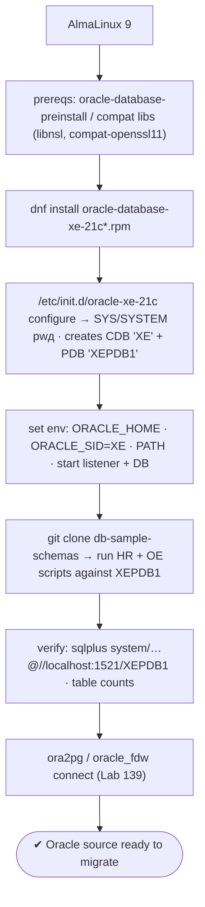
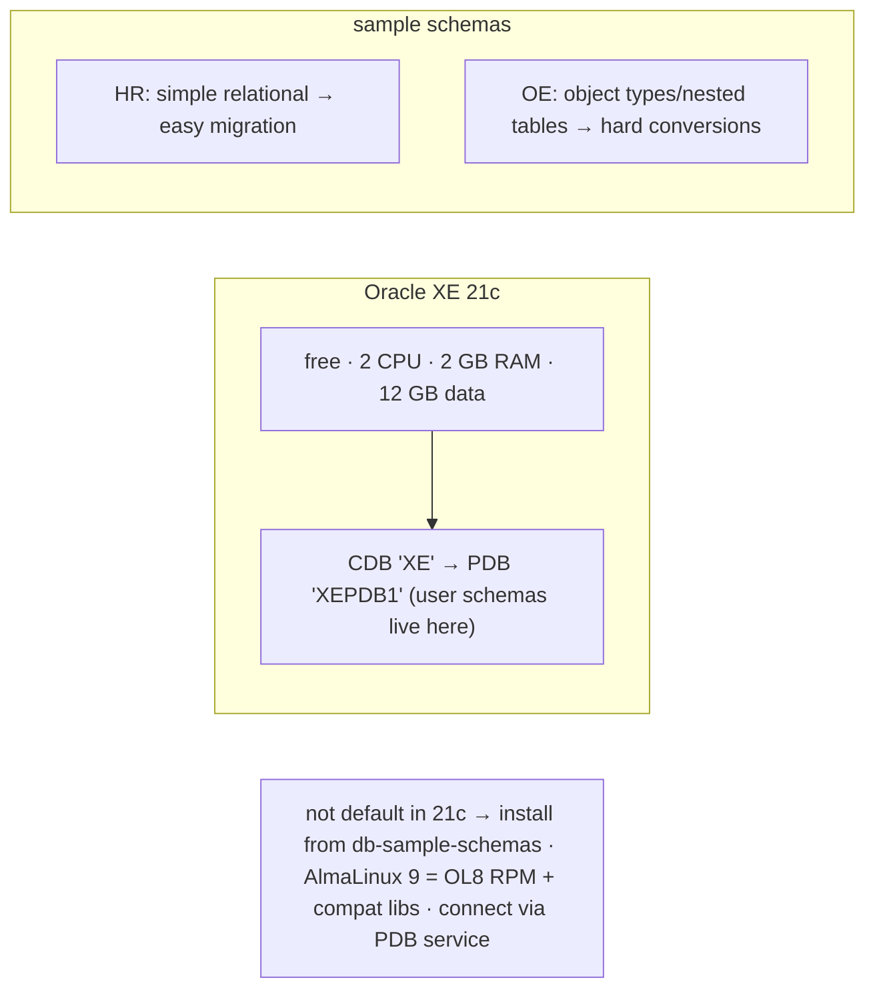

# Lab 151 — Seed an Oracle XE Source Schema (HR/OE Sample) to Migrate From

> **Track D · Migration · D3 Oracle → PostgreSQL · Lab 1 of 8 (Lab 151/222)**
> Teaching package: concept → diagram → steps → verify → quick-ref → self-test → video script.
> **Depends on:** Lab 139 (tooling box — ora2pg/oracle_fdw connect here). Opens the Oracle engine track.

---

## 0. Lab Card (at a glance)

| Field | Value |
|---|---|
| **Objective** | Install Oracle XE 21c on AlmaLinux 9, load the HR and OE sample schemas, and confirm the migration tooling can connect — a real Oracle source for the D3 track. |
| **Success criterion** | XE runs (CDB + XEPDB1 PDB); HR + OE schemas installed; `sqlplus`/ora2pg connect to `//localhost:1521/XEPDB1` and see the tables. |
| **Scope boundary** | Standing up the source. Assessment/conversion are Labs 152+. |
| **Prereqs** | AlmaLinux 9; Oracle XE RPM; ≥2 GB RAM; Lab 139 tooling |
| **Time** | 40–60 min |
| **Difficulty** | ★★★★☆ |
| **Risk** | Low — lab source install. |

---

## 1. Learning Objectives

1. **Why seed a real Oracle source.**
2. **Oracle XE** — limits and CDB/PDB structure.
3. **Install XE on AlmaLinux 9** (compat libs).
4. **Load HR + OE** sample schemas.
5. **Verify tooling connectivity.**

---

## 2. Concept Primer — the "why"

**The Oracle→PG track needs a real Oracle instance to migrate from.** Every downstream lab — ora2pg assessment (152), schema conversion, PL/SQL→PL/pgSQL, data migration, CDC — connects to an actual Oracle source (via `DBD::Oracle`/`oracle_fdw`, Lab 139). **Oracle XE** is the free way to stand one up.

**Oracle Database Express Edition (XE) — the free source.** XE 21c is free and lightweight, capped at **2 CPU threads, 2 GB RAM, 12 GB user data** — plenty for a migration lab. It's **multitenant**: a **container database (CDB)** named `XE` holds a **pluggable database (PDB)** named **`XEPDB1`**, and **user schemas live in the PDB** (`XEPDB1`), not the CDB. Connect for user work with the PDB service name: `//localhost:1521/XEPDB1`.

**AlmaLinux 9 install note.** The XE 21c RPM is built for **OL8/RHEL8**, so on AlmaLinux 9 it needs a few **compatibility libraries** (`libnsl`, `compat-openssl11`, and friends). Oracle's **`oracle-database-preinstall`** RPM sets up kernel params, the `oracle` user, and ulimits; otherwise do those prerequisites manually.

**The sample schemas — a difficulty range for migration testing:**
- **HR (Human Resources)** — simple relational: `employees`, `departments`, `jobs`, `locations`, `countries`, `regions`, `job_history`, with FKs, a view, sequences, and a couple of triggers/procedures. **Easy conversions** — the baseline demo.
- **OE (Order Entry)** — more complex: `customers`, `orders`, `order_items`, `products`, `inventories`, plus **object types, nested tables**, and richer PL/SQL. **Tests the hard conversions** (types, packages) the difficulty matrix flags (Lab 140).
Together they exercise the migration tooling on **both easy and hard objects**.

**These aren't installed by default in XE 21c.** Older XE bundled them; 21c does not — you install them from Oracle's **`db-sample-schemas`** GitHub repo, running the scripts against the **PDB (`XEPDB1`)**.

---

## 3. Diagrams

### 3.1 Seed flow



### 3.2 Concept



---

## 4. Prerequisites — compat libs

```bash
free -h    # ≥ 2 GB RAM
sudo dnf install -y libnsl libaio bc compat-openssl11 2>/dev/null || echo "install compat libs for the OL8 XE RPM on AlmaLinux 9"
# Oracle preinstall (kernel params, oracle user, limits) — if available:
sudo dnf install -y oracle-database-preinstall-21c 2>/dev/null || echo "or set prereqs manually"
```

## 5. Step-by-Step

### Step 1 — Install Oracle XE 21c

```bash
# download the XE 21c RPM from Oracle first (oracle-database-xe-21c-1.0-1.ol8.x86_64.rpm):
sudo dnf install -y ./oracle-database-xe-21c-1.0-1.ol8.x86_64.rpm
```

### Step 2 — Configure the database

```bash
sudo /etc/init.d/oracle-xe-21c configure    # prompts for SYS/SYSTEM/PDBADMIN password; creates CDB 'XE' + PDB 'XEPDB1'
#   (non-interactive: export ORACLE_PWD then run configure)
```

### Step 3 — Set the environment + start

```bash
export ORACLE_HOME=/opt/oracle/product/21c/dbhomeXE
export ORACLE_SID=XE
export PATH=$ORACLE_HOME/bin:$PATH
sudo systemctl enable --now oracle-xe-21c
lsnrctl status | grep -i XEPDB1     # listener up, PDB service registered
```

### Step 4 — Confirm the PDB is open + create a migration user

```bash
sqlplus -s / as sysdba <<'SQL'
ALTER PLUGGABLE DATABASE XEPDB1 OPEN;              -- ensure open
ALTER PLUGGABLE DATABASE XEPDB1 SAVE STATE;        -- auto-open on restart
ALTER SESSION SET CONTAINER = XEPDB1;
CREATE USER miguser IDENTIFIED BY migpass QUOTA UNLIMITED ON USERS;
GRANT CONNECT, RESOURCE, SELECT ANY DICTIONARY TO miguser;   -- read for ora2pg assessment
EXIT
SQL
```

### Step 5 — Install the HR + OE sample schemas (into XEPDB1)

```bash
git clone https://github.com/oracle-samples/db-sample-schemas.git
cd db-sample-schemas
# run against the PDB; scripts prompt for passwords + tablespace + log dir:
sqlplus system/YourPwd@//localhost:1521/XEPDB1 @human_resources/hr_install.sql   # HR
sqlplus system/YourPwd@//localhost:1521/XEPDB1 @order_entry/oe_main.sql          # OE (types, nested tables)
```

### Step 6 — Verify + confirm tooling can connect

```bash
sqlplus -s system/YourPwd@//localhost:1521/XEPDB1 <<'SQL'
SELECT owner, count(*) AS tables FROM all_tables WHERE owner IN ('HR','OE') GROUP BY owner;
SELECT count(*) FROM hr.employees;      -- ~107 rows
SELECT count(*) FROM oe.orders;         -- OE data
EXIT
SQL
# ora2pg connectivity (Lab 139) — point ORACLE_DSN at the PDB:
#   ORACLE_DSN  dbi:Oracle:host=localhost;service_name=XEPDB1;port=1521
ora2pg -t SHOW_VERSION -c /tmp/ora2pg.conf 2>/dev/null && echo "ora2pg connected to Oracle XE"
```

---

## 6. Verification Checklist

- [ ] Compat libs installed; XE 21c installed on AlmaLinux 9
- [ ] `configure` created CDB `XE` + PDB `XEPDB1`
- [ ] Environment set; listener up; PDB open + save state
- [ ] Migration user created with dictionary read
- [ ] HR + OE schemas installed into `XEPDB1`
- [ ] Table counts verified (HR ~7 tables, OE present)
- [ ] ora2pg/oracle_fdw connect to `//localhost:1521/XEPDB1`

---

## 7. Troubleshooting

| Symptom | Cause | Fix |
|---|---|---|
| RPM deps fail | OL8 RPM on AlmaLinux 9 | Install compat libs (`libnsl`, `compat-openssl11`, …) |
| `configure` fails | Prereqs/memory | `oracle-database-preinstall`; ≥2 GB RAM; `/dev/shm` |
| Can't connect | Wrong service / listener | Use **`XEPDB1`** (PDB), not `XE` (CDB); `lsnrctl status` |
| Sample schemas missing | Not default in 21c | Clone `db-sample-schemas`; run against the PDB |
| HR/OE install errors | Wrong container/paths | Run against `XEPDB1`; set tablespace/log paths |
| PDB not open | Closed after restart | `ALTER PLUGGABLE DATABASE XEPDB1 OPEN; … SAVE STATE;` |
| `ORACLE_HOME` unset | Env not sourced | Export `ORACLE_HOME`/`SID`/`PATH` (or `oraenv`) |
| Remote tooling blocked | Firewall | Open 1521 |

---

## 8. Quick Reference Card (paste-ready)

```bash
# Oracle XE 21c = free source (2 CPU/2GB/12GB) · multitenant: CDB 'XE' + PDB 'XEPDB1' (user schemas in the PDB)
# AlmaLinux 9: install compat libs for the OL8 RPM (libnsl, compat-openssl11)
sudo dnf install -y ./oracle-database-xe-21c-1.0-1.ol8.x86_64.rpm
sudo /etc/init.d/oracle-xe-21c configure          # CDB XE + PDB XEPDB1 + passwords
export ORACLE_HOME=/opt/oracle/product/21c/dbhomeXE ORACLE_SID=XE PATH=$ORACLE_HOME/bin:$PATH

# sample schemas (NOT default in 21c) → into the PDB:
git clone https://github.com/oracle-samples/db-sample-schemas
sqlplus system/pwd@//localhost:1521/XEPDB1 @human_resources/hr_install.sql   # HR (simple)
sqlplus system/pwd@//localhost:1521/XEPDB1 @order_entry/oe_main.sql          # OE (types/nested)

# connect (tooling): sqlplus / ora2pg → //localhost:1521/XEPDB1   (PDB, not CDB)
```

---

## 9. Self-Check

1. Why seed an Oracle XE source?
2. What are XE's limits and structure?
3. How do HR and OE differ for migration testing?
4. How are the sample schemas installed in 21c?
5. What's the AlmaLinux 9 install caveat?
6. Which service do you connect to for user schemas?

<details>
<summary>Answers</summary>

1. The Oracle→PG track needs a **real Oracle instance** to connect to (ora2pg/oracle_fdw); XE is the free lightweight edition to serve as the source.
2. **2 CPU, 2 GB RAM, 12 GB data**; multitenant — a **CDB (`XE`)** with a **PDB (`XEPDB1`)** where user schemas live.
3. **HR** is simple relational (easy conversions — the baseline); **OE** has object types and nested tables (tests the hard conversions).
4. They're **not default** in 21c — clone Oracle's **`db-sample-schemas`** repo and run the scripts against the **PDB (`XEPDB1`)**.
5. The XE 21c RPM targets **OL8/RHEL8**, so AlmaLinux 9 needs **compat libraries** (`libnsl`, `compat-openssl11`, …).
6. The **PDB service** — `//localhost:1521/XEPDB1` — not the CDB (`XE`).
</details>

---

## 10. Video / Teaching Script

| # | On screen | Say (narration) |
|---|---|---|
| 1 | Title: "A real Oracle to migrate off" | "To practice migrating *off* Oracle, you need an Oracle. The free Express Edition gives you one — with the classic sample schemas to move." |
| 2 | install | "Install the RPM — it's built for RHEL 8, so AlmaLinux 9 needs a couple of compat libraries. Then configure creates the database." |
| 3 | CDB/PDB | "One catch that trips everyone: it's multitenant. Your tables live in the pluggable database, XEPDB1 — not the container. Connect to the PDB." |
| 4 | schemas | "The sample schemas aren't bundled anymore. Clone the repo, run the scripts. HR for the easy stuff, OE for the hard — types, nested tables." |
| 5 | verify | "Check the counts — a hundred-odd employees, orders in OE. It's alive." |
| 6 | tooling | "Point ora2pg at XEPDB1, and it connects. Your migration source is ready." |
| 7 | Outro | "Oracle source, seeded. Next: assess it and convert the schema." |

---

## 11. Glossary

- **Oracle XE** — free Express Edition (2 CPU/2 GB/12 GB).
- **CDB / PDB** — container / pluggable database (`XE` / `XEPDB1`).
- **HR / OE** — simple / complex sample schemas.
- **`db-sample-schemas`** — Oracle's sample-schema repo.
- **`oracle-database-preinstall`** — prerequisites RPM.
- **Listener** — Oracle's connection service (port 1521).
- **EZConnect** — `//host:port/service` connect syntax.

---
*NETAPORT lab series · PostgreSQL 17 on AlmaLinux 9 · Lab 151/222 · D3 Oracle → PostgreSQL*
