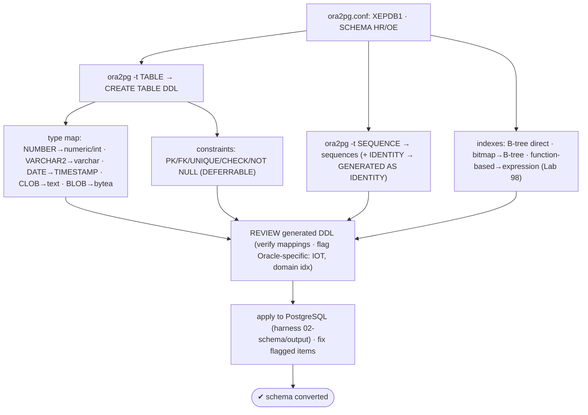
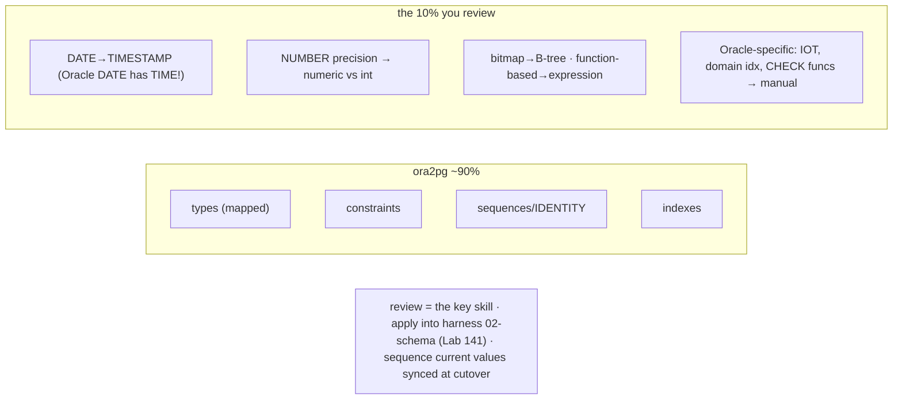

# Lab 152 — `ora2pg` Full Schema Conversion: Tables, Constraints, Sequences, Indexes; Review the Generated DDL

> **Track D · Migration · D3 Oracle → PostgreSQL · Lab 2 of 8 (Lab 152/222)**
> Teaching package: concept → diagram → steps → verify → quick-ref → self-test → video script.
> **Depends on:** Lab 151 (Oracle XE source), Lab 139/140 (ora2pg), Lab 141 (harness 02-schema), Lab 98 (expression index).

---

## 0. Lab Card (at a glance)

| Field | Value |
|---|---|
| **Objective** | Convert the Oracle HR/OE schema to PostgreSQL DDL with ora2pg — tables, constraints, sequences, indexes — and review the generated DDL for correct type mappings and Oracle-specific constructs. |
| **Success criterion** | ora2pg emits PG-ready DDL; type mappings (esp. DATE→timestamp), constraints, sequences/IDENTITY, and index conversions are reviewed and correct; DDL applies to PostgreSQL. |
| **Scope boundary** | Core schema DDL. PL/SQL code conversion is a later D3 lab. |
| **Prereqs** | Lab 151; ora2pg configured for XEPDB1 |
| **Time** | 35–50 min |
| **Difficulty** | ★★★★☆ |
| **Risk** | Low — generates DDL. |

---

## 1. Learning Objectives

1. **ora2pg schema export** — table/sequence/index types.
2. **Type mapping** — and the `DATE` gotcha.
3. **Constraints + sequences/IDENTITY.**
4. **Index conversion** — bitmap, function-based.
5. **Review the DDL** — the key skill.

---

## 2. Concept Primer — the "why"

**ora2pg does ~90% of schema conversion — the remaining 10% is where you review.** It reads the Oracle catalog and emits PostgreSQL DDL, but the conversions that need human eyes are **type mappings**, **constraint conversion**, and **Oracle-specific constructs**. Reviewing the generated DDL is the actual skill.

**Export types:** `ora2pg -t TABLE` (tables + constraints + indexes), `-t SEQUENCE`, `-t INDEX`, etc.; or `ora2pg --init_project` scaffolds a full project (schema/{tables,sequences,indexes,…}, data/, import scripts). Configure `ora2pg.conf` with the connection (XEPDB1, Lab 151), `SCHEMA HR`, and the type.

**Type mapping (Oracle → PostgreSQL) — the traps:**
- **`NUMBER`** → `numeric`, or `integer`/`bigint`/`smallint` by **precision/scale** (`NUMBER(p,0)`→int/bigint; `NUMBER(p,s)`→`numeric(p,s)`; bare `NUMBER`→`numeric`/`double precision`). Configurable via `DATA_TYPE`/`MODIFY_TYPE`.
- **`VARCHAR2(n)`** → `varchar(n)`; **`CHAR(n)`** → `char(n)`.
- **`DATE`** → **`timestamp`** — the classic gotcha: **Oracle `DATE` includes date *and* time**, so mapping it to PostgreSQL `date` **silently loses the time component**. It must be `timestamp(0)`. (ora2pg's default does this — verify it.)
- **`TIMESTAMP`** → `timestamp`; **`CLOB`** → `text`; **`BLOB`/`RAW`** → `bytea`; **`LONG`** → `text`.
- **No native boolean in Oracle** — booleans stored as `NUMBER(1)` or `CHAR(1)` `'Y'/'N'` → map to `boolean` with a rule, or keep and handle in code.

**Constraints** — `PRIMARY KEY`, `UNIQUE`, `FOREIGN KEY`, `CHECK`, `NOT NULL` convert directly; `DEFERRABLE` (Lab 81) carries over. Watch: **constraint names > 63 chars** (PG's limit → ora2pg truncates; verify uniqueness) and **CHECK constraints using Oracle-specific functions** (need a rewrite).

**Sequences + IDENTITY** — Oracle sequences → PostgreSQL sequences (start/increment preserved). Oracle **IDENTITY columns (12c+)** → PostgreSQL **`GENERATED … AS IDENTITY`**; pre-12c sequence+trigger defaults → sequence-based defaults. **Current sequence values are *not* set by DDL** — sync them at data migration/cutover (Lab 76/135).

**Index conversion — the notable cases:**
- **B-tree** → maps **directly**.
- **Bitmap indexes** → **B-tree** — PostgreSQL has **no bitmap *index* type** (it builds bitmaps at *query* time from other indexes, Lab 95); ora2pg converts bitmap → B-tree. Verify the choice fits (low-cardinality columns may want a different strategy).
- **Function-based indexes** → **expression indexes** (Lab 98) — check the function is IMMUTABLE and available in PG.
- **Index-organized tables (IOT)** → regular tables (no direct equivalent); **domain indexes** (Oracle Text/spatial) → PG equivalents (tsvector/GIN, PostGIS).

**The workflow:** configure → export (`-t TABLE`, `-t SEQUENCE`) → **review** (type mappings, constraints, sequences, indexes; flag Oracle-specific) → apply to PostgreSQL (into the harness `02-schema/output`, Lab 141) → fix flagged items.

---

## 3. Diagrams

### 3.1 Schema-conversion flow



### 3.2 Concept



---

## 4. Prerequisites — ora2pg config for HR

```bash
cat > /tmp/ora2pg-hr.conf <<'EOF'
ORACLE_DSN   dbi:Oracle:host=localhost;service_name=XEPDB1;port=1521
ORACLE_USER  system
ORACLE_PWD   YourPwd
SCHEMA       HR
PG_VERSION   17
EOF
ora2pg -t SHOW_VERSION -c /tmp/ora2pg-hr.conf    # connects (Lab 151)
```

## 5. Step-by-Step

### Step 1 — Export tables (+ constraints + indexes)

```bash
ora2pg -t TABLE -c /tmp/ora2pg-hr.conf -o tables.sql
head -40 tables.sql    # CREATE TABLE with mapped types + PK/FK/UNIQUE/CHECK + indexes
```

### Step 2 — Review the type mappings (the DATE gotcha!)

```bash
grep -iE "timestamp|numeric|varchar|date|clob|blob" tables.sql | head
# CHECK: Oracle DATE columns (e.g. hire_date) → timestamp (NOT date — Oracle DATE carries time)
grep -i "hire_date" tables.sql     # should be: hire_date timestamp
```

### Step 3 — Export sequences (+ IDENTITY)

```bash
ora2pg -t SEQUENCE -c /tmp/ora2pg-hr.conf -o sequences.sql
cat sequences.sql    # CREATE SEQUENCE ... (start/increment); IDENTITY cols appear as GENERATED AS IDENTITY in tables.sql
```

### Step 4 — Review index conversions

```bash
grep -iE "CREATE INDEX|CREATE UNIQUE INDEX" tables.sql
# CHECK: any Oracle bitmap → plain B-tree; function-based → expression (e.g. ON t (upper(col)))
ora2pg -t SHOW_REPORT -c /tmp/ora2pg-hr.conf 2>/dev/null | grep -iE "bitmap|function-based|index"   # flags exotic indexes
```

### Step 5 — Apply the DDL to PostgreSQL (harness 02-schema)

```bash
sudo -u postgres createdb hr_target 2>/dev/null || true
sudo -u postgres psql -d hr_target -c "CREATE SCHEMA IF NOT EXISTS hr;"
sudo -u postgres psql -d hr_target -f tables.sql 2> apply-errors.log
sudo -u postgres psql -d hr_target -f sequences.sql 2>> apply-errors.log
grep -iE "error" apply-errors.log | head    # fix any flagged/Oracle-specific items
# into the harness: cp tables.sql sequences.sql migration-oracle-prod/02-schema/output/  (Lab 141)
```

### Step 6 — Verify the converted schema

```bash
sudo -u postgres psql -d hr_target -c "\dt hr.*"                                   # tables present
sudo -u postgres psql -d hr_target -c "\d hr.employees"                            # columns/types/constraints
sudo -u postgres psql -d hr_target -c "SELECT column_name, data_type FROM information_schema.columns WHERE table_name='employees' AND column_name='hire_date';"  # timestamp (not date)
sudo -u postgres psql -d hr_target -c "\di hr.*"                                    # indexes converted
```

---

## 6. Verification Checklist

- [ ] Tables exported with mapped types + constraints
- [ ] `DATE` → `timestamp` verified (not `date`)
- [ ] `NUMBER` precision → correct `numeric`/`integer`
- [ ] Sequences exported; IDENTITY → `GENERATED AS IDENTITY`
- [ ] Indexes converted (bitmap→B-tree, function-based→expression)
- [ ] Oracle-specific constructs flagged
- [ ] DDL applied to PostgreSQL; harness `02-schema` populated

---

## 7. Troubleshooting

| Symptom | Cause | Fix |
|---|---|---|
| `DATE` became `date` (lost time) | Wrong mapping | Map Oracle `DATE`→`timestamp` (default; verify/`MODIFY_TYPE`) |
| `NUMBER` precision wrong | Default map | `DATA_TYPE`/`MODIFY_TYPE` in `ora2pg.conf` |
| Bitmap index error | No PG bitmap index | ora2pg → B-tree; verify fit |
| Function-based index fails | Function not IMMUTABLE | Make it immutable / expression index (Lab 98) |
| CHECK with Oracle function | Oracle-specific | Rewrite for PG |
| Constraint name too long | PG 63-char limit | ora2pg truncates; verify uniqueness |
| Reserved word as name | PG reserved | Quote/rename |
| IOT/cluster | No equivalent | Regular table |

---

## 8. Quick Reference Card (paste-ready)

```bash
# ora2pg schema conversion (~90% auto — REVIEW the rest):
ora2pg -t TABLE    -c conf -o tables.sql       # tables + constraints + indexes
ora2pg -t SEQUENCE -c conf -o sequences.sql    # sequences (IDENTITY → GENERATED AS IDENTITY in tables.sql)
ora2pg --init_project name                     # full project scaffold

# TYPE MAP: NUMBER→numeric/int (precision) · VARCHAR2→varchar · DATE→TIMESTAMP (Oracle DATE has TIME!) · CLOB→text · BLOB→bytea
# INDEXES: B-tree direct · bitmap→B-tree (no PG bitmap index) · function-based→expression (Lab 98)
# REVIEW: DATE gotcha · NUMBER precision · Oracle-specific (IOT, domain idx, CHECK funcs) → manual
# apply → harness 02-schema/output (Lab 141) · sequence CURRENT values synced at cutover, not DDL
```

---

## 9. Self-Check

1. What's the ora2pg schema-export command set?
2. What are the key type mappings?
3. What's the `DATE` gotcha?
4. How are bitmap and function-based indexes converted?
5. Why must you review the generated DDL?
6. How are sequences and IDENTITY handled?

<details>
<summary>Answers</summary>

1. `ora2pg -t TABLE` (tables+constraints+indexes), `-t SEQUENCE`, `-t INDEX`; or `--init_project` for a full scaffold.
2. `NUMBER`→`numeric`/`integer` (by precision), `VARCHAR2`→`varchar`, **`DATE`→`timestamp`**, `CLOB`→`text`, `BLOB`/`RAW`→`bytea`.
3. **Oracle `DATE` includes date *and* time**, so it maps to **`timestamp`**, not `date` — mapping to `date` silently loses the time component.
4. **Bitmap** → **B-tree** (PostgreSQL has no bitmap index type); **function-based** → **expression indexes** (needs an IMMUTABLE function).
5. ora2pg automates ~90%, but **type mappings, constraint conversion, and Oracle-specific constructs** need human verification and manual fixes.
6. Oracle sequences → PG sequences; Oracle **IDENTITY** → **`GENERATED … AS IDENTITY`**; current sequence values are synced at data migration/cutover, not by DDL.
</details>

---

## 10. Video / Teaching Script

| # | On screen | Say (narration) |
|---|---|---|
| 1 | Title: "Oracle schema → Postgres, reviewed" | "ora2pg converts your Oracle schema in one command. It gets ninety percent right. The last ten percent is where you earn your keep." |
| 2 | types | "Types mostly map cleanly — number, varchar2, the usual. But one always bites." |
| 3 | DATE | "Oracle's DATE carries a *time*. Map it to a plain date and you throw away every hour and minute. It has to be a timestamp." |
| 4 | indexes | "Bitmap indexes? Postgres doesn't have them — it makes bitmaps on the fly. So they become B-trees. Function indexes become expression indexes." |
| 5 | sequences | "Sequences convert, identity columns become generated-as-identity. Just remember — the *current* values sync at cutover, not now." |
| 6 | review | "So read the DDL. Every DATE, every number's precision, every odd index. Then apply it. That review is the job." |
| 7 | Outro | "Schema converted and checked. Next: the PL/SQL." |

---

## 11. Glossary

- **ora2pg `-t TABLE`/`-t SEQUENCE`** — schema export types.
- **Type mapping** — Oracle types → PostgreSQL types.
- **`DATE`→`timestamp`** — Oracle DATE carries time.
- **`NUMBER`** — → numeric/integer by precision.
- **Bitmap → B-tree** — no PG bitmap index type.
- **Function-based → expression index** — Lab 98.
- **IDENTITY → GENERATED AS IDENTITY** — auto-increment mapping.

---
*NETAPORT lab series · PostgreSQL 17 on AlmaLinux 9 · Lab 152/222 · D3 Oracle → PostgreSQL*
