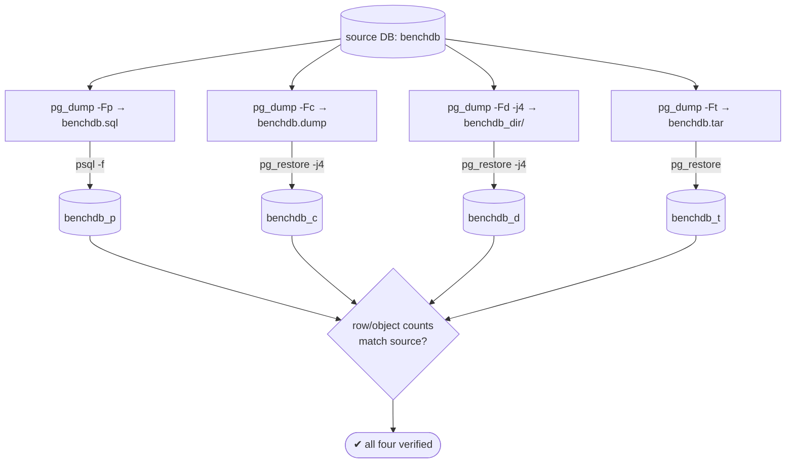
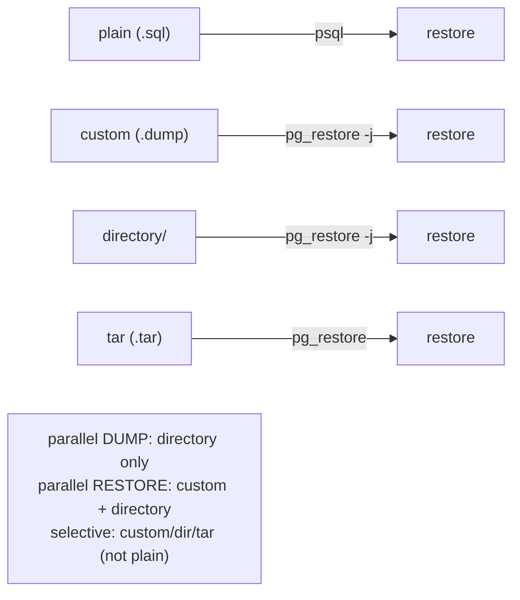

# Lab 16 — `pg_dump` in All Four Formats (plain / custom / directory / tar); Restore Each with `pg_restore`

> **Track A · DBA · A3 Backup & Recovery · Lab 1 of 10 (Lab 16/222)**
> Teaching package: concept → diagram → steps → verify → quick-ref → self-test → video script.
> **Depends on:** Labs 01–15 (running cluster; a sample DB — `benchdb` from Lab 9 works).

---

## 0. Lab Card (at a glance)

| Field | Value |
|---|---|
| **Objective** | Produce a logical backup of one database in all four `pg_dump` formats and restore each into a fresh database — plain with `psql`, the rest with `pg_restore`. |
| **Success criterion** | Four dumps created; four restored databases whose row/object counts match the source. |
| **Scope boundary** | Single-database **logical** dump/restore + format trade-offs. Cluster globals (roles/tablespaces) are Lab 17; physical base backups Lab 19. |
| **Prereqs** | Labs 01–15; a sample DB; a writable backup dir |
| **Time** | 30–45 min |
| **Difficulty** | ★★★☆☆ |
| **Risk** | Low — dumps are read-only on the source; restores target **new** databases. |

---

## 1. Learning Objectives

1. **The four formats and their trade-offs** — which tool restores each, which support parallel dump/restore, selective restore, and compression.
2. **plain ≠ archive** — plain restores with `psql`; custom/directory/tar restore with `pg_restore`.
3. **What a `pg_dump` does *not* include** — roles, tablespaces, other databases — and why a naive restore can fail.
4. **Verify a restore** — matching row/object counts, not just "it ran."

---

## 2. Concept Primer — the "why"

**Logical vs physical.** `pg_dump` produces a **logical** backup — the SQL/objects to recreate a database. It's MVCC-consistent (a single snapshot), portable **across versions and architectures**, and allows selective restore. The cost: restoring replays statements/loads data, so it's slower than a physical (block-level) backup for very large databases (that's `pg_basebackup`, Lab 19). `pg_dump` backs up **one database**; it does **not** capture roles, tablespaces, or other databases (that's `pg_dumpall -g`, Lab 17).

**The four formats (`-F`):**

| Format | Flag | Restore with | Parallel **dump** | Parallel **restore** | Selective restore | Compressed | Shape |
|---|---|---|---|---|---|---|---|
| **plain** | `-Fp` | **`psql`** | ✗ | ✗ | ✗ | ✗ (pipe to gzip) | one `.sql` text file |
| **custom** | `-Fc` | `pg_restore` | ✗ | ✓ (`-j`) | ✓ | ✓ (built-in) | one binary file |
| **directory** | `-Fd` | `pg_restore` | ✓ (`-j`) | ✓ (`-j`) | ✓ | ✓ (per-file) | a directory of files |
| **tar** | `-Ft` | `pg_restore` | ✗ | ✗ | ✓ | ✗ | one `.tar` file |

**How to choose:**
- **custom** is the default recommendation — single file, compressed, and supports **parallel restore** and **selective restore** (restore one table/schema, reorder via TOC).
- **directory** is for **large** databases — the only format that supports **parallel *dump*** (multiple workers writing at once), plus parallel restore.
- **plain** is human-readable/editable and restores with `psql` — handy for small DBs or when you want to inspect/patch the SQL. No parallelism, no selective restore.
- **tar** is a middle ground (selective restore, single file) but no parallelism or compression — least used today.

**The gotcha that fails restores.** Because `pg_dump` excludes roles, a restore into a *fresh cluster* errors when it tries to set object ownership to a role that doesn't exist. Fixes: restore the globals first (`pg_dumpall -g`, Lab 17), or restore with `--no-owner`. Also match the target database's **encoding/locale** to the source (create from `template0` if needed).

**`pg_restore` power features** (custom/directory/tar): `-C` create the database, `-j N` parallel, `-l` list the TOC, `-L` use an edited TOC for selective restore, `-t`/`-n` restore one table/schema, `--clean --if-exists`, `-1`/`--single-transaction` for all-or-nothing.

---

## 3. Diagrams

### 3.1 Dump-and-restore flow



### 3.2 Which tool restores which format



---

## 4. Prerequisites

```bash
# a sample DB (reuse benchdb from Lab 9, or make one):
sudo -u postgres psql -c "SELECT 1 FROM pg_database WHERE datname='benchdb';" | grep -q 1 \
  || { sudo -u postgres createdb benchdb; sudo -u postgres pgbench -i -s 20 benchdb; }

# a backup area owned by postgres
sudo mkdir -p /backup && sudo chown postgres:postgres /backup && sudo chmod 0700 /backup

# baseline row count to verify against:
sudo -u postgres psql -d benchdb -c "SELECT count(*) AS accounts FROM pgbench_accounts;"
```

---

## 5. Step-by-Step

### Step 1 — Dump in all four formats

```bash
sudo -u postgres pg_dump -Fp -d benchdb -f /backup/benchdb.sql          # plain (text SQL)
sudo -u postgres pg_dump -Fc -d benchdb -f /backup/benchdb.dump         # custom (binary, compressed)
sudo -u postgres pg_dump -Fd -j 4 -d benchdb -f /backup/benchdb_dir     # directory (PARALLEL dump)
sudo -u postgres pg_dump -Ft -d benchdb -f /backup/benchdb.tar          # tar
ls -lh /backup/                                                          # compare sizes
```

### Step 2 — Inspect a custom dump's table of contents

```bash
sudo -u postgres pg_restore -l /backup/benchdb.dump | head -20
#   the TOC — every object; you can edit this list and feed it back with -L for selective restore
```

### Step 3 — Restore plain with `psql`

```bash
sudo -u postgres createdb benchdb_p
sudo -u postgres psql -d benchdb_p -f /backup/benchdb.sql
```

### Step 4 — Restore custom / directory / tar with `pg_restore`

```bash
sudo -u postgres createdb benchdb_c
sudo -u postgres pg_restore -d benchdb_c -j 4 /backup/benchdb.dump      # parallel

sudo -u postgres createdb benchdb_d
sudo -u postgres pg_restore -d benchdb_d -j 4 /backup/benchdb_dir       # parallel

sudo -u postgres createdb benchdb_t
sudo -u postgres pg_restore -d benchdb_t /backup/benchdb.tar            # no -j for tar
```

### Step 5 — Verify every restore matches the source

```bash
for db in benchdb benchdb_p benchdb_c benchdb_d benchdb_t; do
  printf "%-12s " "$db"
  sudo -u postgres psql -tAc "SELECT count(*) FROM pgbench_accounts;" -d "$db"
done
# all five counts must be identical
```

### Step 6 — (Optional) selective restore, the custom/dir strength

```bash
# restore ONE table into a scratch DB:
sudo -u postgres createdb scratch
sudo -u postgres pg_restore -d scratch -t pgbench_branches /backup/benchdb.dump
sudo -u postgres psql -d scratch -c "\dt"
```

---

## 6. Verification Checklist

- [ ] Four dumps exist; `directory` is a folder, the others single files
- [ ] `plain` restored via **`psql`**; the other three via **`pg_restore`**
- [ ] Row counts in all four restored DBs equal the source
- [ ] `pg_restore -l` listed the custom dump's TOC
- [ ] Parallel (`-j`) worked for custom & directory (and directory dumped in parallel)
- [ ] (Optional) selective single-table restore succeeded

---

## 7. Troubleshooting

| Symptom | Cause | Fix |
|---|---|---|
| `pg_restore: error: input file … not a valid archive` on the `.sql` | Plain format isn't a pg_restore archive | Restore plain with `psql -f` |
| `-j` ignored / error for plain or tar | Parallel restore only for custom/directory | Drop `-j`, or use custom/directory |
| `pg_dump -Fd` fails: directory exists | `-Fd` needs a new/empty dir | Remove it or choose a fresh path |
| Restore errors: `role "X" does not exist` | `pg_dump` excludes roles | Restore globals first (`pg_dumpall -g`, Lab 17) or `pg_restore --no-owner` |
| `permission denied` writing to `/backup` | Dir not writable by `postgres` | `chown postgres:postgres /backup` |
| Conflicts restoring into a non-empty DB | Objects already exist | Restore into a fresh DB, or `--clean --if-exists` |
| Encoding/locale mismatch | Target created from wrong template | Create target from `template0` with matching encoding/locale |

---

## 8. Quick Reference Card (paste-ready)

```bash
# DUMP (four formats)
sudo -u postgres pg_dump -Fp -d benchdb -f /backup/benchdb.sql        # plain  → psql
sudo -u postgres pg_dump -Fc -d benchdb -f /backup/benchdb.dump       # custom → pg_restore (recommended)
sudo -u postgres pg_dump -Fd -j 4 -d benchdb -f /backup/benchdb_dir   # directory → parallel dump
sudo -u postgres pg_dump -Ft -d benchdb -f /backup/benchdb.tar        # tar

# RESTORE (matching tools)
sudo -u postgres createdb benchdb_p && sudo -u postgres psql -d benchdb_p -f /backup/benchdb.sql
sudo -u postgres createdb benchdb_c && sudo -u postgres pg_restore -d benchdb_c -j4 /backup/benchdb.dump
sudo -u postgres createdb benchdb_d && sudo -u postgres pg_restore -d benchdb_d -j4 /backup/benchdb_dir
sudo -u postgres createdb benchdb_t && sudo -u postgres pg_restore -d benchdb_t     /backup/benchdb.tar

# useful pg_restore flags:
#   -C create DB | -j N parallel (custom/dir) | -l list TOC | -L use-list | -t table | -n schema
#   --no-owner | --clean --if-exists | -1 single-transaction
# Compression (PG17): pg_dump --compress=zstd:3   (plain/custom/directory)
# Reminder: pg_dump = ONE database, NO roles/tablespaces (use pg_dumpall -g for those).
```

---

## 9. Self-Check

1. Which format restores with `psql` rather than `pg_restore`?
2. Which formats support parallel **restore**, and which single format supports parallel **dump**?
3. Does `pg_dump` include roles and tablespaces? What backs those up?
4. Give one advantage each of the custom and directory formats.
5. How do you list a custom dump's contents and restore just one table?
6. Which format is the usual default recommendation, and why?

<details>
<summary>Answers</summary>

1. **plain** (`-Fp`) — restore with `psql -f`.
2. Parallel **restore**: custom and directory. Parallel **dump**: **directory** only.
3. No — `pg_dump` is one database with no roles/tablespaces; use `pg_dumpall -g` (Lab 17) for globals.
4. custom = single compressed file, easy to move, with selective + parallel restore. directory = parallel *dump* for speed on large databases (plus parallel restore).
5. `pg_restore -l file.dump` to list the TOC; `pg_restore -t <table> -d target file.dump` (or edit the list and use `-L`).
6. **custom** — single compressed file supporting selective and parallel restore.
</details>

---

## 10. Video / Teaching Script

| # | On screen | Say (narration) |
|---|---|---|
| 1 | Title: "pg_dump's four formats — and when to use each" | "One command, four output shapes. Choosing the right one changes how fast — and how flexibly — you can restore." |
| 2 | four `pg_dump` commands + `ls -lh` | "Same database, four formats. Notice the sizes — custom and directory compress; plain and tar don't." |
| 3 | `pg_restore -l` TOC | "The archive formats carry a table of contents. That's what lets you restore *part* of a backup — one table, one schema." |
| 4 | `psql -f` for plain | "Plain is just SQL — so it restores with psql, not pg_restore. A common beginner trip-up." |
| 5 | `pg_restore -j4` custom/dir | "The archive formats restore with pg_restore — and custom and directory can do it in *parallel*." |
| 6 | verify counts loop | "Proof, not faith: every restored database matches the source, row for row." |
| 7 | the roles caveat | "One warning: pg_dump doesn't include roles. Restore into a clean cluster and it'll complain — that's the next lab, globals." |
| 8 | Outro | "Four formats, four restores, all verified. Next: pg_dumpall for the cluster-wide globals." |

---

## 11. Glossary

- **Logical backup** — SQL/object dump (portable, selective); vs physical block-level backup.
- **`pg_dump` / `pg_restore`** — dump one database / restore archive formats.
- **plain / custom / directory / tar** — the four `-F` output formats.
- **TOC** — table of contents inside an archive; enables selective restore (`-l`/`-L`).
- **`-j`** — parallel workers (dump for directory; restore for custom/directory).
- **`--no-owner`** — skip ownership assignment (avoids missing-role errors).
- **`pg_dumpall -g`** — dumps cluster globals (roles, tablespaces) — Lab 17.

---
*NETAPORT lab series · PostgreSQL 17 on AlmaLinux 9 · Lab 16/222 · A3 Backup & Recovery*
