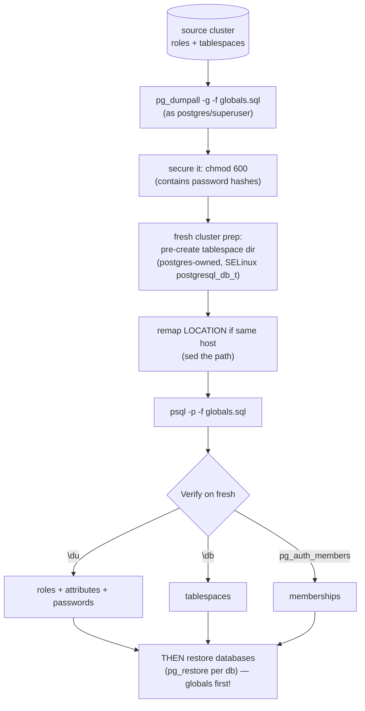
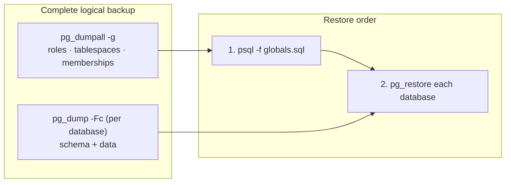

# Lab 17 — `pg_dumpall -g` to Capture Globals; Rebuild Roles + Tablespaces on a Fresh Cluster

> **Track A · DBA · A3 Backup & Recovery · Lab 2 of 10 (Lab 17/222)**
> Teaching package: concept → diagram → steps → verify → quick-ref → self-test → video script.
> **Depends on:** Labs 01–16. Directly closes the "pg_dump excludes roles" gap from Lab 16.

---

## 0. Lab Card (at a glance)

| Field | Value |
|---|---|
| **Objective** | Capture cluster **globals** (roles + tablespaces + memberships) with `pg_dumpall -g` and rebuild them on a fresh cluster with `psql`. |
| **Success criterion** | On the fresh cluster, `\du` shows the roles with their attributes/passwords, `\db` shows the tablespaces, and memberships match the source. |
| **Scope boundary** | Global objects only. Per-database data was Lab 16; the two together = a full logical backup. |
| **Prereqs** | Labs 01–16; superuser; a fresh/second cluster to restore into |
| **Time** | 30–40 min |
| **Difficulty** | ★★★☆☆ |
| **Risk** | Low — source is read-only. **Note:** the globals file contains password hashes — protect it. |

---

## 1. Learning Objectives

1. **What "globals" are** — roles, tablespaces, role memberships, per-role settings — and why `pg_dump` can't include them.
2. **`pg_dumpall` variants** — `-g` (globals), `-r` (roles), `-t` (tablespaces), and full `pg_dumpall`.
3. **Rebuild the right way** — pre-create tablespace directories (ownership + SELinux) before restore, and remap paths when needed.
4. **The DR order** — globals **before** databases, and why.
5. **Handle the password-hash sensitivity** — protect the file; `--no-role-passwords` when appropriate.

---

## 2. Concept Primer — the "why"

**Globals live above any single database.** Roles (users/groups), tablespaces, role memberships, and per-role settings are **cluster-wide** — they aren't inside a database, so `pg_dump` (which dumps one database) can't capture them. That's exactly why a Lab 16 restore into a fresh cluster failed with `role "X" does not exist`. The companion tool is **`pg_dumpall`**.

**`pg_dumpall -g` (globals-only).** Emits the SQL to recreate:
- **Roles** — `CREATE ROLE` with attributes (`LOGIN`, `SUPERUSER`, `CONNECTION LIMIT`, `VALID UNTIL`) and, by default, their **password verifiers** (`md5…` / `SCRAM-SHA-256$…`).
- **Tablespaces** — `CREATE TABLESPACE … LOCATION '/path'`.
- **Memberships** — `GRANT <role> TO <role>` — and per-role `ALTER ROLE … SET`.

Related: `-r` roles only, `-t` tablespaces only, and bare `pg_dumpall` (all databases **and** globals, as one plain SQL script). Output is **plain SQL** — always restored with **`psql`** (there's no custom/directory format for `pg_dumpall`).

**The complete logical-backup recipe:** `pg_dumpall -g` (globals) **+** per-database `pg_dump -Fc` (data, Lab 16). That combo beats a bare `pg_dumpall` because the per-database custom dumps allow parallel and selective restore, while `-g` keeps the globals portable.

**Two things that trip up the restore:**
- **Password sensitivity.** The globals file contains password **hashes** — treat it as a secret (`chmod 600`, never commit to Git). Use `--no-role-passwords` when moving between environments where you'll reset passwords anyway.
- **Tablespaces need their directory to exist.** `CREATE TABLESPACE … LOCATION '/path'` fails unless `/path` already exists on the target, is **owned by `postgres`**, is **empty**, and (under Enforcing SELinux) carries the `postgresql_db_t` label (Lab 4). PostgreSQL creates a version-keyed subdirectory inside it — so **two same-version clusters can't share one LOCATION** (subdir collision). On a real DR host the original path is free; on the same host you **remap** the LOCATION to a new path — a genuinely useful DR skill.

**Restore order = globals first.** Database objects are owned by roles and may live in tablespaces, so those must exist before you load any database. DR sequence: **globals → databases**.

---

## 3. Diagrams

### 3.1 Capture + rebuild flow



### 3.2 The full-backup picture



---

## 4. Prerequisites — create some globals to capture

```bash
# on the SOURCE cluster (5432): make sample roles + a tablespace so there's something to dump
sudo mkdir -p /pgdata/ts/fast && sudo chown postgres:postgres /pgdata/ts/fast && sudo chmod 0700 /pgdata/ts/fast
sudo semanage fcontext -a -t postgresql_db_t "/pgdata/ts(/.*)?" 2>/dev/null || true
sudo restorecon -Rv /pgdata/ts

sudo -u postgres psql <<'SQL'
CREATE ROLE app_ro LOGIN PASSWORD 'RoPass!1';
CREATE ROLE app_rw LOGIN PASSWORD 'RwPass!1' CONNECTION LIMIT 50;
CREATE ROLE app_group NOLOGIN;
GRANT app_group TO app_rw;
CREATE TABLESPACE ts_fast LOCATION '/pgdata/ts/fast';
SQL
```

---

## 5. Step-by-Step

### Step 1 — Dump the globals

```bash
sudo -u postgres pg_dumpall -g -f /backup/globals.sql
sudo chmod 600 /backup/globals.sql                       # contains password hashes — protect it
grep -E "CREATE ROLE|CREATE TABLESPACE|GRANT" /backup/globals.sql
```
> Variants: `pg_dumpall -r` (roles only), `pg_dumpall -t` (tablespaces only), `pg_dumpall --no-role-passwords` (omit hashes).

### Step 2 — Stand up a fresh cluster to restore into

```bash
sudo mkdir -p /pgdata/17/fresh && sudo chown -R postgres:postgres /pgdata/17/fresh && sudo chmod 0700 /pgdata/17/fresh
sudo -u postgres /usr/pgsql-17/bin/initdb -k -D /pgdata/17/fresh --encoding=UTF8 --locale=en_US.UTF-8
echo "port = 5451" | sudo -u postgres tee -a /pgdata/17/fresh/postgresql.conf
sudo semanage port -a -t postgresql_port_t -p tcp 5451 2>/dev/null || true
sudo -u postgres /usr/pgsql-17/bin/pg_ctl -D /pgdata/17/fresh -l /tmp/fresh.log start
```

### Step 3 — Pre-create (and remap) the tablespace directory

```bash
# same host ⇒ can't reuse the source LOCATION (same-version subdir collision) ⇒ remap to a new path
sudo mkdir -p /pgdata/ts/fast_restore && sudo chown postgres:postgres /pgdata/ts/fast_restore && sudo chmod 0700 /pgdata/ts/fast_restore
sudo restorecon -Rv /pgdata/ts
# remap the LOCATION inside the dump (on a separate DR host you'd skip this — the original path is free):
sudo sed -i "s#LOCATION '/pgdata/ts/fast'#LOCATION '/pgdata/ts/fast_restore'#" /backup/globals.sql
```

### Step 4 — Restore the globals into the fresh cluster

```bash
sudo -u postgres psql -p 5451 -d postgres -f /backup/globals.sql
#   (harmless "role postgres already exists" style notices are normal)
```

### Step 5 — Verify on the fresh cluster

```bash
sudo -u postgres psql -p 5451 -c "\du"                    # roles + attributes
sudo -u postgres psql -p 5451 -c "\db"                    # tablespaces
sudo -u postgres psql -p 5451 -c "SELECT rolname, rolcanlogin, rolconnlimit, left(rolpassword,13) AS verifier
                                   FROM pg_authid WHERE rolname LIKE 'app_%';"
sudo -u postgres psql -p 5451 -c "SELECT r.rolname AS member, g.rolname AS granted
                                   FROM pg_auth_members m JOIN pg_roles r ON r.oid=m.member JOIN pg_roles g ON g.oid=m.roleid;"
```

### Step 6 — Then restore databases (globals-first order)

```bash
# now a per-db restore succeeds because roles/tablespaces exist:
sudo -u postgres createdb -p 5451 benchdb
sudo -u postgres pg_restore -p 5451 -d benchdb -j4 /backup/benchdb.dump    # from Lab 16
sudo -u postgres psql -p 5451 -d benchdb -c "SELECT count(*) FROM pgbench_accounts;"
```

---

## 6. Verification Checklist

- [ ] `globals.sql` contains `CREATE ROLE`, `CREATE TABLESPACE`, and `GRANT` lines
- [ ] File permissions `600` (password hashes protected)
- [ ] Fresh cluster `\du` shows `app_ro`/`app_rw`/`app_group` with correct attributes
- [ ] Password verifiers restored (`pg_authid.rolpassword` present)
- [ ] `\db` shows the tablespace on the fresh cluster (remapped path)
- [ ] Membership `app_group → app_rw` present
- [ ] A per-database restore then succeeds (no missing-role errors)

---

## 7. Troubleshooting

| Symptom | Cause | Fix |
|---|---|---|
| `CREATE TABLESPACE` fails: directory doesn't exist / not empty | LOCATION not prepared | Pre-create dir, `chown postgres`, `chmod 0700`, empty it |
| Tablespace fails: `Permission denied` | Missing SELinux label | `semanage fcontext -t postgresql_db_t` + `restorecon` (Lab 4) |
| Tablespace subdir collision on same host | Two same-version clusters share a LOCATION | Remap LOCATION to a new path (Step 3) |
| `pg_dumpall -g` has no passwords | Ran as non-superuser (can't read `pg_authid`) | Run as `postgres`/superuser |
| Restored role can't log in | Verifier format vs `pg_hba` method mismatch, or `--no-role-passwords` | Align auth method (Lab 6) or reset password |
| `role already exists` errors | Restoring into a non-fresh cluster | Use a fresh cluster, or pre-drop the roles |
| `globals.sql` world-readable | Contains hashes | `chmod 600`; never commit to VCS |

---

## 8. Quick Reference Card (paste-ready)

```bash
# capture globals (roles + tablespaces + memberships)
sudo -u postgres pg_dumpall -g -f /backup/globals.sql
sudo chmod 600 /backup/globals.sql                 # password hashes inside — protect it
# variants: -r roles only | -t tablespaces only | --no-role-passwords

# prepare target tablespace dir (owned by postgres, SELinux-labeled)
sudo mkdir -p /pgdata/ts/fast_restore && sudo chown postgres:postgres /pgdata/ts/fast_restore && sudo chmod 0700 /pgdata/ts/fast_restore
sudo restorecon -Rv /pgdata/ts
# same-host remap (skip on a real DR host):
sudo sed -i "s#LOCATION '/pgdata/ts/fast'#LOCATION '/pgdata/ts/fast_restore'#" /backup/globals.sql

# restore GLOBALS FIRST, then databases
sudo -u postgres psql -p 5451 -d postgres -f /backup/globals.sql
sudo -u postgres createdb -p 5451 benchdb && sudo -u postgres pg_restore -p 5451 -d benchdb -j4 /backup/benchdb.dump

# verify
sudo -u postgres psql -p 5451 -c "\du"; sudo -u postgres psql -p 5451 -c "\db"

# COMPLETE backup recipe:  pg_dumpall -g   +   pg_dump -Fc (each database)
```

---

## 9. Self-Check

1. What does `pg_dumpall -g` capture that `pg_dump` cannot?
2. What format is `pg_dumpall` output, and which tool restores it?
3. Before restoring a `CREATE TABLESPACE`, what must be true of its LOCATION directory?
4. Correct DR restore order — globals or databases first? Why?
5. What sensitive content is in the globals file, and which flag omits it?
6. Why might two same-version clusters on one host fail to share a tablespace LOCATION?

<details>
<summary>Answers</summary>

1. Cluster **globals** — roles, tablespaces, role memberships, per-role settings — which live above any single database.
2. Plain SQL; restore with **`psql`**.
3. It must already **exist**, be **owned by `postgres`**, be **empty**, and (Enforcing SELinux) be labeled `postgresql_db_t`.
4. **Globals first** — database objects are owned by roles and may reside in tablespaces, which must exist beforehand.
5. Role **password hashes**; `--no-role-passwords` omits them (and `chmod 600` the file).
6. PostgreSQL creates a version-keyed subdirectory inside the LOCATION; two same-version clusters generate the **same** subdir name → collision. Remap to separate paths.
</details>

---

## 10. Video / Teaching Script

| # | On screen | Say (narration) |
|---|---|---|
| 1 | Title: "The half of your backup pg_dump forgets" | "pg_dump saves a database — but not your users or tablespaces. Restore into a clean server and it breaks. Here's the missing half." |
| 2 | `pg_dumpall -g` + grep | "One command captures the globals: roles, their passwords, memberships, tablespaces." |
| 3 | `chmod 600` | "Important — this file holds password hashes. Lock it down. Never in Git." |
| 4 | fresh cluster + tablespace dir | "On a clean cluster, one prep step people miss: a tablespace's directory must exist first, owned by postgres and SELinux-labeled." |
| 5 | sed remap | "On the same host we remap the path — two same-version clusters can't share one tablespace location. On a real DR box, you'd skip this." |
| 6 | `psql -f globals.sql` + `\du` `\db` | "Restore, and there they are — roles with their attributes, the tablespace, all rebuilt." |
| 7 | per-db restore succeeds | "Now — and only now — a database restore works, because the roles it references exist." |
| 8 | Outro | "Globals plus per-database dumps equals a complete, restorable backup. Next: making these dumps fast with parallelism." |

---

## 11. Glossary

- **Globals** — cluster-wide objects: roles, tablespaces, memberships, per-role settings.
- **`pg_dumpall`** — dumps globals and/or all databases as plain SQL.
- **`-g` / `-r` / `-t`** — globals / roles-only / tablespaces-only.
- **Role / tablespace / membership** — user or group / named storage location / `GRANT role TO role`.
- **Password verifier** — stored password hash (`md5…` / `SCRAM-SHA-256$…`).
- **`--no-role-passwords`** — dump roles without their hashes.
- **Restore order** — globals before databases.

---
*NETAPORT lab series · PostgreSQL 17 on AlmaLinux 9 · Lab 17/222 · A3 Backup & Recovery*
