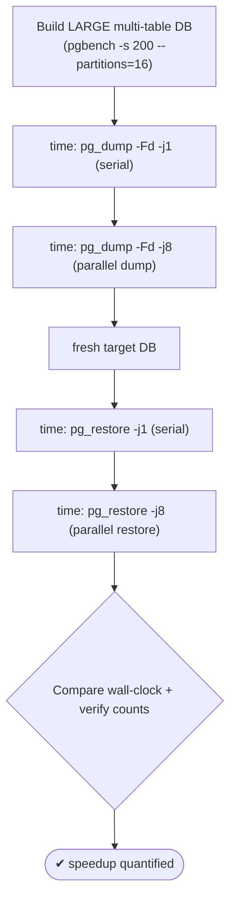
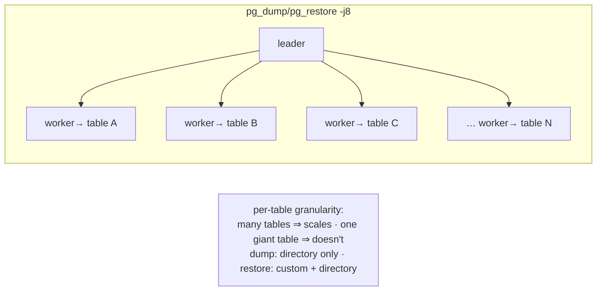

# Lab 18 — Parallel Dump/Restore (`-j`) of a Large DB; Time It vs Single-Threaded

> **Track A · DBA · A3 Backup & Recovery · Lab 3 of 10 (Lab 18/222)**
> Teaching package: concept → diagram → steps → verify → quick-ref → self-test → video script.
> **Depends on:** Labs 16–17 (you know the four formats and that directory supports parallel dump).

---

## 0. Lab Card (at a glance)

| Field | Value |
|---|---|
| **Objective** | Dump and restore a large database serially (`-j1`) and in parallel (`-j N`), and **time both** to quantify the speedup. |
| **Success criterion** | A recorded wall-clock comparison showing parallel dump (directory) and parallel restore (custom/directory) beating single-threaded; restored row counts match. |
| **Scope boundary** | Parallelism + measurement. Format choice was Lab 16; physical backups are Lab 19. |
| **Prereqs** | Labs 16–17; a multi-core VM; a "large", **multi-table** dataset |
| **Time** | 30–50 min (data build + timed runs) |
| **Difficulty** | ★★★☆☆ |
| **Risk** | Low — read-only source; restores into scratch DBs. |

---

## 1. Learning Objectives

1. **Where `-j` applies** — parallel **dump** = directory format only; parallel **restore** = custom **and** directory.
2. **The granularity rule** — parallelism is **per table**; many tables scale, one giant table doesn't.
3. **Which phase gains most** — restore (index/constraint builds parallelize well).
4. **Measure it** — time serial vs parallel and record the delta.
5. **Size `-j`** — cores, bounded by I/O and `max_connections`.

---

## 2. Concept Primer — the "why"

**`-j` splits work across worker processes.** A leader plus N workers each handle a **different table** at once. That maps `-j` to two truths:

- **Parallel DUMP is directory-only.** Only `-Fd` supports `pg_dump -j` — each worker writes its table's file concurrently. `custom`/`plain`/`tar` are single-writer, so they can't parallel-dump. (Consistency is preserved via a **synchronized snapshot** all workers share — a single consistent point-in-time.)
- **Parallel RESTORE works for custom AND directory.** `pg_restore -j` restores multiple tables' data and builds their indexes concurrently. This is usually the **bigger** win, because index and constraint builds are CPU-heavy and parallelize beautifully.

**The granularity catch.** Because a worker takes a **whole table**, parallelism helps in proportion to how the data is spread across tables:
- **Many medium tables → near-linear speedup** up to your core/I/O limit.
- **One dominant giant table → little benefit** — that single worker is the bottleneck while others idle. (This is why plain `pgbench` — mostly one huge `pgbench_accounts` — is a *poor* parallel demo. Partitioning it into many tables fixes that.)

**Sizing `-j`.** Start near the **CPU core count**, then bound by:
- **I/O** — on a single slow disk, workers contend; parallelism helps most when CPU-bound (index builds) or on fast/striped storage.
- **`max_connections`** — each worker is a connection; `-j 8` uses 8 workers + 1 leader = **9 connections**. Ensure headroom.

**Rule of thumb:** parallel restore of a many-table database on a multi-core box is one of the highest-leverage speedups in backup/restore — often several times faster. Measure on *your* hardware; that's the point of this lab.

---

## 3. Diagrams

### 3.1 Measure serial vs parallel



### 3.2 How `-j` distributes work



---

## 4. Prerequisites — build a large, parallel-friendly DB

```bash
nproc                                                     # cores available → guides -j
sudo -u postgres createdb bigdb
# partitions make it MANY tables so parallelism can shine (scale 200 ≈ ~3GB; adjust to your VM):
sudo -u postgres pgbench -i -s 200 --partitions=16 bigdb
sudo -u postgres psql -d bigdb -c "SELECT count(*) FROM pgbench_accounts;"   # baseline to verify against
```

---

## 5. Step-by-Step

### Step 1 — Time a serial dump (directory, `-j1`)

```bash
sudo rm -rf /backup/bigdb_dir_s1
time sudo -u postgres pg_dump -Fd -j 1 -d bigdb -f /backup/bigdb_dir_s1
```

### Step 2 — Time a parallel dump (directory, `-j N`)

```bash
sudo rm -rf /backup/bigdb_dir_p8
time sudo -u postgres pg_dump -Fd -j 8 -d bigdb -f /backup/bigdb_dir_p8
```
*Record both `real` times. Directory format is required for parallel dump.*

### Step 3 — Time a serial restore (`-j1`)

```bash
sudo -u postgres dropdb --if-exists bigdb_s1 && sudo -u postgres createdb bigdb_s1
time sudo -u postgres pg_restore -d bigdb_s1 -j 1 /backup/bigdb_dir_p8
```

### Step 4 — Time a parallel restore (`-j N`)

```bash
sudo -u postgres dropdb --if-exists bigdb_p8 && sudo -u postgres createdb bigdb_p8
time sudo -u postgres pg_restore -d bigdb_p8 -j 8 /backup/bigdb_dir_p8
```
*Restore is usually where parallelism pays off most — watch the delta here.*

### Step 5 — Verify both restores match the source

```bash
for db in bigdb bigdb_s1 bigdb_p8; do
  printf "%-10s " "$db"; sudo -u postgres psql -tAc "SELECT count(*) FROM pgbench_accounts;" -d "$db"
done   # all equal
```

### Step 6 — Record the results (§6 table) and reason about `-j`

```bash
# Try -j = nproc and -j = 2×nproc; note where speedup flattens (I/O or connection bound).
```

---

## 6. Verification Checklist & Results Table

- [ ] Parallel dump used **directory** format (`-Fd`)
- [ ] Timed serial vs parallel for **both** dump and restore
- [ ] Restored row counts equal the source
- [ ] Speedup is clearer on **restore** than dump (index builds)
- [ ] `-j` ≤ cores and within `max_connections` headroom

| Phase | `-j1` (real) | `-j8` (real) | Speedup ×= j1/j8 |
|---|---|---|---|
| Dump (directory) | | | |
| Restore | | | |

*Expect strong restore scaling on a many-table DB; weaker if one table dominates.*

---

## 7. Troubleshooting

| Symptom | Cause | Fix |
|---|---|---|
| No dump speedup | Used custom/plain/tar | Parallel dump needs **directory** (`-Fd`) |
| Little speedup despite `-j` | One dominant giant table | Partition it (per-table granularity); or accept the limit |
| Restore `-j` errors / connection failures | Workers + leader exceed `max_connections` | Lower `-j` or raise `max_connections` |
| Speedup flattens early | I/O-bound on a single disk | Faster/striped storage; parallelism helps CPU-bound index builds most |
| `pg_dump -Fd` fails: dir exists | Directory not empty/new | Remove or use a fresh path |
| Parallel restore ordering issues (rare) | Complex cross-table deps | pg_restore orders by dependency automatically; for data-only edge cases use `--disable-triggers` |

---

## 8. Quick Reference Card (paste-ready)

```bash
# build large, parallel-friendly DB
sudo -u postgres createdb bigdb
sudo -u postgres pgbench -i -s 200 --partitions=16 bigdb

# DUMP: serial vs parallel (directory required for parallel dump)
time sudo -u postgres pg_dump -Fd -j1 -d bigdb -f /backup/bigdb_dir_s1
time sudo -u postgres pg_dump -Fd -j8 -d bigdb -f /backup/bigdb_dir_p8

# RESTORE: serial vs parallel (custom or directory)
sudo -u postgres createdb bigdb_s1 && time sudo -u postgres pg_restore -d bigdb_s1 -j1 /backup/bigdb_dir_p8
sudo -u postgres createdb bigdb_p8 && time sudo -u postgres pg_restore -d bigdb_p8 -j8 /backup/bigdb_dir_p8

# verify
sudo -u postgres psql -tAc "SELECT count(*) FROM pgbench_accounts;" -d bigdb_p8

# Rules: parallel DUMP → directory only | parallel RESTORE → custom + directory
#        granularity = per table | -j ≈ cores, bounded by I/O and max_connections (each worker = 1 conn)
```

---

## 9. Self-Check

1. Which format supports parallel **dump**? Which support parallel **restore**?
2. What is the granularity of `-j` parallelism, and when does it fail to help?
3. How many connections does `-j 8` consume?
4. Which phase — dump or restore — usually benefits more, and why?
5. How is a parallel dump kept consistent across workers?
6. Rule of thumb for choosing `-j`, and the two things that bound it?

<details>
<summary>Answers</summary>

1. Parallel **dump**: directory (`-Fd`) only. Parallel **restore**: custom **and** directory.
2. Per **table** — it doesn't help when one giant table dominates (that worker is the bottleneck).
3. 8 workers + 1 leader = **9** connections.
4. **Restore** — index and constraint builds are CPU-heavy and parallelize well.
5. All workers share a **synchronized (exported) snapshot** — one consistent point-in-time.
6. ≈ **CPU cores**, bounded by **I/O** and **`max_connections`** (each worker is a connection).
</details>

---

## 10. Video / Teaching Script

| # | On screen | Say (narration) |
|---|---|---|
| 1 | Title: "Backups, in parallel" | "On a multi-core box, a single-threaded dump or restore leaves most of the machine idle. Let's put those cores to work — and measure it." |
| 2 | build partitioned bigdb | "First a caveat baked into the demo: parallelism works *per table*. We partition so there's real work to spread — one giant table wouldn't scale." |
| 3 | `time pg_dump -Fd -j1` vs `-j8` | "Serial dump, then parallel — remember, only the directory format can parallel-dump. Watch the clock." |
| 4 | `time pg_restore -j1` vs `-j8` | "Now restore, where it really pays: index builds are CPU-hungry and split across workers beautifully." |
| 5 | verify counts | "Same data, every time — parallel doesn't mean partial." |
| 6 | results table | "Record it. On many-table databases this is one of the biggest wins in the whole backup story." |
| 7 | sizing note | "Set j near your core count — but each worker is a connection, and a single disk will cap you. Measure, don't assume." |
| 8 | Outro | "Faster dumps and restores, proven on your hardware. Next: physical base backups with pg_basebackup." |

---

## 11. Glossary

- **`-j` / parallel jobs** — worker processes handling different tables concurrently.
- **Parallel dump** — directory format only; workers write per-table files.
- **Parallel restore** — custom + directory; workers load data / build indexes.
- **Synchronized snapshot** — shared consistent point-in-time across dump workers.
- **Per-table granularity** — one worker per table; limits gains on one huge table.
- **Leader/worker** — the coordinating process and its parallel helpers.

---
*NETAPORT lab series · PostgreSQL 17 on AlmaLinux 9 · Lab 18/222 · A3 Backup & Recovery*
