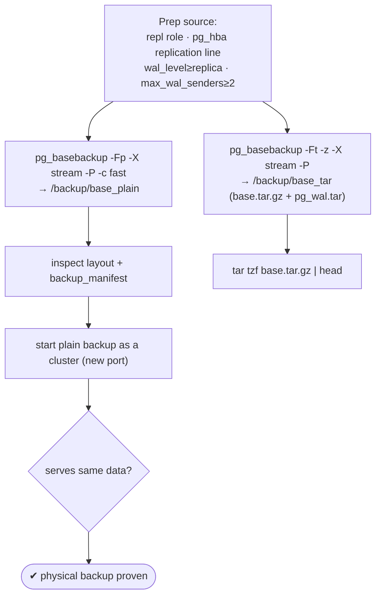
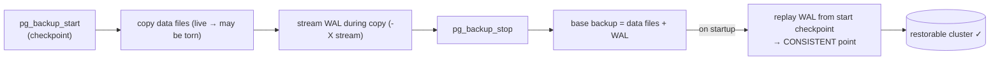

# Lab 19 — Physical Base Backup with `pg_basebackup` (plain + tar, with `-P`)

> **Track A · DBA · A3 Backup & Recovery · Lab 4 of 10 (Lab 19/222)**
> Teaching package: concept → diagram → steps → verify → quick-ref → self-test → video script.
> **Depends on:** Labs 01–18 (running cluster; pg_hba/auth from Lab 6). **Foundation for:** PITR (Lab 21) and streaming replication (Lab 26).

---

## 0. Lab Card (at a glance)

| Field | Value |
|---|---|
| **Objective** | Take a consistent, whole-cluster **physical** base backup with `pg_basebackup` in both **plain** and **tar** formats, showing progress with `-P`, and prove the plain backup is restorable by starting it. |
| **Success criterion** | Plain backup contains a full data-dir layout + `backup_manifest`; tar backup produces `base.tar(.gz)` + WAL; the plain backup **starts as a cluster** and serves the same data. |
| **Scope boundary** | Taking a base backup. WAL archiving is Lab 20; PITR is Lab 21; `pg_verifybackup` is Lab 23; standby setup is Lab 26. |
| **Prereqs** | Labs 01–18; a replication role + pg_hba line; `wal_level ≥ replica` |
| **Time** | 25–40 min |
| **Difficulty** | ★★★☆☆ |
| **Risk** | Low — non-destructive; creates a repl role + one pg_hba line. |

---

## 1. Learning Objectives

1. **Physical vs logical** — what a whole-cluster block-level backup gives you (speed, replication/PITR base) and its limits (same major version + arch).
2. **The prerequisites** — replication role, the `replication` pg_hba line, `wal_level`, `max_wal_senders`.
3. **plain vs tar** — a ready-to-run directory vs a compressible archive.
4. **Why `-X stream`** — a base backup needs WAL to become consistent; streaming it makes the backup self-contained.
5. **Prove it** — start the plain backup as a cluster; know `backup_manifest` for later verification.

---

## 2. Concept Primer — the "why"

**Physical = a byte-level copy of the whole cluster.** Unlike `pg_dump` (logical, per-database, portable across versions), `pg_basebackup` copies the entire data directory — **all** databases, roles, tablespaces — as files. It's **fast for large clusters**, and it's the **basis for streaming replication and PITR**. The trade-off: it's tied to the **same major version and architecture**, and it's all-or-nothing (no selective restore).

**How it stays consistent — the key idea.** `pg_basebackup` connects over the **replication protocol** and, between a start checkpoint (`pg_backup_start`) and a stop (`pg_backup_stop`), copies the data files while the server keeps running. Those copied files can be **torn** (changing mid-copy) — so a base backup on its own is *not* consistent. What makes it restorable is the **WAL generated during the copy**: on startup the backup replays that WAL from the start checkpoint to reach a **consistent point**. So:

> **base backup = data files (possibly inconsistent) + WAL to replay to consistency.**

That's why `-X stream` (the default) matters: it opens a *second* connection and **streams the WAL alongside** the file copy, so the finished backup already contains everything it needs to come up cleanly — no dependency on the source keeping that WAL.

**Prerequisites on the source:**
- A role with **REPLICATION** (or superuser): `CREATE ROLE repl WITH REPLICATION LOGIN PASSWORD …`.
- A pg_hba line for the special **`replication`** pseudo-database: `host replication repl <client>/32 scram-sha-256` (Lab 6).
- **`wal_level`** ≥ `replica` (the default; `minimal` fails a base backup).
- **`max_wal_senders`** ≥ 2 for `-X stream` (one sender for files, one for WAL; default 10 is fine).

**Formats:**
- **plain (`-Fp`, default)** — a normal data-directory layout you can start immediately (or use as a standby). Tablespaces land at their original paths unless remapped with `--tablespace-mapping`.
- **tar (`-Ft`)** — one `base.tar` (+ a tar per tablespace, + `pg_wal.tar` with `-X stream`), optionally compressed (`-z`/`--compress`). Great for archival.

**Useful flags:** `-P` progress; `-c fast` immediate checkpoint (starts sooner, I/O spike) vs `-c spread` (default, gentler); `-R` write recovery config for a standby (Lab 26); `-C --slot` create a slot to guarantee WAL retention. Every backup also gets a **`backup_manifest`** (file list + checksums) that `pg_verifybackup` uses later (Lab 23).

---

## 3. Diagrams

### 3.1 Take + verify flow



### 3.2 How a base backup reaches consistency



---

## 4. Prerequisites — prepare the source

```bash
# replication role
sudo -u postgres psql -c "CREATE ROLE repl WITH REPLICATION LOGIN PASSWORD 'ReplPass!1';"

# pg_hba: allow the special 'replication' pseudo-db for repl (localhost for this lab)
HBA=$(sudo -u postgres psql -tAc "SHOW hba_file;")
sudo tee -a "$HBA" >/dev/null <<'EOF'
# Lab 19 base backup
host    replication   repl   127.0.0.1/32   scram-sha-256
host    replication   repl   ::1/128        scram-sha-256
EOF

# confirm prerequisites, then reload
sudo -u postgres psql -c "SHOW wal_level; SHOW max_wal_senders;"   # replica ; >=2
sudo systemctl reload postgresql-17

# backup area
sudo mkdir -p /backup && sudo chown postgres:postgres /backup
```

---

## 5. Step-by-Step

### Step 1 — Plain base backup, with progress

```bash
sudo rm -rf /backup/base_plain
sudo -u postgres env PGPASSWORD='ReplPass!1' \
  pg_basebackup -h 127.0.0.1 -U repl -D /backup/base_plain \
  -Fp -X stream -P -c fast -l "lab19-plain"
```
*`-Fp` plain, `-X stream` streams WAL (self-consistent), `-P` progress, `-c fast` immediate checkpoint.*

### Step 2 — Tar base backup, compressed, with progress

```bash
sudo rm -rf /backup/base_tar && sudo -u postgres mkdir -p /backup/base_tar
sudo -u postgres env PGPASSWORD='ReplPass!1' \
  pg_basebackup -h 127.0.0.1 -U repl -D /backup/base_tar \
  -Ft -z -X stream -P -l "lab19-tar"
ls -lh /backup/base_tar/                 # base.tar.gz  (+ pg_wal.tar.gz)
```

### Step 3 — Inspect what you got

```bash
# plain: a real data directory
ls /backup/base_plain/ | head            # PG_VERSION base/ global/ pg_wal/ backup_label backup_manifest
sudo head -5 /backup/base_plain/backup_label
sudo -u postgres head -3 /backup/base_plain/backup_manifest

# tar: archive contents
sudo -u postgres tar tzf /backup/base_tar/base.tar.gz | head
```

### Step 4 — Prove the plain backup is restorable (start it as a cluster)

```bash
sudo chown -R postgres:postgres /backup/base_plain && sudo chmod 0700 /backup/base_plain
echo "port = 5452" | sudo -u postgres tee -a /backup/base_plain/postgresql.conf
sudo semanage port -a -t postgresql_port_t -p tcp 5452 2>/dev/null || true
sudo -u postgres /usr/pgsql-17/bin/pg_ctl -D /backup/base_plain -l /tmp/base_plain.log start
sudo -u postgres psql -p 5452 -c "SELECT current_setting('data_directory'); \l"   # serves the whole cluster
```

### Step 5 — Stop the temporary restored cluster

```bash
sudo -u postgres /usr/pgsql-17/bin/pg_ctl -D /backup/base_plain stop
```

---

## 6. Verification Checklist

- [ ] Plain backup dir has `PG_VERSION`, `base/`, `global/`, `pg_wal/`, `backup_label`, `backup_manifest`
- [ ] Tar backup has `base.tar.gz` (+ `pg_wal.tar.gz`)
- [ ] `-P` showed progress during both
- [ ] Plain backup **starts as a cluster** and lists all source databases
- [ ] `wal_level` was ≥ `replica` and `max_wal_senders` ≥ 2
- [ ] You can explain why the WAL (`-X stream`) is what makes it consistent

---

## 7. Troubleshooting

| Symptom | Cause | Fix |
|---|---|---|
| `no pg_hba.conf entry for replication connection` | Missing `replication` pg_hba line | Add the `host replication …` line; reload |
| `must be superuser or replication role` | Role lacks `REPLICATION` | `ALTER ROLE repl REPLICATION;` |
| Base backup fails / `wal_level=minimal` | WAL level too low | Set `wal_level=replica` and restart |
| `-X stream` fails: not enough WAL senders | `max_wal_senders` < 2 | Raise it (default 10) |
| Target dir not empty | `-D` must be empty/new | Clear or use a fresh path |
| Plain restore: tablespace path conflict (same host) | Original tablespace paths reused | `--tablespace-mapping=OLD=NEW` |
| Restored plain cluster won't start | Port conflict / perms | Change `port`, `chown postgres`, `chmod 0700` |

---

## 8. Quick Reference Card (paste-ready)

```bash
# prep source
sudo -u postgres psql -c "CREATE ROLE repl WITH REPLICATION LOGIN PASSWORD 'ReplPass!1';"
HBA=$(sudo -u postgres psql -tAc "SHOW hba_file;")
printf 'host replication repl 127.0.0.1/32 scram-sha-256\nhost replication repl ::1/128 scram-sha-256\n' | sudo tee -a "$HBA"
sudo systemctl reload postgresql-17

# PLAIN (ready-to-run dir), with progress + immediate checkpoint
sudo -u postgres env PGPASSWORD='ReplPass!1' pg_basebackup -h 127.0.0.1 -U repl \
  -D /backup/base_plain -Fp -X stream -P -c fast -l "plain"

# TAR (compressed archive), with progress
sudo -u postgres env PGPASSWORD='ReplPass!1' pg_basebackup -h 127.0.0.1 -U repl \
  -D /backup/base_tar -Ft -z -X stream -P -l "tar"

# inspect + prove restorable
ls /backup/base_plain/; sudo -u postgres tar tzf /backup/base_tar/base.tar.gz | head
echo "port=5452" | sudo -u postgres tee -a /backup/base_plain/postgresql.conf
sudo -u postgres pg_ctl -D /backup/base_plain -l /tmp/bp.log start
sudo -u postgres psql -p 5452 -c "\l"; sudo -u postgres pg_ctl -D /backup/base_plain stop

# flags: -Fp/-Ft format | -X stream WAL (default) | -P progress | -c fast|spread checkpoint
#        -R standby conf (Lab 26) | -C --slot retain WAL | -z compress tar | backup_manifest → pg_verifybackup
```

---

## 9. Self-Check

1. Name one advantage and one limitation of a physical backup vs a logical one.
2. What four things must be true on the source before `pg_basebackup` works?
3. What does `-X stream` do, and why is it the default?
4. When would you choose plain vs tar format?
5. Why is a base backup not consistent on its own, and what fixes that?
6. What does `-P` show, and which file supports later integrity verification?

<details>
<summary>Answers</summary>

1. Advantage: fast, whole-cluster, and the basis for replication/PITR. Limitation: tied to the same major version + architecture, and not selective.
2. A `REPLICATION` role, a `replication` pg_hba entry, `wal_level ≥ replica`, and `max_wal_senders ≥ 2` (for `-X stream`).
3. It streams the WAL generated during the copy over a second connection, making the backup self-consistent and immediately restorable — hence the default.
4. plain = a ready-to-run data directory (start now / use as standby); tar = a compressible archive for storage.
5. Data files are copied while the server is live and may be torn; replaying the included WAL from the start checkpoint brings it to a consistent point.
6. `-P` shows progress; `backup_manifest` (file list + checksums) is used by `pg_verifybackup` (Lab 23).
</details>

---

## 10. Video / Teaching Script

| # | On screen | Say (narration) |
|---|---|---|
| 1 | Title: "The backup replication and PITR are built on" | "pg_dump copies logic; pg_basebackup copies the whole cluster, byte for byte. It's the foundation for standbys and point-in-time recovery." |
| 2 | prep: repl role + hba + wal_level | "A few prerequisites: a replication role, a pg_hba line for the special 'replication' database, and the right WAL level." |
| 3 | `pg_basebackup -Fp -X stream -P -c fast` | "Plain format, with a progress bar. Note -X stream — it streams the WAL alongside the copy." |
| 4 | explain consistency | "Here's the crucial idea: the files are copied while the server runs, so they're not consistent by themselves. The streamed WAL is what replays them to a clean point on startup." |
| 5 | `-Ft -z` tar | "Same backup as a compressed archive — ideal for shipping offsite." |
| 6 | inspect layout + manifest | "The plain backup *is* a data directory — PG_VERSION, base, global, and a manifest of every file." |
| 7 | start plain as a cluster | "The real proof: point a server at it and start it. There's the whole cluster, live." |
| 8 | Outro | "A consistent, restorable physical backup. Next: archiving WAL — the piece that unlocks point-in-time recovery." |

---

## 11. Glossary

- **Physical / base backup** — byte-level copy of the whole cluster.
- **`pg_basebackup`** — takes a base backup over the replication protocol.
- **Replication role / `replication` pg_hba db** — privilege and auth entry required.
- **`wal_level` / `max_wal_senders`** — must permit replication / enough WAL senders.
- **`-X stream` / `fetch`** — stream WAL during copy / fetch at end.
- **plain / tar** — ready-to-run dir / archive format.
- **`backup_label` / `backup_manifest`** — start metadata / file list + checksums.
- **`-c fast` / `spread`** — immediate vs spread start checkpoint.

---
*NETAPORT lab series · PostgreSQL 17 on AlmaLinux 9 · Lab 19/222 · A3 Backup & Recovery*
