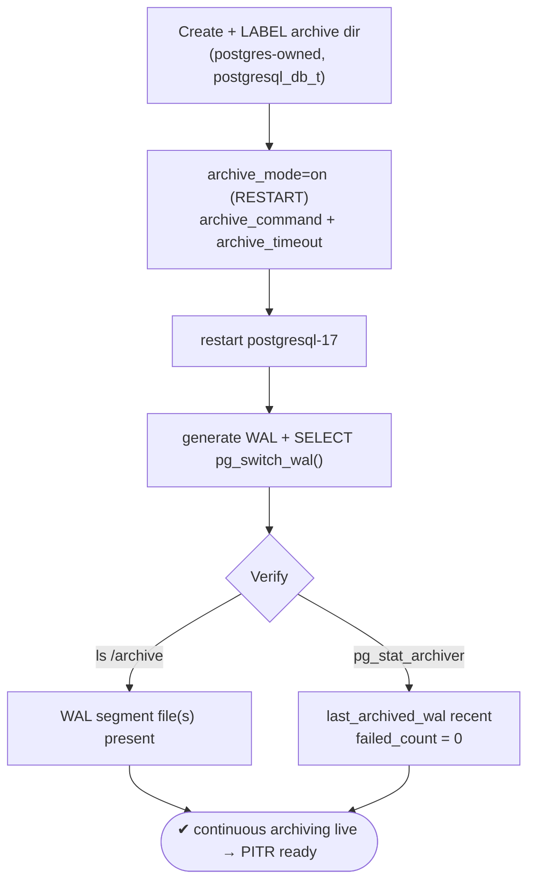
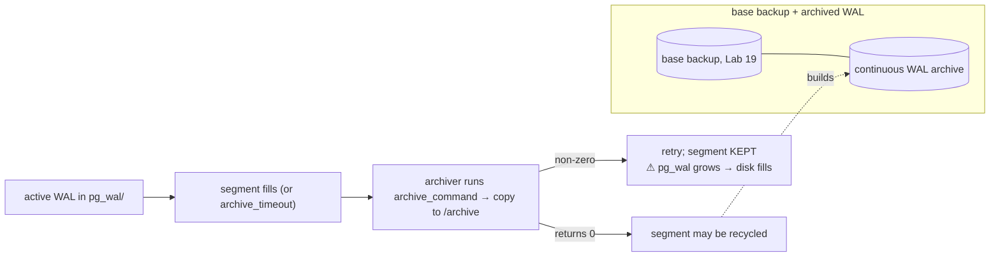

# Lab 20 — Enable WAL Archiving (`archive_mode`, `archive_command`); Verify Segments Land in the Archive

> **Track A · DBA · A3 Backup & Recovery · Lab 5 of 10 (Lab 20/222)**
> Teaching package: concept → diagram → steps → verify → quick-ref → self-test → video script.
> **Depends on:** Labs 01–19 (base backup in Lab 19). **Unlocks:** Lab 21 (PITR) — base backup + archived WAL = point-in-time recovery.

---

## 0. Lab Card (at a glance)

| Field | Value |
|---|---|
| **Objective** | Turn on continuous WAL archiving (`archive_mode` + `archive_command`), force a segment to be archived, and verify it lands in the archive dir with a healthy `pg_stat_archiver`. |
| **Success criterion** | WAL segment files appear in `/archive`; `pg_stat_archiver` shows `last_archived_wal` recent and `failed_count = 0`. |
| **Scope boundary** | Getting archiving working + monitored. Using the archive to recover is Lab 21; production archive tooling is Lab 25. |
| **Prereqs** | Labs 01–19; `wal_level ≥ replica`; a writable, SELinux-labeled archive dir |
| **Time** | 20–30 min |
| **Difficulty** | ★★★☆☆ |
| **Risk** | **Medium** — a broken `archive_command` with `archive_mode=on` lets WAL pile up in `pg_wal` and fill disk. Monitor it. |

---

## 1. Learning Objectives

1. **What continuous archiving is** — copying each completed WAL segment out before it's recycled, building an unbroken WAL history.
2. **The two settings** — `archive_mode` (restart) and `archive_command` (reload), plus `archive_timeout` for RPO.
3. **The danger** — a failing `archive_command` stalls WAL recycling and can fill `pg_wal`.
4. **Monitor it** — `pg_stat_archiver` (`failed_count`, `last_archived_*`).
5. **The SELinux angle** — the archiver is confined; the archive dir must be writable by `postgresql_t`.

---

## 2. Concept Primer — the "why"

**Why archive WAL.** PostgreSQL streams changes into WAL segments (16 MB each) in `pg_wal/`. Normally, once a segment is no longer needed for crash recovery it's **recycled/removed**. **Continuous archiving** copies each *completed* segment to a safe place **before** recycling — giving you an unbroken chain of changes. Combined with a base backup (Lab 19), that chain lets you **replay forward to any moment** — the foundation of PITR (Lab 21) and of feeding standbys.

**`archive_mode` (restart-only).** `off` (default) / `on` (archive as primary) / `always` (archive even on a standby). Needs `wal_level ≥ replica`. It's a `postmaster` param → **restart** to change.

**`archive_command` (reload).** A shell command PostgreSQL runs for **each completed segment**. Placeholders:
- `%p` — path to the WAL file to archive (relative to the data dir).
- `%f` — just the filename.

A minimal teaching command:
```
archive_command = 'test ! -f /archive/%f && cp %p /archive/%f'
```
The `test ! -f` guard refuses to **overwrite** an already-archived file (a same-name file usually signals a problem — fail rather than clobber). The command **must return 0 on success.**

**The failure mode that bites people.** If `archive_command` returns non-zero, PostgreSQL **keeps the segment and retries** — it will **not recycle** WAL until it's archived. So a broken archive command means `pg_wal` **grows without bound** and can **fill the disk and stall the server**. Archiving is not fire-and-forget — you **monitor** it. (This is also why production uses real tools — pgBackRest/WAL-G/Barman, Lab 25 — that do atomic writes, compression, retries, and remote targets; the raw `cp` here is for learning the mechanism.)

**`archive_timeout` (reload).** Forces a WAL switch after N seconds even if the segment isn't full, so a low-traffic system doesn't leave the last changes un-archived indefinitely. It bounds your **RPO** (recovery-point objective) — the cost is more (partly empty) segments when idle. `60s` is a common choice.

**SELinux reality.** The WAL archiver runs inside PostgreSQL's confined `postgresql_t` domain. Writing to an arbitrary `/archive` labeled `default_t` will be **denied**. Label the archive dir so `postgresql_t` may write (e.g. `postgresql_db_t` via `semanage fcontext` + `restorecon`, per Lab 4) — or place the archive under an already-labeled path like `/var/lib/pgsql/`.

**Monitoring: `pg_stat_archiver`.** `archived_count`, `last_archived_wal`, `last_archived_time`, and the red flags `failed_count`, `last_failed_wal`, `last_failed_time`. Healthy = recent `last_archived_time`, `failed_count = 0`.

---

## 3. Diagrams

### 3.1 Enable + verify flow



### 3.2 WAL lifecycle with archiving



---

## 4. Prerequisites

```bash
sudo -u postgres psql -c "SHOW wal_level; SHOW archive_mode;"   # replica ; off (we'll turn on)

# archive dir: owned by postgres + SELinux label so the confined archiver can write
sudo mkdir -p /archive && sudo chown postgres:postgres /archive && sudo chmod 0700 /archive
sudo semanage fcontext -a -t postgresql_db_t "/archive(/.*)?" 2>/dev/null || true
sudo restorecon -Rv /archive
```

---

## 5. Step-by-Step

### Step 1 — Configure archiving

```bash
sudo -u postgres psql <<'SQL'
ALTER SYSTEM SET archive_mode    = 'on';                                   -- postmaster → RESTART
ALTER SYSTEM SET archive_command = 'test ! -f /archive/%f && cp %p /archive/%f';
ALTER SYSTEM SET archive_timeout = '60s';                                  -- bound RPO on idle
SQL
```

### Step 2 — Restart (archive_mode needs it)

```bash
sudo systemctl restart postgresql-17
sudo -u postgres psql -c "SHOW archive_mode; SHOW archive_command;"
```

### Step 3 — Generate WAL and force a segment switch

```bash
sudo -u postgres psql -d benchdb -c "CREATE TABLE IF NOT EXISTS arch_test AS SELECT generate_series(1,100000) AS n;"
sudo -u postgres psql -c "SELECT pg_switch_wal();"     # completes the current segment → triggers archiving
sleep 3
```

### Step 4 — Verify segments landed

```bash
sudo ls -l /archive/
#   → files like 000000010000000000000005  (24 hex chars), maybe .backup / .history too
```

### Step 5 — Check archiver health (the important part)

```bash
sudo -u postgres psql -x -c "SELECT archived_count, last_archived_wal, last_archived_time,
                                    failed_count, last_failed_wal, last_failed_time
                             FROM pg_stat_archiver;"
#   healthy: last_archived_time recent, failed_count = 0
```

### Step 6 — (Instructive) prove the failure mode is visible

```bash
# temporarily point at an unwritable path to see failure surface, then fix it:
sudo -u postgres psql -c "ALTER SYSTEM SET archive_command = 'cp %p /nonexistent/%f'; SELECT pg_reload_conf();"
sudo -u postgres psql -c "SELECT pg_switch_wal();"; sleep 3
sudo -u postgres psql -c "SELECT failed_count, last_failed_wal FROM pg_stat_archiver;"   # failed_count rises
sudo journalctl -u postgresql-17 -n 5 --no-pager | grep -i archive
# restore the working command:
sudo -u postgres psql -c "ALTER SYSTEM SET archive_command = 'test ! -f /archive/%f && cp %p /archive/%f'; SELECT pg_reload_conf();"
```

---

## 6. Verification Checklist

- [ ] `archive_mode` = **on**; `archive_command` set
- [ ] Restart done (archive_mode is postmaster context)
- [ ] WAL segment file(s) present in `/archive`
- [ ] `pg_stat_archiver.failed_count` = **0**, `last_archived_time` recent
- [ ] Archive dir labeled so the confined archiver can write (no AVC denials)
- [ ] You saw `failed_count` rise with a broken command, then clear
- [ ] `archive_timeout` set to bound RPO

---

## 7. Troubleshooting

| Symptom | Cause | Fix |
|---|---|---|
| Nothing in `/archive` | `archive_mode` off (needs restart) or no segment switch yet | Restart; `SELECT pg_switch_wal();` |
| `pg_stat_archiver.failed_count` rising | `archive_command` failing | Read server log; fix the command/permissions |
| SELinux AVC denial writing `/archive` | Archiver confined, dir mislabeled | `semanage fcontext -t postgresql_db_t "/archive(/.*)?"` + `restorecon` |
| `pg_wal` filling the disk | Archiving broken/behind — segments not recycled | Fix archiving urgently; monitor `pg_stat_archiver` |
| Partial/corrupt archived files | Non-atomic `cp` | Use temp-file + rename, or a real archive tool (Lab 25) |
| Command change not applied | `archive_command` is sighup | `SELECT pg_reload_conf();` (only `archive_mode` needs restart) |
| Idle system, WAL never archived | Low write volume | Set `archive_timeout` to force periodic switches |

---

## 8. Quick Reference Card (paste-ready)

```bash
# archive dir (labeled for the confined archiver)
sudo mkdir -p /archive && sudo chown postgres:postgres /archive && sudo chmod 0700 /archive
sudo semanage fcontext -a -t postgresql_db_t "/archive(/.*)?" && sudo restorecon -Rv /archive

# enable archiving
sudo -u postgres psql <<'SQL'
ALTER SYSTEM SET archive_mode    = 'on';                                  -- RESTART
ALTER SYSTEM SET archive_command = 'test ! -f /archive/%f && cp %p /archive/%f';
ALTER SYSTEM SET archive_timeout = '60s';
SQL
sudo systemctl restart postgresql-17

# force + verify
sudo -u postgres psql -c "SELECT pg_switch_wal();"; sleep 3; sudo ls -l /archive/
sudo -u postgres psql -x -c "SELECT last_archived_wal,last_archived_time,failed_count FROM pg_stat_archiver;"

# %p = full path to WAL file | %f = filename | command MUST return 0
# ⚠ failing archive_command → pg_wal grows → disk fills. Monitor pg_stat_archiver.failed_count.
# Production: use pgBackRest/WAL-G/Barman (atomic, compressed, remote) — Lab 25.
```

---

## 9. Self-Check

1. Which setting needs a restart, and which only a reload?
2. What do `%p` and `%f` expand to in `archive_command`?
3. What happens if `archive_command` keeps returning non-zero?
4. Why set `archive_timeout`, and what does it cost?
5. Which view monitors archiving, and which field flags failures?
6. Why might writing to an external `/archive` fail on AlmaLinux even with correct file permissions?

<details>
<summary>Answers</summary>

1. `archive_mode` → **restart** (postmaster); `archive_command`/`archive_timeout` → **reload** (sighup).
2. `%p` = the path to the WAL file to archive; `%f` = its filename.
3. WAL isn't recycled — segments accumulate in `pg_wal`, which can **fill the disk and stall the server**; PostgreSQL keeps retrying.
4. It forces a segment switch after N seconds so idle systems still archive recent changes (bounds RPO); the cost is more, partly-empty segments.
5. `pg_stat_archiver`; `failed_count` (with `last_failed_wal`/`_time`) flags failures.
6. SELinux — the archiver runs confined as `postgresql_t`; an unlabeled `/archive` (`default_t`) is denied. Label it `postgresql_db_t` (+ `restorecon`).
</details>

---

## 10. Video / Teaching Script

| # | On screen | Say (narration) |
|---|---|---|
| 1 | Title: "Never lose a transaction: continuous WAL archiving" | "A base backup is a snapshot. Archived WAL is everything that happened *since*. Together, they let you recover to any second." |
| 2 | create + label /archive | "First the archive directory — and on AlmaLinux, a label, because the archiver runs confined and can't write to just anywhere." |
| 3 | `archive_mode=on` + command + restart | "Turn archiving on — that needs a restart — and give it a command to run for each finished WAL file." |
| 4 | `pg_switch_wal` + `ls /archive` | "Force a segment to complete, and there it is in the archive." |
| 5 | `pg_stat_archiver` | "But 'it appeared once' isn't enough. This view is your health check — failed_count must stay at zero." |
| 6 | break it on purpose | "Watch what a broken command does: failures climb, and — critically — WAL stops being recycled. Left alone, that fills your disk." |
| 7 | `archive_timeout` note | "One more: archive_timeout forces a switch on quiet systems, so your recovery point never drifts far behind." |
| 8 | Outro | "Continuous archiving, monitored. With a base backup plus this WAL stream, we can now do the real thing — point-in-time recovery. That's next." |

---

## 11. Glossary

- **WAL segment** — a 16 MB write-ahead-log file in `pg_wal/`.
- **Continuous archiving** — copying completed segments out before recycling.
- **`archive_mode`** — off / on / always (restart to change).
- **`archive_command`** — shell command per segment; `%p` path, `%f` filename; must return 0.
- **`archive_timeout`** — force a WAL switch after N seconds (bounds RPO).
- **`pg_switch_wal()`** — complete the current segment now.
- **`pg_stat_archiver`** — archiving stats; `failed_count` flags problems.

---
*NETAPORT lab series · PostgreSQL 17 on AlmaLinux 9 · Lab 20/222 · A3 Backup & Recovery*
