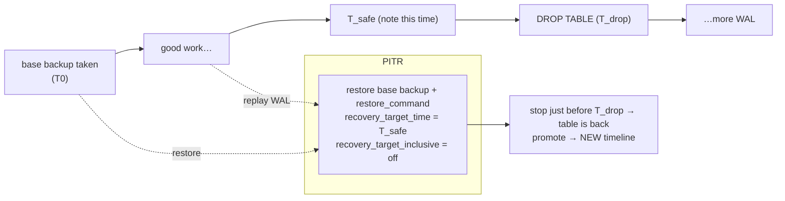
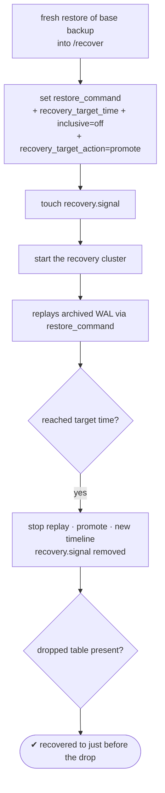

# Lab 21 — Point-in-Time Recovery: Drop a Table "by Accident," Recover to Just Before the Drop

> **Track A · DBA · A3 Backup & Recovery · Lab 6 of 10 (Lab 21/222)**
> Teaching package: concept → diagram → steps → verify → quick-ref → self-test → video script.
> **Depends on:** Lab 19 (base backup) + Lab 20 (WAL archiving) — PITR is the payoff of both.

---

## 0. Lab Card (at a glance)

| Field | Value |
|---|---|
| **Objective** | Perform a full PITR: take a base backup, do damage (`DROP TABLE`), then restore the base backup and **replay archived WAL to a target time just before the drop**, recovering the lost table. |
| **Success criterion** | The recovered cluster contains the dropped table with its data, and recovery stopped at the chosen `recovery_target_time` (not after the drop). |
| **Scope boundary** | Time-based PITR of the whole cluster. Named restore points are Lab 22; recovery is cluster-wide (not one-table selective). |
| **Prereqs** | Labs 19–20 (base backup + working archive); a note of the "safe" timestamp |
| **Time** | 35–50 min |
| **Difficulty** | ★★★★☆ |
| **Risk** | **Medium** — practice on a **separate** recovery cluster/dir; never overwrite your only copy. Capture the pre-incident time. |

---

## 1. Learning Objectives

1. **How PITR works** — restore base backup, then replay WAL forward to a target and stop.
2. **The recovery settings** — `restore_command`, `recovery_target_time`, `recovery_target_inclusive`, `recovery_target_action`.
3. **`recovery.signal`** — the PG12+ mechanism (replaced `recovery.conf`).
4. **Stop *before* the mistake** — inclusive vs exclusive boundary.
5. **Timelines** — why a completed recovery forks a new timeline, and what that protects.

---

## 2. Concept Primer — the "why"

**PITR = base backup + WAL replay to a chosen instant.** You restore a physical base backup (Lab 19), then feed it the archived WAL (Lab 20) and tell it: replay forward, but **stop at time T**. Everything committed up to T is recovered; everything after — including the accidental `DROP TABLE` — is not applied. That's how you undo a mistake without losing the hours of good work that came before it.

**The recovery settings (in `postgresql.conf`/`auto.conf`):**
- **`restore_command`** — the inverse of `archive_command`: how to fetch an archived segment. Typically `cp /archive/%f %p`.
- **`recovery_target_time`** — the timestamp to stop at (e.g. `'2026-09-20 22:59:30+05:30'`).
- **`recovery_target_inclusive`** — `on` (default) stops *after* a transaction at exactly that time; **`off`** stops *before* it. For "just before the drop," you set the target to a moment before the drop, or use `inclusive=off`.
- **`recovery_target_action`** — what to do when the target is reached: `pause` (default — stops and waits so you can inspect), `promote` (finish and open read-write), or `shutdown`.

**`recovery.signal` — the trigger (PG12+).** You create an **empty file** named `recovery.signal` in the data directory. Its presence tells PostgreSQL to enter **archive-recovery mode** on startup and honor the `recovery_target_*` settings. (This replaced the old `recovery.conf` file.) When recovery completes and you promote, PostgreSQL **removes** `recovery.signal` — so it's a one-shot.

**Timelines protect you.** When a recovery finishes at a target and the server is promoted, PostgreSQL starts a **new timeline** (the timeline ID increments, and a `.history` file records the fork). This means the "future" WAL you *didn't* replay isn't overwritten — you could recover to a *different* target from the same base + archive if you got the time wrong. That's why PITR is safe to iterate.

**The golden discipline:** restore into a **separate** directory/cluster, never on top of your production data — and **know the target time** before you start (from your monitoring, the app log, or, in this lab, a timestamp you record before the drop).

---

## 3. Diagrams

### 3.1 The PITR timeline



### 3.2 Recovery control flow



---

## 4. Prerequisites

```bash
# archiving healthy (Lab 20) and a base backup available (Lab 19):
sudo -u postgres psql -c "SELECT failed_count,last_archived_time FROM pg_stat_archiver;"   # failed_count=0
```

---

## 5. Step-by-Step

### Step 1 — Take a fresh base backup (the PITR baseline)

```bash
sudo rm -rf /backup/pitr_base
sudo -u postgres env PGPASSWORD='ReplPass!1' \
  pg_basebackup -h 127.0.0.1 -U repl -D /backup/pitr_base -Fp -X stream -P -c fast -l "pitr-base"
```

### Step 2 — Create data, note the SAFE time, then "accidentally" drop

```bash
sudo -u postgres psql -d benchdb -c "CREATE TABLE important_data AS SELECT g AS id, md5(g::text) AS val FROM generate_series(1,50000) g;"
sudo -u postgres psql -d benchdb -c "SELECT count(*) FROM important_data;"   # 50000

sleep 2
SAFE_TIME=$(sudo -u postgres psql -tAc "SELECT now();"); echo "SAFE_TIME = $SAFE_TIME"    # <-- record this
sleep 5

# the "accident":
sudo -u postgres psql -d benchdb -c "DROP TABLE important_data;"
sudo -u postgres psql -c "SELECT pg_switch_wal();"    # ensure the WAL up to now is archived
sleep 3
```

### Step 3 — Lay down the base backup in a separate recovery dir

```bash
sudo rm -rf /recover && sudo -u postgres cp -a /backup/pitr_base /recover
sudo chown -R postgres:postgres /recover && sudo chmod 0700 /recover
sudo semanage fcontext -a -t postgresql_db_t "/recover(/.*)?" 2>/dev/null || true
sudo restorecon -Rv /recover
rm -f /recover/postmaster.pid 2>/dev/null || true
```

### Step 4 — Configure recovery to stop just before the drop

```bash
sudo -u postgres tee -a /recover/postgresql.conf >/dev/null <<EOF

# --- PITR (Lab 21) ---
port = 5460
restore_command = 'cp /archive/%f %p'
recovery_target_time = '$SAFE_TIME'
recovery_target_inclusive = off        # stop BEFORE this instant
recovery_target_action = 'promote'     # finish and open read-write when target reached
EOF
sudo semanage port -a -t postgresql_port_t -p tcp 5460 2>/dev/null || true

# the trigger that enters archive-recovery mode (PG12+):
sudo -u postgres touch /recover/recovery.signal
```

### Step 5 — Start the recovery cluster and watch it replay

```bash
sudo -u postgres /usr/pgsql-17/bin/pg_ctl -D /recover -l /tmp/recover.log start
sleep 5
grep -Ei "recovery|consistent|target|promot" /tmp/recover.log | tail -15
```

### Step 6 — Verify the table is back and recovery stopped before the drop

```bash
sudo -u postgres psql -p 5460 -d benchdb -c "SELECT count(*) FROM important_data;"   # 50000 — recovered!
sudo -u postgres psql -p 5460 -c "SELECT pg_last_wal_replay_lsn(); SELECT timeline_id FROM pg_control_checkpoint();"
```

### Step 7 — Clean up the practice cluster

```bash
sudo -u postgres /usr/pgsql-17/bin/pg_ctl -D /recover stop
```

---

## 6. Verification Checklist

- [ ] `SAFE_TIME` captured **before** the drop
- [ ] Base backup restored into a **separate** dir (`/recover`), not production
- [ ] `restore_command`, `recovery_target_time`, `inclusive=off`, `recovery_target_action` set
- [ ] `recovery.signal` created
- [ ] Log shows recovery reaching the target and promoting
- [ ] `important_data` present with **50000** rows on the recovered cluster
- [ ] Timeline ID incremented (a new timeline after promotion)

---

## 7. Troubleshooting

| Symptom | Cause | Fix |
|---|---|---|
| Recovery doesn't start / opens normally | `recovery.signal` missing | `touch /recover/recovery.signal` before start |
| `requested recovery stop point is before consistent recovery point` | Target earlier than the base backup's end | Use a base backup taken before the target time |
| Table still missing after recovery | Target time was **after** the drop, or WAL for the window not archived | Set target before the drop; confirm `pg_stat_archiver` archived that segment |
| `could not restore file … from archive` | `restore_command`/path wrong or segment not archived | Fix path; verify the segment exists in `/archive` |
| Recovers past the target | `recovery_target_inclusive=on` with target at the boundary | Set `inclusive=off` or pick an earlier time |
| Recovery pauses and waits | `recovery_target_action='pause'` (default) | `SELECT pg_wal_replay_resume();` or set `action='promote'` |
| SELinux denies reading `/archive` on the recovery cluster | Label/permissions | Ensure `/archive` readable + labeled; run as `postgres` |

---

## 8. Quick Reference Card (paste-ready)

```bash
# 1. base backup (PITR baseline)
sudo -u postgres env PGPASSWORD='ReplPass!1' pg_basebackup -h127.0.0.1 -Urepl -D /backup/pitr_base -Fp -Xstream -P -c fast

# 2. record safe time, then simulate the accident
SAFE_TIME=$(sudo -u postgres psql -tAc "SELECT now();"); echo "$SAFE_TIME"
# ... DROP TABLE happens after SAFE_TIME ...
sudo -u postgres psql -c "SELECT pg_switch_wal();"

# 3. stage base backup in a SEPARATE dir
sudo cp -a /backup/pitr_base /recover && sudo chown -R postgres:postgres /recover && sudo chmod 0700 /recover
sudo restorecon -Rv /recover; rm -f /recover/postmaster.pid

# 4. recovery settings + trigger
sudo -u postgres tee -a /recover/postgresql.conf >/dev/null <<EOF
port = 5460
restore_command = 'cp /archive/%f %p'
recovery_target_time = '$SAFE_TIME'
recovery_target_inclusive = off
recovery_target_action = 'promote'
EOF
sudo -u postgres touch /recover/recovery.signal

# 5. start + verify
sudo -u postgres pg_ctl -D /recover -l /tmp/recover.log start
sudo -u postgres psql -p 5460 -d benchdb -c "SELECT count(*) FROM important_data;"   # recovered

# recovery targets: _time | _xid | _lsn | _name (Lab 22) | 'immediate'
# recovery.signal = PITR/archive recovery (replaced recovery.conf in PG12)
```

---

## 9. Self-Check

1. What two ingredients does PITR combine, and what does each provide?
2. What file triggers archive-recovery mode in PG12+, and what replaced?
3. What does `restore_command` do, and how does it relate to `archive_command`?
4. How do you make recovery stop *before* a bad transaction rather than after?
5. Why should you restore into a separate directory, and why is PITR safe to retry?
6. After a successful PITR + promotion, what changes about the timeline, and why does that matter?

<details>
<summary>Answers</summary>

1. A **base backup** (a consistent starting point) + **archived WAL** (the change history) — replayed forward to a chosen instant.
2. `recovery.signal` (an empty file in the data dir); it replaced `recovery.conf`.
3. `restore_command` fetches an archived WAL segment during recovery — the inverse of `archive_command` (which stored it).
4. Set `recovery_target_time` before the transaction (and/or `recovery_target_inclusive=off` to stop before the boundary instant).
5. To never overwrite your only copy; and because timelines preserve the un-replayed WAL, you can re-run PITR to a different target from the same base + archive.
6. The timeline ID increments (a `.history` fork) so future WAL you didn't replay isn't clobbered — enabling safe re-recovery and avoiding WAL conflicts.
</details>

---

## 10. Video / Teaching Script

| # | On screen | Say (narration) |
|---|---|---|
| 1 | Title: "Undo a disaster: Point-in-Time Recovery" | "Someone drops a table at 11pm. With a base backup and archived WAL, we can rewind to 10:59 — keeping everything before it." |
| 2 | base backup | "Start from a base backup — our known-good foundation." |
| 3 | create table, capture `now()`, drop | "Create important data, note the exact safe time, then — the accident. Drop." |
| 4 | copy to /recover | "Golden rule: recover into a *separate* directory. Never touch your only copy." |
| 5 | recovery settings + recovery.signal | "Now the instructions: how to fetch WAL, the target time, and 'stop before it'. And this empty file — recovery.signal — is what puts PostgreSQL into recovery mode." |
| 6 | start + log | "Start it. Watch the log replay WAL, reach our target, and promote." |
| 7 | `SELECT count(*)` = 50000 | "And there's the table — fifty thousand rows, back from the dead. Recovery stopped just before the drop." |
| 8 | timeline note | "Notice the timeline moved forward. That fork means we could try a *different* target if we'd guessed wrong. PITR is safe to iterate." |
| 9 | Outro | "That's the heart of disaster recovery. Next: named restore points, so you can mark 'stop here' in advance." |

---

## 11. Glossary

- **PITR** — Point-in-Time Recovery: base backup + WAL replay to a target.
- **`restore_command`** — fetch an archived WAL segment during recovery (inverse of `archive_command`).
- **`recovery_target_time` / `_xid` / `_lsn` / `_name`** — where to stop replaying.
- **`recovery_target_inclusive`** — stop after (on) or before (off) the boundary.
- **`recovery_target_action`** — pause / promote / shutdown at target.
- **`recovery.signal`** — empty file that triggers archive recovery (PG12+).
- **Timeline** — a branch of WAL history; increments after a recovery+promote.

---
*NETAPORT lab series · PostgreSQL 17 on AlmaLinux 9 · Lab 21/222 · A3 Backup & Recovery*
