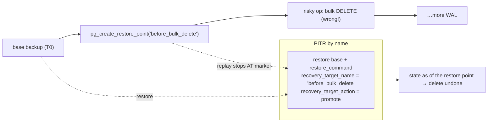
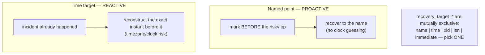

# Lab 22 — Recover to a Named Restore Point (`pg_create_restore_point` + `recovery_target_name`)

> **Track A · DBA · A3 Backup & Recovery · Lab 7 of 10 (Lab 22/222)**
> Teaching package: concept → diagram → steps → verify → quick-ref → self-test → video script.
> **Depends on:** Labs 19–21 (base backup, WAL archiving, PITR mechanics). Same machinery as Lab 21 — the target is a **name**, not a time.

---

## 0. Lab Card (at a glance)

| Field | Value |
|---|---|
| **Objective** | Plant a named restore point **before** a risky operation, perform a destructive change, then recover the cluster to that named marker with `recovery_target_name`. |
| **Success criterion** | The recovered cluster reflects the exact state at the restore point — the destructive change is undone — with no timestamp guessing. |
| **Scope boundary** | Name-based PITR. Time/xid/lsn targets were Lab 21; targets are mutually exclusive. |
| **Prereqs** | Labs 19–21 (base backup + working archive) |
| **Time** | 25–35 min |
| **Difficulty** | ★★★☆☆ |
| **Risk** | Medium — recover into a **separate** dir, as in Lab 21. |

---

## 1. Learning Objectives

1. **Plant a marker** — `pg_create_restore_point('label')` writes a named point into the WAL.
2. **Recover to it** — `recovery_target_name`, and that only one `recovery_target_*` may be set.
3. **Proactive vs reactive** — when a named point beats a timestamp.
4. **Ordering** — why the base backup must precede the restore point.

---

## 2. Concept Primer — the "why"

**A named restore point is a deliberate bookmark in the WAL.** `SELECT pg_create_restore_point('before_migration')` (superuser) writes a special WAL record carrying your label and returns its **LSN**. Later, during recovery, `recovery_target_name = 'before_migration'` tells PostgreSQL to replay forward and **stop exactly at that marker**.

**Named point vs `recovery_target_time` — proactive vs reactive.**
- `recovery_target_time` (Lab 21) is **reactive**: something broke, and you try to reconstruct the exact instant *before* it — error-prone, and vulnerable to clock/timezone confusion.
- A **named restore point** is **proactive**: right before a *known-risky* operation — a schema migration, a bulk delete, a deploy — you drop a labeled marker. If it goes wrong, you recover to that name, no timestamp archaeology. Whenever you're about to do something dangerous **on purpose**, plant a restore point first.

**One target at a time.** The `recovery_target_*` settings — `recovery_target` (`'immediate'`), `recovery_target_name`, `recovery_target_time`, `recovery_target_xid`, `recovery_target_lsn` — are **mutually exclusive**. Setting two is an error. `recovery_target_action` (pause/promote/shutdown) and `recovery.signal` work exactly as in Lab 21.

**Ordering matters.** The restore point must fall **within the WAL that gets replayed** — i.e. *after* the base backup's start and *before* the end of the archive. So the sequence is: **base backup → create restore point → risky operation**. If you create the point *before* the base backup, it's not in the replay range and recovery can't find it (it would run to the end of WAL instead).

**Names aren't required to be unique**, but they should be — recovery stops at the **first** occurrence of a matching name. And if the name doesn't exist in the replayed WAL (typo, or not archived), recovery **silently runs to the end** — so verify the name and that its segment archived.

---

## 3. Diagrams

### 3.1 The named-point timeline



### 3.2 Proactive vs reactive targeting



---

## 4. Prerequisites

```bash
sudo -u postgres psql -c "SELECT failed_count FROM pg_stat_archiver;"    # archiving healthy (0)
```

---

## 5. Step-by-Step

### Step 1 — Base backup FIRST (the PITR baseline)

```bash
sudo rm -rf /backup/rp_base
sudo -u postgres env PGPASSWORD='ReplPass!1' \
  pg_basebackup -h 127.0.0.1 -U repl -D /backup/rp_base -Fp -X stream -P -c fast -l "rp-base"
```

### Step 2 — Seed data, then plant the restore point (before the risk)

```bash
sudo -u postgres psql -d benchdb -c "CREATE TABLE customers AS SELECT g AS id, 'active' AS status FROM generate_series(1,10000) g;"
sudo -u postgres psql -d benchdb -c "SELECT count(*) FROM customers;"    # 10000

# mark the spot BEFORE doing something dangerous:
sudo -u postgres psql -c "SELECT pg_create_restore_point('before_bulk_delete');"   # returns the LSN
```

### Step 3 — Perform the destructive operation

```bash
sudo -u postgres psql -d benchdb -c "DELETE FROM customers WHERE status='active';"   # oops — deletes ALL
sudo -u postgres psql -d benchdb -c "SELECT count(*) FROM customers;"                 # 0
sudo -u postgres psql -c "SELECT pg_switch_wal();"                                    # archive the WAL window
sleep 3
```

### Step 4 — Stage the base backup in a separate recovery dir

```bash
sudo rm -rf /recover_rp && sudo -u postgres cp -a /backup/rp_base /recover_rp
sudo chown -R postgres:postgres /recover_rp && sudo chmod 0700 /recover_rp
sudo semanage fcontext -a -t postgresql_db_t "/recover_rp(/.*)?" 2>/dev/null || true
sudo restorecon -Rv /recover_rp
rm -f /recover_rp/postmaster.pid 2>/dev/null || true
```

### Step 5 — Configure recovery to the named point

```bash
sudo -u postgres tee -a /recover_rp/postgresql.conf >/dev/null <<'EOF'

# --- PITR by name (Lab 22) ---
port = 5461
restore_command = 'cp /archive/%f %p'
recovery_target_name = 'before_bulk_delete'
recovery_target_action = 'promote'
EOF
sudo semanage port -a -t postgresql_port_t -p tcp 5461 2>/dev/null || true
sudo -u postgres touch /recover_rp/recovery.signal
```

### Step 6 — Start recovery and verify

```bash
sudo -u postgres /usr/pgsql-17/bin/pg_ctl -D /recover_rp -l /tmp/recover_rp.log start
sleep 5
grep -Ei "restore point|recovery|consistent|promot" /tmp/recover_rp.log | tail -12
sudo -u postgres psql -p 5461 -d benchdb -c "SELECT count(*) FROM customers;"   # 10000 — delete undone!
```

### Step 7 — Clean up

```bash
sudo -u postgres /usr/pgsql-17/bin/pg_ctl -D /recover_rp stop
```

---

## 6. Verification Checklist

- [ ] Base backup taken **before** the restore point
- [ ] `pg_create_restore_point('before_bulk_delete')` returned an LSN
- [ ] Destructive `DELETE` reduced the table to 0 rows on the source
- [ ] Recovery configured with **only** `recovery_target_name` (no other target)
- [ ] Log shows recovery stopping at the named restore point
- [ ] Recovered cluster shows **10000** rows (delete undone)
- [ ] `recovery.signal` present before start; removed after promote

---

## 7. Troubleshooting

| Symptom | Cause | Fix |
|---|---|---|
| Recovery runs to end of WAL (change not undone) | Name typo, or point not in replayed WAL | Verify exact name; ensure point created after base backup and its segment archived |
| `multiple recovery targets specified` | More than one `recovery_target_*` set | Keep only `recovery_target_name` |
| Restore point "not found" | Created **before** the base backup | Recreate: base backup first, then the restore point |
| Recovery pauses, doesn't open | `recovery_target_action` default is `pause` | Set `promote`, or `SELECT pg_wal_replay_resume();` |
| `could not restore file from archive` | `restore_command`/path wrong or segment missing | Fix path; confirm segment in `/archive` |
| Stops at the wrong marker | Duplicate restore-point names | Use unique names |

---

## 8. Quick Reference Card (paste-ready)

```bash
# 1. base backup FIRST
sudo -u postgres env PGPASSWORD='ReplPass!1' pg_basebackup -h127.0.0.1 -Urepl -D /backup/rp_base -Fp -Xstream -P -c fast

# 2. plant the marker BEFORE the risky op
sudo -u postgres psql -c "SELECT pg_create_restore_point('before_bulk_delete');"
# ... risky operation happens ...
sudo -u postgres psql -c "SELECT pg_switch_wal();"

# 3. stage base backup separately
sudo cp -a /backup/rp_base /recover_rp && sudo chown -R postgres:postgres /recover_rp && sudo chmod 0700 /recover_rp
sudo restorecon -Rv /recover_rp; rm -f /recover_rp/postmaster.pid

# 4. recover to the NAME
sudo -u postgres tee -a /recover_rp/postgresql.conf >/dev/null <<'EOF'
port = 5461
restore_command = 'cp /archive/%f %p'
recovery_target_name = 'before_bulk_delete'
recovery_target_action = 'promote'
EOF
sudo -u postgres touch /recover_rp/recovery.signal
sudo -u postgres pg_ctl -D /recover_rp -l /tmp/rp.log start
sudo -u postgres psql -p 5461 -d benchdb -c "SELECT count(*) FROM customers;"   # undone

# targets are mutually exclusive: name | time | xid | lsn | immediate — set exactly ONE
# workflow: base backup → pg_create_restore_point → risky op → (if bad) recover to name
```

---

## 9. Self-Check

1. What does `pg_create_restore_point` do, and what does it return?
2. When is a named restore point a better target than `recovery_target_time`?
3. Which recovery setting stops at a named point, and can you combine it with a time target?
4. Must the base backup be taken before or after the restore point? Why?
5. Recovery ran to the end of WAL instead of stopping at your name — likely causes?
6. What's the recommended workflow when you're about to do something risky on purpose?

<details>
<summary>Answers</summary>

1. It writes a named marker record into the WAL and returns its **LSN**.
2. When the risky operation is **planned** — you mark the spot beforehand, avoiding timestamp/timezone guesswork afterward.
3. `recovery_target_name`; it **cannot** be combined with any other `recovery_target_*` (they're mutually exclusive).
4. **Before** — the restore point must fall within the WAL that gets replayed (after the base backup's start).
5. Name typo, the restore point wasn't in the archived/replayed WAL, or it was created before the base backup.
6. Take/have a base backup, `pg_create_restore_point('label')` **before** the operation, proceed; if it fails, recover to that name.
</details>

---

## 10. Video / Teaching Script

| # | On screen | Say (narration) |
|---|---|---|
| 1 | Title: "Bookmark your database before you break it" | "Last lab we recovered to a *time* — after an accident. This time we plan ahead: mark a spot *before* a risky change." |
| 2 | base backup | "Same foundation — a base backup." |
| 3 | `pg_create_restore_point` | "Now the new trick: one function drops a named bookmark into the WAL. 'before_bulk_delete'." |
| 4 | destructive DELETE → 0 rows | "Then the risky operation goes wrong — every row gone." |
| 5 | recovery_target_name + recovery.signal | "Recovery is just like PITR, but we target the *name*, not a timestamp. No clock guessing." |
| 6 | start + count = 10000 | "Start, replay to the bookmark, stop — and the table's whole again." |
| 7 | workflow slide | "The habit worth building: before any planned-risky change — a migration, a mass update — plant a restore point. It's a five-second insurance policy." |
| 8 | Outro | "Recovery by name. Next: verifying a backup's integrity before you ever need it." |

---

## 11. Glossary

- **Named restore point** — a labeled marker written into the WAL by `pg_create_restore_point`.
- **`pg_create_restore_point('name')`** — superuser function; returns the marker's LSN.
- **`recovery_target_name`** — stop recovery at a named restore point.
- **Recovery target** — one of name/time/xid/lsn/immediate; **mutually exclusive**.
- **LSN** — Log Sequence Number, a position in the WAL.
- **`recovery.signal` / `recovery_target_action`** — trigger archive recovery / what to do at target (as Lab 21).

---
*NETAPORT lab series · PostgreSQL 17 on AlmaLinux 9 · Lab 22/222 · A3 Backup & Recovery*
