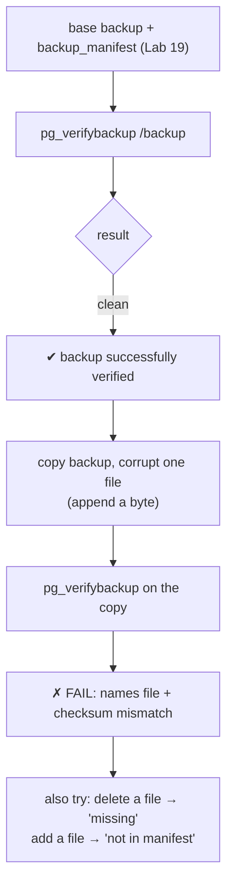
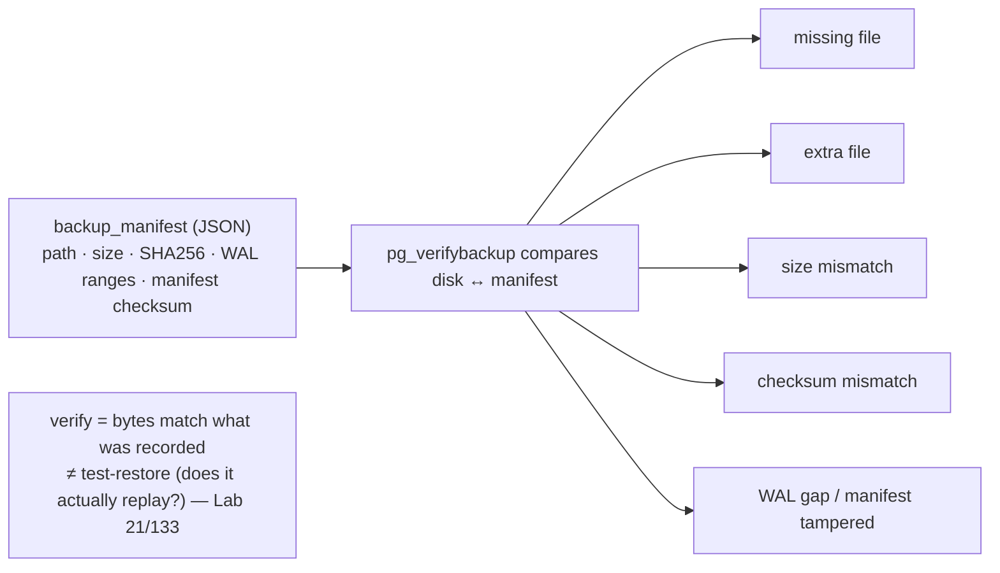

# Lab 23 — Verify a Base Backup with `pg_verifybackup`; Corrupt a File and Watch It Fail

> **Track A · DBA · A3 Backup & Recovery · Lab 8 of 10 (Lab 23/222)**
> Teaching package: concept → diagram → steps → verify → quick-ref → self-test → video script.
> **Depends on:** Lab 19 (base backup + `backup_manifest`). Validates the manifest you've generated since then.

---

## 0. Lab Card (at a glance)

| Field | Value |
|---|---|
| **Objective** | Verify a base backup's integrity against its `backup_manifest`, then deliberately corrupt a file in a throwaway copy and confirm `pg_verifybackup` catches it. |
| **Success criterion** | A clean backup reports "successfully verified"; a corrupted/missing/extra file is flagged by name with a checksum/size/presence error. |
| **Scope boundary** | Integrity verification (files match manifest). Proving the backup actually *restores* is Lab 21/133 — verify ≠ test-restore. |
| **Prereqs** | Lab 19 (a `pg_basebackup` with a manifest) |
| **Time** | 15–25 min |
| **Difficulty** | ★★☆☆☆ |
| **Risk** | Low — corrupt a **copy**, never your only backup. |

---

## 1. Learning Objectives

1. **What the manifest records** — per-file path, size, SHA256 checksum, plus WAL ranges.
2. **What `pg_verifybackup` catches** — missing, extra, wrong-size, wrong-checksum files, WAL gaps, manifest tampering.
3. **verify ≠ test-restore** — two distinct layers of backup assurance.
4. **Useful flags** — skip WAL parsing, ignore expected diffs, checksum-only vs presence-only.

---

## 2. Concept Primer — the "why"

**A backup you haven't verified might be silently broken.** Bit rot, a truncated copy, a storage glitch — none announce themselves. You'd discover the damage at the worst possible moment: mid-restore during a real outage. `pg_verifybackup` (PG13+) lets you catch it **proactively**, right after each backup.

**How it works — the `backup_manifest`.** Every `pg_basebackup` writes a `backup_manifest` (JSON) at the backup root recording, for **every file**: its path, size, and a **checksum** (SHA256 by default), plus the **WAL ranges** the backup needs and a checksum of the manifest itself. `pg_verifybackup` reads that manifest and, against the backup on disk, checks:
- every listed file **exists** and matches its **size** and **checksum**,
- there are no **extra** files not in the manifest,
- the required **WAL** is present and parseable (via `pg_waldump`),
- the **manifest's own checksum** is intact (detects manifest tampering).

Any mismatch is reported **by file name** with the specific problem.

**The crucial distinction: verify ≠ test-restore.**
- `pg_verifybackup` proves the backup's bytes are **exactly what was recorded at backup time** — nothing rotted or got lost in storage/transfer.
- It does **not** prove the backup will **start and replay** successfully. That requires an actual restore (Lab 21) or an automated restore-test (Lab 133).

A mature backup policy does **both**: verify after every backup, and periodically test-restore.

**Handy flags:** `-n`/`--no-parse-wal` (skip WAL checks — needed if the backup was taken with `-X none`), `-i`/`--ignore` (ignore files you *expect* to differ, e.g. a `postgresql.conf` you edited post-backup), `-s`/`--skip-checksums` (presence/size only — faster), `-e`/`--exit-on-error`, `-q`/`--quiet` (report problems only), `-w`/`--wal-directory` (WAL located elsewhere).

**PG17 enhancement:** `pg_verifybackup` can now verify **tar-format** backups too (earlier versions handled only plain/directory).

---

## 3. Diagrams

### 3.1 Verify → corrupt → catch flow



### 3.2 What the manifest lets it check



---

## 4. Prerequisites

```bash
which pg_verifybackup                                   # from postgresql17 client
ls /backup/base_plain/backup_manifest || echo "take a base backup first (Lab 19)"
```

---

## 5. Step-by-Step

### Step 1 — Verify a clean backup

```bash
sudo -u postgres pg_verifybackup /backup/base_plain
#   → backup successfully verified
```
> If it complains about WAL (e.g. backup was `-X none`), add `-n`. If it flags a file you edited post-backup, add `-i <that file>`.

### Step 2 — Make a throwaway copy to damage

```bash
sudo rm -rf /backup/verify_test
sudo -u postgres cp -a /backup/base_plain /backup/verify_test
sudo -u postgres pg_verifybackup /backup/verify_test        # still clean
```

### Step 3 — Corrupt a data file and watch verification fail

```bash
# pick a real data file inside the copy and append a byte (changes size + checksum):
TARGET=$(sudo -u postgres find /backup/verify_test/base -type f | head -1)
echo "CORRUPTION" | sudo tee -a "$TARGET" >/dev/null

sudo -u postgres pg_verifybackup /backup/verify_test
#   → pg_verifybackup: error: "base/…/…" has size <X> on disk but size <Y> in the manifest
#     (and/or checksum mismatch) — verification FAILS, naming the file
```

### Step 4 — Try a missing file and an extra file

```bash
# missing:
sudo -u postgres rm -f "$TARGET"
sudo -u postgres pg_verifybackup /backup/verify_test        # → "…" is present in manifest but not on disk

# extra (not in manifest):
echo "stray" | sudo -u postgres tee /backup/verify_test/base/STRAY_FILE >/dev/null
sudo -u postgres pg_verifybackup /backup/verify_test        # → "STRAY_FILE" is present on disk but not in the manifest
```

### Step 5 — Prove the original is still good, then clean up

```bash
sudo -u postgres pg_verifybackup /backup/base_plain         # → successfully verified (untouched)
sudo rm -rf /backup/verify_test
```

---

## 6. Verification Checklist

- [ ] Clean backup → "backup successfully verified"
- [ ] Corrupted file → checksum/size error naming the file
- [ ] Deleted file → "present in manifest but not on disk"
- [ ] Extra file → "present on disk but not in the manifest"
- [ ] Original backup still verifies (damage was on the copy)
- [ ] You can state the difference between verify and test-restore

---

## 7. Troubleshooting

| Symptom | Cause | Fix |
|---|---|---|
| `error: could not read … backup_manifest` | Backup taken without a manifest (very old) / wrong path | Point at the backup root; retake with modern `pg_basebackup` |
| WAL verification errors | Backup used `-X none` / WAL elsewhere | `-n` to skip, or `-w <wal_dir>` |
| Flags `postgresql.conf`/`auto.conf` you edited | Post-backup edits differ from manifest | `-i <file>` to ignore expected diffs |
| Manifest checksum mismatch | Manifest itself corrupted/edited | The backup is suspect — retake |
| Verify passes but restore fails | verify ≠ test-restore | Also do an actual restore (Lab 21/133) |
| Can't verify a tar backup | Pre-PG17 tool | Use PG17's `pg_verifybackup` (adds tar support) |

---

## 8. Quick Reference Card (paste-ready)

```bash
# verify a backup against its manifest
sudo -u postgres pg_verifybackup /backup/base_plain
#   flags: -n skip WAL | -i FILE ignore expected diffs | -s skip checksums | -e stop on first error | -q quiet

# demo the failure on a COPY
sudo -u postgres cp -a /backup/base_plain /backup/verify_test
T=$(sudo -u postgres find /backup/verify_test/base -type f | head -1)
echo x | sudo tee -a "$T" >/dev/null
sudo -u postgres pg_verifybackup /backup/verify_test        # FAILS, names the file
sudo rm -rf /backup/verify_test

# manifest records: per-file path/size/SHA256 + WAL ranges + manifest checksum
# REMEMBER: verify = files match manifest ≠ test-restore (does it replay?) — do BOTH (Lab 21/133)
# PG17: pg_verifybackup can now verify TAR-format backups too
```

---

## 9. Self-Check

1. What does `pg_verifybackup` compare the backup against, and what's in it?
2. Name four problems it detects.
3. Does a passing verification guarantee the backup will restore? What else must you do?
4. How and when do you skip WAL verification?
5. How do you make it ignore a `postgresql.conf` you edited after the backup?
6. What did PG17 add to `pg_verifybackup`?

<details>
<summary>Answers</summary>

1. The `backup_manifest` — a JSON record of every file's path, size, and SHA256 checksum, plus WAL ranges and a manifest checksum.
2. Any of: missing file, extra file, size mismatch, checksum mismatch, WAL gap, manifest tampering.
3. **No** — verify proves the bytes match what was recorded, not that it replays. Also do a **test-restore** (Lab 21/133).
4. `-n`/`--no-parse-wal`; when the WAL isn't in the backup (e.g. taken with `-X none`) or is elsewhere (`-w`).
5. `-i <file>` (`--ignore`) to skip expected-diff files.
6. Support for verifying **tar-format** backups.
</details>

---

## 10. Video / Teaching Script

| # | On screen | Say (narration) |
|---|---|---|
| 1 | Title: "Is your backup actually intact?" | "A backup sitting on disk can rot silently. You don't want to find out during a real outage. Let's verify it — and prove verification works." |
| 2 | `pg_verifybackup` clean | "Every base backup ships a manifest — every file's size and checksum. One command checks them all. Successfully verified." |
| 3 | copy the backup | "Now let's break one — on a *copy*, never the original." |
| 4 | append a byte + re-verify | "Change a single byte, and… caught. It names the exact file and the mismatch. No guessing." |
| 5 | delete + extra file | "Delete a file? Missing. Add one? Not in the manifest. It notices both." |
| 6 | verify vs restore slide | "One honest limit: this proves the bytes are intact — not that the backup will *start*. That's a separate test-restore. Do both." |
| 7 | Outro | "Verify after every backup, test-restore on a schedule. Next: PostgreSQL 17's incremental backups." |

---

## 11. Glossary

- **`pg_verifybackup`** — checks a base backup against its manifest.
- **`backup_manifest`** — JSON of per-file path/size/checksum + WAL ranges + manifest checksum.
- **Checksum (SHA256/CRC32C)** — per-file integrity value in the manifest.
- **verify vs test-restore** — bytes match manifest vs the backup actually replays.
- **`-n` / `-i` / `-s`** — skip WAL / ignore files / skip checksums.

---
*NETAPORT lab series · PostgreSQL 17 on AlmaLinux 9 · Lab 23/222 · A3 Backup & Recovery*
