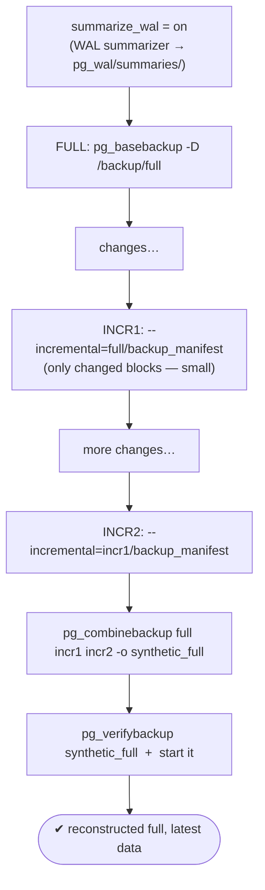
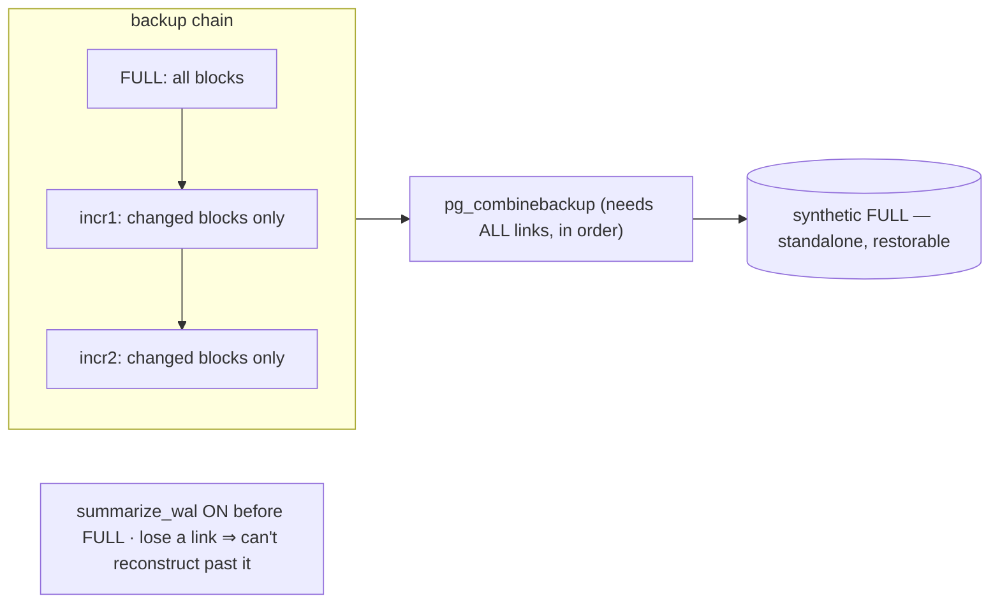

# Lab 24 — Incremental Backup Chain (PG17): `pg_basebackup --incremental` + `pg_combinebackup`

> **Track A · DBA · A3 Backup & Recovery · Lab 9 of 10 (Lab 24/222)**
> Teaching package: concept → diagram → steps → verify → quick-ref → self-test → video script.
> **Depends on:** Labs 19–23 (base backup, archiving, verify). **New in PostgreSQL 17.**

---

## 0. Lab Card (at a glance)

| Field | Value |
|---|---|
| **Objective** | Use PG17's block-level incremental backups: enable WAL summarization, take a full + incremental chain with `pg_basebackup --incremental`, then reconstruct a full backup with `pg_combinebackup` and verify it. |
| **Success criterion** | Incrementals are far smaller than the full; `pg_combinebackup` produces a standalone full that verifies and starts, containing the latest changes. |
| **Scope boundary** | Native PG17 incrementals. pgBackRest (its own incrementals) is Lab 25. |
| **Prereqs** | Labs 19–23; **`summarize_wal = on` before the full backup** |
| **Time** | 30–45 min |
| **Difficulty** | ★★★★☆ |
| **Risk** | Low — new backups into fresh dirs. Chain-dependency: keep every link. |

---

## 1. Learning Objectives

1. **WAL summarization** — the new `summarize_wal` GUC and the summarizer that makes incrementals possible.
2. **Take a chain** — `--incremental=<prior manifest>`, and that the prior can be a full or another incremental.
3. **Reconstruct** — `pg_combinebackup` turns full + increments into a standalone (synthetic) full.
4. **The chain-dependency risk** — every link is required; a missing one breaks reconstruction.
5. **When incrementals win** — large database, low change ratio.

---

## 2. Concept Primer — the "why"

**The problem incrementals solve.** A full base backup of a large, mostly-static database re-copies everything every time — wasteful when only a few percent changed. **PostgreSQL 17 adds native, block-level incremental backups**: an incremental copies only the **8 KB blocks changed since a prior backup**, shrinking size and time dramatically and letting you back up **more often** (better RPO) for less storage/I/O.

**How it knows what changed — WAL summarization.** With the new **`summarize_wal = on`**, a background **WAL summarizer** reads the WAL and writes **summary files** (`pg_wal/summaries/`) recording which relation blocks were modified. A later incremental consults those summaries to copy only the changed blocks.

**The prerequisite that trips people:** `summarize_wal` must be **on *before* the full backup** the increments will reference — and stay on across the range. If summarization wasn't running for that period, there are no summaries and the incremental **fails**. (Retention is governed by `wal_summary_keep_time`, default ~10 days — summaries must still cover the range from the prior backup to the incremental.)

**Taking the chain.**
```
full  = pg_basebackup -D /backup/full                                   # normal full (writes backup_manifest)
incr1 = pg_basebackup -D /backup/incr1 --incremental=/backup/full/backup_manifest
incr2 = pg_basebackup -D /backup/incr2 --incremental=/backup/incr1/backup_manifest
```
`--incremental` points at the **prior backup's `backup_manifest`**. The prior can be the full **or** a previous incremental, forming a chain: **full → incr1 → incr2 → …**. Each incremental is tied to a specific prior by system identifier + LSN — you can't mix backups from different clusters/timelines.

**Reconstructing — `pg_combinebackup`.** An incremental isn't directly restorable on its own; you **combine** the full and the increments (in order) into a complete, standalone data directory:
```
pg_combinebackup /backup/full /backup/incr1 /backup/incr2 -o /backup/synthetic_full
```
The output is a normal base backup you can verify (Lab 23) and start (Lab 19).

**The chain-dependency risk.** Reconstruction needs **every** link from the full up to your target incremental. Lose one and you can't reconstruct past it — same discipline as any incremental/differential scheme: protect the full and the whole chain, and periodically take a fresh full to bound chain length.

**Native vs pgBackRest.** pgBackRest has offered incrementals/differentials for years; PG17 brings block-level incrementals into core `pg_basebackup`. For rich retention/compression/remote features, pgBackRest (Lab 25) still leads — but native incrementals are now built in.

---

## 3. Diagrams

### 3.1 Chain + reconstruct flow



### 3.2 Blocks, chain, synthesis



---

## 4. Prerequisites — enable WAL summarization FIRST

```bash
sudo -u postgres psql -c "ALTER SYSTEM SET summarize_wal = on;"
sudo -u postgres psql -c "SELECT pg_reload_conf();"        # if summarizer doesn't start, restart
sudo -u postgres psql -c "SHOW summarize_wal;"             # on
# generate a little WAL, then confirm summaries appear:
sudo -u postgres psql -d benchdb -c "SELECT pg_switch_wal();"; sleep 3
sudo ls /var/lib/pgsql/17/data/pg_wal/summaries/ | head    # summary files present
```

---

## 5. Step-by-Step

### Step 1 — Take a FULL backup

```bash
sudo rm -rf /backup/full
sudo -u postgres env PGPASSWORD='ReplPass!1' \
  pg_basebackup -h 127.0.0.1 -U repl -D /backup/full -Fp -X stream -P -c fast -l "full"
du -sh /backup/full
```

### Step 2 — Make some changes

```bash
sudo -u postgres psql -d benchdb -c "CREATE TABLE inc_demo AS SELECT g AS id, md5(g::text) AS v FROM generate_series(1,20000) g;"
sudo -u postgres psql -c "SELECT pg_switch_wal();"; sleep 3
```

### Step 3 — Take INCREMENTAL #1 (references the full's manifest)

```bash
sudo rm -rf /backup/incr1
sudo -u postgres env PGPASSWORD='ReplPass!1' \
  pg_basebackup -h 127.0.0.1 -U repl -D /backup/incr1 -Fp -X stream -P \
  --incremental=/backup/full/backup_manifest -l "incr1"
du -sh /backup/incr1        # much smaller than the full
```

### Step 4 — More changes, then INCREMENTAL #2 (references incr1)

```bash
sudo -u postgres psql -d benchdb -c "INSERT INTO inc_demo SELECT g, md5(g::text) FROM generate_series(20001,30000) g;"
sudo -u postgres psql -c "SELECT pg_switch_wal();"; sleep 3

sudo rm -rf /backup/incr2
sudo -u postgres env PGPASSWORD='ReplPass!1' \
  pg_basebackup -h 127.0.0.1 -U repl -D /backup/incr2 -Fp -X stream -P \
  --incremental=/backup/incr1/backup_manifest -l "incr2"
du -sh /backup/full /backup/incr1 /backup/incr2      # compare the savings
```

### Step 5 — Reconstruct a standalone full with `pg_combinebackup`

```bash
sudo rm -rf /backup/synthetic_full
sudo -u postgres /usr/pgsql-17/bin/pg_combinebackup \
  /backup/full /backup/incr1 /backup/incr2 -o /backup/synthetic_full
sudo chown -R postgres:postgres /backup/synthetic_full
```

### Step 6 — Verify and start the reconstructed backup

```bash
sudo -u postgres pg_verifybackup /backup/synthetic_full        # successfully verified

sudo chmod 0700 /backup/synthetic_full
echo "port = 5462" | sudo -u postgres tee -a /backup/synthetic_full/postgresql.conf
sudo semanage port -a -t postgresql_port_t -p tcp 5462 2>/dev/null || true
rm -f /backup/synthetic_full/postmaster.pid 2>/dev/null || true
sudo -u postgres /usr/pgsql-17/bin/pg_ctl -D /backup/synthetic_full -l /tmp/synth.log start
sudo -u postgres psql -p 5462 -d benchdb -c "SELECT count(*) FROM inc_demo;"   # 30000 — latest state
sudo -u postgres /usr/pgsql-17/bin/pg_ctl -D /backup/synthetic_full stop
```

---

## 6. Verification Checklist

- [ ] `summarize_wal = on` **before** the full; summaries exist in `pg_wal/summaries/`
- [ ] Incrementals are **much smaller** than the full (`du -sh`)
- [ ] `incr2` referenced `incr1`'s manifest (a real chain)
- [ ] `pg_combinebackup` produced a standalone full from full + both increments
- [ ] `pg_verifybackup` passes on the synthetic full
- [ ] Reconstructed cluster starts and shows **30000** rows (latest data)

---

## 7. Troubleshooting

| Symptom | Cause | Fix |
|---|---|---|
| Incremental fails: "WAL summaries not available" | `summarize_wal` was off for the range | Enable it **before** the full; retake the full |
| `summaries/` empty | Summarizer not running / no WAL yet | Confirm `summarize_wal=on` (reload/restart); generate WAL |
| `pg_combinebackup` fails: missing input | A chain link absent or out of order | Provide full + all increments, **in order** |
| "manifest system identifier mismatch" | Mixing backups from different clusters/timelines | Use one cluster's own chain |
| Reconstructed won't start | Chain incomplete/misordered | Rebuild with the correct, complete chain |
| Incremental not smaller | High change ratio (most blocks changed) | Expected — incrementals help when little changes |
| Summaries pruned too soon | `wal_summary_keep_time` too short | Increase it, or take incrementals sooner |

---

## 8. Quick Reference Card (paste-ready)

```bash
# 1. enable summarization BEFORE the full
sudo -u postgres psql -c "ALTER SYSTEM SET summarize_wal=on; SELECT pg_reload_conf();"
ls /var/lib/pgsql/17/data/pg_wal/summaries/

# 2. FULL, then INCREMENTALS (each --incremental = prior backup's manifest)
sudo -u postgres env PGPASSWORD='ReplPass!1' pg_basebackup -h127.0.0.1 -Urepl -D /backup/full -Fp -Xstream -P -c fast
# ...changes...
sudo -u postgres env PGPASSWORD='ReplPass!1' pg_basebackup -h127.0.0.1 -Urepl -D /backup/incr1 -Fp -Xstream -P --incremental=/backup/full/backup_manifest
# ...changes...
sudo -u postgres env PGPASSWORD='ReplPass!1' pg_basebackup -h127.0.0.1 -Urepl -D /backup/incr2 -Fp -Xstream -P --incremental=/backup/incr1/backup_manifest
du -sh /backup/full /backup/incr1 /backup/incr2

# 3. RECONSTRUCT (all links, in order) → verify → start
sudo -u postgres pg_combinebackup /backup/full /backup/incr1 /backup/incr2 -o /backup/synthetic_full
sudo -u postgres pg_verifybackup /backup/synthetic_full

# summarize_wal ON before the full · chain = full→incr1→incr2 · lose a link ⇒ can't reconstruct past it
# take a fresh FULL periodically to bound chain length
```

---

## 9. Self-Check

1. What GUC enables incrementals, and when must it be on?
2. What does `--incremental` point to, and what can the prior backup be?
3. Which tool reconstructs a restorable full, and in what order do you feed it?
4. What happens if one incremental in the chain is lost?
5. When do incrementals save the most space?
6. How do you validate a reconstructed backup?

<details>
<summary>Answers</summary>

1. `summarize_wal` — on **before** the full backup the increments reference (and across the range).
2. The **prior backup's `backup_manifest`**; the prior can be the full or a previous incremental (a chain).
3. `pg_combinebackup`, fed the full then each incremental **in order**.
4. You can't reconstruct past the missing link — the whole chain from the full is required.
5. On a **large** database with a **low change ratio** between backups.
6. `pg_verifybackup` on the `pg_combinebackup` output (and optionally start it).
</details>

---

## 10. Video / Teaching Script

| # | On screen | Say (narration) |
|---|---|---|
| 1 | Title: "PostgreSQL 17: incremental backups, built in" | "New in 17: back up only what changed. For a big, slow-changing database, that's a huge saving — and it's now native." |
| 2 | `summarize_wal=on` + summaries dir | "The engine behind it: WAL summarization. Turn it on *before* your full backup — it records which blocks change." |
| 3 | full backup | "A normal full — our baseline." |
| 4 | change, then `--incremental` | "Make changes, then an incremental pointing at the full's manifest. Look at the size — a fraction of the full." |
| 5 | incr2 → incr1 | "And they chain: the next increment references the previous one." |
| 6 | `pg_combinebackup` | "An increment alone won't restore. We combine the full and the chain into a standalone full — synthetic, but complete." |
| 7 | verify + start = 30000 | "Verify it, start it — latest data, all present." |
| 8 | chain-risk slide | "One rule: you need every link. Lose one, and you can't rebuild past it. Take a fresh full now and then to keep chains short." |
| 9 | Outro | "Native incrementals — smaller, faster, more frequent backups. Next: pgBackRest, which wraps all of this into one production tool." |

---

## 11. Glossary

- **Incremental backup** — copies only blocks changed since a prior backup (PG17).
- **`summarize_wal`** — GUC enabling the WAL summarizer.
- **WAL summary files** — `pg_wal/summaries/`; record changed blocks.
- **`--incremental=<manifest>`** — base an incremental on a prior backup's manifest.
- **Backup chain** — full → incr1 → incr2 → …; all links needed to reconstruct.
- **`pg_combinebackup`** — merges full + increments into a standalone full.
- **`wal_summary_keep_time`** — how long summaries are retained.

---
*NETAPORT lab series · PostgreSQL 17 on AlmaLinux 9 · Lab 24/222 · A3 Backup & Recovery*
