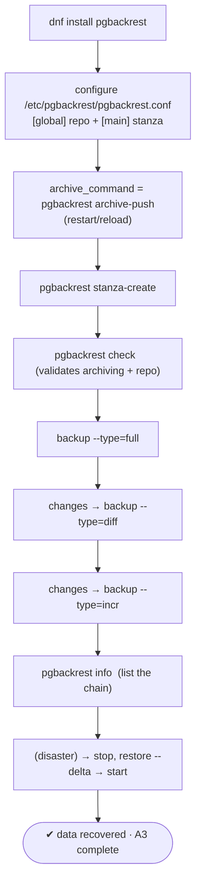
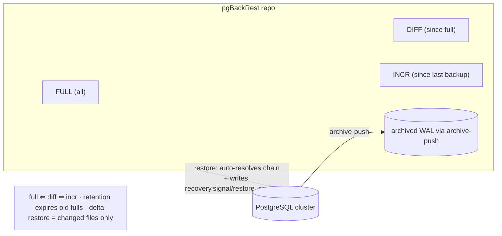

# Lab 25 — Install and Drive pgBackRest: Repo, Full + Differential + Incremental, then Restore

> **Track A · DBA · A3 Backup & Recovery · Lab 10 of 10 (Lab 25/222 · A3 complete)**
> Teaching package: concept → diagram → steps → verify → quick-ref → self-test → video script.
> **Depends on:** Labs 16–24 — pgBackRest packages everything you did by hand (base backup, archiving, incrementals, PITR) into one tool.

---

## 0. Lab Card (at a glance)

| Field | Value |
|---|---|
| **Objective** | Install pgBackRest, configure a repo + stanza, wire atomic WAL archiving, take a full → differential → incremental chain, then restore. |
| **Success criterion** | `pgbackrest check` passes; `info` shows the full/diff/incr backups; a restore rebuilds the cluster and it starts with data intact. |
| **Scope boundary** | pgBackRest end to end on a local repo. S3/immutable/offsite + encryption is Lab 180; automated restore-test is Lab 133. |
| **Prereqs** | Labs 16–24; a repo directory; `wal_level ≥ replica` |
| **Time** | 40–60 min |
| **Difficulty** | ★★★★☆ |
| **Risk** | **Medium** — restore overwrites the data dir. Use `--delta` / a stopped cluster; practice carefully. |

---

## 1. Learning Objectives

1. **Why a real tool** — what pgBackRest gives over hand-rolled `pg_basebackup` + `cp` archiving.
2. **Stanza + repo** — the config model, and atomic `archive-push`.
3. **Full vs differential vs incremental** — what each is relative to, and their restore chains.
4. **Validate before trusting** — `pgbackrest check`, `info`.
5. **Restore** — including the recovery config pgBackRest writes for you.

---

## 2. Concept Primer — the "why"

**Everything A3 taught by hand, industrialized.** You've now done base backups (19), WAL archiving with a fragile `cp` command (20), incrementals (24), and PITR (21–22). pgBackRest wraps all of it into one reliable tool with:
- **Atomic, checksummed, retried WAL archiving** (`archive-push`) — no partial files, no "the cp failed and pg_wal filled up" (Lab 20's hazard).
- **Full / differential / incremental** backups built in, with **automatic chain resolution** on restore.
- **Parallelism** (`process-max`), **compression** (gz/lz4/zst), **encryption** (AES-256).
- **Retention** (auto-expire old backups), **delta restore** (copy only changed files), and PITR (`--type=time/name/lsn`).
- Local **or remote** repos (posix / S3 / Azure / GCS).

**Two core concepts:**
- **Repo** — where backups **and** archived WAL live (`repo1-path`, or an S3 bucket).
- **Stanza** — a named configuration for **one cluster** (e.g. `main`). All commands take `--stanza`.

**Atomic archiving replaces the naive command.** Instead of `archive_command = 'cp %p /archive/%f'`, you set:
```
archive_command = 'pgbackrest --stanza=main archive-push %p'
```
`archive-push` writes to the repo atomically, compresses, checksums, and retries — solving exactly the reliability problems the raw `cp` had.

**The three backup types — what each is relative to:**

| Type | Contains | To restore you need |
|---|---|---|
| **Full** | everything | just the full |
| **Differential** (`--type=diff`) | changes since the **last full** | full + that diff |
| **Incremental** (`--type=incr`) | changes since the **last backup of any type** | full + intervening diff + all increments in the chain |

**diff vs incr trade-off** (same idea as Lab 24, but managed for you): diffs grow over time but restore in two pieces (full + one diff); increments stay small but restore needs the whole chain. pgBackRest **resolves the required chain automatically** — you pick a backup (or "latest") and it pulls what it needs from the repo, and `repo1-retention-full` expires old ones.

**Restore is nearly hands-free.** On restore, pgBackRest lays down the files **and writes the recovery configuration** — `recovery.signal` + a `restore_command` (using `archive-get`) — so the cluster comes up and replays WAL without the manual steps you did in Labs 21–22. For PITR, add `--type=time --target='…'`.

---

## 3. Diagrams

### 3.1 End-to-end flow



### 3.2 Backup types + repo



---

## 4. Prerequisites — install + repo

```bash
sudo dnf install -y pgbackrest
pgbackrest version

# repo dir (pgBackRest runs as postgres)
sudo mkdir -p /var/lib/pgbackrest && sudo chown postgres:postgres /var/lib/pgbackrest && sudo chmod 750 /var/lib/pgbackrest
```

---

## 5. Step-by-Step

### Step 1 — Configure pgBackRest

```bash
sudo tee /etc/pgbackrest/pgbackrest.conf >/dev/null <<'EOF'
[global]
repo1-path=/var/lib/pgbackrest
repo1-retention-full=2
process-max=4
log-level-console=info
start-fast=y
# encryption (optional): repo1-cipher-type=aes-256-cbc + repo1-cipher-pass=... (Lab 180)

[main]
pg1-path=/var/lib/pgsql/17/data
pg1-port=5432
EOF
sudo chown postgres:postgres /etc/pgbackrest/pgbackrest.conf
```

### Step 2 — Point PostgreSQL's archiving at pgBackRest

```bash
sudo -u postgres psql <<'SQL'
ALTER SYSTEM SET archive_mode    = 'on';                                    -- if not already (restart)
ALTER SYSTEM SET archive_command = 'pgbackrest --stanza=main archive-push %p';
SQL
sudo systemctl restart postgresql-17        # archive_mode change needs restart (reload if already on)
```

### Step 3 — Create the stanza and validate

```bash
sudo -u postgres pgbackrest --stanza=main stanza-create
sudo -u postgres pgbackrest --stanza=main check      # pushes a test WAL, confirms archiving + repo
#   → "INFO: check command end: completed successfully"
```

### Step 4 — Full backup

```bash
sudo -u postgres pgbackrest --stanza=main --type=full backup
```

### Step 5 — Change data, then a DIFFERENTIAL backup

```bash
sudo -u postgres psql -d benchdb -c "CREATE TABLE pbr_demo AS SELECT g AS id FROM generate_series(1,10000) g;"
sudo -u postgres pgbackrest --stanza=main --type=diff backup      # changes since the FULL
```

### Step 6 — More changes, then an INCREMENTAL backup

```bash
sudo -u postgres psql -d benchdb -c "INSERT INTO pbr_demo SELECT generate_series(10001,15000);"
sudo -u postgres pgbackrest --stanza=main --type=incr backup      # changes since the last backup
```

### Step 7 — List the chain

```bash
sudo -u postgres pgbackrest --stanza=main info
#   shows full / diff / incr with timestamps, sizes, and the WAL range each covers
```

### Step 8 — Simulate disaster and restore

```bash
sudo -u postgres psql -d benchdb -c "SELECT count(*) FROM pbr_demo;"   # 15000 (pre-disaster)

sudo systemctl stop postgresql-17
# simulate loss: move the data dir aside (safer than rm during a lab)
sudo mv /var/lib/pgsql/17/data /var/lib/pgsql/17/data.lost
sudo mkdir -p /var/lib/pgsql/17/data && sudo chown postgres:postgres /var/lib/pgsql/17/data && sudo chmod 0700 /var/lib/pgsql/17/data

# restore latest (pgBackRest resolves full+diff+incr and writes recovery config):
sudo -u postgres pgbackrest --stanza=main restore
sudo systemctl start postgresql-17
sleep 5
```

### Step 9 — Verify the restore

```bash
sudo -u postgres psql -d benchdb -c "SELECT count(*) FROM pbr_demo;"   # 15000 — recovered
sudo -u postgres psql -c "SELECT pg_is_in_recovery();"                 # f (recovered + promoted)
# cleanup once satisfied:  sudo rm -rf /var/lib/pgsql/17/data.lost
```

> **PITR variant:** `pgbackrest --stanza=main --type=time --target='2026-09-20 23:01:00+05:30' restore` (needs `recovery_target_action` handling; pgBackRest writes the recovery config).

---

## 6. Verification Checklist

- [ ] `pgbackrest version` installed
- [ ] Stanza `main` created; `check` completed successfully
- [ ] `info` lists a **full**, a **diff**, and an **incr** backup
- [ ] Archiving uses `pgbackrest archive-push` (not raw `cp`)
- [ ] Restore rebuilt the data dir; cluster started; `pg_is_in_recovery()` = f
- [ ] Restored data matches pre-disaster (15000 rows)
- [ ] `repo1-retention-full` set (old fulls expire)

---

## 7. Troubleshooting

| Symptom | Cause | Fix |
|---|---|---|
| `stanza-create` fails | `pg1-path`/port wrong, PG down, perms | Fix config; ensure PG running; repo owned by postgres |
| `check` fails | Archiving not working | Confirm `archive_command` set + reloaded; inspect `/var/log/pgbackrest` |
| Backup: "unable to find WAL segment" | Archiving broken since stanza-create | Re-check `archive_command`; run `check` again |
| Restore: data dir not empty | Target must be empty or use delta | Stop PG, clear dir, or `restore --delta` |
| SELinux AVC on repo/archive | Context/booleans | Check `ausearch -m avc`; adjust context |
| `info` shows no backups | Wrong `--stanza` or `repo1-path` | Match the configured stanza/repo |
| Restored cluster won't start | Recovery config removed/edited | Let pgBackRest write `recovery.signal`/`restore_command`; don't delete them |

---

## 8. Quick Reference Card (paste-ready)

```bash
sudo dnf install -y pgbackrest
sudo mkdir -p /var/lib/pgbackrest && sudo chown postgres:postgres /var/lib/pgbackrest && sudo chmod 750 /var/lib/pgbackrest

sudo tee /etc/pgbackrest/pgbackrest.conf >/dev/null <<'EOF'
[global]
repo1-path=/var/lib/pgbackrest
repo1-retention-full=2
process-max=4
start-fast=y
[main]
pg1-path=/var/lib/pgsql/17/data
pg1-port=5432
EOF

sudo -u postgres psql -c "ALTER SYSTEM SET archive_command='pgbackrest --stanza=main archive-push %p'; ALTER SYSTEM SET archive_mode='on';"
sudo systemctl restart postgresql-17

sudo -u postgres pgbackrest --stanza=main stanza-create
sudo -u postgres pgbackrest --stanza=main check
sudo -u postgres pgbackrest --stanza=main --type=full backup
sudo -u postgres pgbackrest --stanza=main --type=diff backup
sudo -u postgres pgbackrest --stanza=main --type=incr backup
sudo -u postgres pgbackrest --stanza=main info

# RESTORE (stop PG first; --delta to restore over existing files):
sudo systemctl stop postgresql-17
sudo -u postgres pgbackrest --stanza=main --delta restore
sudo systemctl start postgresql-17

# types: full | diff (since full) | incr (since last backup)
# PITR:  --type=time --target='YYYY-MM-DD HH:MM:SS+TZ'  (also name/lsn/xid)
# retention: repo1-retention-full=N  |  parallelism: process-max=N  |  archive-push replaces cp
```

---

## 9. Self-Check

1. What does a **stanza** represent in pgBackRest?
2. Full vs differential vs incremental — what is each relative to?
3. Which command validates that archiving and the repo work before you rely on them?
4. What replaces the naive `cp` `archive_command`, and why is it better?
5. To restore an incremental, which backups does pgBackRest need — and who resolves that?
6. What recovery setup does pgBackRest write for you on restore that you did manually in Lab 21?

<details>
<summary>Answers</summary>

1. A named configuration for **one cluster's** backups (all commands take `--stanza`).
2. Full = everything; differential = changes since the last **full**; incremental = changes since the **last backup of any type**.
3. `pgbackrest --stanza=<name> check` (it pushes a test WAL and confirms repo access).
4. `pgbackrest archive-push` — atomic, compressed, checksummed, and retried (fixing the raw `cp` hazards from Lab 20).
5. The full + any intervening diff + all increments in the chain; **pgBackRest resolves the chain automatically**.
6. `recovery.signal` plus a `restore_command` (via `archive-get`) — so the cluster recovers without manual setup.
</details>

---

## 10. Video / Teaching Script

| # | On screen | Say (narration) |
|---|---|---|
| 1 | Title: "pgBackRest: production backups, one tool" | "We've built backups by hand. Now the tool the pros actually run — atomic archiving, full/diff/incremental, and restore that sets itself up." |
| 2 | install + config | "Two ideas: a *repo* where backups and WAL live, and a *stanza* — a named config for this cluster." |
| 3 | `archive-push` archive_command | "This one line fixes Lab 20's fragile cp — archive-push is atomic, compressed, and retried." |
| 4 | `stanza-create` + `check` | "Create the stanza, then — crucially — *check*. It pushes a test WAL and proves archiving works before you trust it." |
| 5 | full / diff / incr | "Three backup types: full is everything, diff is since the full, incremental is since the last backup. Watch the sizes shrink." |
| 6 | `info` | "One command shows the whole chain — types, sizes, WAL ranges." |
| 7 | disaster + restore | "Now the real test: wipe the data directory, restore latest. pgBackRest figures out which backups it needs and writes the recovery config itself." |
| 8 | count = 15000 | "Started, data intact. No manual recovery.signal — it did that for us." |
| 9 | Outro | "That completes Backup and Recovery. You can now back up, verify, and restore a PostgreSQL cluster every way that matters. Next section: replication and high availability." |

---

## 11. Glossary

- **pgBackRest** — production backup/restore tool for PostgreSQL.
- **Repo** — storage for backups + archived WAL (posix / S3 / …).
- **Stanza** — named config for one cluster.
- **`archive-push` / `archive-get`** — atomic WAL archiving / retrieval.
- **Full / differential / incremental** — backup types by what they're relative to.
- **`check` / `info`** — validate archiving+repo / list backups.
- **`--delta` restore** — restore only changed files.
- **`repo1-retention-full`** — how many full backups to keep.

---
*NETAPORT lab series · PostgreSQL 17 on AlmaLinux 9 · Lab 25/222 · **A3 Backup & Recovery complete***
