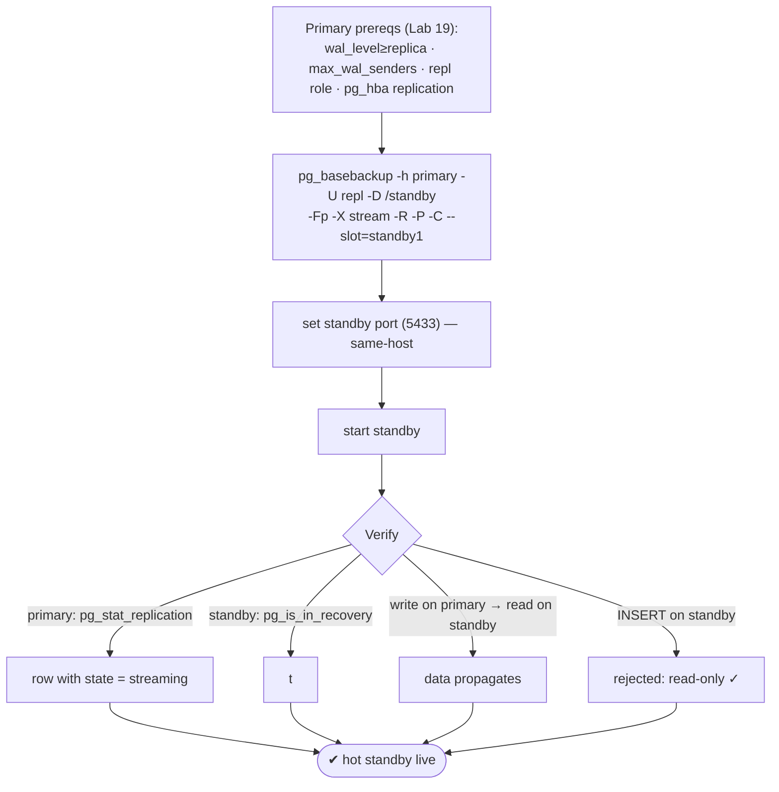
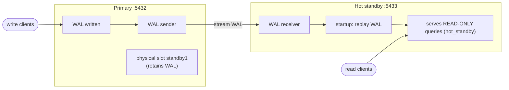

# Lab 26 — Streaming Replication: Build a Hot Standby with `pg_basebackup -R`; Confirm `pg_stat_replication`

> **Track A · DBA · A4 Replication & High Availability · Lab 1 of 11 (Lab 26/222)**
> Teaching package: concept → diagram → steps → verify → quick-ref → self-test → video script.
> **Depends on:** Lab 19 (`pg_basebackup`, replication role, pg_hba replication line). Opens the HA track.

---

## 0. Lab Card (at a glance)

| Field | Value |
|---|---|
| **Objective** | Build a hot standby that streams WAL from the primary in real time using `pg_basebackup -R`, and confirm it in `pg_stat_replication`. |
| **Success criterion** | Standby reports `pg_is_in_recovery()=t`; primary's `pg_stat_replication` shows it `streaming`; data written on the primary appears on the standby; writes on the standby are rejected. |
| **Scope boundary** | One async hot standby. Slots (deep) Lab 27, cascading Lab 28, sync Lab 29, failover Lab 30. |
| **Prereqs** | Lab 19 (repl role + replication pg_hba); a second data dir/port (same host) or a second host |
| **Time** | 30–45 min |
| **Difficulty** | ★★★☆☆ |
| **Risk** | Low — standby is a separate cluster; primary untouched. |

---

## 1. Learning Objectives

1. **What streaming replication is** — the primary streams WAL live; the standby replays it continuously.
2. **`-R` convenience** — it writes the standby's recovery config for you (`standby.signal` + `primary_conninfo`).
3. **Hot standby** — a replica that also serves **read-only** queries.
4. **Confirm and measure** — `pg_stat_replication` (primary), `pg_stat_wal_receiver` (standby), and lag.
5. **Slots** — what `-C --slot` guarantees (and its risk).

---

## 2. Concept Primer — the "why"

**Streaming replication keeps a live copy.** The primary generates WAL; a **WAL sender** process streams it, as it's written, to each connected standby. On the standby, a **WAL receiver** pulls the stream and a **startup process** replays it continuously — so the standby is a near-real-time physical copy of the whole cluster. It underpins **HA** (promote a standby on primary failure) and **read scaling** (offload reads).

**Hot standby = replica + read replica.** With `hot_standby=on` (the default), the standby **accepts read-only queries** while it replays. So one node gives you both a failover target and a place to run reports — but it's strictly read-only: any write returns *"cannot execute … in a read-only transaction."*

**The pieces on each side:**
- **Primary:** `wal_level ≥ replica`, `max_wal_senders ≥ 1`, a **REPLICATION** role, and a `replication` pg_hba line (all from Lab 19). It runs one **WAL sender** per standby.
- **Standby:** built from a base backup of the primary, marked as a standby by a **`standby.signal`** file, told where the primary is via **`primary_conninfo`**, and left in perpetual recovery.

**`-R` does the standby setup for you.** `pg_basebackup -R` writes `standby.signal` **and** `primary_conninfo` into the new data directory's `postgresql.auto.conf` — so the copy is ready to start as a standby immediately, no hand-editing. (Same-host lab detail: the base backup copies the primary's config including its port, so you must change the standby's `port`.)

**Replication slots (`-C --slot`).** A **physical replication slot** on the primary guarantees it **retains the WAL** a standby still needs — even if the standby disconnects — so the standby can always catch up. The trade-off (Lab 27): if a standby stays down, that WAL **accumulates on the primary** and can fill `pg_wal`. `-C --slot=name` creates the slot as part of the backup.

**Confirming it works — the views:**
- **`pg_stat_replication`** (on the **primary**) — one row per connected standby: `application_name`, `client_addr`, `state` (`streaming` = live/caught up), the LSN columns (`sent`/`write`/`flush`/`replay`), lag intervals, and `sync_state` (async here).
- **`pg_stat_wal_receiver`** (on the **standby**) — the receiver's connection + status.
- **Lag**: `pg_stat_replication.replay_lag`, or compare `pg_current_wal_lsn()` (primary) with `pg_last_wal_replay_lsn()` (standby).

---

## 3. Diagrams

### 3.1 Build + verify flow



### 3.2 Replication architecture



---

## 4. Prerequisites — confirm primary is ready

```bash
sudo -u postgres psql -c "SHOW wal_level; SHOW max_wal_senders; SHOW hot_standby;"   # replica ; >=1 ; on
sudo -u postgres psql -c "SELECT rolname FROM pg_roles WHERE rolreplication;"         # repl exists (Lab 19)
sudo -u postgres psql -tAc "SELECT 1 FROM pg_hba_file_rules WHERE database='{replication}' OR 'replication'=ANY(database);" | head -1
```

---

## 5. Step-by-Step

### Step 1 — Build the standby with `-R` (and create a slot)

```bash
sudo rm -rf /pgdata/17/standby && sudo mkdir -p /pgdata/17/standby
sudo chown -R postgres:postgres /pgdata/17/standby && sudo chmod 0700 /pgdata/17/standby
sudo semanage fcontext -a -t postgresql_db_t "/pgdata/17/standby(/.*)?" 2>/dev/null || true
sudo restorecon -Rv /pgdata/17/standby

sudo -u postgres env PGPASSWORD='ReplPass!1' \
  pg_basebackup -h 127.0.0.1 -U repl -D /pgdata/17/standby \
  -Fp -X stream -R -P -C --slot=standby1
```
*`-R` writes `standby.signal` + `primary_conninfo`; `-C --slot=standby1` creates a physical slot on the primary.*

### Step 2 — Adjust the standby's port (same-host) and check the recovery config

```bash
echo "port = 5433" | sudo -u postgres tee -a /pgdata/17/standby/postgresql.conf
ls /pgdata/17/standby/standby.signal                                  # exists → it's a standby
sudo -u postgres grep primary_conninfo /pgdata/17/standby/postgresql.auto.conf
# ensure the conninfo carries the password (add if missing):
sudo -u postgres sed -i "s/primary_conninfo = '/primary_conninfo = 'password=ReplPass!1 /" /pgdata/17/standby/postgresql.auto.conf 2>/dev/null || true
```

### Step 3 — Start the standby

```bash
sudo -u postgres /usr/pgsql-17/bin/pg_ctl -D /pgdata/17/standby -l /tmp/standby.log start
sleep 3
tail -5 /tmp/standby.log     # "started streaming WAL from primary" / "consistent recovery state reached"
```

### Step 4 — Confirm on the PRIMARY: `pg_stat_replication`

```bash
sudo -u postgres psql -x -c "SELECT application_name, client_addr, state, sync_state,
                                    sent_lsn, replay_lsn, replay_lag
                             FROM pg_stat_replication;"
#   → one row, state = streaming, sync_state = async
```

### Step 5 — Confirm on the STANDBY

```bash
sudo -u postgres psql -p 5433 -c "SELECT pg_is_in_recovery();"                       # t
sudo -u postgres psql -p 5433 -x -c "SELECT status, sender_host, received_lsn FROM pg_stat_wal_receiver;"
```

### Step 6 — Prove replication + read-only

```bash
# write on primary:
sudo -u postgres psql -d benchdb -c "CREATE TABLE repl_test AS SELECT generate_series(1,1000) AS n;"
sleep 1
# read on standby:
sudo -u postgres psql -p 5433 -d benchdb -c "SELECT count(*) FROM repl_test;"        # 1000 — replicated!
# writes rejected on standby:
sudo -u postgres psql -p 5433 -d benchdb -c "INSERT INTO repl_test VALUES (9999);"
#   → ERROR: cannot execute INSERT in a read-only transaction
```

### Step 7 — Check lag

```bash
sudo -u postgres psql -c "SELECT pg_current_wal_lsn();"                               # primary position
sudo -u postgres psql -p 5433 -c "SELECT pg_last_wal_replay_lsn();"                   # standby position (≈ equal)
```

---

## 6. Verification Checklist

- [ ] `standby.signal` present; `primary_conninfo` set in the standby
- [ ] Standby: `pg_is_in_recovery()` = **t**
- [ ] Primary: `pg_stat_replication` shows the standby with `state=streaming`
- [ ] Standby: `pg_stat_wal_receiver.status` = streaming
- [ ] Data written on primary appears on standby
- [ ] Write on standby is **rejected** (read-only)
- [ ] Replication slot `standby1` exists on the primary; lag ≈ 0

---

## 7. Troubleshooting

| Symptom | Cause | Fix |
|---|---|---|
| `no pg_hba.conf entry for replication connection` | Missing replication pg_hba line | Add `host replication repl …`; reload (Lab 19) |
| Standby can't authenticate | Password not in `primary_conninfo`/`.pgpass` | Add `password=…` to conninfo or use `.pgpass` |
| `pg_stat_replication` empty | Standby not connected | Check standby log, `primary_conninfo`, network/port |
| Same-host: standby won't start / port clash | Copied primary's port 5432 | Set `port=5433` in standby config |
| Standby write attempts fail | It's read-only | Expected — writes go to the primary |
| Lag grows steadily | Apply can't keep up / network | Monitor `replay_lag`; check I/O, network, `hot_standby_feedback` (Lab 211) |
| `pg_wal` growing on primary | Standby down + slot retaining WAL | Bring standby up or drop the slot (Lab 27) |

---

## 8. Quick Reference Card (paste-ready)

```bash
# build standby (writes recovery config + creates slot)
sudo mkdir -p /pgdata/17/standby && sudo chown -R postgres:postgres /pgdata/17/standby && sudo chmod 0700 /pgdata/17/standby
sudo restorecon -Rv /pgdata/17/standby
sudo -u postgres env PGPASSWORD='ReplPass!1' pg_basebackup -h 127.0.0.1 -U repl \
  -D /pgdata/17/standby -Fp -X stream -R -P -C --slot=standby1
echo "port = 5433" | sudo -u postgres tee -a /pgdata/17/standby/postgresql.conf
sudo -u postgres pg_ctl -D /pgdata/17/standby -l /tmp/standby.log start

# verify on PRIMARY
sudo -u postgres psql -x -c "SELECT application_name,state,sync_state,replay_lag FROM pg_stat_replication;"
# verify on STANDBY
sudo -u postgres psql -p 5433 -c "SELECT pg_is_in_recovery();"
sudo -u postgres psql -p 5433 -x -c "SELECT status,sender_host FROM pg_stat_wal_receiver;"

# prove: write on primary → read on standby ; INSERT on standby → read-only error
# lag: primary pg_current_wal_lsn()  vs  standby pg_last_wal_replay_lsn()
# -R = standby.signal + primary_conninfo | state=streaming = live | slot retains WAL (risk: fills pg_wal if standby down)
```

---

## 9. Self-Check

1. What does `pg_basebackup -R` write into the standby?
2. Which view on the primary shows connected standbys, and which `state` means live?
3. How do you confirm a node is a standby?
4. What is a "hot" standby, and what happens if you write to it?
5. What does a physical replication slot guarantee, and what's its risk?
6. Give two ways to measure replication lag.

<details>
<summary>Answers</summary>

1. `standby.signal` (marks it a standby) and `primary_conninfo` (how to reach the primary) in `postgresql.auto.conf`.
2. `pg_stat_replication`; `state = streaming` means caught up and live.
3. `SELECT pg_is_in_recovery();` returns **t** on a standby.
4. A standby that serves read-only queries while replaying; writes fail with "cannot execute … in a read-only transaction."
5. It makes the primary retain WAL the standby needs even while it's disconnected; the risk is `pg_wal` filling if the standby stays down.
6. `pg_stat_replication.replay_lag`, or compare `pg_current_wal_lsn()` (primary) with `pg_last_wal_replay_lsn()` (standby).
</details>

---

## 10. Video / Teaching Script

| # | On screen | Say (narration) |
|---|---|---|
| 1 | Title: "A live copy of your database: streaming replication" | "The primary streams its changes to a standby in real time. That standby is your failover target — and a read replica." |
| 2 | primary prereqs | "The primary needs a replication role, the right WAL level, and a pg_hba line — all from the base-backup lab." |
| 3 | `pg_basebackup … -R -C --slot` | "One command builds the standby. The -R flag is the magic: it writes the recovery config so the copy is ready to be a replica." |
| 4 | set port + start | "On the same host we just change the port, then start it." |
| 5 | `pg_stat_replication` = streaming | "Here's the confirmation, on the primary: our standby, streaming. Live." |
| 6 | write primary → read standby | "Write on the primary… and it's already on the standby. Milliseconds." |
| 7 | INSERT on standby fails | "Try to write on the standby? Read-only. It's a copy, not a second master." |
| 8 | Outro | "One live standby, confirmed. Next: replication slots — how the primary guarantees the standby never falls off the edge." |

---

## 11. Glossary

- **Streaming replication** — primary streams WAL live to standbys.
- **Primary / standby** — the writable source / the replaying copy.
- **Hot standby** — a standby that also serves read-only queries.
- **WAL sender / receiver** — primary-side / standby-side streaming processes.
- **`standby.signal` / `primary_conninfo`** — marks a standby / how it reaches the primary.
- **`pg_stat_replication` / `pg_stat_wal_receiver`** — primary-side / standby-side status views.
- **Replication slot** — guarantees WAL retention for a standby.
- **`pg_is_in_recovery()`** — true on a standby.

---
*NETAPORT lab series · PostgreSQL 17 on AlmaLinux 9 · Lab 26/222 · A4 Replication & High Availability*
