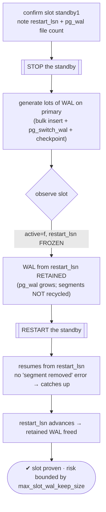
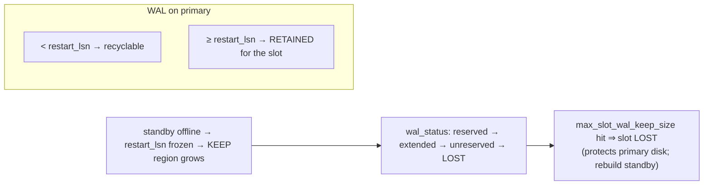

# Lab 27 — Add a Replication Slot; Prove WAL Is Retained When the Standby Is Offline

> **Track A · DBA · A4 Replication & High Availability · Lab 2 of 11 (Lab 27/222)**
> Teaching package: concept → diagram → steps → verify → quick-ref → self-test → video script.
> **Depends on:** Lab 26 (a running primary + hot standby, and the `standby1` slot).

---

## 0. Lab Card (at a glance)

| Field | Value |
|---|---|
| **Objective** | Show a physical replication slot retaining WAL for an **offline** standby (so it can catch up on return), and bound the risk with `max_slot_wal_keep_size`. |
| **Success criterion** | With the standby stopped, the slot's `restart_lsn` freezes and required WAL is **kept** in `pg_wal`; when the standby returns it resumes with no "segment removed" error. |
| **Scope boundary** | Physical slots + the retention/disk trade-off. Logical slots are Lab 33+. |
| **Prereqs** | Lab 26 (primary + standby + slot `standby1`) |
| **Time** | 25–40 min |
| **Difficulty** | ★★★☆☆ |
| **Risk** | **Medium** — an unbounded slot + offline standby can fill `pg_wal`. Set `max_slot_wal_keep_size` and watch disk. |

---

## 1. Learning Objectives

1. **What a slot guarantees** — the primary keeps WAL a consumer hasn't confirmed (`restart_lsn`).
2. **Prove it** — offline standby → `restart_lsn` frozen → WAL retained → clean catch-up on return.
3. **The without-slot failure** — "requested WAL segment already removed" → rebuild.
4. **The risk and the cap** — `max_slot_wal_keep_size`, `wal_status`, `safe_wal_size`.
5. **Monitor slots** — the columns that warn before disk fills.

---

## 2. Concept Primer — the "why"

**The problem slots solve.** Without a slot, the primary recycles WAL once checkpoints pass and `wal_keep_size` is exceeded — it has no idea a particular standby still needs old segments. If a standby is offline **longer than the retained WAL**, it can never catch up: on reconnect it gets *"requested WAL segment … has already been removed,"* and you must **rebuild** it from a fresh base backup.

**What a slot does.** A **physical replication slot** is a durable marker on the primary recording each consumer's WAL position via **`restart_lsn`** — the **oldest** WAL the slot still needs. The primary will **not recycle WAL at or after `restart_lsn`**. So:
- While the standby streams, it confirms progress, `restart_lsn` advances, and old WAL is freed.
- When the standby goes **offline**, `restart_lsn` **freezes** — the primary **retains** every segment from there on. On return, the standby resumes exactly where it left off. No rebuild.

**The double edge (the Lab 26 warning, now front and center).** That guarantee has teeth: a standby that stays down means WAL **accumulates indefinitely** on the primary — `pg_wal` grows and can **fill the disk and halt the primary**. A slot protecting a dead standby is a slow-motion outage.

**The safety valve: `max_slot_wal_keep_size`** (PG13+). It caps how much WAL a slot may force the primary to retain. If a slot's required WAL would exceed this, PostgreSQL **invalidates the slot** (`wal_status = 'lost'`) instead of letting the disk fill. The trade-off is deliberate: **lose the slot (rebuild that standby) rather than crash the primary.** Default is `-1` (unlimited — dangerous); set a real bound (e.g. `10GB`) in production.

**Reading slot health (`pg_replication_slots`):**
- `active` / `active_pid` — is a consumer connected?
- `restart_lsn` — the retention boundary.
- `wal_status` — `reserved` (fine) → `extended` (retained beyond `max_wal_size`) → `unreserved` (nearing the cap) → **`lost`** (required WAL gone; slot dead).
- `safe_wal_size` — bytes of WAL that can still be written before this slot risks losing required WAL (low/negative = danger).

---

## 3. Diagrams

### 3.1 Retention demonstration flow



### 3.2 The retention boundary + status ladder



---

## 4. Prerequisites

```bash
# from Lab 26: primary + standby + slot standby1
sudo -u postgres psql -x -c "SELECT slot_name, slot_type, active, restart_lsn, wal_status, safe_wal_size
                             FROM pg_replication_slots;"
# set a SAFETY cap so a stuck standby can't fill the disk (choose to fit your VM):
sudo -u postgres psql -c "ALTER SYSTEM SET max_slot_wal_keep_size = '2GB'; SELECT pg_reload_conf();"
```

---

## 5. Step-by-Step

### Step 1 — Baseline: slot position and WAL file count

```bash
sudo -u postgres psql -c "SELECT slot_name, active, restart_lsn, wal_status FROM pg_replication_slots WHERE slot_name='standby1';"
BEFORE=$(sudo ls /var/lib/pgsql/17/data/pg_wal/ | grep -E '^[0-9A-F]{24}$' | wc -l); echo "WAL segments before: $BEFORE"
```

### Step 2 — Take the standby OFFLINE

```bash
sudo -u postgres /usr/pgsql-17/bin/pg_ctl -D /pgdata/17/standby stop
sudo -u postgres psql -c "SELECT slot_name, active FROM pg_replication_slots WHERE slot_name='standby1';"   # active = f
```

### Step 3 — Generate WAL on the primary (that a no-slot primary would recycle)

```bash
sudo -u postgres psql -d benchdb -c "CREATE TABLE slot_churn AS SELECT g, md5(g::text) FROM generate_series(1,500000) g;"
for i in 1 2 3 4 5; do sudo -u postgres psql -c "SELECT pg_switch_wal();" >/dev/null; done
sudo -u postgres psql -c "CHECKPOINT;"
```

### Step 4 — Observe: restart_lsn frozen, WAL retained

```bash
sudo -u postgres psql -x -c "SELECT slot_name, active, restart_lsn, wal_status, safe_wal_size
                             FROM pg_replication_slots WHERE slot_name='standby1';"
#   restart_lsn UNCHANGED from Step 1 (frozen), wal_status reserved/extended — WAL is being KEPT for the standby
AFTER=$(sudo ls /var/lib/pgsql/17/data/pg_wal/ | grep -E '^[0-9A-F]{24}$' | wc -l); echo "WAL segments after: $AFTER (grew because the slot retains them)"
```

### Step 5 — Bring the standby back; it resumes cleanly

```bash
sudo -u postgres /usr/pgsql-17/bin/pg_ctl -D /pgdata/17/standby -l /tmp/standby.log start
sleep 5
tail -5 /tmp/standby.log                        # resumes streaming — NO "segment removed" error
sudo -u postgres psql -c "SELECT slot_name, active, restart_lsn FROM pg_replication_slots WHERE slot_name='standby1';"   # active=t, restart_lsn advances
sudo -u postgres psql -p 5433 -d benchdb -c "SELECT count(*) FROM slot_churn;"   # 500000 — caught up
```

### Step 6 — Confirm retained WAL is freed after catch-up

```bash
sudo -u postgres psql -c "CHECKPOINT;"; sleep 2
FREED=$(sudo ls /var/lib/pgsql/17/data/pg_wal/ | grep -E '^[0-9A-F]{24}$' | wc -l); echo "WAL segments now: $FREED (shrinks as slot advances)"
```

> **Contrast (concept):** with **no slot**, Steps 3–5 would end with the standby failing to resume — *"requested WAL segment … already removed"* — forcing a full rebuild. That's exactly what the slot prevents.

---

## 6. Verification Checklist

- [ ] Slot `standby1` exists (`slot_type=physical`)
- [ ] Standby offline → slot `active=f`, `restart_lsn` frozen
- [ ] `pg_wal` segment count **grew** while the standby was down (retention)
- [ ] Standby restarts and resumes with **no** "segment removed" error
- [ ] Standby caught up (500000 rows); `restart_lsn` advanced; WAL freed
- [ ] `max_slot_wal_keep_size` set as a disk-safety bound
- [ ] You can read `wal_status` and know what `lost` means

---

## 7. Troubleshooting

| Symptom | Cause | Fix |
|---|---|---|
| `pg_wal` filling, disk pressure | Standby down + slot retaining WAL | Bring standby up; set/lower `max_slot_wal_keep_size`; or drop the slot |
| Standby resume fails: "WAL segment already removed" | No slot, or slot invalidated (`wal_status=lost`) | Rebuild the standby; recreate the slot |
| `wal_status = lost` | Retention exceeded `max_slot_wal_keep_size` | Slot is dead; recreate + rebuild standby |
| Can't drop a slot: "in use" | Standby still connected | Stop the standby first, then `pg_drop_replication_slot` |
| `restart_lsn` not advancing while standby up | Standby stuck/lagging, not confirming | Investigate replication lag/apply |
| `safe_wal_size` low/negative | Approaching the retention cap | Reduce standby downtime; raise cap if disk allows |

---

## 8. Quick Reference Card (paste-ready)

```bash
# inspect slots + set a disk-safety cap
sudo -u postgres psql -x -c "SELECT slot_name,active,restart_lsn,wal_status,safe_wal_size FROM pg_replication_slots;"
sudo -u postgres psql -c "ALTER SYSTEM SET max_slot_wal_keep_size='2GB'; SELECT pg_reload_conf();"

# create a physical slot manually (if needed)
sudo -u postgres psql -c "SELECT pg_create_physical_replication_slot('standby1');"

# PROVE retention: stop standby → churn WAL → observe restart_lsn frozen + segments kept
sudo -u postgres pg_ctl -D /pgdata/17/standby stop
sudo -u postgres psql -d benchdb -c "CREATE TABLE slot_churn AS SELECT g FROM generate_series(1,500000) g;"
sudo -u postgres psql -c "SELECT pg_switch_wal();"; sudo -u postgres psql -c "CHECKPOINT;"
sudo -u postgres psql -c "SELECT active,restart_lsn,wal_status FROM pg_replication_slots WHERE slot_name='standby1';"
sudo -u postgres pg_ctl -D /pgdata/17/standby -l /tmp/standby.log start    # resumes cleanly

# drop a slot (standby must be disconnected)
sudo -u postgres psql -c "SELECT pg_drop_replication_slot('standby1');"

# restart_lsn = retention boundary | wal_status: reserved→extended→unreserved→LOST
# risk: dead standby fills pg_wal → set max_slot_wal_keep_size (invalidate slot, save the primary)
```

---

## 9. Self-Check

1. What does a replication slot guarantee, and via which column?
2. What happens to `restart_lsn` when the standby goes offline, and to the WAL?
3. Without a slot, what breaks when a standby is offline too long?
4. What is the slot's risk, and which parameter bounds it?
5. What does `wal_status = 'lost'` mean, and what must you then do?
6. How do you drop a slot, and what's the precondition?

<details>
<summary>Answers</summary>

1. The primary retains WAL the consumer still needs; `restart_lsn` is the oldest LSN it keeps.
2. `restart_lsn` **freezes**; the primary **retains** all WAL from there so the standby can resume.
3. On reconnect the standby fails with "requested WAL segment already removed" and must be rebuilt.
4. WAL accumulates and can fill `pg_wal`/disk; `max_slot_wal_keep_size` caps retention (invalidating the slot instead).
5. Required WAL was removed (cap exceeded); the slot is dead — recreate it and rebuild the standby.
6. `SELECT pg_drop_replication_slot('name');` — the slot must be inactive (standby disconnected).
</details>

---

## 10. Video / Teaching Script

| # | On screen | Say (narration) |
|---|---|---|
| 1 | Title: "Replication slots: never lose a standby again" | "Without a slot, a standby that's offline too long is dead — you rebuild it. A slot fixes that. But it comes with a sharp edge." |
| 2 | `pg_replication_slots` baseline | "Here's our slot. This restart_lsn is the line: the primary keeps every WAL segment from here on." |
| 3 | stop standby | "Take the standby down — like a maintenance window or a crash." |
| 4 | churn WAL + observe | "Now generate a mountain of WAL. Without a slot, it'd be recycled and gone. With the slot? restart_lsn is frozen, and those segments are *kept*." |
| 5 | restart standby → catches up | "Bring it back — and it resumes cleanly, no 'segment removed' error. It catches up and the retained WAL is freed." |
| 6 | the risk + `max_slot_wal_keep_size` | "The catch: a standby that *never* comes back keeps that WAL forever — filling your disk. So we cap it. Better to lose the slot and rebuild than crash the primary." |
| 7 | Outro | "Slots make standbys resilient — as long as you bound them. Next: cascading replication, a standby of a standby." |

---

## 11. Glossary

- **Replication slot** — durable marker of a consumer's WAL position on the primary.
- **`restart_lsn`** — the oldest WAL the slot requires (retention boundary).
- **`pg_replication_slots`** — view of slot state (`active`, `restart_lsn`, `wal_status`, `safe_wal_size`).
- **`wal_status`** — reserved / extended / unreserved / **lost**.
- **`max_slot_wal_keep_size`** — cap on WAL a slot may retain (invalidates the slot past it).
- **`pg_create_physical_replication_slot` / `pg_drop_replication_slot`** — create / remove a slot.
- **Slot invalidation** — required WAL removed; slot unusable; standby must be rebuilt.

---
*NETAPORT lab series · PostgreSQL 17 on AlmaLinux 9 · Lab 27/222 · A4 Replication & High Availability*
