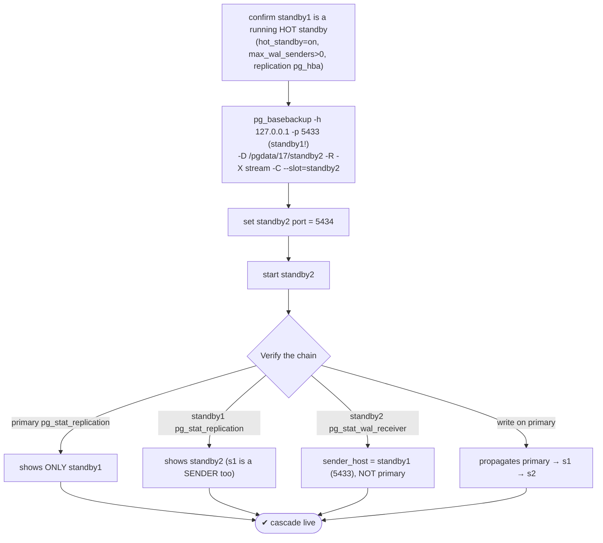
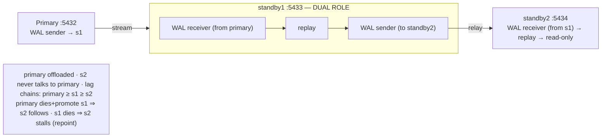

# Lab 28 — Cascading Replication: Standby-of-a-Standby

> **Track A · DBA · A4 Replication & High Availability · Lab 3 of 11 (Lab 28/222)**
> Teaching package: concept → diagram → steps → verify → quick-ref → self-test → video script.
> **Depends on:** Labs 26–27 (a running primary + hot standby `standby1`, plus slots).

---

## 0. Lab Card (at a glance)

| Field | Value |
|---|---|
| **Objective** | Build a cascaded standby (`standby2`) that streams from an **intermediate standby** (`standby1`) rather than the primary, forming primary → s1 → s2. |
| **Success criterion** | The primary sees only `standby1`; `standby1` acts as a sender to `standby2`; `standby2` receives from `standby1`; writes on the primary propagate down the whole chain. |
| **Scope boundary** | Cascading topology + its dual-role standby. Synchronous replication is Lab 29; failover is Lab 30. |
| **Prereqs** | Labs 26–27 (primary 5432 + hot standby 5433) |
| **Time** | 30–45 min |
| **Difficulty** | ★★★☆☆ |
| **Risk** | Low — new cascaded cluster; upstream nodes untouched. |

---

## 1. Learning Objectives

1. **Why cascade** — offload WAL-sending from the primary and reduce cross-site streams.
2. **The intermediate standby's dual role** — WAL receiver *and* WAL sender.
3. **Build against the standby** — `pg_basebackup` from `standby1`, `primary_conninfo` pointing at it.
4. **Confirm the chain** — who sees whom in `pg_stat_replication`/`pg_stat_wal_receiver`.
5. **Failure behavior** — resilience when the primary dies vs dependency when the intermediate dies.

---

## 2. Concept Primer — the "why"

**Cascading = a standby that also feeds standbys.** Normally every standby connects straight to the primary, so N replicas mean N WAL senders and N streams off the primary. **Cascading** lets a standby **relay** WAL onward: the primary streams to one (or a few) **intermediate** standbys, and those relay to further **downstream** standbys — a chain: **primary → standby1 → standby2**. Benefits:
- **Offload the primary** — it sends to fewer nodes; the relaying is done by standbys.
- **Cross-site efficiency** — one stream crosses to a remote site, where a local standby fans out to several more (one WAN stream instead of many).

**The intermediate standby has two jobs at once.** `standby1` is a **WAL receiver** (pulling from the primary) *and* a **WAL sender** (pushing to `standby2`). It's still a read-only hot standby itself. To relay, it just needs `hot_standby=on`, spare `max_wal_senders`, and a `replication` pg_hba entry for the downstream — all of which it inherited when it was cloned from the primary.

**Build the cascade against the *standby*.** The crucial difference from Lab 26: you run `pg_basebackup` against **`standby1`** (port 5433), not the primary. `-R` then writes `standby2`'s `primary_conninfo` pointing at **`standby1`** — the cascaded standby never talks to the primary at all, only to its immediate upstream. A slot (`-C --slot`) is created **on `standby1`** to retain WAL for `standby2` (same slot mechanics and risk as Lab 27, now one hop down).

**Lag is chained.** `standby2` can only be as current as `standby1`, which can only be as current as the primary — so the chain adds a little latency: `primary ≥ s1_replay ≥ s2_replay`.

**Failure behavior — a real advantage and a real dependency:**
- **Primary fails, `standby1` is promoted:** `standby2` keeps streaming from `standby1` **seamlessly** — it was already downstream of it. The cascade survives a primary loss gracefully for the tail of the chain.
- **Intermediate `standby1` fails:** `standby2` **stalls** — it has no other source until `standby1` returns or you **repoint** `standby2` (change its `primary_conninfo`) to the primary or another node. That's the cost of the chain.

---

## 3. Diagrams

### 3.1 Build + verify flow



### 3.2 Topology + dual role



---

## 4. Prerequisites — confirm standby1 can relay

```bash
sudo -u postgres psql -p 5433 -c "SELECT pg_is_in_recovery();"                # t (it's a standby)
sudo -u postgres psql -p 5433 -c "SHOW hot_standby; SHOW max_wal_senders;"    # on ; >=1
# replication pg_hba on standby1 (inherited from primary) should already allow repl from 127.0.0.1
```

---

## 5. Step-by-Step

### Step 1 — Build standby2 from standby1 (the intermediate)

```bash
sudo rm -rf /pgdata/17/standby2 && sudo mkdir -p /pgdata/17/standby2
sudo chown -R postgres:postgres /pgdata/17/standby2 && sudo chmod 0700 /pgdata/17/standby2
sudo semanage fcontext -a -t postgresql_db_t "/pgdata/17/standby2(/.*)?" 2>/dev/null || true
sudo restorecon -Rv /pgdata/17/standby2

sudo -u postgres env PGPASSWORD='ReplPass!1' \
  pg_basebackup -h 127.0.0.1 -p 5433 -U repl -D /pgdata/17/standby2 \
  -Fp -X stream -R -P -C --slot=standby2
```
*Note `-p 5433` — the source is **standby1**, not the primary. The slot `standby2` is created **on standby1**.*

### Step 2 — Set standby2's port and confirm its upstream

```bash
echo "port = 5434" | sudo -u postgres tee -a /pgdata/17/standby2/postgresql.conf
sudo -u postgres grep primary_conninfo /pgdata/17/standby2/postgresql.auto.conf   # → host=127.0.0.1 port=5433 (standby1)
sudo -u postgres sed -i "s/primary_conninfo = '/primary_conninfo = 'password=ReplPass!1 /" /pgdata/17/standby2/postgresql.auto.conf 2>/dev/null || true
sudo semanage port -a -t postgresql_port_t -p tcp 5434 2>/dev/null || true
```

### Step 3 — Start standby2

```bash
sudo -u postgres /usr/pgsql-17/bin/pg_ctl -D /pgdata/17/standby2 -l /tmp/standby2.log start
sleep 4
tail -5 /tmp/standby2.log     # streaming from standby1
```

### Step 4 — Verify the chain topology

```bash
# primary knows ONLY standby1:
echo "== primary =="
sudo -u postgres psql -p 5432 -c "SELECT application_name, client_addr, state FROM pg_stat_replication;"

# standby1 is now ALSO a sender (to standby2) — its dual role:
echo "== standby1 (intermediate) =="
sudo -u postgres psql -p 5433 -c "SELECT application_name, client_addr, state FROM pg_stat_replication;"
sudo -u postgres psql -p 5433 -c "SELECT status, sender_host FROM pg_stat_wal_receiver;"   # receives from primary

# standby2 receives from standby1 (not the primary):
echo "== standby2 (cascaded) =="
sudo -u postgres psql -p 5434 -c "SELECT pg_is_in_recovery();"
sudo -u postgres psql -p 5434 -x -c "SELECT status, sender_host, sender_port FROM pg_stat_wal_receiver;"   # sender_port = 5433
```

### Step 5 — Prove end-to-end propagation

```bash
sudo -u postgres psql -d benchdb -c "CREATE TABLE cascade_test AS SELECT generate_series(1,5000) AS n;"
sleep 2
echo "s1:"; sudo -u postgres psql -p 5433 -d benchdb -tAc "SELECT count(*) FROM cascade_test;"   # 5000
echo "s2:"; sudo -u postgres psql -p 5434 -d benchdb -tAc "SELECT count(*) FROM cascade_test;"   # 5000 — down the chain
```

### Step 6 — Observe the chained lag

```bash
echo "primary:"; sudo -u postgres psql -p 5432 -tAc "SELECT pg_current_wal_lsn();"
echo "s1:";      sudo -u postgres psql -p 5433 -tAc "SELECT pg_last_wal_replay_lsn();"
echo "s2:";      sudo -u postgres psql -p 5434 -tAc "SELECT pg_last_wal_replay_lsn();"    # primary ≥ s1 ≥ s2
```

---

## 6. Verification Checklist

- [ ] `standby2` built from `standby1` (port 5433), not the primary
- [ ] `primary_conninfo` on `standby2` points at `standby1`
- [ ] Primary's `pg_stat_replication` shows **only** `standby1`
- [ ] `standby1`'s `pg_stat_replication` shows `standby2` (dual role confirmed)
- [ ] `standby2`'s `pg_stat_wal_receiver.sender_port` = 5433
- [ ] A write on the primary reaches both `standby1` and `standby2`
- [ ] Lag chains: primary ≥ s1 ≥ s2

---

## 7. Troubleshooting

| Symptom | Cause | Fix |
|---|---|---|
| `standby2` can't connect: no pg_hba entry | Replication line for downstream missing on `standby1` | Add `host replication repl …` on standby1; reload it |
| Base backup from standby1 fails | Intermediate not caught up / no restart point | Ensure standby1 is streaming and has replayed; use `-X stream` |
| `standby2` connects to the primary instead | Wrong `-h/-p` at backup time | Rebuild pointing `-p 5433` (standby1); fix `primary_conninfo` |
| `standby2` stalls | Intermediate `standby1` is down | Wait for standby1, or repoint `standby2`'s `primary_conninfo` |
| WAL piling on `standby1` | `standby2` down + slot on standby1 | Bring standby2 up; set `max_slot_wal_keep_size` on standby1 (Lab 27) |
| High `standby2` lag | Chained latency + intermediate load | Check standby1 health; consider fewer hops |
| Same-host port clash | `standby2` copied a port | Set `port=5434` |

---

## 8. Quick Reference Card (paste-ready)

```bash
# build standby2 FROM standby1 (the intermediate), not the primary
sudo mkdir -p /pgdata/17/standby2 && sudo chown -R postgres:postgres /pgdata/17/standby2 && sudo chmod 0700 /pgdata/17/standby2
sudo restorecon -Rv /pgdata/17/standby2
sudo -u postgres env PGPASSWORD='ReplPass!1' pg_basebackup -h 127.0.0.1 -p 5433 -U repl \
  -D /pgdata/17/standby2 -Fp -X stream -R -P -C --slot=standby2
echo "port = 5434" | sudo -u postgres tee -a /pgdata/17/standby2/postgresql.conf
sudo -u postgres pg_ctl -D /pgdata/17/standby2 -l /tmp/standby2.log start

# verify chain
sudo -u postgres psql -p 5432 -c "SELECT application_name,state FROM pg_stat_replication;"   # only s1
sudo -u postgres psql -p 5433 -c "SELECT application_name,state FROM pg_stat_replication;"   # shows s2 (dual role)
sudo -u postgres psql -p 5434 -x -c "SELECT sender_host,sender_port FROM pg_stat_wal_receiver;"  # 5433

# topology: primary → standby1 (receiver+sender) → standby2 (receiver)
# repoint on intermediate failure:  ALTER SYSTEM SET primary_conninfo='host=... port=5432 ...' on standby2 + restart
```

---

## 9. Self-Check

1. What two roles does the intermediate standby play at once?
2. Where does the cascaded standby's `primary_conninfo` point?
3. Does the primary know about the cascaded standby? How can you tell?
4. What's the main reason to use cascading replication?
5. What happens to the cascaded standby if the primary fails and the intermediate is promoted?
6. What happens to the cascaded standby if the intermediate goes down?

<details>
<summary>Answers</summary>

1. WAL **receiver** (from the primary) and WAL **sender** (to the downstream standby).
2. At the **intermediate standby**, not the primary.
3. No — the primary's `pg_stat_replication` lists only its direct standby (`standby1`); the cascaded one appears in `standby1`'s view.
4. To **offload WAL-sending** from the primary (and reduce cross-site streams) by fanning out through standbys.
5. It keeps streaming from the intermediate **seamlessly** — it was already downstream of it.
6. It **stalls** until the intermediate returns, or you repoint its `primary_conninfo` to another source.
</details>

---

## 10. Video / Teaching Script

| # | On screen | Say (narration) |
|---|---|---|
| 1 | Title: "A standby that feeds standbys" | "Ten replicas don't all need to hammer the primary. One can relay to the next — that's cascading replication." |
| 2 | topology diagram | "Primary to standby-one to standby-two. The middle node does two jobs: it receives *and* it sends." |
| 3 | `pg_basebackup -p 5433` | "The key move: we build standby-two from standby-*one*, port 5433. It never even talks to the primary." |
| 4 | start + verify chain | "Now look who sees whom. The primary knows only standby-one. Standby-one is suddenly a sender too. And standby-two? Its source is standby-one." |
| 5 | write → propagates down | "Write on the primary — it flows down the whole chain." |
| 6 | failure behavior | "Two things to know: if the primary dies and standby-one is promoted, standby-two just follows — no reconfiguration. But if standby-one dies, standby-two stalls until you repoint it." |
| 7 | Outro | "Cascading offloads the primary and scales your read tier. Next: synchronous replication, where a commit waits for the standby." |

---

## 11. Glossary

- **Cascading replication** — a standby relays WAL to downstream standbys.
- **Intermediate / upstream standby** — the relaying node (receiver + sender).
- **Downstream / cascaded standby** — streams from another standby, not the primary.
- **Dual role** — receiver from upstream + sender to downstream.
- **`primary_conninfo`** — points a standby at its upstream (here, another standby).
- **Chained lag** — cumulative latency across hops (primary ≥ s1 ≥ s2).
- **Repoint** — change a standby's upstream when its source fails.

---
*NETAPORT lab series · PostgreSQL 17 on AlmaLinux 9 · Lab 28/222 · A4 Replication & High Availability*
