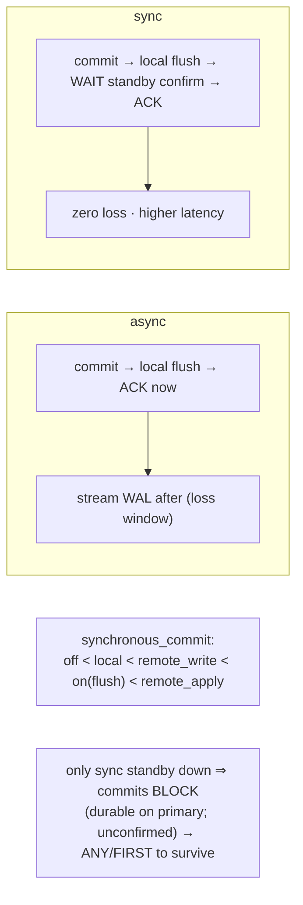

# Lab 29 — Synchronous Replication: `synchronous_standby_names`; Test Commit Latency & Standby-Down Behavior

> **Track A · DBA · A4 Replication & High Availability · Lab 4 of 11 (Lab 29/222)**
> Teaching package: concept → diagram → steps → verify → quick-ref → self-test → video script.
> **Depends on:** Labs 26–28 (primary + standby1 5433 + standby2 5434).

---

## 0. Lab Card (at a glance)

| Field | Value |
|---|---|
| **Objective** | Configure synchronous replication, measure the commit-latency cost vs async, and observe (and safely recover from) the write-halt when a sync standby goes down. |
| **Success criterion** | `sync_state=sync` for the named standby; sync commits are measurably slower than async; a downed sole sync standby **blocks** commits until recovered or reconfigured; an `ANY`/`FIRST` config survives one failure. |
| **Scope boundary** | Sync rep semantics + the availability trade-off. Failover is Lab 30. |
| **Prereqs** | Labs 26–28; standbys reachable |
| **Time** | 30–45 min |
| **Difficulty** | ★★★★☆ |
| **Risk** | **Medium** — sync with a single standby **halts writes** if it's down. Know the unblock (`synchronous_standby_names=''`). |

---

## 1. Learning Objectives

1. **Async vs sync** — what the primary waits for before acknowledging a commit, and the durability/latency trade-off.
2. **Name sync standbys** — `synchronous_standby_names` matched on `application_name`, with `FIRST`/`ANY`.
3. **Tune the level** — `synchronous_commit` (`remote_write`/`on`/`remote_apply`).
4. **The halt** — why one sync standby down blocks writes, and how to unblock **without data loss**.
5. **Design for resilience** — quorum/priority sets so a single failure doesn't stall the primary.

---

## 2. Concept Primer — the "why"

**Async (default): fast, tiny loss window.** The primary flushes the commit **locally**, acknowledges the client immediately, and streams WAL to standbys afterward. If the primary crashes before a standby received a just-committed transaction, that commit can be **lost** on failover. Low latency, small risk.

**Sync: zero loss, higher latency.** With synchronous replication, the primary **waits for at least one standby to confirm** it has the WAL **before** telling the client "committed." So a committed transaction is durable on **both** the primary and a standby — no loss on primary failure. The cost: **every commit pays a network round-trip + the standby's flush**, so write latency rises.

**Naming sync standbys — `synchronous_standby_names` (reload).** Matched against each standby's **`application_name`** (set in its `primary_conninfo`; otherwise it shows as `walreceiver`/`cluster_name`). Formats:
- `'standby1'` — that one standby is sync.
- `'FIRST 2 (s1, s2, s3)'` — the first 2 available, by list priority.
- `'ANY 1 (s1, s2)'` — **quorum**: any 1 of the listed standbys confirming is enough (PG10+).
- `'*'` — any connected standby.

**The level — `synchronous_commit`** (per-transaction tunable): `off` (async, no local wait) < `local` (local flush only, ignore standbys) < `remote_write` (standby wrote to OS) < `on` (standby **flushed** WAL — the default remote level) < `remote_apply` (standby **applied**/replayed — visible to reads there; strongest, slowest). You can even set `synchronous_commit=local` for one bulk-load transaction to skip the sync wait while keeping it on globally.

**The halt — the defining gotcha.** If `synchronous_standby_names` requires a sync standby and **none is available**, commits **block** — the primary waits indefinitely for a confirmation that can't come. A single sync standby going down **stops all writes** on the primary. Crucial nuance: the commit **is durable on the primary** (locally flushed); it's just **unconfirmed** to a standby. The data isn't lost — the client just hangs. To unblock **without losing anything**:
- bring the standby back (commits complete), **or**
- change `synchronous_standby_names` (reload) to remove/replace it, or set it to `''` to go async, **or**
- design so this never happens: use `ANY N`/`FIRST N` over **multiple** standbys so one failure still leaves a confirmer.

**`sync_state` in `pg_stat_replication`:** `async` (not a candidate) / `potential` (candidate, not currently active sync) / `sync` (active synchronous) / `quorum` (member of an `ANY` set).

---

## 3. Diagrams

### 3.1 Configure + test flow

```mermaid
flowchart TD
    A["set application_name on standbys<br/>(primary_conninfo) + restart"] --> B["measure ASYNC latency (pgbench)"]
    B --> C["synchronous_standby_names='standby1' + reload"]
    C --> D["verify sync_state = sync"]
    D --> E["measure SYNC latency (higher)"]
    E --> F[[stop the sync standby]]
    F --> G["commit on primary → HANGS (blocked)"]
    G --> H{unblock without data loss}
    H -->|bring standby up| I["commit completes"]
    H -->|synchronous_standby_names=''| J["goes async, commit returns"]
    H -->|ANY 1 (s1,s2)| K["other standby confirms → no halt"]
    I & J & K --> L([✔ trade-off + resilience understood])
```

### 3.2 Async vs sync + the durability ladder



---

## 4. Prerequisites — name the standbys

```bash
# give each standby a stable application_name so we can reference it in synchronous_standby_names
sudo -u postgres sed -i "s/primary_conninfo = '\(.*\)'/primary_conninfo = '\1 application_name=standby1'/" /pgdata/17/standby/postgresql.auto.conf
sudo -u postgres /usr/pgsql-17/bin/pg_ctl -D /pgdata/17/standby restart -l /tmp/standby.log
sudo -u postgres psql -c "SELECT application_name, state, sync_state FROM pg_stat_replication;"   # standby1 shows, sync_state=async
```

---

## 5. Step-by-Step

### Step 1 — Baseline: ASYNC commit latency

```bash
sudo -u postgres psql -c "SHOW synchronous_standby_names;"     # empty → async
sudo -u postgres pgbench -c 8 -j 4 -T 20 benchdb | grep -E "tps|latency average"   # record async numbers
```

### Step 2 — Turn on synchronous replication

```bash
sudo -u postgres psql -c "ALTER SYSTEM SET synchronous_standby_names = 'standby1'; SELECT pg_reload_conf();"
sudo -u postgres psql -c "SELECT application_name, sync_state FROM pg_stat_replication;"   # standby1 → sync
```

### Step 3 — Measure SYNC commit latency (expect higher)

```bash
sudo -u postgres pgbench -c 8 -j 4 -T 20 benchdb | grep -E "tps|latency average"   # compare to Step 1
# sync tps lower / latency higher — the cost of waiting for the standby's flush
```

### Step 4 — Standby-down test: watch commits block

```bash
sudo -u postgres /usr/pgsql-17/bin/pg_ctl -D /pgdata/17/standby stop        # the sole sync standby goes down
# this commit will HANG (waiting for a sync confirmation that can't come). Bound it with a timeout:
timeout 8 sudo -u postgres psql -d benchdb -c "INSERT INTO cascade_test VALUES (999999);"
echo "exit code $? (124 = timed out = commit blocked, as expected)"
```

### Step 5 — Unblock WITHOUT data loss (two ways)

```bash
# Option A — bring the standby back; the pending commit completes:
sudo -u postgres /usr/pgsql-17/bin/pg_ctl -D /pgdata/17/standby -l /tmp/standby.log start
sleep 4
# Option B (if the standby can't return) — go async to restore write availability:
# sudo -u postgres psql -c "ALTER SYSTEM SET synchronous_standby_names=''; SELECT pg_reload_conf();"
sudo -u postgres psql -d benchdb -c "SELECT 'writes flowing again' AS status;"
```

### Step 6 — Make it resilient: quorum over two standbys

```bash
# with ANY 1 of two standbys, one failure no longer halts writes:
sudo -u postgres psql -c "ALTER SYSTEM SET synchronous_standby_names = 'ANY 1 (standby1, standby2)'; SELECT pg_reload_conf();"
# (ensure standby2 also has application_name=standby2 set, like Step in Prereqs)
sudo -u postgres psql -c "SELECT application_name, sync_state FROM pg_stat_replication;"   # sync_state = quorum
# now stop ONE standby and confirm commits still succeed:
sudo -u postgres /usr/pgsql-17/bin/pg_ctl -D /pgdata/17/standby stop
sudo -u postgres psql -d benchdb -c "INSERT INTO cascade_test VALUES (1000000);"   # succeeds — standby2 confirms
sudo -u postgres /usr/pgsql-17/bin/pg_ctl -D /pgdata/17/standby -l /tmp/standby.log start
```

---

## 6. Verification Checklist

- [ ] Standby shows a stable `application_name` in `pg_stat_replication`
- [ ] With `synchronous_standby_names='standby1'`, `sync_state=sync`
- [ ] Sync commit latency measurably **higher** than async (pgbench)
- [ ] With the sole sync standby down, a commit **blocks** (timeout)
- [ ] Commit completes when the standby returns (no data lost)
- [ ] Setting `synchronous_standby_names=''` restores write availability (async)
- [ ] `ANY 1 (s1, s2)` survives one standby failure (`sync_state=quorum`)

---

## 7. Troubleshooting

| Symptom | Cause | Fix |
|---|---|---|
| All commits hang | Sole sync standby down | Bring it up; or `synchronous_standby_names=''` (async); or use `ANY`/`FIRST` with multiple |
| `sync_state` stays `async` | `application_name` doesn't match the names list | Set `application_name` in `primary_conninfo`; restart standby; verify in `pg_stat_replication` |
| Sync latency too high | Waiting on standby flush + network | Use `remote_write` (less durable), reduce network RTT, or `synchronous_commit=local` per bulk txn |
| Cancelled a hung commit | Backend interrupted mid-wait | Data **is** on the primary; it just wasn't confirmed to a standby (warning) |
| Want zero-loss + availability | Single sync standby is a SPOF | `ANY 1 (s1, s2)` (or more) so one loss doesn't block |
| Standby back but writes still blocked | Reload not applied | `SELECT pg_reload_conf();` |

---

## 8. Quick Reference Card (paste-ready)

```bash
# name the standby, then turn sync on
sudo -u postgres sed -i "s/primary_conninfo = '\(.*\)'/primary_conninfo = '\1 application_name=standby1'/" /pgdata/17/standby/postgresql.auto.conf
sudo -u postgres pg_ctl -D /pgdata/17/standby restart
sudo -u postgres psql -c "ALTER SYSTEM SET synchronous_standby_names='standby1'; SELECT pg_reload_conf();"
sudo -u postgres psql -c "SELECT application_name,sync_state FROM pg_stat_replication;"   # sync

# latency: async vs sync
sudo -u postgres pgbench -c8 -j4 -T20 benchdb | grep -E "tps|latency"   # (do before and after)

# HALT demo + unblock (no data loss)
sudo -u postgres pg_ctl -D /pgdata/17/standby stop
timeout 8 sudo -u postgres psql -c "INSERT INTO t VALUES (1);"          # hangs (124)
sudo -u postgres psql -c "ALTER SYSTEM SET synchronous_standby_names=''; SELECT pg_reload_conf();"   # unblock → async

# RESILIENT config
sudo -u postgres psql -c "ALTER SYSTEM SET synchronous_standby_names='ANY 1 (standby1, standby2)'; SELECT pg_reload_conf();"

# levels: synchronous_commit = off < local < remote_write < on(flush) < remote_apply
# a hung sync commit is DURABLE on the primary — unconfirmed ≠ lost
```

---

## 9. Self-Check

1. In async vs sync, what does the primary wait for before acknowledging a commit?
2. What halts writes in synchronous replication, and how do you unblock **without** losing data?
3. What sets which standby is synchronous, and on what field is it matched?
4. Order `synchronous_commit` levels from weakest to strongest durability.
5. How do you make sync replication survive a single standby failure?
6. Is a "hung" sync commit lost on the primary?

<details>
<summary>Answers</summary>

1. Async: only the **local** flush (then acks). Sync: local flush **plus** a standby's confirmation.
2. When the required sync standby(s) are unavailable, commits block. Unblock by bringing the standby back, setting `synchronous_standby_names=''` (async), or using an `ANY`/`FIRST` set with a surviving standby — none of which loses committed data.
3. `synchronous_standby_names`, matched on each standby's **`application_name`**.
4. `off` < `local` < `remote_write` < `on` (remote flush) < `remote_apply`.
5. Use a quorum/priority set over multiple standbys, e.g. `ANY 1 (standby1, standby2)`.
6. **No** — it's flushed locally (durable on the primary); it's merely unconfirmed to a standby.
</details>

---

## 10. Video / Teaching Script

| # | On screen | Say (narration) |
|---|---|---|
| 1 | Title: "Zero data loss — at a price" | "Async replication is fast but can lose a commit on failover. Synchronous replication makes that impossible — by making commits *wait*." |
| 2 | name standby + async pgbench | "First, a baseline. Async throughput — this is our 'fast' number." |
| 3 | `synchronous_standby_names='standby1'` | "Turn sync on. Now the primary won't say 'done' until the standby confirms." |
| 4 | sync pgbench (slower) | "Same test — slower. That gap is the cost of durability: a network round-trip per commit." |
| 5 | stop standby → commit hangs | "Now the gotcha everyone hits: kill the one sync standby, and… writes freeze. The primary is waiting for a confirmation that can't come." |
| 6 | unblock | "But nothing's lost — the data's on the primary. Bring the standby back, or flip to async to restore writes." |
| 7 | `ANY 1 (s1, s2)` | "The real fix: never rely on a single sync standby. With 'any one of two', losing one doesn't stop a thing." |
| 8 | Outro | "Sync rep is a durability-versus-availability dial. Choose deliberately. Next: promotion and failover." |

---

## 11. Glossary

- **Synchronous / asynchronous replication** — commit waits for a standby / acks immediately.
- **`synchronous_standby_names`** — which standbys are sync (`FIRST`/`ANY`, matched on `application_name`).
- **`synchronous_commit`** — durability level: off / local / remote_write / on / remote_apply.
- **`sync_state`** — async / potential / sync / quorum (in `pg_stat_replication`).
- **Commit latency** — extra time to wait for standby confirmation.
- **Write halt** — commits block when required sync standbys are unavailable.
- **Quorum set** — `ANY N (...)` — any N confirmers suffice.

---
*NETAPORT lab series · PostgreSQL 17 on AlmaLinux 9 · Lab 29/222 · A4 Replication & High Availability*
