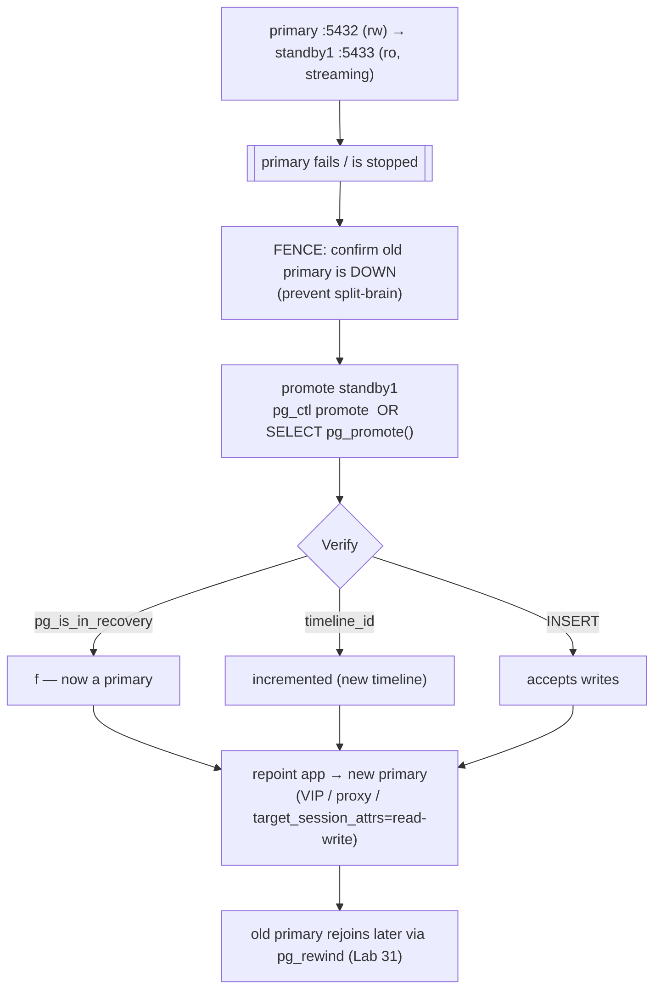
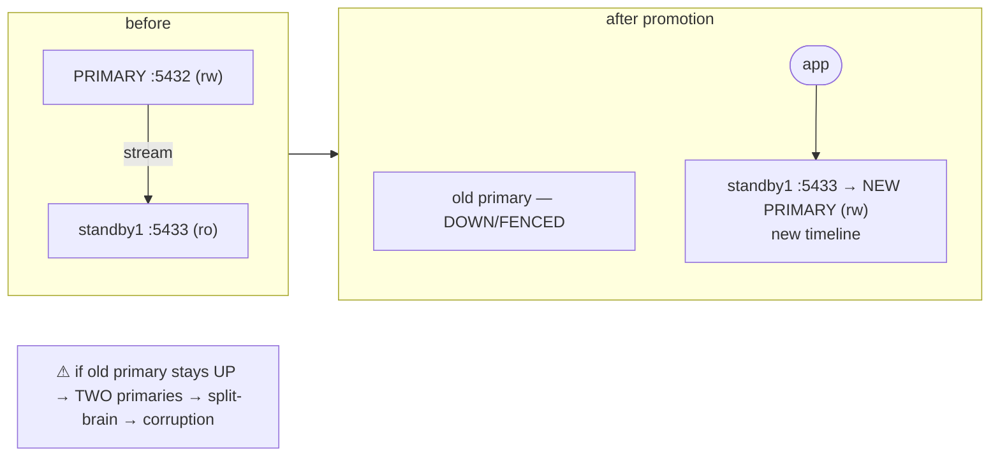

# Lab 30 — Promote a Standby (`pg_ctl promote` / `pg_promote()`); Repoint the App

> **Track A · DBA · A4 Replication & High Availability · Lab 5 of 11 (Lab 30/222)**
> Teaching package: concept → diagram → steps → verify → quick-ref → self-test → video script.
> **Depends on:** Labs 26–29 (primary + standby1). **Sets up:** Lab 31 (`pg_rewind` to reattach the old primary).

---

## 0. Lab Card (at a glance)

| Field | Value |
|---|---|
| **Objective** | Promote a standby to a new read-write primary via `pg_ctl promote`/`pg_promote()`, confirm the timeline advance, and repoint the application to it. |
| **Success criterion** | Promoted node: `pg_is_in_recovery()=f`, timeline incremented, accepts writes; the app reaches the new primary (e.g. via `target_session_attrs=read-write`). |
| **Scope boundary** | Promotion + repointing. Reattaching the old primary is Lab 31; automated failover (Patroni) is Lab 36. |
| **Prereqs** | Labs 26–29 (running primary + streaming standby) |
| **Time** | 25–40 min |
| **Difficulty** | ★★★☆☆ |
| **Risk** | **Medium** — a promotion with the old primary still up = **split-brain**. Fence the old primary. |

---

## 1. Learning Objectives

1. **Promote two ways** — `pg_ctl promote` and `pg_promote()`.
2. **What promotion does** — exits recovery, starts a **new timeline**, becomes writable.
3. **Split-brain** — why two primaries corrupt data, and how to prevent it (fencing).
4. **Repoint the app** — DNS/VIP/proxy, and libpq `target_session_attrs=read-write`.
5. **Failover vs switchover** — unplanned vs planned, and the data-loss implications.

---

## 2. Concept Primer — the "why"

**Promotion turns a standby into the primary.** When the primary is gone (failover) or you're doing a planned handover (switchover), you **promote** a standby: it stops recovery, replays any WAL it still holds, removes `standby.signal`, and becomes **read-write**. `pg_is_in_recovery()` flips to false and it can accept writes and feed its own standbys.

**Two ways to do it:**
- **`pg_ctl promote -D <datadir>`** — on the standby host.
- **`SELECT pg_promote();`** — SQL (superuser, PG12+); `pg_promote(wait := true, wait_seconds := 60)` returns true when done.
- *(The old `promote_trigger_file` mechanism was removed in PG16 — don't use it.)*

**Promotion forks a new timeline.** The moment a standby promotes, its WAL **diverges** from the old primary's — a **new timeline** (the timeline ID increments; a `.history` file records the fork). This matters twice: it's why the **old primary can't just rejoin** (its WAL is on the old timeline — you need `pg_rewind`, Lab 31), and it's how other standbys know to follow the new line.

**Split-brain — the deadly failure mode.** If you promote a standby while the **old primary is still running and reachable**, you now have **two primaries** accepting writes independently. Their data **diverges**, and merging them is generally impossible — it's corruption. So the iron rule of failover: **the old primary must be truly down (or fenced) before the app writes to the new one.** Manual failover means you verify it's down; automated tools (Patroni, Lab 36) do **fencing/STONITH** to guarantee it.

**Failover vs switchover:**
- **Failover** (unplanned) — the primary died; promote a standby. With **async** replication you may lose commits that hadn't replicated (Lab 29); with **sync**, zero loss.
- **Switchover** (planned) — cleanly stop the primary, promote the standby, then rebuild the old primary as a new standby. No data loss.

**Repointing the app.** After promotion the app must connect to the **new** primary. Options:
- **DNS / VIP** — a name or virtual IP that moves to the new primary.
- **A proxy/load balancer** (HAProxy, pgpool — Lab 196) that health-checks and routes to whichever node is primary.
- **libpq multi-host + `target_session_attrs=read-write`** — list several hosts in the connection string; the driver connects to each and **keeps the one that's read-write** (the primary). Clean, app-side, no extra infrastructure:
  `postgresql://user@hostA:5432,hostB:5433/db?target_session_attrs=read-write`

Sibling standbys (that streamed from the *old* primary) must also be repointed to the new primary, and may need `pg_rewind` if they diverged.

---

## 3. Diagrams

### 3.1 Failover flow



### 3.2 Before / after (and the split-brain trap)



---

## 4. Prerequisites

```bash
sudo -u postgres psql -p 5432 -c "SELECT pg_is_in_recovery();"    # f (primary)
sudo -u postgres psql -p 5433 -c "SELECT pg_is_in_recovery();"    # t (standby, streaming)
sudo -u postgres psql -p 5433 -c "SELECT timeline_id FROM pg_control_checkpoint();"   # e.g. 1
```

---

## 5. Step-by-Step

### Step 1 — Simulate primary failure (and FENCE it)

```bash
sudo systemctl stop postgresql-17          # primary on 5432 goes down (failover scenario)
# FENCE: confirm it's really down before promoting anything:
sudo -u postgres psql -p 5432 -c "SELECT 1;" 2>&1 | tail -1     # must fail to connect
ss -tlnp | grep :5432 || echo "old primary confirmed DOWN"
```

### Step 2 — Promote the standby (choose one method)

```bash
# Method A — command line:
sudo -u postgres /usr/pgsql-17/bin/pg_ctl -D /pgdata/17/standby promote
# Method B — SQL (equivalent): sudo -u postgres psql -p 5433 -c "SELECT pg_promote();"
sleep 3
```

### Step 3 — Verify it's now a primary on a new timeline

```bash
sudo -u postgres psql -p 5433 -c "SELECT pg_is_in_recovery();"                       # f — promoted
sudo -u postgres psql -p 5433 -c "SELECT timeline_id FROM pg_control_checkpoint();"  # incremented (e.g. 2)
sudo -u postgres psql -p 5433 -d benchdb -c "INSERT INTO cascade_test VALUES (77777); SELECT 'writable' AS status;"
```

### Step 4 — Repoint the app (libpq finds the writable node)

```bash
# a multi-host string picks whichever node is read-write (now 5433):
sudo -u postgres psql "postgresql://postgres@127.0.0.1:5432,127.0.0.1:5433/benchdb?target_session_attrs=read-write" \
  -c "SELECT inet_server_port() AS connected_to, pg_is_in_recovery();"
#   → connected_to = 5433, pg_is_in_recovery = f  (routed to the new primary automatically)
```

### Step 5 — (Note) repoint the other pieces

```bash
# Cascaded standby2 (Lab 28) followed standby1 and continues automatically.
# A SIBLING standby of the OLD primary would need primary_conninfo → new primary (+ maybe pg_rewind, Lab 31).
# The OLD primary rejoins as a standby via pg_rewind — that's the next lab.
echo "old primary → reattach with pg_rewind (Lab 31)"
```

---

## 6. Verification Checklist

- [ ] Old primary confirmed **down** before promotion (no split-brain)
- [ ] Promoted node: `pg_is_in_recovery()` = **f**
- [ ] Timeline ID **incremented**
- [ ] New primary accepts **writes**
- [ ] App reaches the new primary (`target_session_attrs=read-write` → port 5433)
- [ ] Cascaded standby (if any) still follows the promoted node
- [ ] Plan noted to rejoin the old primary via `pg_rewind`

---

## 7. Troubleshooting

| Symptom | Cause | Fix |
|---|---|---|
| **Two primaries / diverging data** | Old primary still up at promotion (split-brain) | Fence/stop the old primary; never let apps write to both; if it happened, one side's writes must be discarded |
| Promotion doesn't complete | Node wasn't a running standby / stuck recovery | Check the standby log; ensure it was streaming |
| `pg_promote()` returns false | Not promoted within `wait_seconds` | Retry, or use `pg_ctl promote`; check logs |
| App still hits the old primary | Not repointed | Update DNS/VIP/proxy, or use `target_session_attrs=read-write` |
| Sibling standby stops replicating | It followed the old timeline | Repoint `primary_conninfo` to the new primary; `pg_rewind` if diverged (Lab 31) |
| Data missing after failover | Async: unreplicated commits lost with old primary | Expected with async; use sync (Lab 29) for zero loss |
| Can't write after promote | Still in recovery | Promotion incomplete — re-check `pg_is_in_recovery()` |

---

## 8. Quick Reference Card (paste-ready)

```bash
# FENCE first — confirm the old primary is down
sudo systemctl stop postgresql-17
ss -tlnp | grep :5432 || echo "old primary DOWN"

# PROMOTE (either)
sudo -u postgres pg_ctl -D /pgdata/17/standby promote
# sudo -u postgres psql -p 5433 -c "SELECT pg_promote();"

# VERIFY
sudo -u postgres psql -p 5433 -c "SELECT pg_is_in_recovery();"                        # f
sudo -u postgres psql -p 5433 -c "SELECT timeline_id FROM pg_control_checkpoint();"   # incremented

# REPOINT app — driver finds the read-write node
psql "postgresql://postgres@127.0.0.1:5432,127.0.0.1:5433/benchdb?target_session_attrs=read-write" \
  -c "SELECT inet_server_port(), pg_is_in_recovery();"

# ⚠ SPLIT-BRAIN: two live primaries = corruption. Old primary MUST be down before app writes to new.
# old primary rejoins via pg_rewind (Lab 31) | automated fencing = Patroni (Lab 36)
```

---

## 9. Self-Check

1. Give two ways to promote a standby.
2. What three things change on a node when it's promoted?
3. What is split-brain, and what's the rule that prevents it?
4. Difference between failover and switchover, including data-loss implications?
5. How can an application automatically connect to the new primary without DNS/VIP changes?
6. Why can't the old primary simply rejoin as a standby after a failover?

<details>
<summary>Answers</summary>

1. `pg_ctl promote -D <datadir>` and `SELECT pg_promote();`.
2. It exits recovery (becomes read-write), starts a **new timeline**, and can accept writes / feed standbys.
3. Two primaries accepting writes independently → diverging, unmergeable data (corruption). Prevent it by ensuring the old primary is **down/fenced** before the app writes to the new one.
4. Failover is unplanned (primary died; async may lose unreplicated commits); switchover is planned and clean (no data loss).
5. libpq multi-host connection string with `target_session_attrs=read-write` — the driver keeps the writable node.
6. Its WAL is on the **old timeline** and has diverged from the new primary; it must be rewound to the fork point with `pg_rewind` (Lab 31).
</details>

---

## 10. Video / Teaching Script

| # | On screen | Say (narration) |
|---|---|---|
| 1 | Title: "Failover: promoting a standby" | "The primary is down. Your standby has all the data. Time to make it the new boss." |
| 2 | stop primary + fence check | "First — and this is non-negotiable — confirm the old primary is really down. Two live primaries means corrupted, unrecoverable data." |
| 3 | `pg_ctl promote` | "Promote. One command. The standby stops replaying and opens for writes." |
| 4 | verify: recovery=f, new timeline | "Proof: no longer in recovery, and notice the timeline number jumped. That fork is important — it's why the old server can't just wander back." |
| 5 | INSERT works | "And it writes. It's the primary now." |
| 6 | `target_session_attrs=read-write` | "The slick part: give your app both addresses and 'read-write', and the driver *finds* the new primary itself. No DNS change needed." |
| 7 | split-brain warning | "One more time, because it's the mistake that ends careers: the old primary must stay down until the app is on the new one." |
| 8 | Outro | "Failover done. But that old primary isn't wasted — next lab, we rewind it and bring it back as a standby." |

---

## 11. Glossary

- **Promotion** — turning a standby into a read-write primary.
- **`pg_ctl promote` / `pg_promote()`** — CLI / SQL promotion.
- **Timeline** — WAL history branch; increments at promotion.
- **Failover / switchover** — unplanned / planned primary change.
- **Split-brain** — two primaries writing independently → divergence.
- **Fencing / STONITH** — forcibly isolating the old primary.
- **`target_session_attrs=read-write`** — libpq option to connect to the writable node.

---
*NETAPORT lab series · PostgreSQL 17 on AlmaLinux 9 · Lab 30/222 · A4 Replication & High Availability*
