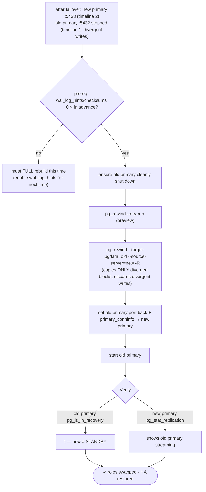
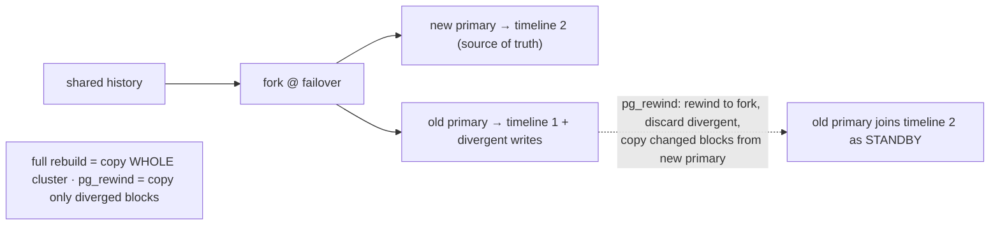

# Lab 31 — `pg_rewind` a Former Primary Back Into the Cluster (No Full Rebuild)

> **Track A · DBA · A4 Replication & High Availability · Lab 6 of 11 (Lab 31/222)**
> Teaching package: concept → diagram → steps → verify → quick-ref → self-test → video script.
> **Depends on:** Lab 30 (a failover: new primary on 5433, old primary on 5432 stopped and diverged).

---

## 0. Lab Card (at a glance)

| Field | Value |
|---|---|
| **Objective** | Reattach the former primary as a standby of the new primary using `pg_rewind` — copying only diverged blocks — then start it and confirm roles are swapped. |
| **Success criterion** | Old primary rewinds to the fork point, starts as a standby of the new primary, streams, and `pg_stat_replication` on the new primary shows it. |
| **Scope boundary** | Rewind + rejoin. Prereqs (`wal_log_hints`) and split-brain came from Labs 30/5; delayed replicas next (Lab 32). |
| **Prereqs** | Lab 30 done; **`wal_log_hints=on` or data checksums set in advance**; old primary cleanly shut down |
| **Time** | 30–45 min |
| **Difficulty** | ★★★★☆ |
| **Risk** | **Medium** — `pg_rewind` rewrites the target's data dir and **discards its divergent writes**. `--dry-run` first. |

---

## 1. Learning Objectives

1. **The divergence problem** — why a former primary can't just rejoin after a failover.
2. **`pg_rewind` vs full rebuild** — rewind only the changed blocks to the fork point.
3. **The mandatory prerequisite** — `wal_log_hints`/checksums, set **before** you need it.
4. **The data-loss reality** — divergent (un-replicated) transactions are discarded.
5. **Reattach** — `-R` writes recovery config; the old primary comes back as a standby.

---

## 2. Concept Primer — the "why"

**After a failover, the two servers have diverged.** When you promoted the standby (Lab 30), it forked a **new timeline**. Meanwhile the old primary may hold transactions that were committed **but never replicated** (the async loss window) — WAL on the **old** timeline. So the old primary and new primary now have **conflicting histories**. You can't just restart the old primary pointing at the new one — their WAL diverges at the fork.

**Two ways to rejoin:**
1. **Full rebuild** — `pg_basebackup` from the new primary, discard the old data dir, copy the **whole** cluster. Always correct, but for a large database that's **hours** of copying.
2. **`pg_rewind`** — find the **last common checkpoint** (the fork point), determine which blocks changed on the old primary since then, and copy **just those** from the new primary, rewinding the old primary to a state consistent with the new primary's timeline. Then it follows forward as a standby. Only the **diverged** data moves — often minutes instead of hours.

**How it decides what changed.** `pg_rewind` needs to know which blocks were touched on the target since the fork. That requires the cluster to have been running with **`wal_log_hints = on`** *or* **data page checksums** (`initdb -k`, Lab 5) — these make hint-bit changes WAL-logged so block changes are detectable.

> **The prerequisite that bites in production:** you must have enabled `wal_log_hints`/checksums **before** the failure. If neither was on when the divergence happened, `pg_rewind` can't work for *this* incident — you're stuck with a full rebuild. So enable `wal_log_hints=on` on **every** cluster member up front. (It's a `postmaster` param — needs a restart.)

**The data-loss reality — say it plainly.** `pg_rewind` makes the old primary consistent with the **new** primary's history, which means it **discards** the old primary's divergent transactions — exactly those commits that were on the old primary but never reached the standby before failover. With async replication, those were already the at-risk commits (Lab 29). This is expected; there's no way to keep both histories.

**Requirements checklist:**
- Target (old primary) **cleanly shut down** (`pg_rewind` refuses a running or crash-inconsistent target; if it crashed, start then stop once to reach a clean state).
- Source = the running new primary, via `--source-server='…'` (a superuser or a role granted the rewind functions), or a local `--source-pgdata`.
- `-R` writes `standby.signal` + `primary_conninfo` so the rewound node is ready to start as a standby. `--dry-run` previews without changing anything.

---

## 3. Diagrams

### 3.1 Rewind + rejoin flow



### 3.2 Timeline divergence + what rewind does



---

## 4. Prerequisites

```bash
# new primary running on 5433 (from Lab 30); old primary stopped on 5432
sudo -u postgres psql -p 5433 -c "SELECT pg_is_in_recovery();"     # f (new primary)

# CHECK the mandatory prerequisite on the OLD primary's data dir:
sudo -u postgres /usr/pgsql-17/bin/pg_controldata /var/lib/pgsql/17/data | grep -Ei "checksum|wal_log_hints|wal-log-hints"
#   Data page checksum version: 1  OR  wal_log_hints setting must have been on.
#   If NEITHER → pg_rewind can't run for this failover; full rebuild required. Enable wal_log_hints for the future:
#   (on every member, in advance)  ALTER SYSTEM SET wal_log_hints=on;  then restart.
```

---

## 5. Step-by-Step

### Step 1 — Ensure the old primary is cleanly shut down

```bash
sudo -u postgres /usr/pgsql-17/bin/pg_controldata /var/lib/pgsql/17/data | grep "Database cluster state"
#   → "shut down"  (if "in production"/"in crash recovery", start then stop once to get a clean shutdown)
```

### Step 2 — Preview with `--dry-run`

```bash
sudo -u postgres /usr/pgsql-17/bin/pg_rewind \
  --target-pgdata=/var/lib/pgsql/17/data \
  --source-server='host=127.0.0.1 port=5433 user=postgres dbname=postgres password=postgres' \
  --dry-run --progress
#   shows what it WOULD do — no changes made
```

### Step 3 — Run the rewind (writes recovery config)

```bash
sudo -u postgres /usr/pgsql-17/bin/pg_rewind \
  --target-pgdata=/var/lib/pgsql/17/data \
  --source-server='host=127.0.0.1 port=5433 user=postgres dbname=postgres password=postgres' \
  -R --progress
#   copies only diverged blocks from the new primary; -R writes standby.signal + primary_conninfo
```

### Step 4 — Fix the old primary's port and conninfo, then start it as a standby

```bash
# it kept its old port (5432) in config — that's fine (new primary is on 5433):
sudo -u postgres grep -E "primary_conninfo|standby.signal" /var/lib/pgsql/17/data/postgresql.auto.conf
ls /var/lib/pgsql/17/data/standby.signal                              # present → will start as standby
# ensure conninfo has the password:
sudo -u postgres sed -i "s/primary_conninfo = '/primary_conninfo = 'password=ReplPass!1 /" /var/lib/pgsql/17/data/postgresql.auto.conf 2>/dev/null || true

sudo systemctl start postgresql-17        # old primary starts as a STANDBY of the new primary (5433)
sleep 4
```

### Step 5 — Verify roles are swapped and streaming

```bash
# old primary (5432) is now a standby:
sudo -u postgres psql -p 5432 -c "SELECT pg_is_in_recovery();"                       # t
# new primary (5433) sees it streaming:
sudo -u postgres psql -p 5433 -c "SELECT application_name, client_addr, state FROM pg_stat_replication;"
# prove data flows new→old:
sudo -u postgres psql -p 5433 -d benchdb -c "CREATE TABLE rewind_test AS SELECT generate_series(1,2000) AS n;"
sleep 2
sudo -u postgres psql -p 5432 -d benchdb -c "SELECT count(*) FROM rewind_test;"       # 2000 — replicated back
```

---

## 6. Verification Checklist

- [ ] Prerequisite confirmed (`wal_log_hints`/checksums were on the old primary)
- [ ] Old primary was **cleanly shut down** before rewind
- [ ] `--dry-run` previewed without changes
- [ ] `pg_rewind` copied only diverged blocks (fast, not a full copy)
- [ ] Old primary starts as a **standby** (`pg_is_in_recovery()=t`)
- [ ] New primary's `pg_stat_replication` shows it streaming
- [ ] Data written on the new primary replicates to the rewound node
- [ ] You understand its divergent writes were discarded

---

## 7. Troubleshooting

| Symptom | Cause | Fix |
|---|---|---|
| `target server must be shut down cleanly` | Old primary crashed/running | Start then stop once to reach a clean shutdown, then rewind |
| `target server needs to use either data checksums or wal_log_hints` | Neither enabled before failure | Full rebuild this time; enable `wal_log_hints=on` (restart) on all members going forward |
| `could not connect to source` / permission denied | Source down or role lacks rights | Ensure new primary is up; use a superuser or grant the rewind functions |
| Rewind copies a lot | Large divergence | Normal — still usually far less than a full base backup |
| WAL needed not present locally | Required WAL recycled/archived | Use `-c`/`--restore-target-wal` with a `restore_command` |
| Old primary won't follow after start | `primary_conninfo`/password wrong | Fix conninfo (add password); `-R` writes the rest |
| "Missing data" complaint | Divergent commits discarded | Expected — those were unreplicated at failover (async loss window) |

---

## 8. Quick Reference Card (paste-ready)

```bash
# PREREQ (set in ADVANCE on every member): wal_log_hints=on (or checksums). Verify on the old primary:
sudo -u postgres pg_controldata /var/lib/pgsql/17/data | grep -Ei "checksum|state"

# 1. old primary cleanly shut down (start+stop once if it crashed)
# 2. preview
sudo -u postgres pg_rewind --target-pgdata=/var/lib/pgsql/17/data \
  --source-server='host=127.0.0.1 port=5433 user=postgres dbname=postgres password=postgres' --dry-run --progress
# 3. do it (writes recovery config)
sudo -u postgres pg_rewind --target-pgdata=/var/lib/pgsql/17/data \
  --source-server='host=127.0.0.1 port=5433 user=postgres dbname=postgres password=postgres' -R --progress
# 4. start as standby of the new primary
sudo systemctl start postgresql-17

# verify roles swapped
sudo -u postgres psql -p 5432 -c "SELECT pg_is_in_recovery();"                        # t (now standby)
sudo -u postgres psql -p 5433 -c "SELECT application_name,state FROM pg_stat_replication;"

# pg_rewind copies ONLY diverged blocks · discards the old primary's un-replicated writes
# needs wal_log_hints/checksums set BEFORE the failure · target must be cleanly shut down
```

---

## 9. Self-Check

1. What does `pg_rewind` do differently from a full base-backup rebuild?
2. What prerequisite must be enabled in advance, and why can't you add it afterward?
3. What state must the target (old primary) be in before rewinding?
4. What happens to the old primary's un-replicated transactions?
5. What does `-R` do for `pg_rewind`?
6. After a successful rewind and start, what's the resulting topology?

<details>
<summary>Answers</summary>

1. It copies only the **diverged blocks** back to the fork point (fast); a full rebuild re-copies the entire cluster.
2. `wal_log_hints=on` (or data checksums). They make block changes detectable; the divergence has already happened, so you can't detect it retroactively without them.
3. **Cleanly shut down** (start then stop once if it crashed).
4. They're **discarded** — those unreplicated commits conflict with the new timeline (the async loss window).
5. Writes `standby.signal` + `primary_conninfo`, so the rewound node is ready to start as a standby of the source.
6. The old primary becomes a **standby of the new primary** — roles swapped, HA restored.
</details>

---

## 10. Video / Teaching Script

| # | On screen | Say (narration) |
|---|---|---|
| 1 | Title: "Bring the old primary back — fast" | "After a failover, the old primary has data the new one doesn't. You *could* rebuild it from scratch — hours for a big database. Or you rewind it in minutes." |
| 2 | divergence diagram | "The two servers forked at the failover. Their histories conflict — that's why you can't just plug the old one back in." |
| 3 | prereq check | "One catch, and it's the one people learn the hard way: pg_rewind needs wal_log_hints or checksums turned on *before* the failure. Enable it everywhere, now." |
| 4 | `--dry-run` | "Always preview first. This shows exactly what it'll touch." |
| 5 | `pg_rewind -R` | "Run it. Notice it copies only what diverged — not the whole cluster. And -R sets it up to rejoin as a standby." |
| 6 | start + verify swapped | "Start it, and the tables have turned — literally. The old primary is now a standby of the new one. High availability restored." |
| 7 | data-loss honesty | "One honest note: the old primary's unreplicated writes are gone. Those were the at-risk commits from async replication. There's no keeping both." |
| 8 | Outro | "Fast failback without a rebuild. Next: a delayed replica — a safety net against logical mistakes." |

---

## 11. Glossary

- **`pg_rewind`** — reattaches a diverged former primary by copying only changed blocks.
- **Timeline divergence** — conflicting WAL histories after a failover.
- **Fork point / last common checkpoint** — where the timelines split.
- **`wal_log_hints` / data checksums** — required so block changes are detectable.
- **`--source-server` / `--source-pgdata`** — new primary as connection / local dir.
- **`--dry-run` / `-R`** — preview / write recovery config.
- **Divergent transactions** — old-primary commits discarded on rewind.
- **Full rebuild** — the slow alternative (copy the whole cluster).

---
*NETAPORT lab series · PostgreSQL 17 on AlmaLinux 9 · Lab 31/222 · A4 Replication & High Availability*
