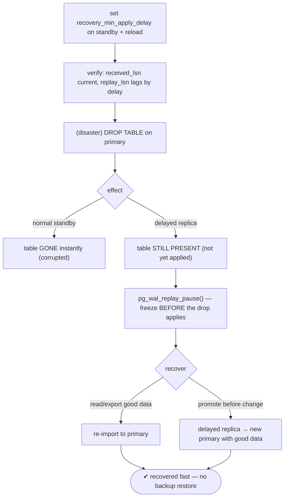
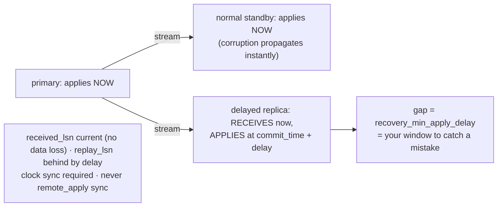

# Lab 32 — Delayed Replica (`recovery_min_apply_delay`) as a Logical-Corruption Safety Net

> **Track A · DBA · A4 Replication & High Availability · Lab 7 of 11 (Lab 32/222)**
> Teaching package: concept → diagram → steps → verify → quick-ref → self-test → video script.
> **Depends on:** Labs 26–31 (a primary + a standby you can configure). Complements PITR (Lab 21).

---

## 0. Lab Card (at a glance)

| Field | Value |
|---|---|
| **Objective** | Configure a standby to intentionally lag with `recovery_min_apply_delay`, and use that window to recover from a destructive change that has already propagated to normal standbys. |
| **Success criterion** | The delayed replica lags in *apply* by the configured delay; after a `DROP TABLE` on the primary, the table is gone on normal standbys but still present on the delayed replica, and you recover it. |
| **Scope boundary** | Delayed apply as a human-error safety net. It complements — doesn't replace — backups/PITR. |
| **Prereqs** | Labs 26–31; a standby; clock sync (chrony) between nodes |
| **Time** | 25–40 min |
| **Difficulty** | ★★★☆☆ |
| **Risk** | Low — a delayed replica holds extra WAL; size disk for the delay. |

---

## 1. Learning Objectives

1. **Receive vs apply** — the standby gets WAL in real time but replays it late.
2. **Why it's a safety net** — the delay window is a chance to catch a mistake before it applies.
3. **Faster than backup PITR** — a warm, pre-corruption copy already running.
4. **The gotchas** — clock sync, and never make it a `remote_apply` sync standby.
5. **Recover** — pause replay, read/promote before the bad change.

---

## 2. Concept Primer — the "why"

**Replication faithfully copies your mistakes.** Streaming replication propagates *everything* instantly — including a fat-fingered `DROP TABLE` or a `DELETE` with no `WHERE`. Milliseconds later, every normal standby is corrupted too. Replication protects against **hardware** failure, not **human** error.

**A delayed replica buys you time.** `recovery_min_apply_delay` makes a standby **receive** WAL in real time (so nothing is lost — the WAL is all there) but **hold off applying** each commit until `commit_time + delay` has passed. Set it to `1h` and the standby's *visible* state is always ~1 hour behind. Crucially, that means a destructive change hasn't been **applied** there yet. Within the delay window you can:
- **Read** the correct, pre-corruption data straight off the delayed replica (e.g. dump the dropped table and re-import it), or
- **Promote it to just before** the bad change (pause replay / set a recovery target), turning it into a new primary with the good data.

**Why it beats restoring from backup.** PITR from a base backup (Lab 21) means restoring the whole backup and **replaying hours of WAL** — slow. A delayed replica is a **warm, already-running** copy sitting just behind live — recovery is seconds to minutes. It's a "living PITR." It **complements** backups (which cover disasters beyond the delay window); it doesn't replace them.

**Two gotchas that matter:**
- **Clock sync.** The delay is computed from each WAL record's **commit timestamp** versus the standby's **clock**. If the clocks drift, the effective delay is wrong. Run `chrony`/NTP on all nodes (Lab 194).
- **Never combine with `remote_apply` sync.** If a delayed replica is a synchronous standby at `synchronous_commit=remote_apply`, the primary's commits would **wait for the delayed apply** — i.e. hang for the entire delay. Catastrophic. Keep a delayed replica **async** (or at most flush-level sync, `on`, which doesn't wait on apply).

**Config (standby-side, reload):** `ALTER SYSTEM SET recovery_min_apply_delay = '1h';` → reload. Its `received_lsn` stays current while `replay_lsn` (and `replay_lag`) lag by the delay. It also **retains** the received-but-unapplied WAL — so size the disk for a delay's worth.

---

## 3. Diagrams

### 3.1 Safety-net flow



### 3.2 Received vs applied (the window)



---

## 4. Prerequisites

```bash
# current topology (after Labs 30-31): primary on 5433, a standby on 5434
sudo -u postgres psql -p 5433 -c "SELECT pg_is_in_recovery();"    # f (primary)
sudo -u postgres psql -p 5434 -c "SELECT pg_is_in_recovery();"    # t (standby → we'll delay this one)
sudo -u postgres psql -p 5434 -c "SHOW synchronous_commit;"      # ensure NOT remote_apply for a delayed node
chronyc tracking >/dev/null 2>&1 && echo "clock sync active" || echo "run chrony/NTP (Lab 194)"
```

---

## 5. Step-by-Step

### Step 1 — Configure the apply delay (short value for a visible demo)

```bash
# production would be '1h' or more; use a short value here so we can observe it:
sudo -u postgres psql -p 5434 -c "ALTER SYSTEM SET recovery_min_apply_delay = '2min'; SELECT pg_reload_conf();"
sudo -u postgres psql -p 5434 -c "SHOW recovery_min_apply_delay;"    # 2min
```

### Step 2 — Verify it receives current WAL but applies it late

```bash
# generate WAL on the primary:
sudo -u postgres psql -p 5433 -d benchdb -c "CREATE TABLE delay_probe AS SELECT now() AS created;"
sleep 3
# delayed replica: received is current, but replay lags (probe NOT visible yet):
sudo -u postgres psql -p 5434 -x -c "SELECT status, latest_end_lsn AS received FROM pg_stat_wal_receiver;"
sudo -u postgres psql -p 5434 -c "SELECT count(*) FROM delay_probe;" 2>&1 | tail -1   # likely errors: not applied yet
sudo -u postgres psql -p 5433 -c "SELECT replay_lag FROM pg_stat_replication WHERE application_name IS NOT NULL;" 2>/dev/null || true
```

### Step 3 — Simulate corruption on the primary

```bash
sudo -u postgres psql -p 5433 -d benchdb -c "CREATE TABLE critical AS SELECT g AS id, 'important' AS data FROM generate_series(1,5000) g;"
sleep 130    # let the delayed replica APPLY the create (past the 2min delay)
sudo -u postgres psql -p 5434 -d benchdb -c "SELECT count(*) FROM critical;"   # 5000 — now present on delayed replica

# the "accident" — on the primary:
sudo -u postgres psql -p 5433 -d benchdb -c "DROP TABLE critical;"
```

### Step 4 — Observe: gone on normal standbys, still there on the delayed replica

```bash
# a NORMAL standby (e.g. the rewound old primary on 5432) — dropped instantly:
sleep 3
sudo -u postgres psql -p 5432 -d benchdb -c "SELECT count(*) FROM critical;" 2>&1 | tail -1   # error: does not exist
# the DELAYED replica — DROP not yet applied (within the 2min window):
sudo -u postgres psql -p 5434 -d benchdb -c "SELECT count(*) FROM critical;"   # 5000 — still here!
```

### Step 5 — Freeze the delayed replica and recover the data

```bash
# pause replay so the DROP never gets applied here:
sudo -u postgres psql -p 5434 -c "SELECT pg_wal_replay_pause(); SELECT pg_is_wal_replay_paused();"   # t
# rescue the data (read it off the delayed replica; export or re-create on the primary):
sudo -u postgres pg_dump -p 5434 -d benchdb -t critical -Fc -f /backup/critical_rescue.dump
sudo -u postgres pg_restore -p 5433 -d benchdb /backup/critical_rescue.dump
sudo -u postgres psql -p 5433 -d benchdb -c "SELECT count(*) FROM critical;"   # 5000 — restored to primary
```

### Step 6 — Resume the delayed replica (back to guarding)

```bash
sudo -u postgres psql -p 5434 -c "SELECT pg_wal_replay_resume();"
# (it will apply the DROP now, but the data is already safe on the primary)
```

---

## 6. Verification Checklist

- [ ] `recovery_min_apply_delay` set on the delayed replica
- [ ] It **receives** current WAL (`received_lsn` current) but **applies** late (`replay_lag` ≈ delay)
- [ ] After `DROP`, table gone on normal standby, **present** on delayed replica
- [ ] `pg_wal_replay_pause()` froze it before the drop applied
- [ ] Data rescued from the delayed replica back onto the primary
- [ ] The delayed replica is **not** a `remote_apply` sync standby
- [ ] Clock sync (chrony) confirmed

---

## 7. Troubleshooting

| Symptom | Cause | Fix |
|---|---|---|
| Delay not taking effect | Not reloaded / clock skew | `pg_reload_conf()`; sync clocks (chrony) |
| Effective delay wrong | Clock drift (commit_time vs standby clock) | Run NTP/chrony on all nodes (Lab 194) |
| Primary commits hang | Delayed replica is a `remote_apply` sync standby | Make it async / flush-level; never `remote_apply` |
| Missed the window (drop applied) | Delay < detection+reaction time | Use a longer delay; pause immediately on incident |
| `pg_wal` filling on delayed replica | It retains a delay's worth of unapplied WAL | Size disk for the delay; shorten delay if needed |
| Monitoring alerts on "lag" | The delay *is* the lag | Exclude the delayed node's expected apply lag from alerts |

---

## 8. Quick Reference Card (paste-ready)

```bash
# configure delay on the standby (production: 1h+; demo: short)
sudo -u postgres psql -p 5434 -c "ALTER SYSTEM SET recovery_min_apply_delay='1h'; SELECT pg_reload_conf();"

# it RECEIVES now, APPLIES late:
sudo -u postgres psql -p 5434 -x -c "SELECT status,latest_end_lsn FROM pg_stat_wal_receiver;"   # received current
sudo -u postgres psql -p 5433 -c "SELECT application_name,replay_lag FROM pg_stat_replication;"  # apply lag ≈ delay

# ON INCIDENT: freeze before the bad change applies, then rescue
sudo -u postgres psql -p 5434 -c "SELECT pg_wal_replay_pause();"
sudo -u postgres pg_dump -p 5434 -d benchdb -t <table> -Fc -f /backup/rescue.dump
sudo -u postgres pg_restore -p 5433 -d benchdb /backup/rescue.dump
sudo -u postgres psql -p 5434 -c "SELECT pg_wal_replay_resume();"

# delays APPLY not receive (no data loss) · warm fast recovery vs backup PITR
# NEEDS clock sync · NEVER a remote_apply sync standby · sizes disk for a delay of WAL
```

---

## 9. Self-Check

1. Does `recovery_min_apply_delay` delay receiving or applying WAL? Why does that matter for data safety?
2. How does a delayed replica act as a corruption safety net?
3. What's its advantage over PITR from a base backup?
4. Why does clock synchronization matter for the delay?
5. What synchronous configuration must you avoid on a delayed replica, and why?
6. On spotting corruption, what's the first thing you do on the delayed replica?

<details>
<summary>Answers</summary>

1. It delays **applying** (replay); WAL is still **received** in real time, so there's no data-loss risk — the changes are present, just not yet applied.
2. A destructive change hasn't been applied there within the delay window, so you can read the pre-corruption data or promote before the change.
3. It's a **warm, running** pre-corruption copy — recovery in seconds/minutes vs restoring a base backup and replaying hours of WAL.
4. The delay is computed from each WAL record's commit timestamp against the standby's clock; drift makes the delay inaccurate.
5. `synchronous_commit=remote_apply` — the primary's commits would wait for the delayed apply and hang for the whole delay.
6. `SELECT pg_wal_replay_pause();` — freeze replay before the destructive change is applied.
</details>

---

## 10. Video / Teaching Script

| # | On screen | Say (narration) |
|---|---|---|
| 1 | Title: "A standby that runs an hour in the past" | "Replication copies your mistakes instantly. A delayed replica deliberately lags — so it hasn't made the mistake yet." |
| 2 | set `recovery_min_apply_delay` | "One setting. It keeps receiving WAL in real time — no data loss — but holds off *applying* it." |
| 3 | received vs applied | "See the split: it has the latest WAL, but the latest changes aren't visible yet. That gap is your safety window." |
| 4 | DROP on primary | "Now the disaster — drop a critical table." |
| 5 | gone on normal, present on delayed | "On a normal standby? Gone, instantly. On the delayed replica? Still right there — it hasn't applied the drop." |
| 6 | pause + rescue | "Freeze it before it does, dump the table, restore it to the primary. Minutes — not the hours a backup restore would take." |
| 7 | gotchas | "Two rules: keep the clocks in sync, and never make a delayed replica a remote-apply sync standby, or your primary will hang for the whole delay." |
| 8 | Outro | "A living safety net against human error. Next: logical replication — replicating tables, not the whole cluster." |

---

## 11. Glossary

- **`recovery_min_apply_delay`** — how long a standby holds a commit before applying it.
- **Delayed replica** — a standby intentionally lagging in apply.
- **Receive vs apply** — WAL arrives now; replay happens later.
- **Logical corruption** — damage from a bad statement (drop/delete), not hardware.
- **`pg_wal_replay_pause()` / `_resume()`** — freeze / continue replay on a standby.
- **Warm standby** — a running replica ready for fast recovery.
- **Clock sync (chrony/NTP)** — required for an accurate delay.

---
*NETAPORT lab series · PostgreSQL 17 on AlmaLinux 9 · Lab 32/222 · A4 Replication & High Availability*
