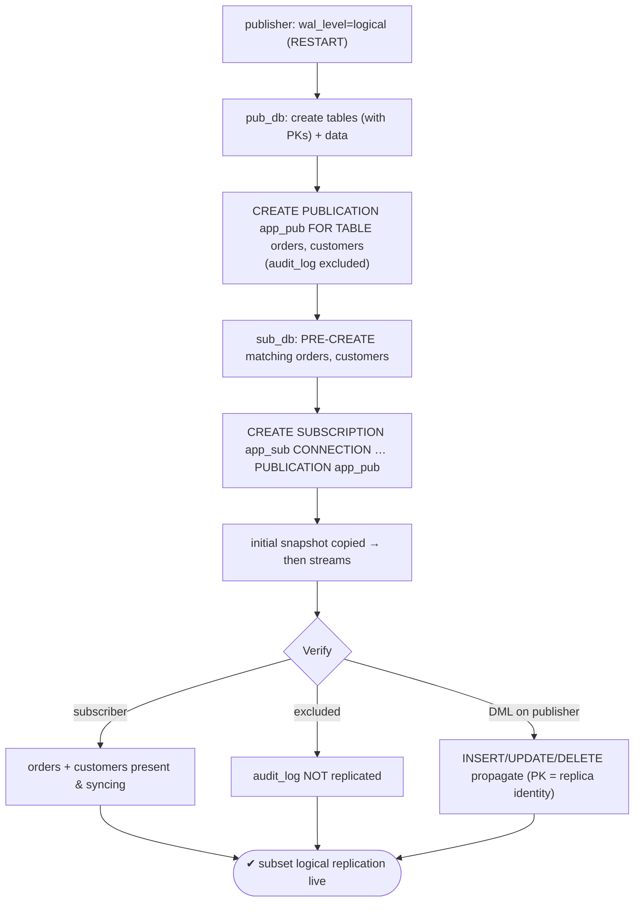
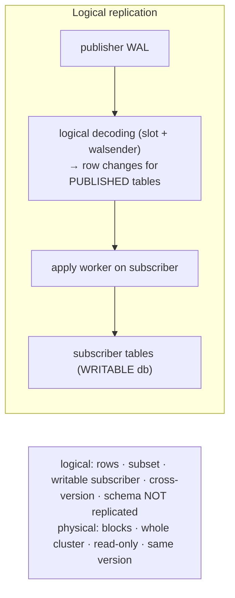

# Lab 33 — Logical Replication: `CREATE PUBLICATION` / `CREATE SUBSCRIPTION`, Replicate a Subset of Tables

> **Track A · DBA · A4 Replication & High Availability · Lab 8 of 11 (Lab 33/222)**
> Teaching package: concept → diagram → steps → verify → quick-ref → self-test → video script.
> **Depends on:** Labs 26–32 (physical replication understood — this is the logical counterpart). **Feeds:** Lab 76 (zero-downtime major upgrade).

---

## 0. Lab Card (at a glance)

| Field | Value |
|---|---|
| **Objective** | Set up logical replication of a **subset of tables** from a publisher to a subscriber database, and verify ongoing row-level changes propagate (while an excluded table does not). |
| **Success criterion** | Published tables' data appears on the subscriber and stays in sync on INSERT/UPDATE/DELETE; the unpublished table is not replicated. |
| **Scope boundary** | Table-subset logical replication. Column-lists/row-filters are Lab 34; `pg_createsubscriber` is Lab 35. |
| **Prereqs** | `wal_level=logical` on the publisher; a replication role with table access |
| **Time** | 30–45 min |
| **Difficulty** | ★★★★☆ |
| **Risk** | Low — additive; subscriber is a separate database. |

---

## 1. Learning Objectives

1. **Logical vs physical** — row/table-level, selective, writable subscriber, cross-version.
2. **The prerequisites** — `wal_level=logical`, subscriber tables **pre-created**, **replica identity** for UPDATE/DELETE.
3. **Publication/subscription model** — what each does and what happens under the hood.
4. **Replicate a subset** — publish specific tables; confirm others are excluded.
5. **Monitor** — `pg_stat_subscription`, publication/subscription catalogs.

---

## 2. Concept Primer — the "why"

**A different kind of replication.** Physical replication (Labs 26–32) ships **WAL blocks** of the **entire cluster** to a **read-only** standby of the **same** major version. **Logical replication** decodes WAL into **row-level changes** (INSERT/UPDATE/DELETE/TRUNCATE) for **chosen tables** and applies them to a subscriber that is a **fully writable** database — possibly a **different major version**, on a different host, with its own extra tables and writes. That makes it the tool for **selective replication**, **data consolidation/distribution**, and **zero-downtime major upgrades** (Lab 76).

**The model — publications and subscriptions:**
- **Publication** (publisher side): declares *what* to replicate — `CREATE PUBLICATION p FOR TABLE a, b;` (a subset), or `FOR ALL TABLES`, or `FOR TABLES IN SCHEMA s`. You can also limit operations (`WITH (publish='insert,update')`).
- **Subscription** (subscriber side): `CREATE SUBSCRIPTION s CONNECTION '…' PUBLICATION p;` — it connects to the publisher, **creates a logical replication slot** and a logical WAL sender there, **copies the initial data** (a snapshot), then **streams** ongoing changes to an **apply worker** on the subscriber.

**Three prerequisites people miss:**
1. **`wal_level = logical`** on the publisher (higher than `replica`). It's a `postmaster` param → **restart**.
2. **Subscriber tables must already exist.** Logical replication replicates **data, not schema** — **DDL is not replicated**. You create matching tables on the subscriber first, and apply future schema changes to **both** sides manually.
3. **Replica identity** for UPDATE/DELETE. To know *which* row to change on the subscriber, each replicated table needs a **replica identity** — a **primary key** by default (or a unique index, or `REPLICA IDENTITY FULL`). INSERT works without one; UPDATE/DELETE won't replicate without it.

**Access.** The subscription's connection role needs the **REPLICATION** attribute (or superuser) and **SELECT** on the published tables, plus a `pg_hba` entry allowing it to connect to the **publisher database** (a normal database line — *not* the special `replication` keyword, which is for physical replication).

**Subscriber is writable — mind conflicts.** Because the subscriber accepts writes, a local change that collides with an incoming one (e.g. duplicate PK) causes a **conflict** that stalls apply until resolved. Keep replicated tables subscriber-side "owned" by replication.

---

## 3. Diagrams

### 3.1 Setup + verify flow



### 3.2 Logical vs physical



---

## 4. Prerequisites — publisher side

```bash
# publisher cluster (use your primary's port; example 5432)
sudo -u postgres psql -c "ALTER SYSTEM SET wal_level='logical';"     # postmaster → RESTART
sudo systemctl restart postgresql-17
sudo -u postgres psql -c "SHOW wal_level;"                           # logical

# two databases for a self-contained demo (same cluster is fine):
sudo -u postgres psql -c "CREATE DATABASE pub_db; CREATE DATABASE sub_db;"

# allow the repl role to connect to pub_db (normal db line, NOT 'replication'):
HBA=$(sudo -u postgres psql -tAc "SHOW hba_file;")
echo "host  pub_db  repl  127.0.0.1/32  scram-sha-256" | sudo tee -a "$HBA"
sudo systemctl reload postgresql-17
```

---

## 5. Step-by-Step

### Step 1 — Create tables + data on the publisher (with PKs)

```bash
sudo -u postgres psql -d pub_db <<'SQL'
CREATE TABLE customers (id int PRIMARY KEY, name text);
CREATE TABLE orders    (id int PRIMARY KEY, customer_id int, amount numeric);
CREATE TABLE audit_log (id int PRIMARY KEY, msg text);           -- will NOT be published
INSERT INTO customers SELECT g, 'cust_'||g FROM generate_series(1,100) g;
INSERT INTO orders    SELECT g, (g%100)+1, g*10 FROM generate_series(1,500) g;
INSERT INTO audit_log SELECT g, 'log '||g FROM generate_series(1,50) g;
GRANT SELECT ON customers, orders TO repl;                        -- subscription role needs SELECT
SQL
```

### Step 2 — Create the publication for a SUBSET of tables

```bash
sudo -u postgres psql -d pub_db -c "CREATE PUBLICATION app_pub FOR TABLE customers, orders;"   # audit_log excluded
sudo -u postgres psql -d pub_db -c "SELECT * FROM pg_publication_tables WHERE pubname='app_pub';"
```

### Step 3 — Pre-create matching tables on the subscriber

```bash
sudo -u postgres psql -d sub_db <<'SQL'
CREATE TABLE customers (id int PRIMARY KEY, name text);
CREATE TABLE orders    (id int PRIMARY KEY, customer_id int, amount numeric);
SQL
```
*Only the published tables — and they must match. No `audit_log` here.*

### Step 4 — Create the subscription (initial copy + stream)

```bash
sudo -u postgres psql -d sub_db -c \
"CREATE SUBSCRIPTION app_sub
 CONNECTION 'host=127.0.0.1 port=5432 dbname=pub_db user=repl password=ReplPass!1'
 PUBLICATION app_pub;"
sleep 3
```

### Step 5 — Verify the initial snapshot + the exclusion

```bash
sudo -u postgres psql -d sub_db -c "SELECT count(*) FROM customers; SELECT count(*) FROM orders;"   # 100 ; 500
sudo -u postgres psql -d sub_db -c "SELECT to_regclass('audit_log');"                               # NULL — not replicated
```

### Step 6 — Prove ongoing changes replicate (PK = replica identity)

```bash
sudo -u postgres psql -d pub_db -c "INSERT INTO orders VALUES (501, 5, 9999);"        # INSERT
sudo -u postgres psql -d pub_db -c "UPDATE orders SET amount=1 WHERE id=1;"           # UPDATE (needs PK)
sudo -u postgres psql -d pub_db -c "DELETE FROM orders WHERE id=2;"                   # DELETE (needs PK)
sudo -u postgres psql -d pub_db -c "INSERT INTO audit_log VALUES (51,'excluded');"    # NOT published
sleep 2
sudo -u postgres psql -d sub_db -c "SELECT count(*) FROM orders;"                     # 500 (+1 -1) = 500
sudo -u postgres psql -d sub_db -c "SELECT amount FROM orders WHERE id=1;"            # 1 (update applied)
sudo -u postgres psql -d sub_db -c "SELECT * FROM orders WHERE id=2;"                 # none (delete applied)
```

### Step 7 — Check replication status

```bash
sudo -u postgres psql -d sub_db -x -c "SELECT subname, received_lsn, latest_end_lsn, last_msg_receipt_time FROM pg_stat_subscription;"
sudo -u postgres psql -c "SELECT slot_name, slot_type, active FROM pg_replication_slots;"   # a LOGICAL slot exists
```

---

## 6. Verification Checklist

- [ ] `wal_level=logical` on the publisher
- [ ] Publication lists **only** `customers` + `orders`
- [ ] Subscriber tables pre-created before subscribing
- [ ] Initial snapshot copied (100 customers, 500 orders)
- [ ] `audit_log` **not** present on the subscriber
- [ ] INSERT/UPDATE/DELETE on published tables propagate
- [ ] A **logical** replication slot exists and is active; `pg_stat_subscription` healthy

---

## 7. Troubleshooting

| Symptom | Cause | Fix |
|---|---|---|
| No data / subscription errors | `wal_level` not `logical` | Set it + **restart** the publisher |
| "could not connect" / auth failed | repl lacks db access, missing pg_hba line, or wrong password | Grant SELECT + pg_hba `host pub_db repl …`; fix conninfo password |
| `relation "…" does not exist` on subscriber | Tables not pre-created | Create matching tables first (DDL isn't replicated) |
| UPDATE/DELETE not replicating | No replica identity | Add a PK/unique index or `REPLICA IDENTITY FULL` |
| Schema change didn't replicate | DDL is never replicated | Apply DDL manually on both sides |
| Apply stalls with conflict | Subscriber local data collides (dup PK) | Resolve the conflicting row; keep replicated tables replication-owned |
| Leftover slot after `DROP SUBSCRIPTION` | Publisher unreachable at drop | `ALTER SUBSCRIPTION … SET (slot_name=NONE)` then drop; remove slot manually |

---

## 8. Quick Reference Card (paste-ready)

```bash
# PUBLISHER: wal_level + access
sudo -u postgres psql -c "ALTER SYSTEM SET wal_level='logical';" && sudo systemctl restart postgresql-17
# (pg_hba: host pub_db repl <ip>/32 scram-sha-256 ; GRANT SELECT on published tables TO repl)

# publication for a SUBSET
sudo -u postgres psql -d pub_db -c "CREATE PUBLICATION app_pub FOR TABLE customers, orders;"

# SUBSCRIBER: pre-create tables, then subscribe
sudo -u postgres psql -d sub_db -c "CREATE TABLE customers(id int PRIMARY KEY, name text); CREATE TABLE orders(id int PRIMARY KEY, customer_id int, amount numeric);"
sudo -u postgres psql -d sub_db -c "CREATE SUBSCRIPTION app_sub CONNECTION 'host=127.0.0.1 port=5432 dbname=pub_db user=repl password=ReplPass!1' PUBLICATION app_pub;"

# verify + monitor
sudo -u postgres psql -d sub_db -c "SELECT count(*) FROM orders; SELECT to_regclass('audit_log');"   # data ; NULL
sudo -u postgres psql -d sub_db -x -c "SELECT subname,received_lsn,latest_end_lsn FROM pg_stat_subscription;"

# logical: rows · subset · writable subscriber · cross-version · NO DDL · needs replica identity (PK) for UPD/DEL
# publication ops: WITH (publish='insert,update,delete,truncate')
```

---

## 9. Self-Check

1. Give three ways logical replication differs from physical.
2. What `wal_level` does the publisher need, and what change does it require?
3. Must subscriber tables pre-exist? Does DDL replicate?
4. What's required for UPDATE and DELETE to replicate, and why?
5. What does `CREATE SUBSCRIPTION` set up under the hood?
6. Name two things you'd check to monitor a subscription.

<details>
<summary>Answers</summary>

1. Row/table-level (not blocks); a **subset** of tables (not the whole cluster); a **writable** subscriber that can be a **different major version** (vs read-only same-version).
2. `wal_level=logical` — a `postmaster` param, so a **restart**.
3. Yes, they must pre-exist; **DDL is not replicated** (data only) — apply schema changes on both sides.
4. A **replica identity** (a primary key by default) — so the apply worker knows which row to update/delete.
5. A logical replication **slot** + logical WAL sender on the publisher, an **apply worker** on the subscriber, an **initial snapshot** copy, then streaming.
6. `pg_stat_subscription` (subscriber) and the publisher's `pg_replication_slots`/`pg_publication_tables`.
</details>

---

## 10. Video / Teaching Script

| # | On screen | Say (narration) |
|---|---|---|
| 1 | Title: "Replicate tables, not the whole cluster" | "Physical replication copies everything, read-only. Logical replication copies the *tables you choose* into a *writable* database — even across versions." |
| 2 | `wal_level=logical` restart | "First, the publisher needs a higher WAL level — that's a restart." |
| 3 | tables + `CREATE PUBLICATION` for subset | "We publish just two of three tables. The audit log stays home." |
| 4 | pre-create on subscriber | "Key gotcha: the subscriber tables must already exist. Logical replication moves data, not schema." |
| 5 | `CREATE SUBSCRIPTION` | "One command subscribes: it copies the current data, then streams every change." |
| 6 | verify subset + exclusion | "There's our data — and the unpublished table? Simply not here." |
| 7 | DML propagates | "Insert, update, delete on the publisher — all mirrored. Update and delete work because our tables have primary keys." |
| 8 | Outro | "Selective, writable, cross-version replication. Next: narrowing it further with column lists and row filters." |

---

## 11. Glossary

- **Logical replication** — row-level replication of chosen tables via logical decoding.
- **Publication / subscription** — what to replicate / the consumer that pulls it.
- **`wal_level=logical`** — required on the publisher.
- **Replica identity** — PK/unique/FULL; identifies rows for UPDATE/DELETE.
- **Apply worker** — subscriber process that applies incoming changes.
- **Logical replication slot** — publisher-side slot feeding a subscription.
- **Initial snapshot** — the one-time data copy at subscription time.

---
*NETAPORT lab series · PostgreSQL 17 on AlmaLinux 9 · Lab 33/222 · A4 Replication & High Availability*
