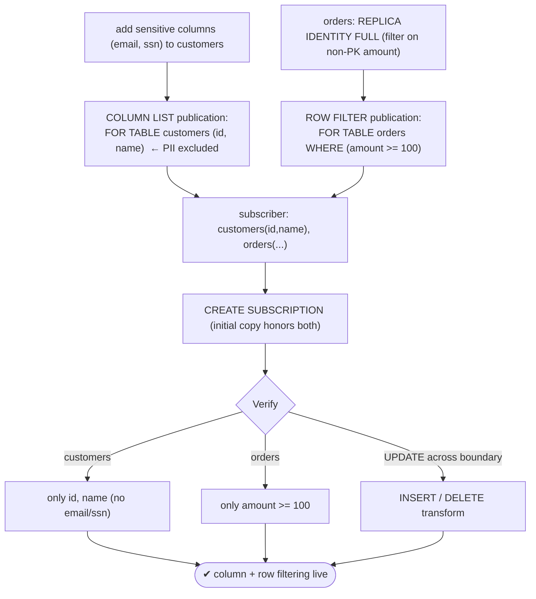
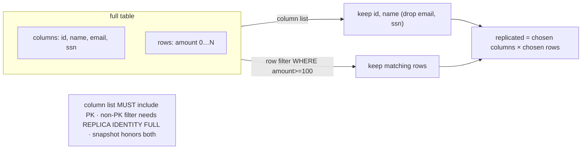

# Lab 34 — Column-List + Row-Filter Logical Replication (PG15+ Features)

> **Track A · DBA · A4 Replication & High Availability · Lab 9 of 11 (Lab 34/222)**
> Teaching package: concept → diagram → steps → verify → quick-ref → self-test → video script.
> **Depends on:** Lab 33 (logical replication basics; `wal_level=logical`, pub_db/sub setup).

---

## 0. Lab Card (at a glance)

| Field | Value |
|---|---|
| **Objective** | Replicate only chosen **columns** (excluding sensitive ones) and only rows matching a **filter**, and observe row-movement behavior when an UPDATE crosses the filter boundary. |
| **Success criterion** | Subscriber receives only the listed columns (no PII) and only rows passing the WHERE clause; boundary-crossing UPDATEs turn into INSERT/DELETE on the subscriber. |
| **Scope boundary** | Column lists + row filters (PG15+). Base logical replication was Lab 33. |
| **Prereqs** | Lab 33 (`wal_level=logical`, pub_db, repl access) |
| **Time** | 30–45 min |
| **Difficulty** | ★★★★☆ |
| **Risk** | Low — additive; new publications/subscriber. |

---

## 1. Learning Objectives

1. **Column lists** — replicate a vertical slice; exclude sensitive columns.
2. **Row filters** — replicate a horizontal slice via a `WHERE` clause.
3. **The rules** — column lists must include replica-identity columns; non-PK filters need `REPLICA IDENTITY FULL`.
4. **Row movement** — how a boundary-crossing UPDATE is transformed.
5. **Snapshot respects both** — the initial copy honors filters and column lists.

---

## 2. Concept Primer — the "why"

Logical replication (Lab 33) already lets you pick **which tables**. PG15+ adds two ways to publish **less than a whole table**:

**Column lists — a vertical slice.** `CREATE PUBLICATION p FOR TABLE customers (id, name);` replicates **only** `id` and `name`; other columns (say `email`, `ssn`) are never sent. The headline use is **compliance/privacy**: give an analytics or reporting replica the data it needs **without the PII** — the sensitive columns never leave the publisher. It also cuts bandwidth.
- **Rule:** the column list **must include every replica-identity column** (the primary key by default) — those are needed to identify rows for UPDATE/DELETE. You can't omit the PK.
- A table's column list must be **consistent** across the publications a single subscription pulls (no conflicting lists).

**Row filters — a horizontal slice.** `CREATE PUBLICATION p FOR TABLE orders WHERE (amount >= 100);` replicates **only** rows matching the condition. Uses: only active/recent records, only a region's data, sharding (different subscribers get different ranges), excluding soft-deleted rows.
- **Rule:** if the publication includes **UPDATE/DELETE**, the filter may only reference columns covered by the **replica identity**. To filter on a **non-PK** column (like `amount`) for UPDATE/DELETE, set **`REPLICA IDENTITY FULL`** on the table (so the old row's values are available). For **INSERT-only** publications, any published column may be used.
- The filter must be a simple, **immutable** expression — no volatile/user-defined functions, no subqueries, no system columns.

**Row movement — the subtle part.** When an UPDATE changes whether a row matches the filter, PostgreSQL **transforms** the operation on the subscriber:

| old row | new row | replicated as |
|---|---|---|
| matches | matches | **UPDATE** |
| matches | doesn't | **DELETE** (row leaves the set) |
| doesn't | matches | **INSERT** (row enters the set) |
| doesn't | doesn't | **skipped** |

So a filtered subscriber always reflects exactly the current matching set — even as rows cross the boundary.

**Both together:** `FOR TABLE orders (id, amount) WHERE (amount >= 100)` — a rectangle of the table (chosen columns × chosen rows). And the **initial snapshot** honors both, so the subscriber starts correct.

---

## 3. Diagrams

### 3.1 Setup + verify flow



### 3.2 Vertical × horizontal slice



---

## 4. Prerequisites

```bash
# from Lab 33: wal_level=logical, pub_db exists, repl has access
sudo -u postgres psql -c "SHOW wal_level;"                       # logical
# a fresh subscriber database for this lab:
sudo -u postgres psql -c "CREATE DATABASE sub2_db;"
```

---

## 5. Step-by-Step

### Step 1 — Add sensitive columns to the source table

```bash
sudo -u postgres psql -d pub_db <<'SQL'
ALTER TABLE customers ADD COLUMN email text, ADD COLUMN ssn text;
UPDATE customers SET email = name||'@example.com', ssn = '000-00-'||lpad(id::text,4,'0');
GRANT SELECT ON customers, orders TO repl;
SQL
```

### Step 2 — Column-list publication (exclude PII)

```bash
sudo -u postgres psql -d pub_db -c "CREATE PUBLICATION cust_cols FOR TABLE customers (id, name);"   # email/ssn NOT published
sudo -u postgres psql -d pub_db -c "SELECT * FROM pg_publication_tables WHERE pubname='cust_cols';"
```

### Step 3 — Row-filter publication (needs REPLICA IDENTITY FULL for non-PK filter)

```bash
sudo -u postgres psql -d pub_db -c "ALTER TABLE orders REPLICA IDENTITY FULL;"   # amount isn't the PK → FULL needed for UPD/DEL filtering
sudo -u postgres psql -d pub_db -c "CREATE PUBLICATION order_hi FOR TABLE orders WHERE (amount >= 100);"
```

### Step 4 — Pre-create subscriber tables (subset columns) and subscribe

```bash
sudo -u postgres psql -d sub2_db <<'SQL'
CREATE TABLE customers (id int PRIMARY KEY, name text);              -- only the published columns
CREATE TABLE orders    (id int PRIMARY KEY, customer_id int, amount numeric);
SQL
sudo -u postgres psql -d sub2_db -c \
"CREATE SUBSCRIPTION filt_sub
 CONNECTION 'host=127.0.0.1 port=5432 dbname=pub_db user=repl password=ReplPass!1'
 PUBLICATION cust_cols, order_hi;"
sleep 3
```

### Step 5 — Verify column exclusion + row filtering

```bash
# columns: subscriber customers has id, name only — no email/ssn:
sudo -u postgres psql -d sub2_db -c "\d customers"
sudo -u postgres psql -d sub2_db -c "SELECT count(*) FROM customers;"                 # 100 (all rows, 2 cols)
# rows: subscriber orders has only amount >= 100:
sudo -u postgres psql -d sub2_db -c "SELECT min(amount), max(amount), count(*) FROM orders;"
sudo -u postgres psql -d pub_db  -c "SELECT count(*) FROM orders WHERE amount >= 100;" # should match subscriber count
```

### Step 6 — Row-movement: UPDATE across the filter boundary

```bash
# a low order (below 100) not on subscriber → raise it above 100 → appears (INSERT transform):
sudo -u postgres psql -d pub_db -c "UPDATE orders SET amount = 500 WHERE id = 5;"       # 5*10=50 → 500
sleep 2
sudo -u postgres psql -d sub2_db -c "SELECT id, amount FROM orders WHERE id = 5;"       # now present (INSERTed)

# a high order → drop it below 100 → disappears (DELETE transform):
sudo -u postgres psql -d pub_db -c "UPDATE orders SET amount = 5 WHERE id = 50;"        # 50*10=500 → 5
sleep 2
sudo -u postgres psql -d sub2_db -c "SELECT id FROM orders WHERE id = 50;"              # gone (DELETEd)
```

---

## 6. Verification Checklist

- [ ] Column-list publication includes the PK (`id`)
- [ ] Subscriber `customers` has **only** id, name — no email/ssn
- [ ] `orders` set to `REPLICA IDENTITY FULL` for the non-PK filter
- [ ] Subscriber `orders` contains **only** rows with `amount >= 100`
- [ ] Counts match `WHERE amount >= 100` on the publisher
- [ ] UPDATE raising a row above the threshold → appears (INSERT)
- [ ] UPDATE dropping a row below the threshold → disappears (DELETE)

---

## 7. Troubleshooting

| Symptom | Cause | Fix |
|---|---|---|
| Column-list publication rejected | List omits a replica-identity column | Include all PK columns |
| Filter rejected / UPDATE-DELETE not filtered | Filter on non-RI column without `REPLICA IDENTITY FULL` | Set `REPLICA IDENTITY FULL`, or filter only on PK columns |
| Sensitive column appears on subscriber | Subscriber table has it + a publication without the column list | Use only the column-list publication; check subscriber schema |
| Row movement doesn't work | Replica identity not FULL | `ALTER TABLE … REPLICA IDENTITY FULL` |
| Filter uses a function and fails | Volatile/UDF/subquery not allowed | Use immutable expressions only |
| Conflicting column lists for one table | Two publications, different lists, one subscription | Make lists identical or consolidate |
| Initial data ignored the filter | (It shouldn't — PG15+) misconfigured publication | Recheck the WHERE/column list; recreate subscription |

---

## 8. Quick Reference Card (paste-ready)

```bash
# COLUMN LIST (exclude PII) — must include the PK
sudo -u postgres psql -d pub_db -c "CREATE PUBLICATION cust_cols FOR TABLE customers (id, name);"

# ROW FILTER — non-PK filter for UPD/DEL needs REPLICA IDENTITY FULL
sudo -u postgres psql -d pub_db -c "ALTER TABLE orders REPLICA IDENTITY FULL;"
sudo -u postgres psql -d pub_db -c "CREATE PUBLICATION order_hi FOR TABLE orders WHERE (amount >= 100);"

# BOTH at once:
# CREATE PUBLICATION p FOR TABLE orders (id, amount) WHERE (amount >= 100);

# subscribe (pre-create subset tables first)
sudo -u postgres psql -d sub2_db -c "CREATE SUBSCRIPTION filt_sub CONNECTION 'host=127.0.0.1 port=5432 dbname=pub_db user=repl password=ReplPass!1' PUBLICATION cust_cols, order_hi;"

# row-movement transforms (UPDATE crossing the filter):
#   match→match=UPDATE | match→no=DELETE | no→match=INSERT | no→no=skip
# column list = columns (must include PK) | row filter = rows (immutable expr) | snapshot honors both
```

---

## 9. Self-Check

1. Which slices columns and which slices rows?
2. What must a column list always include, and why?
3. What's the classic use of column lists?
4. To filter on a non-PK column for UPDATE/DELETE, what must you set?
5. What happens to an UPDATE that moves a row across the filter boundary?
6. Does the initial snapshot respect column lists and row filters?

<details>
<summary>Answers</summary>

1. Column list slices **columns** (vertical); row filter slices **rows** (horizontal).
2. All **replica-identity (PK)** columns — needed to identify rows for UPDATE/DELETE.
3. Excluding **sensitive/PII columns** from a replica (compliance) and reducing bandwidth.
4. `REPLICA IDENTITY FULL` on the table (so the old row's values are available).
5. It's transformed: matching→non-matching = **DELETE**, non→matching = **INSERT**, both matching = **UPDATE**, neither = **skip**.
6. **Yes** (PG15+) — the initial copy honors both.
</details>

---

## 10. Video / Teaching Script

| # | On screen | Say (narration) |
|---|---|---|
| 1 | Title: "Replicate part of a table" | "Last lab we chose which tables. Now we go finer: which *columns*, and which *rows*." |
| 2 | add email/ssn + column list | "Column lists are a privacy win. We publish id and name — the SSN and email never leave the publisher." |
| 3 | `\d customers` on subscriber | "See? The subscriber physically doesn't have those columns. PII stays home." |
| 4 | REPLICA IDENTITY FULL + row filter | "Row filters pick rows with a WHERE clause. One rule: to filter on a non-key column and still handle updates, the table needs full replica identity." |
| 5 | verify only amount>=100 | "Only the high-value orders made it across." |
| 6 | row movement demo | "The clever bit: raise a small order above the threshold, and it *appears* — an insert. Drop a big one below, and it *vanishes* — a delete. The filtered copy always stays exactly right." |
| 7 | Outro | "Column and row filtering — precise, compliant replication. Next: pg_createsubscriber, PostgreSQL 17's fast path to a logical replica." |

---

## 11. Glossary

- **Column list** — publish only specified columns (must include the PK).
- **Row filter** — a `WHERE` clause limiting which rows replicate.
- **`REPLICA IDENTITY FULL`** — log all columns of the old row (needed for non-PK filters).
- **Row movement** — UPDATE transformed to INSERT/DELETE when crossing the filter.
- **Vertical / horizontal slice** — columns / rows subset.
- **PII exclusion** — keeping sensitive columns off a replica.

---
*NETAPORT lab series · PostgreSQL 17 on AlmaLinux 9 · Lab 34/222 · A4 Replication & High Availability*
