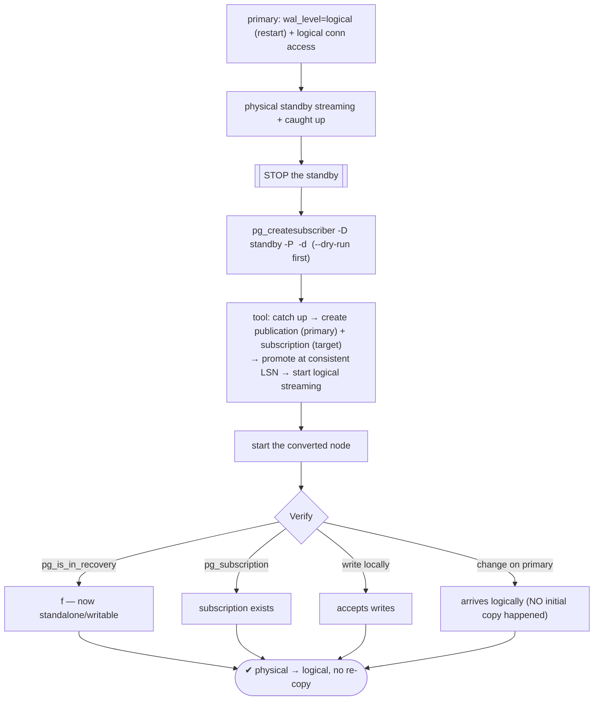

# Lab 35 — `pg_createsubscriber` (PG17): Convert a Physical Standby into a Logical Subscriber

> **Track A · DBA · A4 Replication & High Availability · Lab 10 of 11 (Lab 35/222)**
> Teaching package: concept → diagram → steps → verify → quick-ref → self-test → video script.
> **Depends on:** Labs 26 (physical standby), 33 (logical replication). **New in PostgreSQL 17. Feeds:** Lab 76 (zero-downtime upgrade).

---

## 0. Lab Card (at a glance)

| Field | Value |
|---|---|
| **Objective** | Use `pg_createsubscriber` to convert an existing physical standby into a logical subscriber **without** re-copying the data, and confirm it's now a writable, logically-replicating node. |
| **Success criterion** | The former standby is no longer in recovery, carries a subscription, is writable, and receives logical changes from the primary — with **no** initial data copy. |
| **Scope boundary** | The conversion itself. The full upgrade workflow it enables is Lab 76. |
| **Prereqs** | Primary `wal_level=logical`; a caught-up physical standby; PG17 |
| **Time** | 30–45 min |
| **Difficulty** | ★★★★☆ |
| **Risk** | **Medium** — conversion is **one-way**; the node stops being a physical standby. |

---

## 1. Learning Objectives

1. **What it does** — turn a physical standby into a logical subscriber, reusing existing data.
2. **The step it skips** — the expensive logical-replication **initial copy**.
3. **The prerequisites** — `wal_level=logical`, standby **stopped** and caught up, PG17.
4. **Before vs after** — read-only physical standby → writable logical subscriber.
5. **Why it matters** — near-zero-downtime major upgrades.

---

## 2. Concept Primer — the "why"

**The pain it removes.** Setting up logical replication normally (Lab 33) requires an **initial data copy**: the subscriber snapshots every published table from the publisher. For a large database that's copying the **whole dataset again** over the network — slow and I/O-heavy. But a **physical standby** is already a **byte-identical copy** of the primary. **`pg_createsubscriber` reuses that data**: it converts the standby into a logical subscriber, cutting over from physical streaming to logical replication at a **consistent LSN** — **no re-copy**. A 1 TB database that would take hours to snapshot converts in moments.

**What the tool does (run on the standby):**
1. Ensures the standby is **caught up** to a consistent point.
2. Creates a **publication** on the primary (for the specified database's tables) and a matching **subscription** on the target.
3. **Promotes** the standby out of recovery at the consistent LSN.
4. Starts the subscription streaming **logical** changes from that LSN forward — the data is already present, so nothing is copied.

Result: the former standby is now an **independent, writable** database that also **subscribes** to the primary's changes logically.

**Prerequisites (get these right or it fails):**
- **Primary `wal_level=logical`** (restart) — logical replication needs it. The standby inherits it.
- **Target is a caught-up physical standby**, and it must be **stopped** when you run the tool (it operates on the standby's data dir, starting/stopping it internally).
- **PG17** for the tool; both nodes at the same major version at conversion time (physical replication requires it).
- The primary allows **logical connections** for the conversion role (repl + a `pg_hba` line for the database).
- Enough `max_replication_slots` / logical workers.
- **`--dry-run`** to preview.

**Before vs after:**

| | Physical standby (before) | Logical subscriber (after) |
|---|---|---|
| Recovery | in recovery (read-only) | promoted (writable) |
| Level | block-level, whole cluster | row-level, per-database |
| Version | same as primary | can now be upgraded independently |
| Reversible | — | **no** (one-way conversion) |

**Why this is the upgrade unlock (Lab 76 preview).** Because the converted node is a **writable, cross-version-capable** logical subscriber, you can then `pg_upgrade` **it** to a new major version while logical replication keeps it in sync — then switch the app over with minimal downtime. `pg_createsubscriber` is the fast bridge from "physical standby" to "logical replica ready to upgrade."

---

## 3. Diagrams

### 3.1 Conversion flow



### 3.2 Before / after

```mermaid
flowchart LR
    subgraph BEFORE [physical standby]
      P1["primary"] -->|WAL blocks, whole cluster| S1["standby (read-only, in recovery)"]
    end
    subgraph AFTER [logical subscriber]
      P2["primary (publisher)"] -->|logical row changes| S2["former standby → WRITABLE subscriber<br/>(reused existing data, no copy)"]
    end
    BEFORE -->|pg_createsubscriber (one-way)| AFTER
    note["skips the initial snapshot · cutover at consistent LSN · enables cross-version upgrade"]
```

---

## 4. Prerequisites — primary + a fresh physical standby

```bash
PRIMARY_PORT=5432        # use your current primary's port

# primary must be wal_level=logical (from Lab 33) + allow logical connections:
sudo -u postgres psql -p $PRIMARY_PORT -c "SHOW wal_level;"      # logical
HBA=$(sudo -u postgres psql -p $PRIMARY_PORT -tAc "SHOW hba_file;")
grep -q "host  *benchdb  *repl" "$HBA" || echo "host benchdb repl 127.0.0.1/32 scram-sha-256" | sudo tee -a "$HBA"
sudo systemctl reload postgresql-17

# build a fresh physical standby to convert:
sudo rm -rf /pgdata/17/pgcs && sudo mkdir -p /pgdata/17/pgcs && sudo chown -R postgres:postgres /pgdata/17/pgcs && sudo chmod 0700 /pgdata/17/pgcs
sudo restorecon -Rv /pgdata/17/pgcs 2>/dev/null || true
sudo -u postgres env PGPASSWORD='ReplPass!1' pg_basebackup -h 127.0.0.1 -p $PRIMARY_PORT -U repl -D /pgdata/17/pgcs -Fp -X stream -R -P
echo "port = 5455" | sudo -u postgres tee -a /pgdata/17/pgcs/postgresql.conf
sudo semanage port -a -t postgresql_port_t -p tcp 5455 2>/dev/null || true
sudo -u postgres sed -i "s/primary_conninfo = '/primary_conninfo = 'password=ReplPass!1 /" /pgdata/17/pgcs/postgresql.auto.conf 2>/dev/null || true
sudo -u postgres pg_ctl -D /pgdata/17/pgcs -l /tmp/pgcs.log start
sleep 4
sudo -u postgres psql -p 5455 -c "SELECT pg_is_in_recovery();"   # t (physical standby, caught up)
```

---

## 5. Step-by-Step

### Step 1 — Stop the standby (the tool needs it stopped)

```bash
sudo -u postgres pg_ctl -D /pgdata/17/pgcs stop
```

### Step 2 — Preview the conversion with `--dry-run`

```bash
sudo -u postgres /usr/pgsql-17/bin/pg_createsubscriber \
  -D /pgdata/17/pgcs \
  -P "host=127.0.0.1 port=$PRIMARY_PORT dbname=benchdb user=repl password=ReplPass!1" \
  -p 5455 \
  -d benchdb \
  --dry-run
#   reports what it WOULD do — no changes
```

### Step 3 — Run the conversion

```bash
sudo -u postgres /usr/pgsql-17/bin/pg_createsubscriber \
  -D /pgdata/17/pgcs \
  -P "host=127.0.0.1 port=$PRIMARY_PORT dbname=benchdb user=repl password=ReplPass!1" \
  -p 5455 \
  -d benchdb
#   catches up → creates pub on primary + sub on target → promotes at consistent LSN
```

### Step 4 — Start the converted node

```bash
sudo -u postgres pg_ctl -D /pgdata/17/pgcs -l /tmp/pgcs.log start
sleep 3
```

### Step 5 — Verify it's now a writable logical subscriber

```bash
# no longer a physical standby:
sudo -u postgres psql -p 5455 -c "SELECT pg_is_in_recovery();"                   # f
# a subscription now exists:
sudo -u postgres psql -p 5455 -d benchdb -c "SELECT subname, subenabled FROM pg_subscription;"
# it's WRITABLE (create a local-only table):
sudo -u postgres psql -p 5455 -d benchdb -c "CREATE TABLE local_only(x int); INSERT INTO local_only VALUES (1); SELECT 'writable' AS ok;"
```

### Step 6 — Prove logical changes flow (no initial copy happened)

```bash
sudo -u postgres psql -p $PRIMARY_PORT -d benchdb -c "INSERT INTO pgbench_branches (bid, bbalance) VALUES (99, 12345) ON CONFLICT DO NOTHING;"
sleep 2
sudo -u postgres psql -p 5455 -d benchdb -c "SELECT bbalance FROM pgbench_branches WHERE bid=99;"   # 12345 — arrived logically
sudo -u postgres psql -p 5455 -x -c "SELECT subname, received_lsn, latest_end_lsn FROM pg_stat_subscription;"
```

---

## 6. Verification Checklist

- [ ] Primary `wal_level=logical`; standby was caught up and **stopped** before conversion
- [ ] `--dry-run` previewed without changes
- [ ] Converted node: `pg_is_in_recovery()` = **f**
- [ ] A subscription exists in `pg_subscription`
- [ ] The node is **writable** (local table created)
- [ ] A new change on the primary arrives via **logical** replication
- [ ] No initial data copy occurred (existing standby data reused)

---

## 7. Troubleshooting

| Symptom | Cause | Fix |
|---|---|---|
| Conversion fails: `wal_level` too low | Primary not `logical` | Set `wal_level=logical` on the primary + restart |
| "target server must be shut down" | Standby still running | Stop it before running the tool |
| Standby not caught up / can't reach primary | Replication unhealthy | Ensure it's streaming and caught up first |
| Auth/connection failure | Missing logical `pg_hba` line / access | Add `host benchdb repl …`; grant access; fix conninfo |
| Version mismatch | Nodes not both PG17 | Use matching major versions for the physical phase |
| Not enough slots/workers | Limits too low | Raise `max_replication_slots` / logical workers |
| Realized it was a mistake | Conversion is **one-way** | Can't revert — rebuild a physical standby if needed |

---

## 8. Quick Reference Card (paste-ready)

```bash
PRIMARY_PORT=5432
# 1. primary wal_level=logical (+ logical pg_hba: host benchdb repl <ip>/32 scram-sha-256)
sudo -u postgres psql -p $PRIMARY_PORT -c "SHOW wal_level;"    # logical

# 2. have a caught-up physical standby (built via pg_basebackup -R), then STOP it
sudo -u postgres pg_ctl -D /pgdata/17/pgcs stop

# 3. preview, then convert
sudo -u postgres pg_createsubscriber -D /pgdata/17/pgcs \
  -P "host=127.0.0.1 port=$PRIMARY_PORT dbname=benchdb user=repl password=ReplPass!1" \
  -p 5455 -d benchdb --dry-run
sudo -u postgres pg_createsubscriber -D /pgdata/17/pgcs \
  -P "host=127.0.0.1 port=$PRIMARY_PORT dbname=benchdb user=repl password=ReplPass!1" \
  -p 5455 -d benchdb

# 4. start + verify
sudo -u postgres pg_ctl -D /pgdata/17/pgcs -l /tmp/pgcs.log start
sudo -u postgres psql -p 5455 -c "SELECT pg_is_in_recovery();"                # f
sudo -u postgres psql -p 5455 -d benchdb -c "SELECT subname FROM pg_subscription;"

# skips the initial COPY (reuses standby data) · consistent-LSN cutover · ONE-WAY · enables cross-version upgrade (Lab 76)
```

---

## 9. Self-Check

1. What does `pg_createsubscriber` convert, and what expensive step does it skip?
2. What is its primary real-world use case?
3. What three prerequisites must hold before running it?
4. What state is the target in before vs after conversion?
5. Is the conversion reversible?
6. Why is it faster than setting up logical replication from scratch?

<details>
<summary>Answers</summary>

1. It converts a **physical standby** into a **logical subscriber**, skipping the **initial data copy** (it reuses the standby's existing data).
2. **Near-zero-downtime major upgrades** (and fast creation of a logical replica from an existing standby).
3. Primary `wal_level=logical`; the target is a **caught-up physical standby that is stopped**; PG17 (with logical-connection access).
4. Before: a read-only physical standby in recovery. After: a **writable, standalone logical subscriber**.
5. **No** — it's a one-way conversion; the node is no longer a physical standby.
6. It reuses the standby's already-present data and cuts over at a consistent LSN, so **no snapshot copy** is needed.
</details>

---

## 10. Video / Teaching Script

| # | On screen | Say (narration) |
|---|---|---|
| 1 | Title: "PostgreSQL 17: physical standby → logical replica, instantly" | "Setting up logical replication normally means copying the whole database again. If you already have a physical standby, PostgreSQL 17 lets you skip that entirely." |
| 2 | prereqs: wal_level=logical + standby | "The primary needs logical WAL level, and we need a caught-up physical standby — a byte-perfect copy already." |
| 3 | stop standby + `--dry-run` | "Stop the standby, and always dry-run first to see the plan." |
| 4 | `pg_createsubscriber` | "One command converts it: it creates the publication and subscription, promotes the standby at a consistent point, and starts logical streaming — reusing the data that's already there." |
| 5 | verify: recovery=f, subscription, writable | "And now it's a different animal: out of recovery, writable, with a live subscription." |
| 6 | change on primary arrives | "New changes still flow — logically now. No gigabytes re-copied." |
| 7 | upgrade angle | "Why care? This writable logical replica can be upgraded to a new major version while it stays in sync — the foundation of a near-zero-downtime upgrade." |
| 8 | Outro | "A fast bridge from physical to logical. Next: Patroni — automated failover, no human at 3am." |

---

## 11. Glossary

- **`pg_createsubscriber`** — PG17 tool converting a physical standby to a logical subscriber.
- **Initial copy** — the snapshot logical replication normally does (skipped here).
- **Consistent LSN cutover** — the point where physical stops and logical begins.
- **`-P` / `-d` / `-p`** — publisher connection / database(s) / subscriber port.
- **One-way conversion** — cannot revert to a physical standby.
- **Cross-version replication** — logical replication works across major versions (upgrade enabler).

---
*NETAPORT lab series · PostgreSQL 17 on AlmaLinux 9 · Lab 35/222 · A4 Replication & High Availability*
