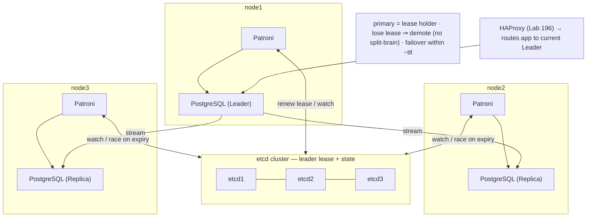

# Lab 36 — Deploy Patroni + etcd for Automated Failover; Kill the Primary, Watch Leader Election

> **Track A · DBA · A4 Replication & High Availability · Lab 11 of 11 (Lab 36/222 · A4 complete)**
> Teaching package: concept → diagram → steps → verify → quick-ref → self-test → video script.
> **Depends on:** Labs 26–35 — Patroni automates all of it (replication, promotion, `pg_rewind`, fencing).
> **Multi-node:** uses the 3-VM rig (node1/node2/node3).

---

## 0. Lab Card (at a glance)

| Field | Value |
|---|---|
| **Objective** | Stand up a Patroni + etcd HA cluster across 3 nodes, then kill the leader and watch Patroni elect and promote a new leader automatically. |
| **Success criterion** | `patronictl list` shows one Leader + replicas; killing the leader triggers automatic promotion of a replica within ~`ttl` seconds; the old node rejoins as a replica. |
| **Scope boundary** | Automated failover with etcd DCS. App routing (HAProxy) is Lab 196. |
| **Prereqs** | 3 AlmaLinux 9 nodes with PostgreSQL 17 installed; network between them; Python 3 |
| **Time** | 60–90 min |
| **Difficulty** | ★★★★★ |
| **Risk** | Medium — a distributed system; test in the lab rig, not production. |

---

## 1. Learning Objectives

1. **Why automated HA** — manual failover (Labs 30–31) is too slow and error-prone at 3 a.m.
2. **The DCS (etcd)** — a consistent store holding cluster state + the leader lease.
3. **Leader election** — TTL lease, renewal, and the promotion race.
4. **Split-brain prevention** — lose the lease → demote yourself.
5. **Self-healing** — the old primary rejoins as a replica (via `pg_rewind`).

---

## 2. Concept Primer — the "why"

**Manual failover doesn't scale to real outages.** Labs 30–31 needed a human to detect the failure, promote a standby, fence the old primary, and repoint the app — minutes of downtime and a real split-brain risk. **Automated HA** does all of it in **seconds**, correctly, every time.

**Patroni** is an HA orchestrator: an agent runs on **each** PostgreSQL node and manages its PostgreSQL (start/stop/promote/reconfigure). The agents coordinate through a **Distributed Configuration Store (DCS)**.

**etcd** is that DCS — a distributed, strongly-consistent key-value store (Raft consensus). It holds the cluster's state and, crucially, the **leader lease**. etcd needs an **odd** number of nodes for quorum (3 survives one failure).

**Leader election via a TTL lease.** The primary holds a **leader key** in etcd with a **time-to-live** (default `ttl=30s`). It must **renew** the lease every loop (`loop_wait=10s`). Replicas **watch** that key. If the primary dies and can't renew, the lease **expires**; the remaining nodes each check that they're healthy and sufficiently caught up, and the best candidate **acquires the leader key** and Patroni **promotes** its PostgreSQL. Failover happens within roughly `ttl` seconds — **no human**.

**Split-brain is prevented by design.** Being primary requires **holding the lease**. A node that loses it (crash, network partition, can't reach etcd) **demotes itself** to a replica. So two primaries can't coexist — the fencing problem from Lab 30 is solved structurally. (`maximum_lag_on_failover` also refuses to promote a replica that's too far behind, bounding data loss.)

**Self-healing.** When the old primary returns, it sees it no longer holds the lease and Patroni **demotes** it to a replica of the new leader — using **`pg_rewind`** (Lab 31, hence `use_pg_rewind: true` + `wal_log_hints`) to reattach without a full rebuild.

**Management.** `patronictl` (CLI) and a REST API on each node (`:8008`) show cluster state and drive planned `switchover`/`failover`. A proxy (HAProxy, Lab 196) uses the REST health endpoints to always route the app to the current leader.

---

## 3. Diagrams

### 3.1 Deploy + failover flow

```mermaid
flowchart TD
    A["3-node etcd cluster (DCS)"] --> B["Patroni on node1/2/3 (patroni.yml)"]
    B --> C["node1 bootstraps as Leader (holds lease)<br/>node2/3 clone as replicas"]
    C --> D["patronictl list → 1 Leader + 2 Replicas"]
    D --> E[[KILL node1 (the leader)]]
    E --> F["leader lease not renewed → EXPIRES in etcd (~ttl)"]
    F --> G["healthy, caught-up replica acquires the leader key"]
    G --> H["Patroni PROMOTES it → new Leader"]
    H --> I["patronictl list → NEW Leader"]
    I --> J["node1 returns → demoted → pg_rewind → rejoins as Replica"]
    J --> K([✔ automated failover + self-heal])
```

### 3.2 Architecture



---

## 4. Prerequisites

```bash
# on ALL 3 nodes: hostnames resolvable + PostgreSQL 17 installed but NOT running a manual cluster
# (Patroni will manage PostgreSQL — stop/disable the plain service so it doesn't conflict)
sudo systemctl disable --now postgresql-17
# name resolution (or DNS):
echo "<node1-ip> node1
<node2-ip> node2
<node3-ip> node3" | sudo tee -a /etc/hosts
sudo dnf install -y etcd python3-pip
sudo pip3 install "patroni[etcd3]" psycopg2-binary
```

---

## 5. Step-by-Step

### Step 1 — Configure a 3-node etcd cluster (on each node)

```bash
# /etc/etcd/etcd.conf on node1 (repeat on node2/node3 with that node's name/IP):
sudo tee /etc/etcd/etcd.conf >/dev/null <<EOF
ETCD_NAME=node1
ETCD_DATA_DIR=/var/lib/etcd
ETCD_LISTEN_PEER_URLS=http://<node1-ip>:2380
ETCD_LISTEN_CLIENT_URLS=http://<node1-ip>:2379,http://127.0.0.1:2379
ETCD_INITIAL_ADVERTISE_PEER_URLS=http://<node1-ip>:2380
ETCD_ADVERTISE_CLIENT_URLS=http://<node1-ip>:2379
ETCD_INITIAL_CLUSTER=node1=http://<node1-ip>:2380,node2=http://<node2-ip>:2380,node3=http://<node3-ip>:2380
ETCD_INITIAL_CLUSTER_STATE=new
ETCD_INITIAL_CLUSTER_TOKEN=pg-etcd
EOF
sudo systemctl enable --now etcd
# after all 3 are up:
etcdctl --endpoints=http://<node1-ip>:2379 endpoint health
etcdctl --endpoints=http://<node1-ip>:2379 member list
```

### Step 2 — Write `patroni.yml` (per node; node1 shown)

```bash
sudo mkdir -p /etc/patroni && sudo tee /etc/patroni/patroni.yml >/dev/null <<'EOF'
scope: pgcluster
name: node1
restapi:
  listen: 0.0.0.0:8008
  connect_address: node1:8008
etcd3:
  hosts: node1:2379,node2:2379,node3:2379
bootstrap:
  dcs:
    ttl: 30
    loop_wait: 10
    retry_timeout: 10
    maximum_lag_on_failover: 1048576
    postgresql:
      use_pg_rewind: true
      parameters:
        wal_level: replica
        hot_standby: "on"
        wal_log_hints: "on"
        max_wal_senders: 10
        max_replication_slots: 10
  initdb:
    - encoding: UTF8
    - data-checksums
  pg_hba:
    - host replication replicator 0.0.0.0/0 scram-sha-256
    - host all all 0.0.0.0/0 scram-sha-256
postgresql:
  listen: 0.0.0.0:5432
  connect_address: node1:5432
  data_dir: /var/lib/pgsql/17/patroni
  bin_dir: /usr/pgsql-17/bin
  authentication:
    replication: {username: replicator, password: ReplPass!1}
    superuser: {username: postgres, password: PgPass!1}
EOF
# on node2/node3: change name and the two connect_address lines to that node
```

### Step 3 — A systemd unit for Patroni (each node)

```bash
sudo tee /etc/systemd/system/patroni.service >/dev/null <<'EOF'
[Unit]
Description=Patroni PostgreSQL HA
After=network-online.target etcd.service
Wants=network-online.target
[Service]
Type=simple
User=postgres
Group=postgres
ExecStart=/usr/local/bin/patroni /etc/patroni/patroni.yml
KillMode=process
Restart=on-failure
TimeoutSec=60
[Install]
WantedBy=multi-user.target
EOF
sudo mkdir -p /var/lib/pgsql/17/patroni && sudo chown postgres:postgres /var/lib/pgsql/17/patroni && sudo chmod 0700 /var/lib/pgsql/17/patroni
sudo semanage fcontext -a -t postgresql_db_t "/var/lib/pgsql/17/patroni(/.*)?" 2>/dev/null || true
sudo restorecon -Rv /var/lib/pgsql/17/patroni
sudo systemctl daemon-reload
```

### Step 4 — Start Patroni: node1 bootstraps, others clone

```bash
# node1 first (it bootstraps the cluster and becomes leader):
sudo systemctl enable --now patroni      # on node1
# then node2, then node3 (they clone from the leader as replicas):
sudo systemctl enable --now patroni      # on node2, node3
sleep 15
```

### Step 5 — Inspect the cluster

```bash
patronictl -c /etc/patroni/patroni.yml list
#   + Cluster: pgcluster -----+---------+---------+----+-----------+
#   | Member | Host  | Role    | State   | TL | Lag in MB |
#   | node1  | node1 | Leader  | running |  1 |           |
#   | node2  | node2 | Replica | running |  1 |         0 |
#   | node3  | node3 | Replica | running |  1 |         0 |
```

### Step 6 — Kill the leader and watch automatic failover

```bash
# on node1 (the current leader) — simulate a crash:
sudo systemctl stop patroni      # (or 'kill -9' the postgres, or power off the VM)

# on node2/node3, watch the election happen (within ~ttl seconds):
watch -n 2 "patronictl -c /etc/patroni/patroni.yml list"
#   node1 → disappears/stopped; a replica is PROMOTED to Leader (new TL); the other follows it
```

### Step 7 — Bring the old leader back; it self-heals as a replica

```bash
# on node1:
sudo systemctl start patroni
sleep 15
patronictl -c /etc/patroni/patroni.yml list
#   node1 rejoins as Replica (Patroni pg_rewinds it to follow the new leader)
```

---

## 6. Verification Checklist

- [ ] 3-node etcd healthy (`etcdctl endpoint health`)
- [ ] `patronictl list` shows one **Leader** + two **Replicas**, lag ~0
- [ ] Killing the leader promotes a replica **automatically** (~`ttl`)
- [ ] Timeline increments on the new leader
- [ ] The other replica follows the new leader
- [ ] The old leader rejoins as a **Replica** (self-heal via `pg_rewind`)
- [ ] No split-brain occurred at any point

---

## 7. Troubleshooting

| Symptom | Cause | Fix |
|---|---|---|
| Patroni won't start / can't reach etcd | etcd down or `hosts` wrong | `etcdctl endpoint health`; fix etcd; check `etcd3.hosts` |
| No leader elected | etcd quorum lost (need majority) | Keep ≥2 of 3 etcd nodes up |
| Replica won't join | Replication auth/pg_hba | Check Patroni-managed `pg_hba`, `replicator` password |
| Failover too slow | `ttl`/`loop_wait` high | Lower them (too low → false failovers on transient blips) |
| Old leader won't rejoin (full reinit) | `pg_rewind` prereq missing | Ensure `use_pg_rewind: true` + `wal_log_hints: on` |
| A laggy replica isn't promoted | `maximum_lag_on_failover` exceeded | Expected (data-loss guard); tune if needed |
| `patronictl list` empty | Wrong `scope`/`-c` file | Point at the right `patroni.yml`/scope |

---

## 8. Quick Reference Card (paste-ready)

```bash
# etcd (3 nodes, odd for quorum) — per-node /etc/etcd/etcd.conf with all 3 in ETCD_INITIAL_CLUSTER
sudo systemctl enable --now etcd
etcdctl --endpoints=http://<node1-ip>:2379 endpoint health

# patroni (per node): /etc/patroni/patroni.yml (scope, name, etcd3.hosts, bootstrap.dcs, postgresql auth)
sudo pip3 install "patroni[etcd3]" psycopg2-binary
sudo systemctl enable --now patroni     # node1 bootstraps; node2/3 clone as replicas

# inspect + drive
patronictl -c /etc/patroni/patroni.yml list
patronictl -c /etc/patroni/patroni.yml switchover     # planned handover
patronictl -c /etc/patroni/patroni.yml failover        # forced

# FAILOVER TEST: stop patroni on the leader → replica auto-promoted within ~ttl → old node rejoins (pg_rewind)
# key knobs: ttl (failover speed) · loop_wait (check interval) · maximum_lag_on_failover (data-loss guard)
# primary = lease holder · lose lease ⇒ demote (no split-brain) · route app via HAProxy (Lab 196)
```

---

## 9. Self-Check

1. What role does etcd play in a Patroni cluster?
2. How does Patroni elect a leader and detect the primary's failure?
3. How does Patroni structurally prevent split-brain?
4. Why does etcd need an odd number of nodes?
5. What determines how quickly failover happens?
6. How does the old primary rejoin the cluster after a failover?

<details>
<summary>Answers</summary>

1. It's the DCS — a consistent store holding cluster state and the **leader lease**; it coordinates election.
2. The leader holds a **TTL leader key** and renews it each loop; if it stops renewing (dies), the key **expires** and healthy, caught-up replicas race to acquire it — the winner is promoted.
3. Being primary requires **holding the lease**; a node that loses it **demotes itself**, so two primaries can't coexist.
4. For **quorum/majority** in Raft consensus — 3 nodes survive one failure.
5. `ttl` (failover happens within ~`ttl` of the leader's death); `loop_wait` sets the check interval.
6. Patroni **demotes** it and reattaches it as a replica of the new leader using **`pg_rewind`** (needs `wal_log_hints`).
</details>

---

## 10. Video / Teaching Script

| # | On screen | Say (narration) |
|---|---|---|
| 1 | Title: "Failover with no human: Patroni + etcd" | "We've done failover by hand. Now let's make it automatic — the primary dies, and a new one takes over in seconds, correctly, every time." |
| 2 | etcd health | "First, etcd — a consistent store that everyone agrees on. It holds one thing that matters most: who's the leader." |
| 3 | patroni.yml + start | "Patroni runs on each node and manages PostgreSQL. Start node one — it becomes the leader. The others clone themselves as replicas." |
| 4 | `patronictl list` | "There's our cluster: one Leader, two Replicas." |
| 5 | the lease concept | "Here's the trick: the leader holds a lease in etcd and must keep renewing it. Stop renewing, and you stop being leader. That single rule prevents split-brain." |
| 6 | kill the leader + watch | "So — kill the primary. Watch. The lease expires, a replica grabs it, promotes itself… new leader. No pager, no human." |
| 7 | old node rejoins | "And when the old primary comes back? It sees it lost the lease, rewinds itself, and quietly rejoins as a replica." |
| 8 | Outro | "That's real high availability — and it completes our replication track. Self-healing, automatic, safe." |

---

## 11. Glossary

- **Patroni** — HA orchestrator; an agent per PostgreSQL node.
- **etcd / DCS** — distributed consistent store holding cluster state + leader lease.
- **Leader lease (TTL)** — the key the primary must renew; expiry triggers election.
- **`loop_wait` / `ttl`** — check interval / lease lifetime (failover speed).
- **Quorum / Raft** — majority consensus; odd node counts.
- **`patronictl`** — Patroni's CLI (`list`, `switchover`, `failover`).
- **`maximum_lag_on_failover`** — refuses to promote a too-laggy replica.
- **`use_pg_rewind`** — reattach the old primary via `pg_rewind`.

---
*NETAPORT lab series · PostgreSQL 17 on AlmaLinux 9 · Lab 36/222 · **A4 Replication & High Availability complete***
