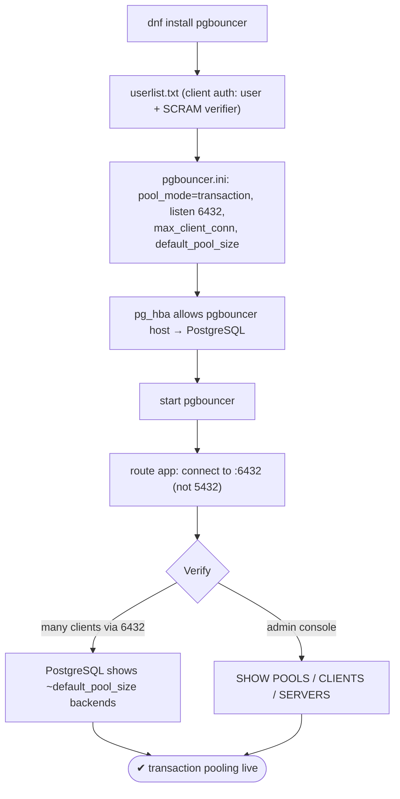
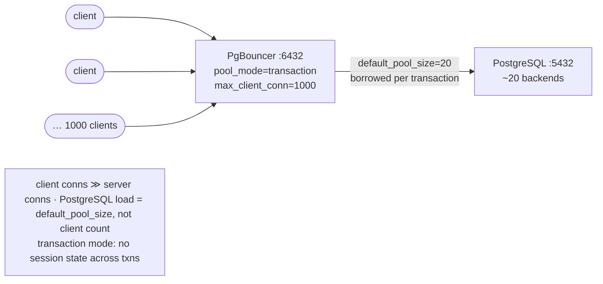

# Lab 37 — Install and Configure PgBouncer (Transaction Pooling); Route the App Through 6432

> **Track A · DBA · A5 Connection Management & Pooling · Lab 1 of 4 (Lab 37/222)**
> Teaching package: concept → diagram → steps → verify → quick-ref → self-test → video script.
> **Depends on:** Labs 01–06 (a running cluster; you know pg_hba/auth). Opens the pooling track.

---

## 0. Lab Card (at a glance)

| Field | Value |
|---|---|
| **Objective** | Install PgBouncer, configure transaction pooling, route clients through port 6432, and confirm that many client connections map to few PostgreSQL backends. |
| **Success criterion** | Clients connect via 6432; under load, PostgreSQL shows only ~`default_pool_size` backends for far more clients; the PgBouncer admin console reports the pools. |
| **Scope boundary** | PgBouncer transaction pooling. Mode comparison is Lab 38; sizing Lab 39; per-role limits Lab 40. |
| **Prereqs** | Labs 01–06; a database + user |
| **Time** | 30–45 min |
| **Difficulty** | ★★★☆☆ |
| **Risk** | Low — additive proxy; PostgreSQL unchanged. |

---

## 1. Learning Objectives

1. **Why pool** — cut the per-connection cost of many short-lived clients.
2. **Transaction pooling** — a server connection is borrowed **per transaction**, and its caveats.
3. **The sizing that matters** — `default_pool_size` vs `max_client_conn`.
4. **Auth flow** — clients authenticate to PgBouncer; PgBouncer authenticates to PostgreSQL.
5. **Route + monitor** — connect via 6432; read the admin console.

---

## 2. Concept Primer — the "why"

**The problem.** Every PostgreSQL connection is a full backend **process** (~5–10 MB + resources). Hundreds or thousands of app connections — common with web/serverless workloads that open many short-lived connections — overwhelm memory, thrash the scheduler, and hit `max_connections`. A **connection pooler** fixes this by **multiplexing** many client connections onto a **small** set of real PostgreSQL backends.

**PgBouncer** is a lightweight, single-process, async pooler. Three modes:

| Mode | Server connection released… | Use |
|---|---|---|
| **session** | when the client disconnects | safest; any feature works; least sharing |
| **transaction** | at the **end of each transaction** | the workhorse — max sharing, minor caveats |
| **statement** | after **each statement** | most aggressive; forbids multi-statement txns |

**Transaction pooling — the efficient default.** A server connection is held **only while a transaction is active**, then returned to the pool. So thousands of mostly-idle clients share a handful of server connections — PostgreSQL only ever sees `default_pool_size` backends per (user, database). This is the mode most modern apps use.

**Its caveats — read these before deploying.** Because a client may land on a *different* server connection each transaction, **session-scoped state doesn't survive across transactions**:
- session-level `SET` (use `SET LOCAL` — transaction-scoped — instead),
- `LISTEN`/`NOTIFY`, advisory locks held across transactions, `WITH HOLD` cursors, temp tables spanning transactions.
- Server-side **prepared statements** historically broke — **PgBouncer 1.21+** supports them in transaction mode via `max_prepared_statements`.

If your app relies on any of the first group, use **session** mode for it. Most web apps are fine with transaction mode.

**The two numbers that matter.**
- `max_client_conn` — how many **client** connections PgBouncer accepts (can be thousands).
- `default_pool_size` — **server** connections per (user, db) pair to PostgreSQL — **this is PostgreSQL's real load**. So `max_connections` on PostgreSQL only needs to cover `default_pool_size × pairs` + overhead, not the client count.

**Auth is two hops.** Client → PgBouncer (via `auth_type` + `auth_file`/`auth_query`), then PgBouncer → PostgreSQL (as the user). PostgreSQL's `pg_hba` must allow **PgBouncer's host** for those users. The `auth_file` (userlist) holds each user's SCRAM verifier; `auth_query` can instead look them up dynamically.

---

## 3. Diagrams

### 3.1 Install + route flow



### 3.2 Multiplexing architecture



---

## 4. Prerequisites

```bash
sudo dnf install -y pgbouncer
# a user with a password (reuse or create):
sudo -u postgres psql -c "SET password_encryption='scram-sha-256'; CREATE ROLE app_user LOGIN PASSWORD 'AppPass!1';" 2>/dev/null || true
sudo -u postgres psql -c "GRANT ALL ON DATABASE benchdb TO app_user;"
```

---

## 5. Step-by-Step

### Step 1 — Build the client auth file (userlist.txt)

```bash
# grab the user's SCRAM verifier from PostgreSQL and put it in the userlist:
VERIFIER=$(sudo -u postgres psql -tAc "SELECT rolpassword FROM pg_authid WHERE rolname='app_user';")
echo "\"app_user\" \"$VERIFIER\"" | sudo tee /etc/pgbouncer/userlist.txt
sudo chown pgbouncer:pgbouncer /etc/pgbouncer/userlist.txt && sudo chmod 600 /etc/pgbouncer/userlist.txt
```

### Step 2 — Configure PgBouncer (transaction mode, port 6432)

```bash
sudo tee /etc/pgbouncer/pgbouncer.ini >/dev/null <<'EOF'
[databases]
benchdb = host=127.0.0.1 port=5432 dbname=benchdb
* = host=127.0.0.1 port=5432

[pgbouncer]
listen_addr = 0.0.0.0
listen_port = 6432
auth_type = scram-sha-256
auth_file = /etc/pgbouncer/userlist.txt
pool_mode = transaction
max_client_conn = 1000
default_pool_size = 20
reserve_pool_size = 5
server_reset_query =
admin_users = app_user
stats_users = app_user
logfile = /var/log/pgbouncer/pgbouncer.log
pidfile = /run/pgbouncer/pgbouncer.pid
EOF
sudo chown pgbouncer:pgbouncer /etc/pgbouncer/pgbouncer.ini
```
*`server_reset_query` is left empty — transaction mode resets automatically; `DISCARD ALL` is for session mode.*

### Step 3 — Allow PgBouncer → PostgreSQL, and open the port

```bash
HBA=$(sudo -u postgres psql -tAc "SHOW hba_file;")
grep -q "host  *benchdb  *app_user" "$HBA" || echo "host benchdb app_user 127.0.0.1/32 scram-sha-256" | sudo tee -a "$HBA"
sudo systemctl reload postgresql-17
sudo semanage port -a -t postgresql_port_t -p tcp 6432 2>/dev/null || true   # if SELinux denies the bind
sudo firewall-cmd --permanent --add-port=6432/tcp 2>/dev/null && sudo firewall-cmd --reload 2>/dev/null || true
```

### Step 4 — Start PgBouncer

```bash
sudo systemctl enable --now pgbouncer
sudo systemctl status pgbouncer --no-pager
ss -tlnp | grep 6432
```

### Step 5 — Route the app through 6432

```bash
PGPASSWORD='AppPass!1' psql "host=127.0.0.1 port=6432 dbname=benchdb user=app_user" \
  -c "SELECT current_user, inet_server_port() AS via, 'through pgbouncer' AS note;"
#   connects via 6432 → PgBouncer → PostgreSQL 5432
```

### Step 6 — Prove pooling: many clients, few backends

```bash
# hammer PgBouncer with 100 clients through 6432:
PGPASSWORD='AppPass!1' pgbench -h 127.0.0.1 -p 6432 -U app_user -c 100 -j 8 -T 20 benchdb >/tmp/pgb.out 2>&1 &

sleep 8
# how many ACTUAL backends does PostgreSQL have for app_user? (far fewer than 100)
sudo -u postgres psql -c "SELECT count(*) AS server_backends FROM pg_stat_activity WHERE usename='app_user';"
wait
```

### Step 7 — Monitor with the admin console

```bash
PGPASSWORD='AppPass!1' psql "host=127.0.0.1 port=6432 dbname=pgbouncer user=app_user" -c "SHOW POOLS;"
#   cl_active / cl_waiting (clients) vs sv_active / sv_idle (server conns) per pool
PGPASSWORD='AppPass!1' psql "host=127.0.0.1 port=6432 dbname=pgbouncer user=app_user" -c "SHOW STATS;"
```

---

## 6. Verification Checklist

- [ ] PgBouncer listening on **6432**
- [ ] `pool_mode = transaction`
- [ ] A client connects through 6432 to `benchdb`
- [ ] Under 100 clients, PostgreSQL shows **≤ default_pool_size** backends for `app_user`
- [ ] Admin console `SHOW POOLS` shows client vs server connection counts
- [ ] `pg_hba` allows PgBouncer → PostgreSQL for `app_user`
- [ ] You can name transaction-mode caveats

---

## 7. Troubleshooting

| Symptom | Cause | Fix |
|---|---|---|
| Client auth fails at 6432 | Wrong verifier in userlist / `auth_type` mismatch | Copy the exact `rolpassword`; match `auth_type=scram-sha-256` |
| PgBouncer can't reach PostgreSQL | `pg_hba` missing the PgBouncer host/user | Add `host benchdb app_user 127.0.0.1/32 scram-sha-256`; reload |
| `prepared statement "…" does not exist` | Old PgBouncer + server-side prepares in txn mode | Upgrade to 1.21+ and set `max_prepared_statements`, or use simple query mode |
| LISTEN/temp tables misbehave | Transaction-mode limitation | Use `session` mode for those clients |
| Bind on 6432 denied | SELinux | `semanage port -a -t postgresql_port_t -p tcp 6432` |
| Clients waiting / pool exhausted | `default_pool_size` too small / long transactions | Raise pool size; shorten transactions (Lab 39) |
| Odd session behavior | `server_reset_query` set in txn mode | Leave it empty for transaction mode |

---

## 8. Quick Reference Card (paste-ready)

```bash
sudo dnf install -y pgbouncer
# client auth: user + SCRAM verifier
V=$(sudo -u postgres psql -tAc "SELECT rolpassword FROM pg_authid WHERE rolname='app_user';")
echo "\"app_user\" \"$V\"" | sudo tee /etc/pgbouncer/userlist.txt
sudo chown pgbouncer:pgbouncer /etc/pgbouncer/userlist.txt && sudo chmod 600 /etc/pgbouncer/userlist.txt

# pgbouncer.ini essentials
#   listen_port=6432 | auth_type=scram-sha-256 | auth_file=/etc/pgbouncer/userlist.txt
#   pool_mode=transaction | max_client_conn=1000 | default_pool_size=20 | server_reset_query=
sudo systemctl enable --now pgbouncer

# pg_hba: host benchdb app_user 127.0.0.1/32 scram-sha-256  (reload PostgreSQL)
# route app:
PGPASSWORD=... psql "host=127.0.0.1 port=6432 dbname=benchdb user=app_user"

# monitor (admin db = 'pgbouncer'):
psql "host=127.0.0.1 port=6432 dbname=pgbouncer user=app_user" -c "SHOW POOLS;"   # SHOW CLIENTS/SERVERS/STATS
# PostgreSQL load = default_pool_size (NOT max_client_conn). Transaction mode: no session state across txns.
```

---

## 9. Self-Check

1. What problem does a connection pooler solve?
2. In session / transaction / statement mode, when is a server connection released?
3. What does transaction pooling break, and how do you work around session-`SET`?
4. Which setting determines PostgreSQL's actual connection load — `max_client_conn` or `default_pool_size`?
5. How does the application start using the pooler?
6. How do you monitor PgBouncer?

<details>
<summary>Answers</summary>

1. It multiplexes many client connections onto few real PostgreSQL backends, cutting per-connection memory/scheduling cost.
2. session: at client disconnect; transaction: at end of each transaction; statement: after each statement.
3. Session state across transactions (session `SET`, `LISTEN`/`NOTIFY`, temp tables, cross-txn advisory locks, `WITH HOLD` cursors); use `SET LOCAL` instead of session `SET`.
4. `default_pool_size` (per user/db) — `max_client_conn` is just how many clients PgBouncer accepts.
5. Point its connection at PgBouncer's port **6432** instead of 5432.
6. Connect to the special `pgbouncer` admin database on 6432 and run `SHOW POOLS`/`CLIENTS`/`SERVERS`/`STATS`.
</details>

---

## 10. Video / Teaching Script

| # | On screen | Say (narration) |
|---|---|---|
| 1 | Title: "One thousand clients, twenty connections" | "Each PostgreSQL connection is a whole process. Thousands of them will sink your server. A pooler fixes that." |
| 2 | install + userlist | "PgBouncer sits in front. First, tell it how to authenticate clients — the user's password verifier." |
| 3 | pgbouncer.ini | "The config: transaction mode, port 6432, and the number that matters — default_pool_size. That's all PostgreSQL will actually see." |
| 4 | pg_hba + start | "Let PgBouncer reach PostgreSQL, and start it." |
| 5 | route via 6432 | "Now the app just changes one thing: connect to 6432 instead of 5432." |
| 6 | 100 clients → few backends | "Watch — a hundred clients hammering the pooler, and PostgreSQL? Barely twenty backends. That's the whole point." |
| 7 | caveats | "One warning: in transaction mode, session state doesn't survive between transactions. No session SET, no LISTEN, no temp tables across transactions. Most apps are fine — check yours." |
| 8 | Outro | "Massive connection counts, tiny server footprint. Next: comparing the pooling modes head to head." |

---

## 11. Glossary

- **Connection pooler** — multiplexes client connections onto fewer server backends.
- **PgBouncer** — lightweight async pooler.
- **session / transaction / statement mode** — when a server connection is released.
- **`max_client_conn` / `default_pool_size`** — client cap / server connections per (user, db).
- **`auth_file` (userlist) / `auth_query`** — client auth by static list / dynamic lookup.
- **Admin console** — the `pgbouncer` pseudo-database; `SHOW POOLS` etc.
- **`server_reset_query`** — cleanup between uses (session mode).

---
*NETAPORT lab series · PostgreSQL 17 on AlmaLinux 9 · Lab 37/222 · A5 Connection Management & Pooling*
