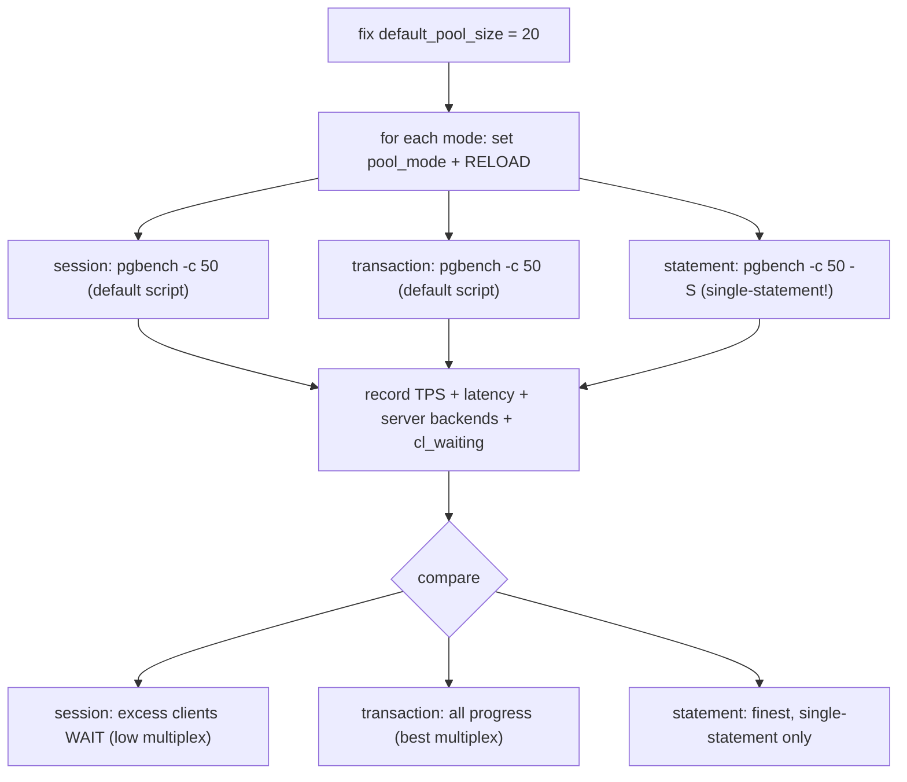
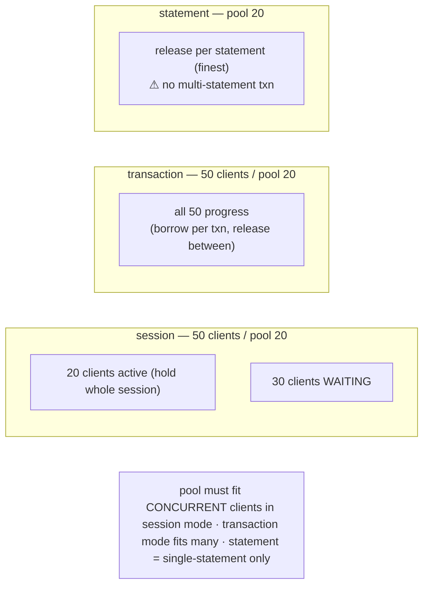

# Lab 38 — Compare session vs transaction vs statement Pooling Modes Under `pgbench -c`

> **Track A · DBA · A5 Connection Management & Pooling · Lab 2 of 4 (Lab 38/222)**
> Teaching package: concept → diagram → steps → verify → quick-ref → self-test → video script.
> **Depends on:** Lab 37 (PgBouncer installed, routed through 6432).

---

## 0. Lab Card (at a glance)

| Field | Value |
|---|---|
| **Objective** | With a fixed pool size, drive more clients than the pool through each mode and measure TPS, latency, and how many PostgreSQL backends result — making the multiplexing trade-off concrete. |
| **Success criterion** | A recorded per-mode comparison: transaction mode multiplexes best; session mode makes excess clients wait; statement mode works only for single-statement workloads. |
| **Scope boundary** | Mode comparison. Sizing is Lab 39; per-role limits Lab 40. |
| **Prereqs** | Lab 37 (PgBouncer, `default_pool_size=20`) |
| **Time** | 30–45 min |
| **Difficulty** | ★★★☆☆ |
| **Risk** | Low — measurement + config reloads. |

---

## 1. Learning Objectives

1. **Why the mode changes multiplexing** — when a server connection is held vs released.
2. **The pool-exhaustion effect** — session mode when clients > pool.
3. **The statement-mode constraint** — no multi-statement transactions.
4. **Measure it** — TPS/latency + backend count per mode with `pgbench`.

---

## 2. Concept Primer — the "why"

All three modes share the same pool of server connections; they differ in **how long a client keeps one**, which sets the **multiplexing ratio**.

**session mode — hold for the whole session.** A client keeps its server connection from connect to disconnect. So with 50 concurrent clients you need up to **50** server connections *at once*. If `default_pool_size=20`, only 20 clients run; the other **30 wait the entire run** (a session connection frees only on disconnect). Session mode barely multiplexes — the pool must be sized to the number of **concurrent clients**. Its upside: every session feature works.

**transaction mode — hold per transaction.** A client holds a server connection only **while a transaction is active**, then returns it. Between transactions it holds nothing. So a small pool serves **many** clients: 50 clients making short transactions cycle through 20 server connections, all making progress. Best throughput for typical OLTP — at the cost of the session-state caveats (Lab 37).

**statement mode — hold per statement.** The connection returns after **each statement** — finest sharing, but a **multi-statement transaction can't span** it. This is why **pgbench's default script (an explicit multi-statement `BEGIN…COMMIT`) fails in statement mode**; you must test it with a single-statement workload (`-S`, select-only). Statement mode suits autocommit/single-statement apps only.

**The experiment.** Fix `default_pool_size=20`, run `pgbench -c 50` (more clients than the pool):
- **session:** ~20 clients active, ~30 waiting → throughput capped near a 20-client run; PostgreSQL shows ~20 backends held for the whole run.
- **transaction:** all 50 progress via 20 shared connections → higher TPS; ~20 backends, busy per-transaction.
- **statement (`-S`):** similar-to-better sharing on the single-statement workload.

Watch `cl_waiting` in `SHOW POOLS` to *see* clients queueing in session mode.

---

## 3. Diagrams

### 3.1 Compare flow



### 3.2 How long a connection is held



---

## 4. Prerequisites

```bash
# from Lab 37: PgBouncer on 6432, default_pool_size=20, app_user
sudo -u postgres psql -c "SHOW max_connections;"     # ensure > default_pool_size + overhead
PGPASSWORD='AppPass!1' psql "host=127.0.0.1 port=6432 dbname=pgbouncer user=app_user" -c "SHOW CONFIG;" | grep -E "pool_mode|default_pool_size"
```

> Helper to switch mode: edit `pool_mode` in `/etc/pgbouncer/pgbouncer.ini`, then reload PgBouncer.

---

## 5. Step-by-Step

### Step 1 — Baseline: TRANSACTION mode (from Lab 37)

```bash
sudo sed -i 's/^pool_mode = .*/pool_mode = transaction/' /etc/pgbouncer/pgbouncer.ini
sudo systemctl reload pgbouncer
PGPASSWORD='AppPass!1' pgbench -h 127.0.0.1 -p 6432 -U app_user -c 50 -j 8 -T 20 benchdb | grep -E "tps|latency average"
# during the run (another shell): backends + waiting clients
sudo -u postgres psql -c "SELECT count(*) FROM pg_stat_activity WHERE usename='app_user';"
PGPASSWORD='AppPass!1' psql "host=127.0.0.1 port=6432 dbname=pgbouncer user=app_user" -c "SHOW POOLS;" | grep benchdb
```

### Step 2 — SESSION mode (watch clients wait)

```bash
sudo sed -i 's/^pool_mode = .*/pool_mode = session/' /etc/pgbouncer/pgbouncer.ini
sudo systemctl reload pgbouncer
PGPASSWORD='AppPass!1' pgbench -h 127.0.0.1 -p 6432 -U app_user -c 50 -j 8 -T 20 benchdb | grep -E "tps|latency average"
# note cl_waiting climbs — 50 clients, only 20 server conns, the rest queue:
PGPASSWORD='AppPass!1' psql "host=127.0.0.1 port=6432 dbname=pgbouncer user=app_user" -c "SHOW POOLS;" | grep benchdb
```

### Step 3 — STATEMENT mode (single-statement only)

```bash
sudo sed -i 's/^pool_mode = .*/pool_mode = statement/' /etc/pgbouncer/pgbouncer.ini
sudo systemctl reload pgbouncer
# default (multi-statement) pgbench WILL FAIL here — use -S (single SELECT per txn):
PGPASSWORD='AppPass!1' pgbench -h 127.0.0.1 -p 6432 -U app_user -c 50 -j 8 -T 20 -S benchdb | grep -E "tps|latency average"
# prove default fails:
PGPASSWORD='AppPass!1' pgbench -h 127.0.0.1 -p 6432 -U app_user -c 4 -T 3 benchdb 2>&1 | tail -3   # error about statement pooling
```

### Step 4 — Restore transaction mode

```bash
sudo sed -i 's/^pool_mode = .*/pool_mode = transaction/' /etc/pgbouncer/pgbouncer.ini
sudo systemctl reload pgbouncer
```

---

## 6. Verification Checklist & Results Table

- [ ] Same `default_pool_size` and `-c 50` across modes
- [ ] Transaction mode: all clients progress; highest default-script TPS
- [ ] Session mode: `cl_waiting` > 0 (excess clients queue)
- [ ] Statement mode: default multi-statement pgbench **fails**; `-S` works
- [ ] Server backend count ≈ `default_pool_size` in each mode

| Mode | pgbench script | TPS | latency avg | cl_waiting | server backends |
|---|---|---|---|---|---|
| transaction | default | | | | |
| session | default | | | | |
| statement | `-S` only | | | | |

*Expect: transaction best for the default OLTP script; session throttled by pool < clients; statement only viable single-statement.*

---

## 7. Troubleshooting

| Symptom | Cause | Fix |
|---|---|---|
| Statement mode: default pgbench errors | Multi-statement txn can't span statements | Use `-S`; statement mode is single-statement only |
| Session mode: clients hang/time out | `default_pool_size` < concurrent clients | Raise pool to ≥ clients, or use transaction mode |
| No TPS difference between modes | Pool ≥ clients (no contention) or run too short | Use `-c` > pool; longer `-T`; watch `cl_waiting` |
| Mode change didn't apply | Existing conns kept old mode | `systemctl reload pgbouncer` (restart to force all) |
| Backend count differs oddly | Measured outside load | Sample during the run |

---

## 8. Quick Reference Card (paste-ready)

```bash
setmode(){ sudo sed -i "s/^pool_mode = .*/pool_mode = $1/" /etc/pgbouncer/pgbouncer.ini; sudo systemctl reload pgbouncer; }

setmode transaction; PGPASSWORD='AppPass!1' pgbench -h127.0.0.1 -p6432 -U app_user -c50 -j8 -T20 benchdb | grep tps
setmode session;     PGPASSWORD='AppPass!1' pgbench -h127.0.0.1 -p6432 -U app_user -c50 -j8 -T20 benchdb | grep tps
setmode statement;   PGPASSWORD='AppPass!1' pgbench -h127.0.0.1 -p6432 -U app_user -c50 -j8 -T20 -S benchdb | grep tps   # -S required
setmode transaction  # restore

# watch queueing:
PGPASSWORD='AppPass!1' psql "host=127.0.0.1 port=6432 dbname=pgbouncer user=app_user" -c "SHOW POOLS;"
# session: pool must fit CONCURRENT clients · transaction: best multiplex · statement: single-statement only
```

---

## 9. Self-Check

1. In session mode, how many server connections do 50 concurrent clients require?
2. Why does transaction mode multiplex better than session mode?
3. Why does pgbench's default script fail in statement mode?
4. Which mode gives the best TPS for typical OLTP with a small pool, and why?
5. With clients ≫ pool size, what happens in session vs transaction mode?
6. How do you switch modes and make it take effect?

<details>
<summary>Answers</summary>

1. Up to **50** — one server connection per active session; if the pool is smaller, the excess clients wait.
2. It holds a server connection only during a transaction and releases it between, so a few connections serve many clients that are idle between transactions.
3. A multi-statement explicit transaction (`BEGIN…COMMIT`) can't span statements when the connection is released after each statement.
4. **transaction** — brief per-transaction borrowing maximizes sharing across many clients.
5. session: excess clients **wait** the whole run (pool exhausted); transaction: **all** progress by sharing the pool per transaction.
6. Edit `pool_mode` in `pgbouncer.ini` and `reload` (or restart) PgBouncer.
</details>

---

## 10. Video / Teaching Script

| # | On screen | Say (narration) |
|---|---|---|
| 1 | Title: "Three pooling modes, measured" | "Same pool, same clients — but the *mode* decides how much you can share. Let's prove it with numbers." |
| 2 | transaction run | "Transaction mode first: fifty clients, a pool of twenty — and all fifty make progress. That's multiplexing." |
| 3 | session run + `cl_waiting` | "Now session mode. Same setup — but watch clients-waiting climb. Twenty run; thirty queue for the whole test. The pool has to fit every concurrent client." |
| 4 | statement mode fails | "Statement mode is the finest sharing — but try the default workload and it *errors*. Multi-statement transactions can't span it." |
| 5 | statement `-S` works | "Give it a single-statement workload and it runs fine. That's its niche." |
| 6 | results table | "The verdict: transaction mode for typical apps, session when you truly need session state, statement only for single-statement workloads." |
| 7 | Outro | "Pick the mode for your workload. Next: sizing the pool itself against real backend limits." |

---

## 11. Glossary

- **Pooling mode** — when a server connection is released (session / transaction / statement).
- **Multiplexing ratio** — clients served per server connection.
- **Pool exhaustion** — clients waiting because the pool is full (`cl_waiting`).
- **`cl_waiting` / `sv_active`** — queued clients / busy server connections (`SHOW POOLS`).
- **Single-statement constraint** — statement mode forbids multi-statement transactions.
- **TPS / latency** — throughput / response time (pgbench).

---
*NETAPORT lab series · PostgreSQL 17 on AlmaLinux 9 · Lab 38/222 · A5 Connection Management & Pooling*
