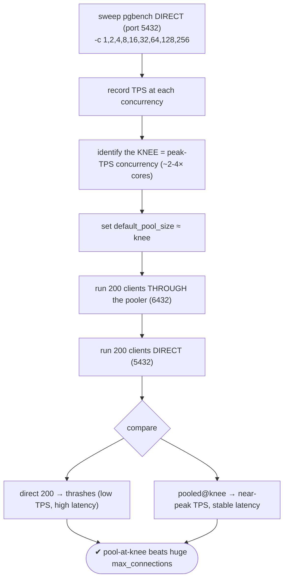
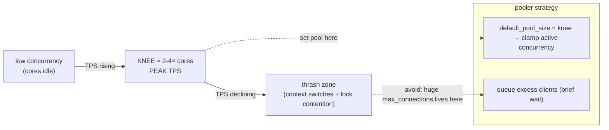

# Lab 39 — `max_connections` vs Pooler Sizing; Find the Point Where the Raw DB Thrashes

> **Track A · DBA · A5 Connection Management & Pooling · Lab 3 of 4 (Lab 39/222)**
> Teaching package: concept → diagram → steps → verify → quick-ref → self-test → video script.
> **Depends on:** Labs 37–38 (PgBouncer, pooling modes) and Lab 9 (pgbench).

---

## 0. Lab Card (at a glance)

| Field | Value |
|---|---|
| **Objective** | Measure PostgreSQL's throughput-vs-concurrency curve, find the "knee" where more connections *reduce* TPS (thrashing), then size a pool near the knee and show it beats a huge `max_connections`. |
| **Success criterion** | A recorded TPS curve showing a peak and decline; a pool sized at the knee delivers higher, stabler throughput for many clients than direct high-concurrency access. |
| **Scope boundary** | The connections/throughput relationship + pool sizing. Per-role limits are Lab 40. |
| **Prereqs** | Labs 37–38; a multi-core VM; a contended workload |
| **Time** | 40–60 min |
| **Difficulty** | ★★★★☆ |
| **Risk** | Low — measurement; brief high-load runs. |

---

## 1. Learning Objectives

1. **Why more connections ≠ more throughput** — the thrashing mechanism.
2. **Find the knee** — sweep concurrency and locate peak TPS.
3. **Size the pool to the knee**, not to the client count.
4. **Right-size `max_connections`** — pool size × pools + overhead, not thousands.
5. **Prove it** — pooled-at-knee vs direct high concurrency.

---

## 2. Concept Primer — the "why"

**The counterintuitive truth: past a point, more connections mean *less* work done.** People crank `max_connections` to thousands so every client gets a backend. Under real concurrency that **thrashes** the database:
- **CPU** — you have N cores. Beyond roughly **2–4× cores of *active* connections**, backends spend their time context-switching and contending, not doing useful work.
- **Lock/latch contention** — more concurrent transactions fight over shared locks (ProcArrayLock, buffer partitions, LWLocks), and contention rises non-linearly.
- **Memory** — each active backend uses `work_mem`, temp, etc.; more of them → pressure and OOM risk (Labs 8–9).

**The throughput curve.** Plot TPS against concurrency and you get: a **rise** (adding parallelism helps while cores are idle), a **peak** (the "knee," ~2–4× cores for mixed OLTP), then a **decline** (the thrash zone — overhead exceeds useful work). Beyond the knee, adding connections **hurts**.

**So a pooler with a *small* pool beats a huge `max_connections`.** Instead of letting 1,000 clients open 1,000 backends and thrash, a pooler holds server concurrency at the **knee** (`default_pool_size ≈ peak-TPS concurrency`) and **queues** the rest — clients wait a few milliseconds instead of the whole database grinding. Total throughput stays near peak and latency stays stable. And `max_connections` on PostgreSQL then only needs to cover `default_pool_size × pools + reserved + admin` — far smaller than the client count. (A very high `max_connections` also wastes memory even when idle: several shared structures are **sized at startup** for it.)

**How you'll find the knee.** Run `pgbench` **directly** against PostgreSQL (bypass the pooler) at increasing `-c`: 1, 2, 4, 8, 16, 32, 64, 128, 256. Record TPS at each. The concurrency with the **highest TPS** is your knee. Then set `default_pool_size` there and compare: 200 clients **through the pooler** vs 200 clients **direct** — the direct run thrashes; the pooled run holds near peak.

**Signs of thrashing while it happens:** TPS falling and latency rising as `-c` grows; CPU near 100% with high **context switches** (`vmstat` `cs`); many backends in `pg_stat_activity` waiting on `LWLock`/`Lock`; load average above the core count.

---

## 3. Diagrams

### 3.1 Find-the-knee flow



### 3.2 The throughput curve (shape)



---

## 4. Prerequisites

```bash
CORES=$(nproc); echo "cores: $CORES  → expect the knee near $((CORES*2)) to $((CORES*4)) active connections"
# ensure max_connections is high enough to run the sweep directly:
sudo -u postgres psql -c "SHOW max_connections;"        # needs to exceed your top -c (e.g. 256 → set 300)
# if too low: ALTER SYSTEM SET max_connections=300; restart  (postmaster param)
sudo -u postgres psql -c "SELECT 1 FROM pg_database WHERE datname='benchdb';" | grep -q 1 || sudo -u postgres pgbench -i -s 50 benchdb
```

---

## 5. Step-by-Step

### Step 1 — Sweep concurrency DIRECTLY against PostgreSQL (find the knee)

```bash
echo "clients  tps" | tee /tmp/curve.txt
for c in 1 2 4 8 16 32 64 128 256; do
  # warm once, then measure
  sudo -u postgres pgbench -c $c -j $(( c<8 ? c : 8 )) -T 8 benchdb >/dev/null 2>&1
  tps=$(sudo -u postgres pgbench -c $c -j $(( c<8 ? c : 8 )) -T 15 benchdb 2>/dev/null | awk '/^tps/{print $3; exit}')
  printf "%-8s %s\n" "$c" "$tps" | tee -a /tmp/curve.txt
done
cat /tmp/curve.txt
#   TPS should rise, PEAK around 2-4× cores, then DECLINE — the peak row is your KNEE
```

### Step 2 — Watch the thrash directly (during a high-c run)

```bash
# in one shell, a heavy run:
sudo -u postgres pgbench -c 256 -j 8 -T 30 benchdb >/dev/null 2>&1 &
# in another, observe overhead + lock waits:
vmstat 2 5                                   # 'cs' (context switches) + high 'sy' during thrash
sudo -u postgres psql -c "SELECT wait_event_type, count(*) FROM pg_stat_activity WHERE state='active' GROUP BY 1 ORDER BY 2 DESC;"
uptime                                       # load average vs cores
wait
```

### Step 3 — Size the pool at the knee

```bash
KNEE=$(( $(nproc) * 3 ))     # start from the rule of thumb; refine to your curve's peak
sudo sed -i "s/^default_pool_size = .*/default_pool_size = $KNEE/" /etc/pgbouncer/pgbouncer.ini
sudo sed -i 's/^pool_mode = .*/pool_mode = transaction/' /etc/pgbouncer/pgbouncer.ini
sudo systemctl reload pgbouncer
echo "pool sized at $KNEE"
```

### Step 4 — Compare: 200 clients pooled@knee vs 200 direct

```bash
echo "== 200 clients THROUGH pooler (clamped at $KNEE) =="
PGPASSWORD='AppPass!1' pgbench -h 127.0.0.1 -p 6432 -U app_user -c 200 -j 8 -T 20 benchdb | grep -E "tps|latency average"

echo "== 200 clients DIRECT (thrash) =="
sudo -u postgres pgbench -c 200 -j 8 -T 20 benchdb | grep -E "tps|latency average"
# pooled@knee should show HIGHER, stabler TPS than direct-200
```

---

## 6. Verification Checklist & Results Table

- [ ] Swept `-c` directly; recorded TPS at each concurrency
- [ ] TPS shows a **peak then decline** (a knee exists)
- [ ] Observed thrash signs (high `cs`, lock waits, load > cores) at high `-c`
- [ ] `default_pool_size` set near the knee
- [ ] 200 clients pooled@knee > 200 clients direct (TPS + latency)
- [ ] `max_connections` sized to pool × pools + overhead, not client count

| Direct `-c` | TPS | | Scenario | TPS | latency avg |
|---|---|---|---|---|---|
| 1 | | | 200 pooled@knee | | |
| 8 | | | 200 direct | | |
| **knee (peak)** | | | | | |
| 256 (thrash) | | | | | |

---

## 7. Troubleshooting

| Symptom | Cause | Fix |
|---|---|---|
| No knee / TPS keeps rising | Workload I/O-bound or fits cache; too few clients vs cores | Push `-c` to 8–16× cores; use the write (default) script |
| Can't run high `-c` | `max_connections` too low for the sweep | Temporarily raise it (restart) to exceed top `-c` |
| OOM at high `-c` | `work_mem × active connections` | Lower `work_mem`/`-c` (Labs 8–9) |
| Pooled run not better | Pool too high (still thrashing) or too low (idle) | Set `default_pool_size` at the measured knee |
| Noisy TPS | Cold cache / single run / other load | Warm first, median of runs, isolate the VM |
| Latency spikes pooled | Pool a touch small for arrival rate | Nudge pool up slightly; watch `cl_waiting` |

---

## 8. Quick Reference Card (paste-ready)

```bash
CORES=$(nproc)
# 1. find the knee — sweep DIRECT
for c in 1 2 4 8 16 32 64 128 256; do
  tps=$(sudo -u postgres pgbench -c $c -j $((c<8?c:8)) -T 12 benchdb 2>/dev/null | awk '/^tps/{print $3;exit}')
  echo "$c $tps"
done                         # peak row ≈ knee (~2-4× cores)

# 2. watch thrash
vmstat 2 5                   # high 'cs'/'sy' = context-switch/lock overhead
sudo -u postgres psql -c "SELECT wait_event_type,count(*) FROM pg_stat_activity WHERE state='active' GROUP BY 1 ORDER BY 2 DESC;"

# 3. size pool at knee, compare
sudo sed -i "s/^default_pool_size = .*/default_pool_size = $((CORES*3))/" /etc/pgbouncer/pgbouncer.ini && sudo systemctl reload pgbouncer
PGPASSWORD='AppPass!1' pgbench -h127.0.0.1 -p6432 -U app_user -c200 -j8 -T20 benchdb | grep tps   # pooled@knee
sudo -u postgres pgbench -c200 -j8 -T20 benchdb | grep tps                                         # direct (thrash)

# rules: optimal ACTIVE conns ≈ 2-4× cores | default_pool_size = knee | max_connections = pool×pools + overhead
```

---

## 9. Self-Check

1. Why does throughput decline past a certain concurrency?
2. Roughly what's the optimal number of active connections relative to cores?
3. How should `default_pool_size` relate to the throughput knee?
4. Why does a small pool + queueing beat a huge `max_connections`?
5. What does a very high `max_connections` cost even when connections are idle?
6. Name three signs the database is thrashing.

<details>
<summary>Answers</summary>

1. Past the point where cores are saturated, added backends increase context-switching and lock/latch contention faster than they add useful work.
2. About **2–4× CPU cores** for mixed OLTP.
3. Set it near the **peak-TPS concurrency (the knee)** — not the client count.
4. It clamps active concurrency at the efficient point and queues excess clients briefly, avoiding thrash — so total throughput stays near peak.
5. Memory — several shared structures are **sized at startup** for `max_connections`, consuming RAM regardless of use.
6. TPS falling / latency rising as `-c` grows; high context switches (`vmstat cs`) and system CPU; many backends waiting on `LWLock`/`Lock`; load average above core count.
</details>

---

## 10. Video / Teaching Script

| # | On screen | Say (narration) |
|---|---|---|
| 1 | Title: "More connections, less speed" | "Everyone's instinct is to raise max_connections. It's usually wrong. Past a point, more connections make your database *slower*." |
| 2 | the sweep | "Let's measure. Ramp concurrency and watch the TPS: up, up… then it peaks. That peak is the knee." |
| 3 | past the knee | "Push further and throughput *falls*. The cores are saturated; now it's all context-switching and lock fighting." |
| 4 | vmstat / lock waits | "Here's the thrash in real time — context switches through the roof, backends stuck waiting on locks." |
| 5 | size pool at knee | "So we don't let the flood in. Set the pool at the knee — the efficient point — and queue the rest." |
| 6 | pooled vs direct 200 | "Two hundred clients, direct: thrashing, low throughput. Same two hundred through a pool sized at the knee: near peak, stable. Fewer connections, more work done." |
| 7 | Outro | "Right-size the pool, keep max_connections modest. Next: per-role and per-database connection limits." |

---

## 11. Glossary

- **`max_connections`** — hard cap on backends (sized at startup; restart to change).
- **Thrashing** — throughput falling as concurrency rises past saturation.
- **Throughput curve / knee** — TPS vs concurrency; the peak concurrency.
- **Context switching** — CPU overhead swapping between backends (`vmstat cs`).
- **Lock/latch contention** — backends waiting on shared locks/LWLocks.
- **`default_pool_size`** — pooler's server connections; set at the knee.
- **Active vs idle connections** — running work vs holding a slot.

---
*NETAPORT lab series · PostgreSQL 17 on AlmaLinux 9 · Lab 39/222 · A5 Connection Management & Pooling*
