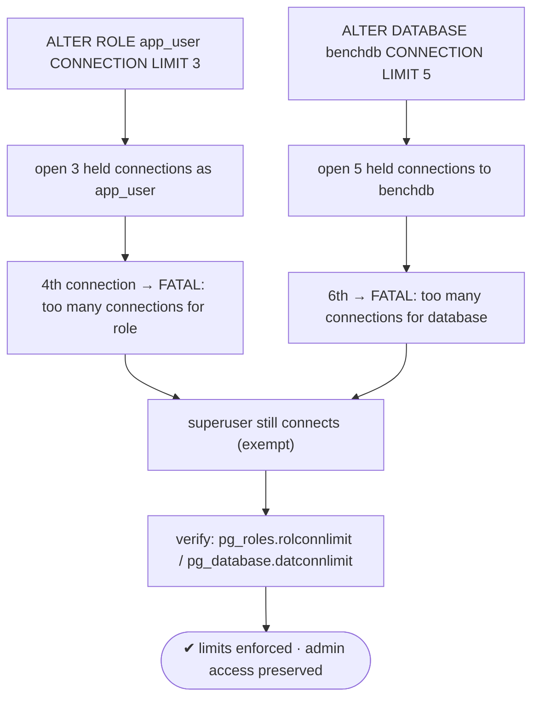
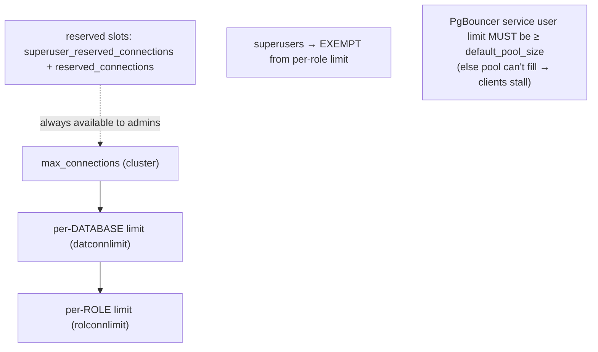

# Lab 40 — Per-Role / Per-DB Connection Limits (`ALTER ROLE … CONNECTION LIMIT`); Test Enforcement

> **Track A · DBA · A5 Connection Management & Pooling · Lab 4 of 4 (Lab 40/222 · A5 complete)**
> Teaching package: concept → diagram → steps → verify → quick-ref → self-test → video script.
> **Depends on:** Labs 37–39 (pooling, max_connections). **Feeds:** Lab 216 (multi-tenant noisy-neighbor control).

---

## 0. Lab Card (at a glance)

| Field | Value |
|---|---|
| **Objective** | Cap concurrent connections per role and per database, prove new connections are rejected at the limit, and understand the superuser exemption and pooler interaction. |
| **Success criterion** | A role/db at its limit rejects further connections with the right error; superusers still connect; catalogs show the limits. |
| **Scope boundary** | Per-role/per-db limits + reserved slots. Full multi-tenancy is Lab 216. |
| **Prereqs** | Labs 37–39; `app_user`, `benchdb` |
| **Time** | 20–30 min |
| **Difficulty** | ★★☆☆☆ |
| **Risk** | Low — limits affect only new connections. |

---

## 1. Learning Objectives

1. **The limit levels** — cluster (`max_connections`), per-database, per-role.
2. **Enforce and test** — hit the cap and see the rejection.
3. **The superuser exemption** — why admin access isn't blocked.
4. **Pooler interaction** — the pooler user's limit must exceed `default_pool_size`.
5. **Reserved slots** — keep admins able to log in when the cluster is full.

---

## 2. Concept Primer — the "why"

**Bounding a noisy neighbor.** On a shared/multi-tenant cluster, one role or database can open connections until nobody else can — starving the OLTP app or locking out admins. Connection limits cap that at two granularities, both independent of the cluster-wide `max_connections`:

- **Per-role:** `ALTER ROLE app_user CONNECTION LIMIT 5;` (or at `CREATE ROLE`). Caps concurrent connections **for that role**. `-1` = unlimited (default).
- **Per-database:** `ALTER DATABASE benchdb CONNECTION LIMIT 20;`. Caps concurrent connections **to that database**. `-1` = unlimited.

Both apply at once: a connection must fit under the database's cap **and** the role's cap **and** `max_connections`.

**Enforcement.** When the cap is reached, a **new** connection is rejected immediately:
- role: `FATAL: too many connections for role "app_user"`
- database: `FATAL: too many connections for database "benchdb"`

Existing connections are unaffected. The change takes effect for new connections instantly (it's a catalog value — no reload).

**The superuser exemption.** Per-role connection limits are **not enforced for superusers**. This is deliberate: an admin must always be able to connect to fix a runaway situation. So don't rely on a per-role limit to bound a superuser role.

**Keeping admins in when the cluster is full.** Even at `max_connections`, two reserves keep privileged logins possible:
- `superuser_reserved_connections` (default 3) — slots only superusers can use.
- `reserved_connections` (PG16+) — slots for roles granted `pg_use_reserved_connections`.
Regular connections are refused once the non-reserved slots fill, but these reserves remain — so you can still get in.

**The pooler interaction (important).** PgBouncer opens its server connections **as a specific user/db**, and those count against **that user's** limit. If you set `app_user`'s limit **below** `default_pool_size`, the pooler can't fill its pool — it gets `too many connections for role`, and clients stall. **Rule:** the pooler user's connection limit must be **≥ `default_pool_size`** (plus any headroom), or don't cap the pooler's service role at all and cap the *tenant* roles/databases instead.

---

## 3. Diagrams

### 3.1 Set + test flow



### 3.2 Limit hierarchy + pooler



---

## 4. Prerequisites

```bash
sudo -u postgres psql -c "SELECT rolname, rolconnlimit, rolsuper FROM pg_roles WHERE rolname='app_user';"
sudo -u postgres psql -c "SELECT datname, datconnlimit FROM pg_database WHERE datname='benchdb';"
```

---

## 5. Step-by-Step

### Step 1 — Set a per-role limit and test enforcement

```bash
sudo -u postgres psql -c "ALTER ROLE app_user CONNECTION LIMIT 3;"

# hold 3 connections as app_user (background, each sleeps):
for i in 1 2 3; do PGPASSWORD='AppPass!1' psql "host=127.0.0.1 dbname=benchdb user=app_user" -c "SELECT pg_sleep(30);" & done
sleep 2
# the 4th should be REJECTED:
PGPASSWORD='AppPass!1' psql "host=127.0.0.1 dbname=benchdb user=app_user" -c "SELECT 1;" 2>&1 | tail -1
#   → FATAL: too many connections for role "app_user"
wait
```

### Step 2 — Set a per-database limit and test enforcement

```bash
sudo -u postgres psql -c "ALTER ROLE app_user CONNECTION LIMIT -1;"        # remove role cap for this test
sudo -u postgres psql -c "ALTER DATABASE benchdb CONNECTION LIMIT 5;"

for i in 1 2 3 4 5; do PGPASSWORD='AppPass!1' psql "host=127.0.0.1 dbname=benchdb user=app_user" -c "SELECT pg_sleep(30);" & done
sleep 2
PGPASSWORD='AppPass!1' psql "host=127.0.0.1 dbname=benchdb user=app_user" -c "SELECT 1;" 2>&1 | tail -1
#   → FATAL: too many connections for database "benchdb"
wait
```

### Step 3 — Show the superuser exemption

```bash
sudo -u postgres psql -c "ALTER ROLE app_user CONNECTION LIMIT 1;"
PGPASSWORD='AppPass!1' psql "host=127.0.0.1 dbname=benchdb user=app_user" -c "SELECT pg_sleep(20);" &
sleep 2
# app_user at its cap → rejected:
PGPASSWORD='AppPass!1' psql "host=127.0.0.1 dbname=benchdb user=app_user" -c "SELECT 1;" 2>&1 | tail -1   # rejected
# but the superuser connects regardless:
sudo -u postgres psql -d benchdb -c "SELECT 'superuser in' AS ok;"                                        # succeeds
wait
```

### Step 4 — Verify limits in the catalogs

```bash
sudo -u postgres psql -c "SELECT rolname, rolconnlimit FROM pg_roles WHERE rolname='app_user';"
sudo -u postgres psql -c "SELECT datname, datconnlimit FROM pg_database WHERE datname='benchdb';"
sudo -u postgres psql -c "SHOW superuser_reserved_connections; SHOW reserved_connections;"
```

### Step 5 — Pooler-safe sizing, then reset

```bash
# if app_user is the PgBouncer service user, its limit must be >= default_pool_size:
POOL=$(grep -E "^default_pool_size" /etc/pgbouncer/pgbouncer.ini | awk '{print $3}')
sudo -u postgres psql -c "ALTER ROLE app_user CONNECTION LIMIT $((POOL + 5));"    # pool + headroom
# reset to defaults when done:
sudo -u postgres psql -c "ALTER ROLE app_user CONNECTION LIMIT -1; ALTER DATABASE benchdb CONNECTION LIMIT -1;"
```

---

## 6. Verification Checklist

- [ ] Per-role limit set; the over-limit connection is **rejected** ("role")
- [ ] Per-database limit set; the over-limit connection is **rejected** ("database")
- [ ] A **superuser** connects even when a role is at its cap
- [ ] `rolconnlimit` / `datconnlimit` show the configured values
- [ ] `superuser_reserved_connections` (and `reserved_connections`) confirmed
- [ ] Pooler service user's limit ≥ `default_pool_size` (or uncapped)
- [ ] Limits reset to `-1` after testing

---

## 7. Troubleshooting

| Symptom | Cause | Fix |
|---|---|---|
| Role limit not enforced | Role is a **superuser** (exempt) | Use a non-superuser role; superusers bypass per-role limits |
| Pooler can't fill pool / clients stall | Pooler user's limit < `default_pool_size` | Raise role limit ≥ pool size, or don't cap the service role |
| Unexpected "too many connections" | Limit too low for legit load | Raise it; check `pg_stat_activity` counts for that role/db |
| Admin can't log in when full | No reserved slots free | Set `superuser_reserved_connections` / `reserved_connections` |
| Limit "didn't apply" | Existing connections unaffected | It applies to **new** connections immediately (no reload) |
| Confusing which cap fired | Per-role and per-db are independent | Read the error text ("role" vs "database") |

---

## 8. Quick Reference Card (paste-ready)

```bash
# per-role and per-database caps
sudo -u postgres psql -c "ALTER ROLE app_user CONNECTION LIMIT 5;"
sudo -u postgres psql -c "ALTER DATABASE benchdb CONNECTION LIMIT 20;"
# -1 = unlimited (default). Also settable at CREATE ROLE/DATABASE.

# test: hold N connections, attempt N+1 →
#   FATAL: too many connections for role "app_user"   /   ... for database "benchdb"

# inspect
sudo -u postgres psql -c "SELECT rolname,rolconnlimit,rolsuper FROM pg_roles WHERE rolconnlimit<>-1;"
sudo -u postgres psql -c "SELECT datname,datconnlimit FROM pg_database WHERE datconnlimit<>-1;"

# admin reserves when full:
sudo -u postgres psql -c "SHOW superuser_reserved_connections; SHOW reserved_connections;"

# superusers are EXEMPT from per-role limits
# PgBouncer service user limit MUST be >= default_pool_size (or don't cap it; cap tenant roles/dbs instead)
```

---

## 9. Self-Check

1. Name the two connection-limit levels below `max_connections`.
2. What happens (and what error) when a role hits its limit?
3. Who is exempt from per-role connection limits, and why?
4. If `app_user` is the PgBouncer service user, what must its limit be relative to `default_pool_size`?
5. How do you ensure an admin can still connect when the cluster is full?
6. Where do you read the configured per-role and per-db limits?

<details>
<summary>Answers</summary>

1. **Per-database** (`ALTER DATABASE … CONNECTION LIMIT`) and **per-role** (`ALTER ROLE … CONNECTION LIMIT`).
2. New connections are rejected with `FATAL: too many connections for role "…"`; existing ones continue.
3. **Superusers** — so an admin can always connect to fix problems.
4. **≥ `default_pool_size`** (plus headroom), or the pooler can't fill its pool and clients stall.
5. Reserve slots via `superuser_reserved_connections` (and `reserved_connections` for privileged roles).
6. `pg_roles.rolconnlimit` and `pg_database.datconnlimit`.
</details>

---

## 10. Video / Teaching Script

| # | On screen | Say (narration) |
|---|---|---|
| 1 | Title: "Stop one tenant from taking everything" | "On a shared cluster, one role or database can hog every connection. Two simple caps stop that." |
| 2 | `ALTER ROLE … CONNECTION LIMIT 3` | "Cap the role at three. Hold three connections… and the fourth is refused. Clean and immediate." |
| 3 | `ALTER DATABASE … CONNECTION LIMIT 5` | "Same idea per database — a whole tenant database, bounded." |
| 4 | superuser still connects | "One deliberate exception: superusers ignore the role cap. You must always be able to get in and fix things." |
| 5 | reserved connections | "And when the whole cluster is full? Reserved slots keep admins — and privileged roles — able to log in." |
| 6 | pooler caveat | "One gotcha with pooling: if the pooler connects as a capped role, its cap must be at least the pool size — or the pool starves." |
| 7 | Outro | "Fair sharing, admin access preserved. That completes Connection Management — the whole pooling story, measured and bounded." |

---

## 11. Glossary

- **Per-role / per-database connection limit** — `rolconnlimit` / `datconnlimit`; `-1` = unlimited.
- **`ALTER ROLE/DATABASE … CONNECTION LIMIT n`** — set the cap.
- **Superuser exemption** — per-role limits don't apply to superusers.
- **`superuser_reserved_connections` / `reserved_connections`** — slots kept for admins / privileged roles.
- **Noisy neighbor** — one role/db monopolizing shared resources.
- **Pooler service user** — the role PgBouncer connects as; its cap must fit the pool.

---
*NETAPORT lab series · PostgreSQL 17 on AlmaLinux 9 · Lab 40/222 · **A5 Connection Management & Pooling complete***
