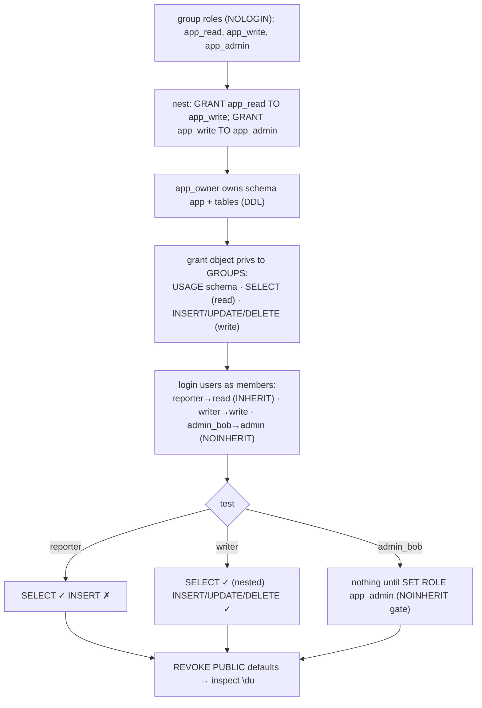
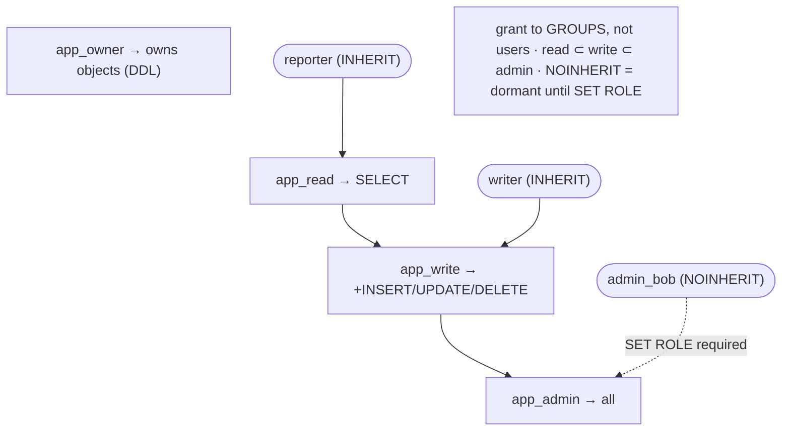

# Lab 41 — Build a Least-Privilege Role Hierarchy (Group Roles + `GRANT`/`REVOKE`, `NOINHERIT`)

> **Track A · DBA · A6 Security & Access Control · Lab 1 of 9 (Lab 41/222)**
> Teaching package: concept → diagram → steps → verify → quick-ref → self-test → video script.
> **Depends on:** Lab 06 (auth). Opens the security track. **Feeds:** Lab 42 (default privileges), Lab 49 (REASSIGN/DROP OWNED).

---

## 0. Lab Card (at a glance)

| Field | Value |
|---|---|
| **Objective** | Design a least-privilege role hierarchy — group roles bundling privileges, login users as members — and demonstrate `INHERIT` vs `NOINHERIT` (deliberate elevation via `SET ROLE`). |
| **Success criterion** | Read/write/admin group roles hold the right privileges; users inherit exactly what their membership allows; a `NOINHERIT` admin has no active privilege until `SET ROLE`. |
| **Scope boundary** | Role hierarchy + membership + inheritance. Auto-granting future objects is Lab 42; RLS Lab 43; column privileges Lab 44. |
| **Prereqs** | Lab 06; a database to work in |
| **Time** | 30–45 min |
| **Difficulty** | ★★★☆☆ |
| **Risk** | Low — additive roles/grants; reset at the end. |

---

## 1. Learning Objectives

1. **Roles, not users/groups** — one primitive; conventions make the difference.
2. **Least-privilege structure** — group roles hold privileges; users are members.
3. **Privilege nesting** — read ⊂ write ⊂ admin via role membership.
4. **`INHERIT` vs `NOINHERIT`** — automatic vs deliberate (`SET ROLE`) elevation.
5. **Harden PUBLIC** — revoke the defaults everyone gets.

---

## 2. Concept Primer — the "why"

**There are no users or groups — only roles.** A role with `LOGIN` behaves like a "user"; a role without `LOGIN`, used to bundle privileges, behaves like a "group". Roles can be **members of** other roles (`GRANT role TO role`), forming a hierarchy. This one primitive is the whole access model.

**Least privilege, structured.** The maintainable pattern:
1. **Group roles (NOLOGIN)** hold sets of object privileges by *function*: `app_read`, `app_write`, `app_admin`.
2. **Grant object privileges to the groups**, never to individual users.
3. **Login users** are **members** of the appropriate group(s).
4. **Nest** groups so higher roles imply lower ones: `GRANT app_read TO app_write` (write implies read), `GRANT app_write TO app_admin`.
5. **An owner role** owns the schema/tables (holds DDL), separate from the app roles that only use them.

This separates *privilege definition* (groups) from *identity* (users): add a person by granting a membership; change what "write" means in one place.

**`INHERIT` vs `NOINHERIT` — the elevation gate.**
- **`INHERIT`** (default): a member **automatically uses** the privileges of roles it belongs to. `reporter` (member of `app_read`, INHERIT) can `SELECT` immediately.
- **`NOINHERIT`**: a member does **not** auto-use those privileges — it must explicitly **`SET ROLE`** to activate them. Like `sudo`: the power exists but stays **dormant** until deliberately invoked. Ideal for admins — routine sessions run unprivileged; elevation is a conscious act (and auditable), preventing accidental privileged operations.
- **PG16+ refinement:** inheritance can be set **per membership** with `GRANT … WITH INHERIT TRUE/FALSE`, overriding the member role's default for that specific grant.

**GRANT/REVOKE surface.** Object privileges (`SELECT/INSERT/UPDATE/DELETE/…` on tables, `USAGE/CREATE` on schemas, `EXECUTE` on functions, `CONNECT/TEMP` on databases), role membership (`GRANT group TO user`, `WITH ADMIN OPTION` to let a member re-grant), and `WITH GRANT OPTION` to re-grant object privileges.

**Harden PUBLIC.** `PUBLIC` is a pseudo-role every role belongs to. By default it holds some privileges (function `EXECUTE`, database `CONNECT`, etc.). Least-privilege means **revoking** those you don't want everyone to have — e.g. `REVOKE ALL ON DATABASE … FROM PUBLIC` and granting `CONNECT` only to intended roles. *(PG15 already removed `CREATE` on the `public` schema from PUBLIC by default.)*

---

## 3. Diagrams

### 3.1 Build + test flow



### 3.2 The hierarchy



---

## 4. Prerequisites

```bash
sudo -u postgres createdb secdb 2>/dev/null || true
sudo -u postgres psql -d secdb -c "SELECT current_database();"
```

---

## 5. Step-by-Step

### Step 1 — Create nested group roles (NOLOGIN)

```bash
sudo -u postgres psql -d secdb <<'SQL'
CREATE ROLE app_read  NOLOGIN;
CREATE ROLE app_write NOLOGIN;
CREATE ROLE app_admin NOLOGIN;
GRANT app_read  TO app_write;    -- write implies read
GRANT app_write TO app_admin;    -- admin implies write (and read)
SQL
```

### Step 2 — Owner role + schema + tables (DDL separated)

```bash
sudo -u postgres psql -d secdb <<'SQL'
CREATE ROLE app_owner NOLOGIN;
CREATE SCHEMA app AUTHORIZATION app_owner;
SET ROLE app_owner;
CREATE TABLE app.customers (id int PRIMARY KEY, name text);
CREATE TABLE app.orders    (id int PRIMARY KEY, customer_id int, amount numeric);
INSERT INTO app.customers VALUES (1,'Acme'),(2,'Globex');
RESET ROLE;
SQL
```

### Step 3 — Grant object privileges to the GROUPS (not users)

```bash
sudo -u postgres psql -d secdb <<'SQL'
GRANT USAGE ON SCHEMA app TO app_read;                       -- read needs schema USAGE
GRANT SELECT ON ALL TABLES IN SCHEMA app TO app_read;
GRANT INSERT, UPDATE, DELETE ON ALL TABLES IN SCHEMA app TO app_write;
GRANT USAGE ON ALL SEQUENCES IN SCHEMA app TO app_write;
SQL
```

### Step 4 — Create login users as members (INHERIT vs NOINHERIT)

```bash
sudo -u postgres psql -d secdb <<'SQL'
CREATE ROLE reporter  LOGIN PASSWORD 'RepPass!1' INHERIT;
CREATE ROLE writer    LOGIN PASSWORD 'WrPass!1'  INHERIT;
CREATE ROLE admin_bob LOGIN PASSWORD 'AbPass!1'  NOINHERIT;   -- powers dormant until SET ROLE
GRANT app_read  TO reporter;
GRANT app_write TO writer;
GRANT app_admin TO admin_bob;
SQL
```

### Step 5 — Test each role (SET ROLE simulates the login user)

```bash
# reporter: SELECT yes, INSERT no
sudo -u postgres psql -d secdb -c "SET ROLE reporter;  SELECT count(*) FROM app.customers;"           # ok
sudo -u postgres psql -d secdb -c "SET ROLE reporter;  INSERT INTO app.customers VALUES (9,'x');" 2>&1 | tail -1   # denied

# writer: SELECT (nested) + DML
sudo -u postgres psql -d secdb -c "SET ROLE writer;  SELECT count(*) FROM app.orders;  INSERT INTO app.orders VALUES (1,1,100);"  # ok

# admin_bob: NOINHERIT → nothing works until SET ROLE app_admin
sudo -u postgres psql -d secdb -c "SET ROLE admin_bob; SELECT count(*) FROM app.customers;" 2>&1 | tail -1              # DENIED (dormant)
sudo -u postgres psql -d secdb -c "SET ROLE admin_bob; SET ROLE app_admin; SELECT count(*) FROM app.customers;"        # ok after elevation
```

### Step 6 — Harden PUBLIC and inspect

```bash
sudo -u postgres psql -d secdb -c "REVOKE ALL ON DATABASE secdb FROM PUBLIC; GRANT CONNECT ON DATABASE secdb TO reporter, writer, admin_bob;"
sudo -u postgres psql -d secdb -c "\du"                                   # roles, attributes, memberships
sudo -u postgres psql -d secdb -c "SELECT rolname, rolinherit, rolcanlogin FROM pg_roles WHERE rolname LIKE 'app_%' OR rolname IN ('reporter','writer','admin_bob');"
```

---

## 6. Verification Checklist

- [ ] Group roles nested: `app_read ⊂ app_write ⊂ app_admin`
- [ ] Object privileges granted to **groups**, not users
- [ ] `reporter` can SELECT but not INSERT
- [ ] `writer` can SELECT (via nesting) and do DML
- [ ] `admin_bob` (NOINHERIT) has **no** active privilege until `SET ROLE app_admin`
- [ ] `pg_roles.rolinherit` = false for `admin_bob`
- [ ] PUBLIC defaults revoked; CONNECT granted explicitly

---

## 7. Troubleshooting

| Symptom | Cause | Fix |
|---|---|---|
| Member can't access despite membership | Member is `NOINHERIT` | `SET ROLE <group>` to elevate, or make it `INHERIT` |
| SELECT denied for a read role | Missing `USAGE` on the schema | `GRANT USAGE ON SCHEMA app TO app_read` |
| New tables not accessible | `GRANT … ALL TABLES` covers existing only | Set default privileges for future tables (Lab 42) |
| `SET ROLE` fails: permission denied | Not a member of that role | `GRANT <group> TO <user>` |
| Everyone can still connect | PUBLIC defaults not revoked | `REVOKE ALL ON DATABASE … FROM PUBLIC` |
| Can't drop a role | It owns objects / holds grants | `REASSIGN OWNED` / `DROP OWNED` (Lab 49) |
| Per-membership inherit surprise | PG16 `WITH INHERIT` on the grant | Check `GRANT … WITH INHERIT`; set as intended |

---

## 8. Quick Reference Card (paste-ready)

```bash
sudo -u postgres psql -d secdb <<'SQL'
-- group roles + nesting
CREATE ROLE app_read NOLOGIN; CREATE ROLE app_write NOLOGIN; CREATE ROLE app_admin NOLOGIN;
GRANT app_read TO app_write; GRANT app_write TO app_admin;
-- owner + objects
CREATE ROLE app_owner NOLOGIN; CREATE SCHEMA app AUTHORIZATION app_owner;
-- privileges to GROUPS
GRANT USAGE ON SCHEMA app TO app_read;
GRANT SELECT ON ALL TABLES IN SCHEMA app TO app_read;
GRANT INSERT,UPDATE,DELETE ON ALL TABLES IN SCHEMA app TO app_write;
-- login users as members
CREATE ROLE reporter LOGIN PASSWORD 'x' INHERIT;   GRANT app_read TO reporter;
CREATE ROLE admin_bob LOGIN PASSWORD 'y' NOINHERIT; GRANT app_admin TO admin_bob;  -- SET ROLE to elevate
-- harden PUBLIC
REVOKE ALL ON DATABASE secdb FROM PUBLIC; GRANT CONNECT ON DATABASE secdb TO reporter, admin_bob;
SQL

# INHERIT: auto-use memberships | NOINHERIT: SET ROLE to activate (sudo-like)
# PG16 per-membership: GRANT app_admin TO admin_bob WITH INHERIT FALSE;
# grant to GROUPS not users · read ⊂ write ⊂ admin · future tables → ALTER DEFAULT PRIVILEGES (Lab 42)
```

---

## 9. Self-Check

1. In PostgreSQL, what's the difference between a user and a group?
2. Describe the least-privilege structure (who holds privileges, who are members).
3. What's the behavioral difference between `INHERIT` and `NOINHERIT`?
4. Why use `NOINHERIT` for an admin role?
5. What does `GRANT SELECT ON ALL TABLES` cover, and what does it miss?
6. Name one PUBLIC hardening step.

<details>
<summary>Answers</summary>

1. None at the engine level — both are roles; a "user" has `LOGIN`, a "group" is `NOLOGIN` by convention.
2. **Group roles** hold the object privileges (bundled by function); **login users** are *members* of those groups. Grant to groups, not individual users.
3. `INHERIT`: a member automatically uses its memberships' privileges. `NOINHERIT`: it must `SET ROLE` to activate them.
4. Privilege separation — the admin's powers stay dormant during routine work and require a deliberate, auditable `SET ROLE` to use, avoiding accidental privileged actions.
5. Only **existing** tables; **future** tables need `ALTER DEFAULT PRIVILEGES` (Lab 42).
6. `REVOKE ALL ON DATABASE … FROM PUBLIC` (then grant `CONNECT` explicitly) — or revoke function `EXECUTE` from PUBLIC.
</details>

---

## 10. Video / Teaching Script

| # | On screen | Say (narration) |
|---|---|---|
| 1 | Title: "Least privilege, the PostgreSQL way" | "There are no users and groups here — only roles. Master that, and access control becomes simple and safe." |
| 2 | group roles + nesting | "Bundle privileges into group roles by job: read, write, admin. And nest them — write includes read, admin includes both." |
| 3 | grant to groups | "The golden rule: grant to the *groups*, never to individual people." |
| 4 | users as members | "People are just members. Add someone by granting a membership — one line." |
| 5 | reporter/writer test | "Reporter reads but can't write. Writer does both, inheriting read through the nesting. Exactly as designed." |
| 6 | NOINHERIT admin | "Now the clever one: our admin has full power — but it's *dormant*. Nothing works until they deliberately SET ROLE. It's sudo for the database." |
| 7 | harden PUBLIC | "Finally, lock down PUBLIC — the privileges everyone silently has. Revoke, then grant only what's needed." |
| 8 | Outro | "A clean, least-privilege hierarchy. Next: making sure *future* tables get the right grants automatically." |

---

## 11. Glossary

- **Role** — the single primitive; `LOGIN` = user-like, `NOLOGIN` = group-like.
- **Group role / membership** — a role holding privileges / `GRANT role TO role`.
- **Nesting** — a role that is a member of another (privilege inheritance chain).
- **`INHERIT` / `NOINHERIT`** — auto-use vs `SET ROLE`-to-activate memberships.
- **`SET ROLE`** — assume a role's privileges for the session.
- **`WITH ADMIN OPTION`** — a member may re-grant the role.
- **PUBLIC** — pseudo-role every role belongs to; harden by revoking its defaults.

---
*NETAPORT lab series · PostgreSQL 17 on AlmaLinux 9 · Lab 41/222 · A6 Security & Access Control*
