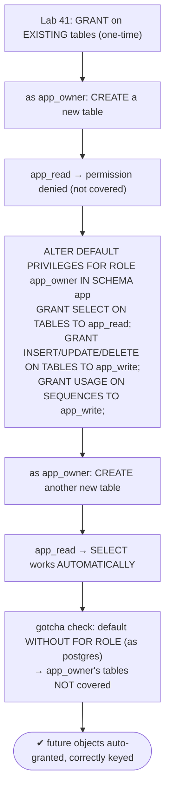

# Lab 42 — `ALTER DEFAULT PRIVILEGES` So New Tables Auto-Grant Correctly to an App Role

> **Track A · DBA · A6 Security & Access Control · Lab 2 of 9 (Lab 42/222)**
> Teaching package: concept → diagram → steps → verify → quick-ref → self-test → video script.
> **Depends on:** Lab 41 (role hierarchy; app schema, app_owner, app_read/app_write). Closes the "future tables" gap it left.

---

## 0. Lab Card (at a glance)

| Field | Value |
|---|---|
| **Objective** | Configure `ALTER DEFAULT PRIVILEGES` so tables created *later* automatically grant the right privileges to app roles, and demonstrate the `FOR ROLE` (creating-role) gotcha. |
| **Success criterion** | A newly created table is immediately readable/writable by the app roles with no extra GRANT; a mis-keyed `FOR ROLE` fails to apply and is diagnosed. |
| **Scope boundary** | Auto-granting future objects. Existing-object grants were Lab 41; RLS Lab 43; column privileges Lab 44. |
| **Prereqs** | Lab 41 (secdb, app schema, roles) |
| **Time** | 25–35 min |
| **Difficulty** | ★★★☆☆ |
| **Risk** | Low — additive; reset at the end. |

---

## 1. Learning Objectives

1. **Why GRANT alone isn't enough** — it covers existing objects only.
2. **`ALTER DEFAULT PRIVILEGES`** — auto-grant on *future* objects.
3. **The `FOR ROLE` gotcha** — defaults are keyed to the object's **creator**.
4. **Complete coverage** — one-time GRANT (existing) + default privileges (future).
5. **Don't forget sequences** — for serial/identity columns.

---

## 2. Concept Primer — the "why"

**The gap Lab 41 left.** `GRANT SELECT ON ALL TABLES IN SCHEMA app TO app_read` grants on the tables that **exist right now**. Create a new table tomorrow and `app_read` **can't read it** — you'd get `permission denied` until someone re-runs the GRANT. In practice, every schema migration that adds a table breaks the app role until a human notices. That's a fragile, error-prone security posture.

**`ALTER DEFAULT PRIVILEGES` — grants that apply to future objects.**
```
ALTER DEFAULT PRIVILEGES [FOR ROLE creating_role] [IN SCHEMA schema]
  GRANT privileges ON object_type TO grantee;
```
It records a rule: "whenever *creating_role* creates an object of this type in this schema, automatically grant these privileges to *grantee*." From then on, new tables carry the grants at creation — no manual step.

**The `FOR ROLE` gotcha — the thing everyone gets wrong.** Default privileges are keyed to **who creates the object**, not to the schema alone. If you omit `FOR ROLE`, it defaults to **the role running the `ALTER DEFAULT PRIVILEGES` command** (often your admin/`postgres`). But in production, tables are created by the **owner role** (e.g. `app_owner`) during migrations. If the default is keyed to `postgres` and the table is created by `app_owner`, **the default doesn't match and doesn't apply**. New tables silently lack the grant, and you're back to `permission denied` — mystifying, because you "set default privileges."

> **Rule:** set `FOR ROLE` to the role that **actually creates the tables**. If migrations run as `app_owner`, use `ALTER DEFAULT PRIVILEGES FOR ROLE app_owner …`. If several roles create objects, set defaults for each — or standardize on one owner.

**Complete coverage = two commands.**
1. **Existing** objects → one-time `GRANT … ON ALL TABLES …` (Lab 41).
2. **Future** objects → `ALTER DEFAULT PRIVILEGES FOR ROLE <owner> …`.

**Don't forget sequences.** Serial/identity columns use sequences; a write role needs `USAGE` on them. Set default privileges on `SEQUENCES` too, or inserts fail on the sequence.

**Inspect** with `\ddp` (psql) or the `pg_default_acl` catalog.

---

## 3. Diagrams

### 3.1 Fix + verify flow



### 3.2 How default privileges match

```mermaid
flowchart LR
    CREATE["CREATE TABLE by <creating role> in <schema>"] --> MATCH{"matching default privilege?<br/>(FOR ROLE = creating role, IN SCHEMA = schema)"}
    MATCH -->|yes| GRANTED["grants auto-applied to grantee ✓"]
    MATCH -->|no (wrong FOR ROLE)| NONE["no auto-grant → permission denied ✗"]
    note["default privileges keyed to the CREATOR, not the schema alone<br/>affects FUTURE objects only · existing need one-time GRANT"]
```

---

## 4. Prerequisites

```bash
# from Lab 41: secdb, schema app, app_owner, app_read, app_write, existing grants
sudo -u postgres psql -d secdb -c "\dp app.*" | head
```

---

## 5. Step-by-Step

### Step 1 — Reproduce the gap: a new table is NOT accessible

```bash
sudo -u postgres psql -d secdb -c "SET ROLE app_owner; CREATE TABLE app.invoices (id int PRIMARY KEY, total numeric);"
# app_read can't see it yet:
sudo -u postgres psql -d secdb -c "SET ROLE app_read; SELECT count(*) FROM app.invoices;" 2>&1 | tail -1
#   → ERROR: permission denied for table invoices
```

### Step 2 — Set default privileges keyed to the OWNER

```bash
sudo -u postgres psql -d secdb <<'SQL'
ALTER DEFAULT PRIVILEGES FOR ROLE app_owner IN SCHEMA app GRANT SELECT ON TABLES TO app_read;
ALTER DEFAULT PRIVILEGES FOR ROLE app_owner IN SCHEMA app GRANT INSERT, UPDATE, DELETE ON TABLES TO app_write;
ALTER DEFAULT PRIVILEGES FOR ROLE app_owner IN SCHEMA app GRANT USAGE, SELECT ON SEQUENCES TO app_write;
SQL
```

### Step 3 — Create another new table; it's auto-granted

```bash
sudo -u postgres psql -d secdb -c "SET ROLE app_owner; CREATE TABLE app.payments (id serial PRIMARY KEY, amount numeric);"
# app_read can read it WITHOUT any new GRANT:
sudo -u postgres psql -d secdb -c "SET ROLE app_read;  SELECT count(*) FROM app.payments;"         # ok
# app_write can insert (uses the sequence):
sudo -u postgres psql -d secdb -c "SET ROLE app_write; INSERT INTO app.payments (amount) VALUES (100);"   # ok
```

### Step 4 — Demonstrate the `FOR ROLE` gotcha

```bash
# a default WITHOUT FOR ROLE → keyed to the current role (postgres), NOT app_owner:
sudo -u postgres psql -d secdb -c "ALTER DEFAULT PRIVILEGES IN SCHEMA app GRANT SELECT ON TABLES TO reporter;"
# app_owner creates a table → the postgres-keyed default does NOT apply:
sudo -u postgres psql -d secdb -c "SET ROLE app_owner; CREATE TABLE app.gotcha (id int);"
sudo -u postgres psql -d secdb -c "SET ROLE reporter; SELECT count(*) FROM app.gotcha;" 2>&1 | tail -1
#   → permission denied  (the default was keyed to postgres, but app_owner created it)
```

### Step 5 — Fix the existing tables + inspect

```bash
# defaults don't retro-apply — grant on the one already created before the default existed:
sudo -u postgres psql -d secdb -c "GRANT SELECT ON app.invoices TO app_read; GRANT INSERT,UPDATE,DELETE ON app.invoices TO app_write;"
# inspect default privileges:
sudo -u postgres psql -d secdb -c "\ddp"
sudo -u postgres psql -d secdb -c "SELECT defaclrole::regrole AS creator, defaclnamespace::regnamespace AS schema, defaclobjtype, defaclacl FROM pg_default_acl;"
```

---

## 6. Verification Checklist

- [ ] A table created **before** the default is not covered (the gap)
- [ ] Default privileges set `FOR ROLE app_owner IN SCHEMA app`
- [ ] A table created **after** is auto-readable by `app_read`, writable by `app_write`
- [ ] Sequence USAGE granted (serial inserts work)
- [ ] A default without `FOR ROLE` (keyed to postgres) does **not** apply to `app_owner`'s tables
- [ ] `\ddp` / `pg_default_acl` shows the defaults with their creator role

---

## 7. Troubleshooting

| Symptom | Cause | Fix |
|---|---|---|
| New tables still not accessible | `FOR ROLE` doesn't match the actual creator | Set `FOR ROLE <the role that creates tables>` |
| Defaults apply to admin's tables only | Ran without `FOR ROLE` (keyed to admin) | Re-add with the correct `FOR ROLE` |
| Existing tables not covered | Defaults affect **future** objects only | One-time `GRANT … ON ALL TABLES` for existing |
| Wrong schema | `IN SCHEMA` doesn't match | Match the schema where tables are created |
| Insert fails on serial/identity | Missing sequence default | `ALTER DEFAULT PRIVILEGES … GRANT USAGE ON SEQUENCES` |
| Need to remove a default | Left stale | `ALTER DEFAULT PRIVILEGES FOR ROLE … REVOKE … FROM …` |

---

## 8. Quick Reference Card (paste-ready)

```bash
# COMPLETE coverage = existing (one-time GRANT) + future (default privileges)
sudo -u postgres psql -d secdb <<'SQL'
-- existing objects
GRANT SELECT ON ALL TABLES IN SCHEMA app TO app_read;
GRANT INSERT,UPDATE,DELETE ON ALL TABLES IN SCHEMA app TO app_write;
GRANT USAGE ON ALL SEQUENCES IN SCHEMA app TO app_write;
-- FUTURE objects — key to the ACTUAL creator (app_owner)!
ALTER DEFAULT PRIVILEGES FOR ROLE app_owner IN SCHEMA app GRANT SELECT ON TABLES TO app_read;
ALTER DEFAULT PRIVILEGES FOR ROLE app_owner IN SCHEMA app GRANT INSERT,UPDATE,DELETE ON TABLES TO app_write;
ALTER DEFAULT PRIVILEGES FOR ROLE app_owner IN SCHEMA app GRANT USAGE,SELECT ON SEQUENCES TO app_write;
SQL

# inspect: \ddp   (or pg_default_acl)
# GOTCHA: default privileges are keyed to the CREATING role — omit FOR ROLE and they attach to whoever ran the command
# defaults affect FUTURE objects only · sequences needed for serial/identity
```

---

## 9. Self-Check

1. Does `ALTER DEFAULT PRIVILEGES` affect existing or future objects?
2. What's the single biggest gotcha with default privileges?
3. If migrations run as `app_owner`, what `FOR ROLE` do you specify?
4. Which two commands together give complete coverage?
5. Besides tables, what else needs default privileges for a writable app?
6. How do you inspect the configured default privileges?

<details>
<summary>Answers</summary>

1. **Future** objects only — existing ones need a one-time `GRANT`.
2. They're keyed to the **creating role**; omit `FOR ROLE` and they attach to whoever ran the command (often the admin), not the real object creator — so they silently don't apply.
3. `FOR ROLE app_owner`.
4. A one-time `GRANT … ON ALL TABLES …` (existing) plus `ALTER DEFAULT PRIVILEGES FOR ROLE <owner> …` (future).
5. **Sequences** — for serial/identity columns (write role needs `USAGE`).
6. `\ddp` in psql, or query `pg_default_acl`.
</details>

---

## 10. Video / Teaching Script

| # | On screen | Say (narration) |
|---|---|---|
| 1 | Title: "Grants that keep working — for tomorrow's tables" | "You granted your app role access to every table. Then a migration adds a new one — and everything breaks. Here's the fix." |
| 2 | new table → permission denied | "Watch: create a fresh table, and the read role can't touch it. Your grant only covered what existed at the time." |
| 3 | `ALTER DEFAULT PRIVILEGES FOR ROLE app_owner` | "Default privileges solve it — grants that apply to *future* tables automatically. But notice this: FOR ROLE app_owner." |
| 4 | new table auto-granted | "Now a new table is readable and writable the moment it's created. No human in the loop." |
| 5 | the FOR ROLE gotcha | "And here's what trips everyone up: leave off FOR ROLE, and the default keys to *you*, not the owner. The owner's tables? Still locked out. Match the creator, always." |
| 6 | don't forget sequences | "One more — serial columns need sequence access, or inserts fail. Include sequences in your defaults." |
| 7 | Outro | "Grants that never fall behind your schema. Next: row-level security — filtering *which rows* a role can see." |

---

## 11. Glossary

- **`ALTER DEFAULT PRIVILEGES`** — auto-grants applied to future objects.
- **`FOR ROLE`** — the creating role the defaults are keyed to (critical).
- **Creating role** — the role that owns/creates the object (whose defaults apply).
- **`pg_default_acl` / `\ddp`** — catalog / psql view of default privileges.
- **Sequences** — backing serial/identity; write roles need `USAGE`.
- **Existing vs future** — one-time GRANT vs default privileges.

---
*NETAPORT lab series · PostgreSQL 17 on AlmaLinux 9 · Lab 42/222 · A6 Security & Access Control*
