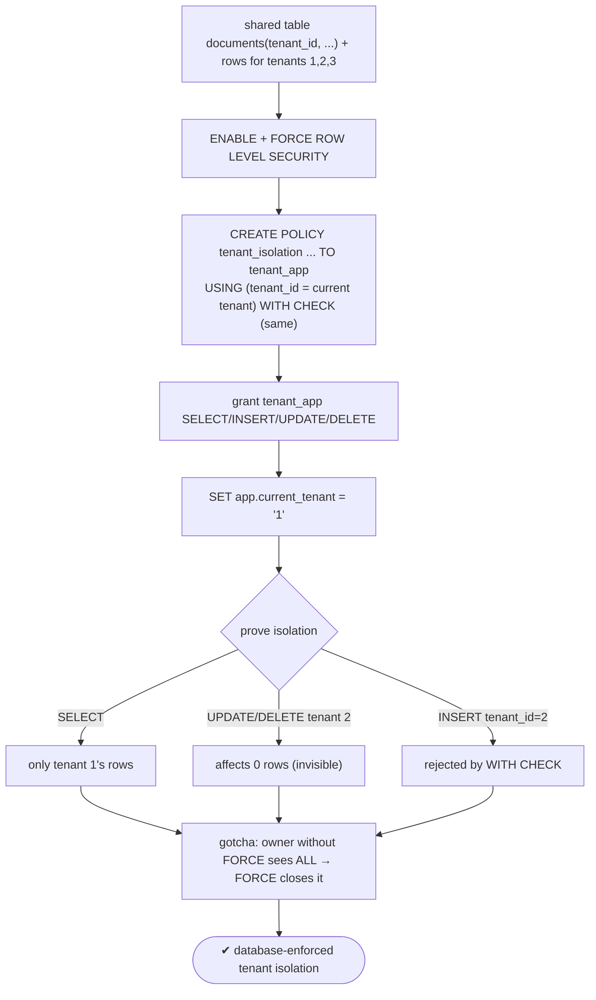
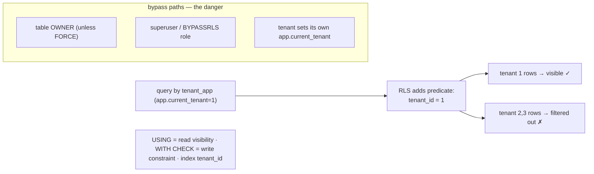

# Lab 43 — Row-Level Security: Multi-Tenant Table, `CREATE POLICY`, Prove Tenant Isolation

> **Track A · DBA · A6 Security & Access Control · Lab 3 of 9 (Lab 43/222)**
> Teaching package: concept → diagram → steps → verify → quick-ref → self-test → video script.
> **Depends on:** Labs 41–42 (roles, privileges). **Feeds:** Lab 214 (multi-tenancy models), Lab 218 (cross-tenant reporting).

---

## 0. Lab Card (at a glance)

| Field | Value |
|---|---|
| **Objective** | Enforce tenant isolation on a shared multi-tenant table with RLS policies, and prove a tenant can only read/insert/update/delete its own rows. |
| **Success criterion** | With a tenant context set, a role sees only that tenant's rows and cannot read, write, or insert into another tenant's; the owner-bypass gotcha is closed with `FORCE`. |
| **Scope boundary** | RLS for tenant isolation. Column privileges are Lab 44; the multi-tenancy architecture comparison is Lab 214. |
| **Prereqs** | Labs 41–42 (secdb, roles) |
| **Time** | 30–45 min |
| **Difficulty** | ★★★★☆ |
| **Risk** | Low in lab — but conceptually high-stakes (a mistake = data leak). |

---

## 1. Learning Objectives

1. **What RLS enforces** — row visibility/modifiability, below table/column privileges.
2. **`CREATE POLICY`** — `USING` (visibility) vs `WITH CHECK` (write constraint).
3. **The multi-tenant pattern** — a tenant context filter on a shared table.
4. **The bypass gotchas** — owner-by-default, superuser, `BYPASSRLS`; and `FORCE`.
5. **The trust boundary** — the tenant context must come from trusted code.

---

## 2. Concept Primer — the "why"

**RLS filters rows, automatically.** Table and column privileges (Labs 41–42, 44) are all-or-nothing per table/column. **Row-Level Security** goes finer: PostgreSQL adds a **policy predicate** to every query so a role sees and modifies only the rows a policy allows. The flagship use is **multi-tenancy**: one shared table holds *all* tenants' rows, and RLS guarantees isolation **in the database** — not in app code you have to trust to get every query's `WHERE tenant_id = …` right.

**Turning it on.**
- `ALTER TABLE t ENABLE ROW LEVEL SECURITY;` — once enabled, the default is **deny all rows** to non-owners until a policy allows them.
- `CREATE POLICY p ON t [FOR cmd] [TO role] USING (expr) [WITH CHECK (expr)];`
  - **`USING`** — which rows are **visible** to SELECT/UPDATE/DELETE (a row must satisfy it to be seen or affected).
  - **`WITH CHECK`** — which rows may be **inserted/updated** (the new row must satisfy it). If omitted, it defaults to `USING` for writes.
  - **`FOR`** — `ALL` (default) / `SELECT` / `INSERT` / `UPDATE` / `DELETE`.
  - **`TO`** — roles the policy applies to (default `PUBLIC`).
- Multiple **permissive** policies combine with **OR**; **restrictive** ones (`AS RESTRICTIVE`) combine with **AND**.

**The multi-tenant policy.** Tag rows with `tenant_id` and filter on the **current tenant context**:
```
USING (tenant_id = current_setting('app.current_tenant')::int)
WITH CHECK (tenant_id = current_setting('app.current_tenant')::int)
```
The app sets `app.current_tenant` per session/request; every query then sees only that tenant's rows, and can't insert rows for another.

**The bypass gotchas — read carefully, this is where isolation leaks:**
1. **The table owner bypasses RLS by default.** If your app connects as the *owner* of the table, policies **do not apply** and every tenant's rows are visible. Close it with **`ALTER TABLE t FORCE ROW LEVEL SECURITY;`** (RLS then applies to the owner too) — or, better, connect the app as a **non-owner** role.
2. **Superusers and `BYPASSRLS` roles always bypass RLS.** The app role must be **neither** a superuser nor have `BYPASSRLS`.
3. **The tenant context is only as safe as who sets it.** If a tenant can run `SET app.current_tenant = <someone else's id>`, isolation is broken. The setting must be established by **trusted code** — the connection pooler or app layer after authentication, or derived from the authenticated role (e.g. a `SECURITY DEFINER` function, Lab 47) — not left for the tenant to choose. This is an **architecture** requirement, not just a SQL one.

**Performance:** the policy predicate is added to every query — **index `tenant_id`**.

---

## 3. Diagrams

### 3.1 Enforce + prove flow



### 3.2 How RLS gates a query



---

## 4. Prerequisites

```bash
sudo -u postgres psql -d secdb -c "SELECT current_database();"
# a non-owner, non-superuser app role for tenants:
sudo -u postgres psql -d secdb -c "CREATE ROLE tenant_app LOGIN PASSWORD 'TenPass!1';" 2>/dev/null || true
sudo -u postgres psql -d secdb -c "SELECT rolname, rolsuper, rolbypassrls FROM pg_roles WHERE rolname='tenant_app';"   # both false
```

---

## 5. Step-by-Step

### Step 1 — Multi-tenant table + data

```bash
sudo -u postgres psql -d secdb <<'SQL'
CREATE TABLE app.documents (
  id        serial PRIMARY KEY,
  tenant_id int NOT NULL,
  title     text
);
CREATE INDEX ON app.documents (tenant_id);           -- RLS predicate hits this
INSERT INTO app.documents (tenant_id, title) VALUES
  (1,'T1 doc A'),(1,'T1 doc B'),
  (2,'T2 doc A'),(2,'T2 doc B'),(2,'T2 doc C'),
  (3,'T3 doc A');
GRANT USAGE ON SCHEMA app TO tenant_app;
GRANT SELECT, INSERT, UPDATE, DELETE ON app.documents TO tenant_app;
GRANT USAGE ON ALL SEQUENCES IN SCHEMA app TO tenant_app;
SQL
```

### Step 2 — Enable RLS (and FORCE so the owner is filtered too)

```bash
sudo -u postgres psql -d secdb <<'SQL'
ALTER TABLE app.documents ENABLE ROW LEVEL SECURITY;
ALTER TABLE app.documents FORCE  ROW LEVEL SECURITY;    -- close the owner-bypass gotcha
SQL
```

### Step 3 — Create the tenant-isolation policy

```bash
sudo -u postgres psql -d secdb <<'SQL'
CREATE POLICY tenant_isolation ON app.documents
  FOR ALL TO tenant_app
  USING      (tenant_id = current_setting('app.current_tenant')::int)
  WITH CHECK (tenant_id = current_setting('app.current_tenant')::int);
SQL
```

### Step 4 — Prove read isolation

```bash
# as tenant_app, set the tenant context and query:
sudo -u postgres psql -d secdb -c "SET ROLE tenant_app; SET app.current_tenant='1'; SELECT id,tenant_id,title FROM app.documents;"
#   → only tenant 1's rows
sudo -u postgres psql -d secdb -c "SET ROLE tenant_app; SET app.current_tenant='2'; SELECT count(*) FROM app.documents;"
#   → 3 (only tenant 2)
```

### Step 5 — Prove write isolation (update/delete/insert)

```bash
# tenant 1 can't affect tenant 2's rows (they're invisible → 0 rows changed):
sudo -u postgres psql -d secdb -c "SET ROLE tenant_app; SET app.current_tenant='1'; UPDATE app.documents SET title='hacked' WHERE tenant_id=2;"   # UPDATE 0
sudo -u postgres psql -d secdb -c "SET ROLE tenant_app; SET app.current_tenant='1'; DELETE FROM app.documents WHERE tenant_id=2;"                 # DELETE 0
# tenant 1 can't insert a row for tenant 2 (WITH CHECK blocks it):
sudo -u postgres psql -d secdb -c "SET ROLE tenant_app; SET app.current_tenant='1'; INSERT INTO app.documents (tenant_id,title) VALUES (2,'sneaky');" 2>&1 | tail -1
#   → ERROR: new row violates row-level security policy
# tenant 1 CAN insert its own:
sudo -u postgres psql -d secdb -c "SET ROLE tenant_app; SET app.current_tenant='1'; INSERT INTO app.documents (tenant_id,title) VALUES (1,'legit'); SELECT count(*) FROM app.documents;"   # sees its own only
```

### Step 6 — Demonstrate the bypass gotchas

```bash
# WITHOUT force, the table owner would see everything. Temporarily prove it:
sudo -u postgres psql -d secdb -c "ALTER TABLE app.documents NO FORCE ROW LEVEL SECURITY;"
sudo -u postgres psql -d secdb -c "SET ROLE app_owner; SELECT count(*) FROM app.documents;"   # ALL rows — owner bypasses!
sudo -u postgres psql -d secdb -c "ALTER TABLE app.documents FORCE ROW LEVEL SECURITY;"       # restore the guard
# a superuser always bypasses (note the risk):
sudo -u postgres psql -d secdb -c "SELECT count(*) FROM app.documents;"                         # postgres sees all
```

---

## 6. Verification Checklist

- [ ] `tenant_app` is **not** superuser and **not** `BYPASSRLS`
- [ ] RLS **enabled and forced** on `documents`
- [ ] Policy uses `USING` (read) + `WITH CHECK` (write) on the tenant context
- [ ] Tenant sees **only** its own rows on SELECT
- [ ] UPDATE/DELETE of another tenant's rows affects **0 rows**
- [ ] INSERT for another tenant is **rejected** by `WITH CHECK`
- [ ] Owner bypasses **without** FORCE; is filtered **with** FORCE
- [ ] `tenant_id` is indexed

---

## 7. Troubleshooting

| Symptom | Cause | Fix |
|---|---|---|
| Role sees ALL rows despite RLS | Connected as owner (no FORCE), or superuser/`BYPASSRLS` | `FORCE ROW LEVEL SECURITY`; use a non-owner, non-superuser role without `BYPASSRLS` |
| Role sees NO rows | No policy for it, or tenant context unset/wrong | Set `app.current_tenant`; check policy `TO` role |
| `unrecognized configuration parameter` | Context variable not set | `SET app.current_tenant='…'` first, or `current_setting('app.current_tenant', true)` |
| Cross-tenant INSERT succeeds | Missing `WITH CHECK` | Add `WITH CHECK` matching the tenant predicate |
| Tenant changes its own context | `SET` is client-controllable | Set the context in **trusted** code (pooler/`SECURITY DEFINER`), or derive from role |
| RLS not applied to UPDATE/DELETE | `FOR` clause too narrow | Use `FOR ALL` or add per-command policies |
| Slow queries | Predicate added to every query | Index `tenant_id` |

---

## 8. Quick Reference Card (paste-ready)

```bash
sudo -u postgres psql -d secdb <<'SQL'
-- enable + FORCE (owner also filtered)
ALTER TABLE app.documents ENABLE ROW LEVEL SECURITY;
ALTER TABLE app.documents FORCE  ROW LEVEL SECURITY;
-- tenant-isolation policy (read + write)
CREATE POLICY tenant_isolation ON app.documents FOR ALL TO tenant_app
  USING      (tenant_id = current_setting('app.current_tenant')::int)
  WITH CHECK (tenant_id = current_setting('app.current_tenant')::int);
CREATE INDEX IF NOT EXISTS documents_tenant_idx ON app.documents (tenant_id);
SQL

# use: SET app.current_tenant='<id>';  then normal queries see only that tenant
# GOTCHAS: table owner bypasses unless FORCE · superuser/BYPASSRLS always bypass ·
#          tenant context MUST be set by trusted code (pooler/SECURITY DEFINER), never tenant-chosen
# permissive policies = OR · restrictive (AS RESTRICTIVE) = AND · index tenant_id
```

---

## 9. Self-Check

1. What does RLS control that table/column privileges don't?
2. Who bypasses RLS by default, and how do you close the owner path?
3. What's the difference between `USING` and `WITH CHECK`?
4. How is the tenant context typically supplied, and what's the critical security caveat?
5. With RLS enabled but no policy, what does a non-owner role see?
6. How do permissive and restrictive policies combine?

<details>
<summary>Answers</summary>

1. Which **rows** a role can see/modify, below whole-table/column access.
2. The **table owner** (by default) and **superusers/`BYPASSRLS`** roles; close the owner path with `FORCE ROW LEVEL SECURITY` (and don't run the app as superuser/`BYPASSRLS`).
3. `USING` filters row **visibility** for SELECT/UPDATE/DELETE; `WITH CHECK` constrains which rows may be **inserted/updated**.
4. Via a session context like `current_setting('app.current_tenant')`; it must be set by **trusted code** (pooler/app/`SECURITY DEFINER`), not chosen by the tenant, or isolation breaks.
5. **No rows** — RLS defaults to deny-all until a policy allows.
6. Permissive policies combine with **OR**; restrictive (`AS RESTRICTIVE`) with **AND**.
</details>

---

## 10. Video / Teaching Script

| # | On screen | Say (narration) |
|---|---|---|
| 1 | Title: "One table, many tenants, zero leaks" | "Multi-tenant apps share tables. Row-Level Security makes the *database* guarantee each tenant sees only their own rows — not your app code." |
| 2 | table + enable + FORCE | "Enable RLS, and — critically — FORCE it. Without FORCE, the table owner sees everything, and that's a silent data leak." |
| 3 | `CREATE POLICY` | "The policy: a row is visible only when its tenant matches the current session's tenant. USING for reads, WITH CHECK for writes." |
| 4 | set tenant, SELECT | "Set the tenant to one — and we see only tenant one's rows. Switch to two — only two's. The database is filtering, every query." |
| 5 | cross-tenant write blocked | "Try to touch another tenant's rows? Zero affected — they're invisible. Try to insert *for* another tenant? Rejected outright." |
| 6 | bypass gotchas | "Three ways this leaks: the owner without FORCE, a superuser, or a tenant who can set their *own* tenant id. The context must come from trusted code — never the tenant." |
| 7 | Outro | "Tenant isolation, enforced where it can't be bypassed by a forgotten WHERE clause. Next: column-level privileges." |

---

## 11. Glossary

- **Row-Level Security (RLS)** — per-row visibility/modifiability via policies.
- **`ENABLE` / `FORCE ROW LEVEL SECURITY`** — turn on / apply to the owner too.
- **`CREATE POLICY` / `USING` / `WITH CHECK`** — define a policy / read filter / write constraint.
- **Permissive / restrictive** — combined with OR / AND.
- **`BYPASSRLS`** — role attribute that skips RLS (keep off the app role).
- **Tenant context** — session setting (`current_setting('app.current_tenant')`) driving the filter.
- **Multi-tenancy** — many tenants sharing one table, isolated by RLS.

---
*NETAPORT lab series · PostgreSQL 17 on AlmaLinux 9 · Lab 43/222 · A6 Security & Access Control*
