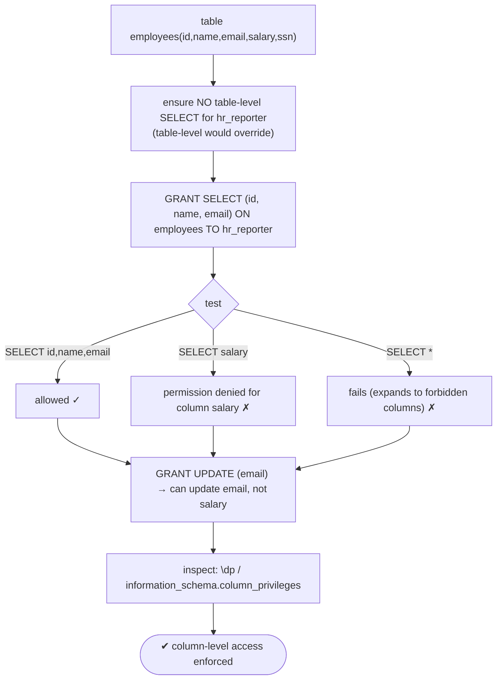
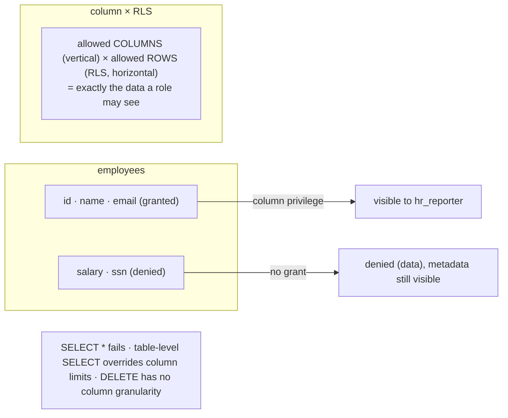

# Lab 44 — Column-Level Privileges; Grant SELECT on Some Columns Only

> **Track A · DBA · A6 Security & Access Control · Lab 4 of 9 (Lab 44/222)**
> Teaching package: concept → diagram → steps → verify → quick-ref → self-test → video script.
> **Depends on:** Labs 41–43 (roles, privileges, RLS). The vertical complement to RLS's row filtering.

---

## 0. Lab Card (at a glance)

| Field | Value |
|---|---|
| **Objective** | Grant SELECT (and UPDATE) on specific columns so a role can read non-sensitive columns but not sensitive ones, and understand how it composes with RLS. |
| **Success criterion** | The role reads the allowed columns, is denied the forbidden ones, `SELECT *` fails, and column-level UPDATE is likewise restricted. |
| **Scope boundary** | Column-level privileges. RLS (rows) was Lab 43; masking for non-prod is Lab 181. |
| **Prereqs** | Labs 41–43 (secdb, app schema, roles) |
| **Time** | 25–35 min |
| **Difficulty** | ★★★☆☆ |
| **Risk** | Low — additive grants; reset at the end. |

---

## 1. Learning Objectives

1. **Column-level GRANT** — restrict access to specific columns.
2. **Which commands support it** — SELECT/INSERT/UPDATE/REFERENCES.
3. **The `SELECT *` behavior** — why it fails for a restricted role.
4. **Table-level vs column-level** — table-level supersedes; revoke it first.
5. **Compose with RLS** — columns × rows = a precise rectangle.

---

## 2. Concept Primer — the "why"

**Hide columns, not just tables.** Table privileges are all-or-nothing per table; RLS (Lab 43) filters **rows**. **Column-level privileges** filter **columns** — a role can read `name` and `email` but not `salary` or `ssn` on the *same* table. The flagship use: expose a table to a reporting/analytics role while keeping sensitive columns (PII, secrets) out of reach — enforced by the database.

**Syntax — name the columns in the GRANT:**
```
GRANT SELECT (id, name, email) ON app.employees TO hr_reporter;
GRANT UPDATE (email)           ON app.employees TO hr_reporter;
```
Column-level grants are supported for **SELECT, INSERT, UPDATE, REFERENCES** — **not** DELETE or TRUNCATE (those are row/table operations with no column granularity).

**How access resolves.** A role may read a column if it has **table-level** SELECT (covers *all* columns) **or** **column-level** SELECT on that column. So to actually restrict, grant **only** the column-level privilege and ensure the role has **no table-level SELECT** on that table. If a table-level SELECT was granted earlier (Lab 41's `GRANT SELECT ON ALL TABLES`), the column restriction is **moot** — you must `REVOKE` the table-level grant first.

**The `SELECT *` surprise.** `SELECT *` expands to every column and therefore requires SELECT on **all** of them — so it **fails** for a column-restricted role with `permission denied for column "salary"`. The role (and the app) must **name the allowed columns explicitly**. This trips up applications that rely on `SELECT *`.

**What column privileges do and don't hide.** They control **data access**, not **metadata**: the role can still see that `salary` *exists* (via `\d`), it just can't read its values. Column privileges are access control, not obscurity.

**INSERT with column privileges.** A role can insert values only into granted columns; others take their defaults. If a non-granted column is `NOT NULL` with no default, the INSERT fails.

**Compose with RLS.** Column privileges (vertical) and RLS (horizontal) combine cleanly: a role sees **(allowed rows) × (allowed columns)** — a precise rectangle of the table. Multi-tenant + PII-safe in one design.

Inspect with `\dp` (psql) or `information_schema.column_privileges`.

---

## 3. Diagrams

### 3.1 Restrict + test flow



### 3.2 Vertical slice + composing with RLS



---

## 4. Prerequisites

```bash
sudo -u postgres psql -d secdb -c "CREATE ROLE hr_reporter LOGIN PASSWORD 'HrPass!1';" 2>/dev/null || true
sudo -u postgres psql -d secdb -c "GRANT USAGE ON SCHEMA app TO hr_reporter;"
```

---

## 5. Step-by-Step

### Step 1 — Table with sensitive columns

```bash
sudo -u postgres psql -d secdb <<'SQL'
CREATE TABLE app.employees (
  id     serial PRIMARY KEY,
  name   text,
  email  text,
  salary numeric,      -- sensitive
  ssn    text          -- sensitive
);
INSERT INTO app.employees (name,email,salary,ssn) VALUES
  ('Asha','asha@co',  90000,'111-11-1111'),
  ('Ravi','ravi@co', 120000,'222-22-2222');
SQL
```

### Step 2 — Ensure NO table-level SELECT, then grant only columns

```bash
sudo -u postgres psql -d secdb <<'SQL'
REVOKE SELECT ON app.employees FROM hr_reporter;             -- make sure table-level isn't granted
GRANT  SELECT (id, name, email) ON app.employees TO hr_reporter;
SQL
```

### Step 3 — Test read restriction

```bash
# allowed columns:
sudo -u postgres psql -d secdb -c "SET ROLE hr_reporter; SELECT id, name, email FROM app.employees;"     # ok
# forbidden column:
sudo -u postgres psql -d secdb -c "SET ROLE hr_reporter; SELECT name, salary FROM app.employees;" 2>&1 | tail -1
#   → ERROR: permission denied for column salary
# SELECT * fails (expands to salary/ssn):
sudo -u postgres psql -d secdb -c "SET ROLE hr_reporter; SELECT * FROM app.employees;" 2>&1 | tail -1
#   → ERROR: permission denied for column ... (must name allowed columns)
```

### Step 4 — Column-level UPDATE

```bash
sudo -u postgres psql -d secdb -c "GRANT UPDATE (email) ON app.employees TO hr_reporter;"
# can update email:
sudo -u postgres psql -d secdb -c "SET ROLE hr_reporter; UPDATE app.employees SET email='new@co' WHERE id=1;"   # ok
# cannot update salary:
sudo -u postgres psql -d secdb -c "SET ROLE hr_reporter; UPDATE app.employees SET salary=1 WHERE id=1;" 2>&1 | tail -1
#   → ERROR: permission denied for column salary
```

### Step 5 — Prove metadata is still visible (access ≠ obscurity)

```bash
sudo -u postgres psql -d secdb -c "SET ROLE hr_reporter; \d app.employees"   # sees salary/ssn EXIST, just can't read them
```

### Step 6 — Inspect column privileges

```bash
sudo -u postgres psql -d secdb -c "SELECT grantee, table_name, column_name, privilege_type
                                   FROM information_schema.column_privileges
                                   WHERE grantee='hr_reporter' ORDER BY column_name;"
sudo -u postgres psql -d secdb -c "\dp app.employees"
```

---

## 6. Verification Checklist

- [ ] `hr_reporter` has **no** table-level SELECT on `employees`
- [ ] Column-level SELECT granted on `id, name, email` only
- [ ] Allowed columns readable; `salary`/`ssn` denied
- [ ] `SELECT *` fails for the restricted role
- [ ] Column-level UPDATE on `email` works; `salary` denied
- [ ] Column metadata still visible (data hidden, existence not)
- [ ] `information_schema.column_privileges` shows the grants

---

## 7. Troubleshooting

| Symptom | Cause | Fix |
|---|---|---|
| `SELECT *` fails | Expands to columns the role lacks | Name allowed columns explicitly |
| Role sees ALL columns | Table-level SELECT still granted | `REVOKE SELECT ON table` then grant column-level only |
| INSERT fails | Non-granted NOT NULL column without default | Grant that column, or give it a default |
| Column shown in `\d` | Metadata isn't hidden by column privileges | Expected — it's data access control, not obscurity |
| Can't restrict DELETE by column | DELETE has no column granularity | Use RLS (Lab 43) for row control |
| Function/expression denied | It references a forbidden column | Grant that column or rewrite the query |

---

## 8. Quick Reference Card (paste-ready)

```bash
sudo -u postgres psql -d secdb <<'SQL'
-- restrict: NO table-level SELECT, only column-level
REVOKE SELECT ON app.employees FROM hr_reporter;
GRANT  SELECT (id, name, email) ON app.employees TO hr_reporter;
GRANT  UPDATE (email)           ON app.employees TO hr_reporter;
SQL

# test:
#   SELECT id,name,email  → ok
#   SELECT salary         → permission denied for column salary
#   SELECT *              → fails (name allowed columns instead)

# inspect:
sudo -u postgres psql -d secdb -c "SELECT grantee,column_name,privilege_type FROM information_schema.column_privileges WHERE grantee='hr_reporter';"

# column-level: SELECT/INSERT/UPDATE/REFERENCES (not DELETE) · table-level SELECT overrides → revoke it first
# SELECT * breaks for restricted roles · metadata stays visible · combine with RLS = rows × columns
```

---

## 9. Self-Check

1. What do column-level privileges control, versus RLS?
2. Which commands support column-level grants?
3. Why does `SELECT *` fail for a column-restricted role?
4. If a role already has table-level SELECT, does a column restriction take effect?
5. Do column privileges hide a column's existence?
6. How do column privileges and RLS combine?

<details>
<summary>Answers</summary>

1. Which **columns** a role can access; RLS controls which **rows**.
2. **SELECT, INSERT, UPDATE, REFERENCES** — not DELETE or TRUNCATE.
3. `*` expands to every column, requiring SELECT on all of them; the role must **name** the allowed columns.
4. No — table-level SELECT covers all columns; you must **revoke** it first for column limits to matter.
5. No — the column's existence/metadata is still visible; only its **data** is protected.
6. As a rectangle: **(allowed rows via RLS) × (allowed columns via column privileges)**.
</details>

---

## 10. Video / Teaching Script

| # | On screen | Say (narration) |
|---|---|---|
| 1 | Title: "Some columns, not others" | "Row-Level Security hides rows. Column privileges hide *columns* — perfect for keeping salaries and SSNs away from a reporting role." |
| 2 | table + revoke table-level | "First, make sure there's no table-wide SELECT — that would override everything. Then grant only the safe columns." |
| 3 | allowed vs denied | "Name, email — fine. Salary? Permission denied. Exactly what we want." |
| 4 | `SELECT *` fails | "Here's the surprise: SELECT-star breaks. It needs *every* column. Restricted roles must name what they're allowed to see." |
| 5 | column UPDATE | "It works for writes too — update the email, but not the salary." |
| 6 | metadata visible | "One nuance: they can still *see* the column exists — they just can't read it. It's access control, not a magic trick." |
| 7 | combine with RLS | "Pair this with Row-Level Security and you get a precise rectangle: the right rows, and only the right columns." |
| 8 | Outro | "Sensitive columns, locked down. Next: encrypting the connection itself with TLS." |

---

## 11. Glossary

- **Column-level privilege** — GRANT on named columns (`SELECT (a, b)`).
- **Supported commands** — SELECT, INSERT, UPDATE, REFERENCES.
- **Table-level override** — table-wide SELECT covers all columns (revoke to restrict).
- **`SELECT *` behavior** — requires all columns; fails when restricted.
- **`information_schema.column_privileges` / `\dp`** — inspect grants.
- **Vertical × horizontal** — columns (privileges) × rows (RLS).

---
*NETAPORT lab series · PostgreSQL 17 on AlmaLinux 9 · Lab 44/222 · A6 Security & Access Control*
