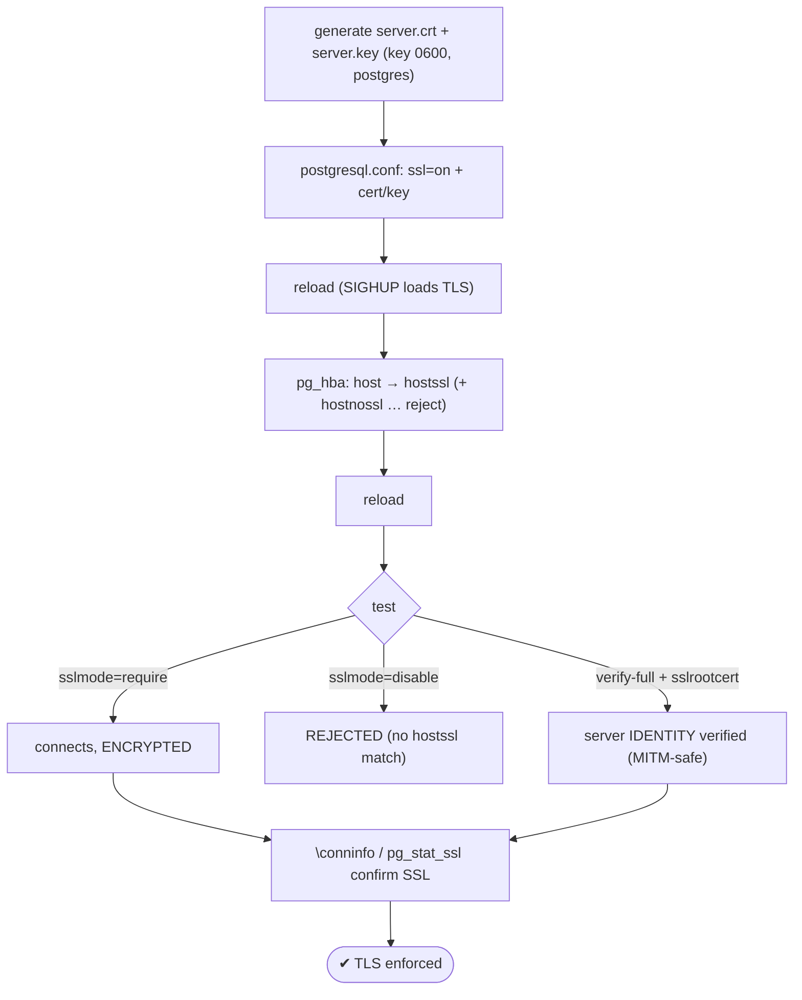
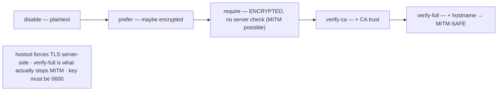

# Lab 45 — Configure TLS: Generate Certs, `ssl=on`, Force `hostssl`, Verify with `\conninfo`

> **Track A · DBA · A6 Security & Access Control · Lab 5 of 9 (Lab 45/222)**
> Teaching package: concept → diagram → steps → verify → quick-ref → self-test → video script.
> **Depends on:** Lab 06 (pg_hba/auth). **Feeds:** Lab 46 (client certs), Lab 177 (cert rotation).

---

## 0. Lab Card (at a glance)

| Field | Value |
|---|---|
| **Objective** | Enable TLS on the server, force encrypted connections via `hostssl`, and verify with `\conninfo` and `pg_stat_ssl`. |
| **Objective** | Server serves TLS; a non-SSL connection is rejected; `\conninfo` shows an SSL connection; `verify-full` validates the server. |
| **Scope boundary** | Server TLS + forcing it. Client-cert auth is Lab 46; rotation is Lab 177. |
| **Prereqs** | Lab 06; `openssl`; a client that can reach the server |
| **Time** | 30–40 min |
| **Difficulty** | ★★★☆☆ |
| **Risk** | **Medium** — forcing TLS can lock out misconfigured clients; keep local access. |

---

## 1. Learning Objectives

1. **Why TLS** — encrypt connections against sniffing/MITM.
2. **Generate + install** a server cert/key with correct permissions.
3. **Force TLS** with `hostssl` (and reject non-SSL).
4. **`sslmode` ladder** — why `verify-full` beats `require`.
5. **Verify** — `\conninfo`, `pg_stat_ssl`.

---

## 2. Concept Primer — the "why"

**Without TLS, the wire is plaintext.** SCRAM protects the *password* during auth, but query data, results, and everything else travel unencrypted over the network — sniffable on any untrusted path. **TLS** encrypts the whole connection, authenticates the server (and optionally the client, Lab 46), and prevents man-in-the-middle attacks.

**Server side — three pieces:**
1. A **certificate** (`server.crt`) and **private key** (`server.key`). For a lab, self-signed; in production, a cert from your internal PKI or a public CA.
2. `postgresql.conf`: `ssl = on`, `ssl_cert_file`, `ssl_key_file` (defaults are `server.crt`/`server.key` in `$PGDATA`). Enabling/reloading TLS works on **reload** (SIGHUP) — which also reloads rotated certs (Lab 177).
3. **Key permissions:** `server.key` must be **`0600`, owned by `postgres`** — PostgreSQL **refuses to start** with a group/world-readable key.

**Forcing TLS in `pg_hba.conf`.** The connection type controls SSL:
- **`host`** — allows both SSL and non-SSL TCP.
- **`hostssl`** — **SSL only**; non-SSL attempts don't match.
- **`hostnossl`** — non-SSL only.

To **force** TLS, use `hostssl` for your entries; a non-SSL client then finds **no matching line** and is rejected. For an explicit, clear rejection, add `hostnossl all all 0.0.0.0/0 reject`.

**Client side — the `sslmode` ladder (this is the security-critical part):**

| `sslmode` | Encrypts? | Verifies server? | MITM-safe? |
|---|---|---|---|
| `disable` | no | no | no |
| `prefer` (default) | if available | no | no |
| `require` | **yes** | **no** | **no** — encrypts, but you could be talking to an impostor |
| `verify-ca` | yes | cert signed by trusted CA | mostly |
| `verify-full` | yes | CA **and** hostname match | **yes** |

**`require` only encrypts — it does not verify the server**, so a man-in-the-middle with any cert can intercept. For real security, clients use **`verify-full`** with the CA cert (`sslrootcert`), which checks the cert chain *and* that the hostname matches. Encryption without verification is a false sense of safety.

**Verify.** In psql, `\conninfo` reports `SSL connection (protocol: TLSv1.3, cipher: …)`. The `pg_stat_ssl` view shows SSL status per backend (`ssl`, `version`, `cipher`, client-cert fields).

**Performance:** TLS adds a handshake per connection — another reason to **pool** (Lab 37), amortizing handshakes across many client requests.

---

## 3. Diagrams

### 3.1 Enable + force + verify flow



### 3.2 The sslmode ladder



---

## 4. Prerequisites

```bash
PGDATA=/var/lib/pgsql/17/data      # your data dir
which openssl
sudo -u postgres psql -c "SHOW ssl;"     # off (we'll enable)
```

---

## 5. Step-by-Step

### Step 1 — Generate a server certificate + key (self-signed for the lab)

```bash
sudo -u postgres openssl req -new -x509 -days 365 -nodes -text \
  -out "$PGDATA/server.crt" -keyout "$PGDATA/server.key" \
  -subj "/CN=$(hostname -f)"
sudo chmod 600 "$PGDATA/server.key" && sudo chown postgres:postgres "$PGDATA/server.key" "$PGDATA/server.crt"
ls -l "$PGDATA/server.key"          # must be -rw------- postgres
```
> Production: replace the self-signed cert with one from your CA (CN/SAN = the server's real hostname).

### Step 2 — Enable TLS in postgresql.conf

```bash
sudo -u postgres psql <<'SQL'
ALTER SYSTEM SET ssl = on;
ALTER SYSTEM SET ssl_min_protocol_version = 'TLSv1.2';
SQL
sudo systemctl reload postgresql-17
sudo -u postgres psql -c "SHOW ssl;"    # on   (restart if reload didn't flip it)
```

### Step 3 — Force TLS in pg_hba.conf (`hostssl` + reject non-SSL)

```bash
HBA=$(sudo -u postgres psql -tAc "SHOW hba_file;")
sudo tee -a "$HBA" >/dev/null <<'EOF'
# Lab 45 — force TLS
hostssl   all   all   0.0.0.0/0   scram-sha-256
hostnossl all   all   0.0.0.0/0   reject
EOF
sudo systemctl reload postgresql-17     # keep the local 'peer' admin line intact!
```

### Step 4 — Test: SSL required works, non-SSL rejected

```bash
# encrypted connection succeeds:
PGPASSWORD='AppPass!1' psql "host=$(hostname -f) dbname=benchdb user=app_user sslmode=require" -c "\conninfo"
#   → You are connected ... SSL connection (protocol: TLSv1.3, cipher: ...)

# non-SSL is rejected:
PGPASSWORD='AppPass!1' psql "host=$(hostname -f) dbname=benchdb user=app_user sslmode=disable" -c "SELECT 1;" 2>&1 | tail -1
#   → FATAL: no pg_hba.conf entry ... (or: connection requires a valid client certificate / SSL)
```

### Step 5 — Verify server identity with `verify-full` (MITM-safe)

```bash
# the client needs the CA/server cert to verify. Copy server.crt to the client as the root:
sudo cp "$PGDATA/server.crt" /tmp/root.crt
PGPASSWORD='AppPass!1' psql "host=$(hostname -f) dbname=benchdb user=app_user sslmode=verify-full sslrootcert=/tmp/root.crt" -c "\conninfo"
#   → SSL connection AND the server's identity is verified (fails if hostname/CA don't match)
```

### Step 6 — Confirm via pg_stat_ssl

```bash
PGPASSWORD='AppPass!1' psql "host=$(hostname -f) dbname=benchdb user=app_user sslmode=require" \
  -c "SELECT ssl, version, cipher FROM pg_stat_ssl WHERE pid = pg_backend_pid();"
#   → t | TLSv1.3 | <cipher>
```

---

## 6. Verification Checklist

- [ ] `server.key` is `0600`, owned by `postgres`
- [ ] `SHOW ssl` → **on**; server started/reloaded cleanly
- [ ] `hostssl` entry present; non-SSL rejected (`hostnossl … reject`)
- [ ] `sslmode=require` connects; `\conninfo` shows an SSL connection
- [ ] `sslmode=disable` is **rejected**
- [ ] `verify-full` with `sslrootcert` validates the server
- [ ] `pg_stat_ssl` shows `ssl=t`, TLS version, cipher

---

## 7. Troubleshooting

| Symptom | Cause | Fix |
|---|---|---|
| Server won't start: "could not load private key" / permissions | `server.key` not `0600`/wrong owner | `chmod 600` + `chown postgres` |
| `sslmode=disable` still connects | Plain `host` line still matches | Replace with `hostssl`; add `hostnossl … reject` |
| Client: "server does not support SSL" | `ssl=off` / not reloaded | `ssl=on`, reload (or restart) |
| `verify-full`: "hostname mismatch" | Cert CN/SAN ≠ connect host | Issue cert with the correct CN/SAN, or use `verify-ca` |
| `verify-ca/full`: "unable to get local issuer" | Client lacks the CA cert | Provide `sslrootcert=<ca/server.crt>` |
| Locked out over TCP | Forced TLS + misconfigured clients | Fix via the local `peer` admin line; correct pg_hba |
| Self-signed warning in tools | Expected in lab | Use a CA-issued cert in production |

---

## 8. Quick Reference Card (paste-ready)

```bash
PGDATA=/var/lib/pgsql/17/data
# 1. cert + key (self-signed lab; use a CA in prod)
sudo -u postgres openssl req -new -x509 -days 365 -nodes -text \
  -out "$PGDATA/server.crt" -keyout "$PGDATA/server.key" -subj "/CN=$(hostname -f)"
sudo chmod 600 "$PGDATA/server.key" && sudo chown postgres:postgres "$PGDATA/server.key" "$PGDATA/server.crt"

# 2. enable TLS
sudo -u postgres psql -c "ALTER SYSTEM SET ssl=on;" && sudo systemctl reload postgresql-17

# 3. force TLS in pg_hba (keep local peer admin line!)
HBA=$(sudo -u postgres psql -tAc "SHOW hba_file;")
printf 'hostssl all all 0.0.0.0/0 scram-sha-256\nhostnossl all all 0.0.0.0/0 reject\n' | sudo tee -a "$HBA"
sudo systemctl reload postgresql-17

# 4. verify
psql "host=$(hostname -f) dbname=benchdb user=app_user sslmode=require" -c "\conninfo"
psql "host=$(hostname -f) dbname=benchdb user=app_user sslmode=verify-full sslrootcert=/path/ca.crt" -c "\conninfo"

# hostssl = SSL only · require = encrypt-only (MITM possible) · verify-full = verify server (MITM-safe)
# key MUST be 0600/postgres · pool to amortize TLS handshakes (Lab 37)
```

---

## 9. Self-Check

1. What's the difference between `host`, `hostssl`, and `hostnossl`?
2. How do you force TLS for a set of connections?
3. Why is `sslmode=require` not enough for real security, and what fixes it?
4. What permission must `server.key` have, and what happens otherwise?
5. Two ways to confirm a connection is encrypted?
6. Does enabling `ssl` require a restart?

<details>
<summary>Answers</summary>

1. `host` allows SSL or non-SSL; `hostssl` allows **only** SSL; `hostnossl` allows **only** non-SSL.
2. Use `hostssl` entries (non-SSL then matches nothing) and add `hostnossl … reject` for an explicit refusal.
3. `require` encrypts but doesn't verify the server, so a MITM is possible; **`verify-full`** (with `sslrootcert`) verifies the CA chain and hostname.
4. `0600`, owned by `postgres` — otherwise PostgreSQL **refuses to start**.
5. `\conninfo` (shows the SSL line) and `pg_stat_ssl` (per-backend SSL status).
6. No — `ssl` is applied on **reload** (SIGHUP), which also reloads rotated certs.
</details>

---

## 10. Video / Teaching Script

| # | On screen | Say (narration) |
|---|---|---|
| 1 | Title: "Encrypt the wire: TLS for PostgreSQL" | "Without TLS, your queries and data cross the network in the clear. Let's fix that — and force it." |
| 2 | generate cert + chmod 600 | "A certificate and key. One rule that stops half of first attempts: the key must be 0600, owned by postgres, or the server won't start." |
| 3 | `ssl=on` + reload | "Turn SSL on and reload — no restart needed." |
| 4 | `hostssl` + reject | "Now force it. hostssl means SSL only; a plaintext client matches nothing. We add an explicit reject too." |
| 5 | require works, disable rejected | "Encrypted client? In. Plaintext client? Refused. Exactly the policy we want." |
| 6 | the require vs verify-full point | "But here's the trap: 'require' only *encrypts*. It doesn't check *who* you're talking to. Use verify-full — it validates the server's identity and stops man-in-the-middle." |
| 7 | `\conninfo` / pg_stat_ssl | "And to prove it — conninfo shows the TLS version and cipher. Done." |
| 8 | Outro | "Encrypted, verified connections. Next: going further — authenticating clients *by* certificate." |

---

## 11. Glossary

- **TLS/SSL** — encrypts and authenticates the connection.
- **`ssl` / `ssl_cert_file` / `ssl_key_file`** — enable TLS / cert / key.
- **`host` / `hostssl` / `hostnossl`** — pg_hba connection types (any / SSL-only / non-SSL-only).
- **`sslmode`** — client policy: disable…require…verify-ca…**verify-full**.
- **`sslrootcert`** — client's CA cert for verification.
- **`\conninfo` / `pg_stat_ssl`** — show a connection's SSL status.
- **MITM** — man-in-the-middle; blocked by `verify-full`.

---
*NETAPORT lab series · PostgreSQL 17 on AlmaLinux 9 · Lab 45/222 · A6 Security & Access Control*
