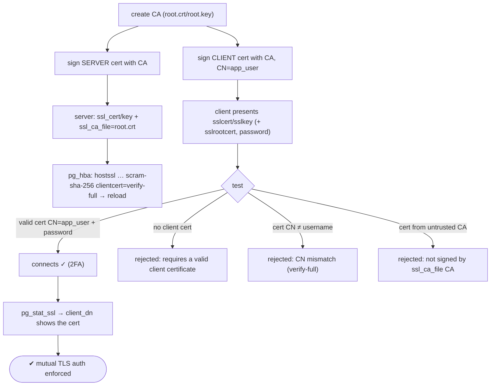
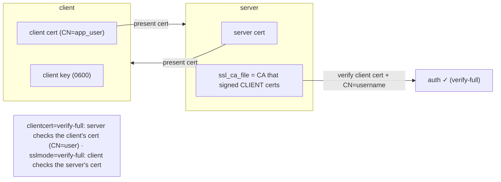

# Lab 46 — Client Certificate Authentication (`clientcert=verify-full`)

> **Track A · DBA · A6 Security & Access Control · Lab 6 of 9 (Lab 46/222)**
> Teaching package: concept → diagram → steps → verify → quick-ref → self-test → video script.
> **Depends on:** Lab 45 (server TLS). This adds client-side certificate auth — mutual TLS.

---

## 0. Lab Card (at a glance)

| Field | Value |
|---|---|
| **Objective** | Require clients to present a valid certificate whose CN matches the username (`clientcert=verify-full`), as a second factor alongside scram, and prove the enforcement. |
| **Success criterion** | A client with a valid CN-matching cert + password connects; no cert, wrong CN, or an untrusted-CA cert are all rejected. |
| **Scope boundary** | Client cert as an add-on (mTLS + password). The passwordless `cert` method is noted, not the focus. |
| **Prereqs** | Lab 45 (server TLS); a CA to sign certs |
| **Time** | 35–50 min |
| **Difficulty** | ★★★★☆ |
| **Risk** | Medium — a misissued/absent cert locks clients out; keep local access. |

---

## 1. Learning Objectives

1. **Mutual TLS** — the client authenticates by certificate, too.
2. **`clientcert` add-on** — a valid client cert *plus* the primary auth (2FA).
3. **`verify-ca` vs `verify-full`** — CA-signed vs CN-must-equal-username.
4. **The PKI pieces** — CA, server cert, client cert, `ssl_ca_file`.
5. **`clientcert=` vs the `cert` method** — second factor vs passwordless.

---

## 2. Concept Primer — the "why"

**Server TLS proved the *server's* identity (Lab 45). Client certs prove the *client's*.** In **mutual TLS (mTLS)**, both ends present certificates. The client authenticating **by certificate** gives strong, key-based identity — ideal for service-to-service, zero-trust, and high-security environments — and can be layered *on top of* a password.

**Two ways to use client certs in `pg_hba`:**
1. **`clientcert=` as an add-on** to another method (this lab):
   ```
   hostssl all all 0.0.0.0/0 scram-sha-256 clientcert=verify-full
   ```
   The client must present a valid cert **and** pass scram — effectively **two factors** (something you have: the cert/key; something you know: the password).
   - **`clientcert=verify-ca`** — the client cert must be signed by a trusted CA (any CN).
   - **`clientcert=verify-full`** — additionally, the cert's **CN must equal the database username** being connected as. This binds the certificate to the role: a cert with `CN=app_user` can only be used to log in as `app_user`.
2. **The `cert` method** — the certificate **is** the authentication, no password:
   ```
   hostssl all all 0.0.0.0/0 cert
   ```
   The cert's CN must match the username (or a `pg_ident` `map=` translates it). Passwordless, cert-only.

**What each side needs (the PKI):**
- A **CA** (`root.crt`/`root.key`) that signs both the server cert and the client certs.
- **Server:** `ssl_cert_file`/`ssl_key_file` (server cert), and **`ssl_ca_file` = the CA cert** used to **verify client certificates**.
- **Client:** `sslcert` (its cert), `sslkey` (its key, `0600`), and `sslrootcert` (the CA, to verify the server).
- For `verify-full`, the client cert's **CN = the PostgreSQL username**.

**Direction matters (don't conflate two "verify-full"s):** `clientcert=verify-full` is a **server-side** requirement on the *client's* cert; `sslmode=verify-full` (Lab 45) is a **client-side** requirement on the *server's* cert. Both can be in play at once — that's full mutual verification.

**Inspect:** `pg_stat_ssl` shows the client cert's `client_dn` (distinguished name), `client_serial`, and `issuer_dn` per backend.

---

## 3. Diagrams

### 3.1 Setup + test flow



### 3.2 Mutual TLS + the CN tie



---

## 4. Prerequisites

```bash
PGDATA=/var/lib/pgsql/17/data
CERTS=/etc/pgcerts && sudo mkdir -p $CERTS
sudo -u postgres psql -c "SHOW ssl;"     # on (Lab 45)
```

---

## 5. Step-by-Step

### Step 1 — Build a CA

```bash
cd /tmp
openssl req -new -x509 -days 3650 -nodes -text -out root.crt -keyout root.key -subj "/CN=Lab-CA"
```

### Step 2 — Server cert signed by the CA

```bash
openssl req -new -nodes -text -out server.csr -keyout server.key -subj "/CN=$(hostname -f)"
openssl x509 -req -in server.csr -text -days 365 -CA root.crt -CAkey root.key -CAcreateserial -out server.crt
sudo cp server.crt server.key root.crt "$PGDATA/"
sudo chmod 600 "$PGDATA/server.key" && sudo chown postgres:postgres "$PGDATA"/server.* "$PGDATA/root.crt"
```

### Step 3 — Client cert signed by the CA, **CN = app_user**

```bash
openssl req -new -nodes -text -out client.csr -keyout client.key -subj "/CN=app_user"   # CN MUST match the role
openssl x509 -req -in client.csr -text -days 365 -CA root.crt -CAkey root.key -CAcreateserial -out client.crt
chmod 600 client.key
```

### Step 4 — Server: point at the CA and require client certs

```bash
sudo -u postgres psql -c "ALTER SYSTEM SET ssl_ca_file = 'root.crt';"     # verifies CLIENT certs
HBA=$(sudo -u postgres psql -tAc "SHOW hba_file;")
# replace the Lab-45 hostssl line with one requiring a client cert:
sudo sed -i '/hostssl   all   all   0.0.0.0\/0   scram-sha-256$/d' "$HBA" 2>/dev/null || true
echo "hostssl all all 0.0.0.0/0 scram-sha-256 clientcert=verify-full" | sudo tee -a "$HBA"
sudo systemctl reload postgresql-17
```

### Step 5 — Connect WITH a valid CN-matching client cert (succeeds)

```bash
PGPASSWORD='AppPass!1' psql "host=$(hostname -f) dbname=benchdb user=app_user \
  sslmode=verify-full sslrootcert=/tmp/root.crt sslcert=/tmp/client.crt sslkey=/tmp/client.key" -c "\conninfo"
#   → connected: SSL connection + client certificate accepted
```

### Step 6 — Prove the rejections

```bash
# no client cert → rejected:
PGPASSWORD='AppPass!1' psql "host=$(hostname -f) dbname=benchdb user=app_user sslmode=require" -c "SELECT 1;" 2>&1 | tail -1
#   → FATAL: connection requires a valid client certificate

# cert whose CN != username (make one with CN=wrong), connect as app_user → rejected:
openssl req -new -nodes -out /tmp/wrong.csr -keyout /tmp/wrong.key -subj "/CN=intruder" 2>/dev/null
openssl x509 -req -in /tmp/wrong.csr -days 365 -CA /tmp/root.crt -CAkey /tmp/root.key -CAcreateserial -out /tmp/wrong.crt 2>/dev/null
chmod 600 /tmp/wrong.key
PGPASSWORD='AppPass!1' psql "host=$(hostname -f) dbname=benchdb user=app_user \
  sslmode=verify-full sslrootcert=/tmp/root.crt sslcert=/tmp/wrong.crt sslkey=/tmp/wrong.key" -c "SELECT 1;" 2>&1 | tail -1
#   → FATAL: certificate authentication failed for user "app_user" (CN mismatch)
```

### Step 7 — Verify via pg_stat_ssl

```bash
PGPASSWORD='AppPass!1' psql "host=$(hostname -f) dbname=benchdb user=app_user \
  sslmode=verify-full sslrootcert=/tmp/root.crt sslcert=/tmp/client.crt sslkey=/tmp/client.key" \
  -c "SELECT ssl, client_dn, issuer_dn FROM pg_stat_ssl WHERE pid = pg_backend_pid();"
#   → t | CN=app_user | CN=Lab-CA
```

---

## 6. Verification Checklist

- [ ] CA created; server + client certs signed by it
- [ ] Client cert `CN = app_user` (matches the role)
- [ ] `ssl_ca_file` set to the CA; `clientcert=verify-full` in pg_hba
- [ ] Valid cert + password connects (2FA)
- [ ] No client cert → rejected
- [ ] Cert with wrong CN → rejected
- [ ] `pg_stat_ssl.client_dn` shows the client cert DN

---

## 7. Troubleshooting

| Symptom | Cause | Fix |
|---|---|---|
| "connection requires a valid client certificate" | No cert presented | Provide `sslcert`/`sslkey` |
| "certificate authentication failed … CN mismatch" | `verify-full` CN ≠ username | Issue a cert with `CN=<username>`, or use `verify-ca` (+ `pg_ident map`) |
| Client cert not trusted | Signed by a CA not in `ssl_ca_file` | Sign with the right CA / set `ssl_ca_file` |
| Server won't load `ssl_ca_file` | Path/permissions | Place under `$PGDATA` or a readable path; fix perms |
| Client key rejected | Not `0600` | `chmod 600 client.key` |
| Confusing the two verify-fulls | `clientcert` (server-side) vs `sslmode` (client-side) | They verify opposite directions; both can apply |
| Want passwordless | Use the `cert` method instead of `scram + clientcert` |

---

## 8. Quick Reference Card (paste-ready)

```bash
# CA + server cert + CLIENT cert (CN=username)
openssl req -new -x509 -days 3650 -nodes -out root.crt -keyout root.key -subj "/CN=Lab-CA"
openssl req -new -nodes -out server.csr -keyout server.key -subj "/CN=$(hostname -f)"
openssl x509 -req -in server.csr -days 365 -CA root.crt -CAkey root.key -CAcreateserial -out server.crt
openssl req -new -nodes -out client.csr -keyout client.key -subj "/CN=app_user"   # CN = role
openssl x509 -req -in client.csr -days 365 -CA root.crt -CAkey root.key -CAcreateserial -out client.crt

# server: verify client certs + require them
sudo -u postgres psql -c "ALTER SYSTEM SET ssl_ca_file='root.crt';"        # (copy root.crt into PGDATA)
# pg_hba:  hostssl all all 0.0.0.0/0 scram-sha-256 clientcert=verify-full   (reload)

# client connects with its cert:
psql "host=$(hostname -f) dbname=benchdb user=app_user sslmode=verify-full \
  sslrootcert=root.crt sslcert=client.crt sslkey=client.key"

# clientcert=verify-ca: CA-signed cert (any CN) | verify-full: CN MUST = username
# clientcert= is an ADD-ON (cert + password = 2FA) | 'cert' method = cert-only (passwordless)
# clientcert (server verifies client) vs sslmode=verify-full (client verifies server)
```

---

## 9. Self-Check

1. What does `clientcert=verify-full` require, and in addition to what?
2. Difference between `clientcert=verify-ca` and `verify-full`?
3. How does `clientcert=` differ from the `cert` auth method?
4. Which server setting verifies client certificates?
5. What does the client present to authenticate?
6. How do you confirm a client certificate was used?

<details>
<summary>Answers</summary>

1. A valid client certificate whose **CN equals the connecting username**, **in addition** to the primary method (e.g. scram) — effectively two factors.
2. `verify-ca` requires a CA-signed cert (any CN); `verify-full` additionally requires the cert's **CN to equal the username**.
3. `clientcert=` is an **add-on** to another method (cert + password); the `cert` method makes the certificate the **sole** authentication (passwordless).
4. `ssl_ca_file` — the CA cert that signed the client certificates.
5. `sslcert` (its cert), `sslkey` (its key), and `sslrootcert` (to verify the server).
6. `pg_stat_ssl` — `client_dn`/`issuer_dn` (and `\conninfo` shows the SSL connection).
</details>

---

## 10. Video / Teaching Script

| # | On screen | Say (narration) |
|---|---|---|
| 1 | Title: "Now the *client* proves who it is" | "Last lab, the server showed its certificate. Now we flip it — the client must present one too. Mutual TLS." |
| 2 | build CA + certs | "We need a CA to sign both ends. Note the client cert's CN — it's the username. That link is the whole point." |
| 3 | `ssl_ca_file` + `clientcert=verify-full` | "Tell the server which CA to trust for clients, and require a cert whose CN matches the login." |
| 4 | valid connect | "With the right cert and the password, we're in — that's two factors: a key you hold and a password you know." |
| 5 | no cert / wrong CN | "No cert? Refused. A cert that says 'intruder' trying to log in as app_user? Refused. The certificate is bound to the identity." |
| 6 | pg_stat_ssl | "And the proof — the exact certificate distinguished name, recorded on the connection." |
| 7 | Outro | "Strong, key-based client auth. Next: SECURITY DEFINER functions — and the search_path trap that makes them dangerous." |

---

## 11. Glossary

- **Mutual TLS (mTLS)** — both client and server present certificates.
- **`clientcert=verify-ca` / `verify-full`** — client cert CA-signed / CN must equal username.
- **`cert` method** — certificate as the sole authentication (passwordless).
- **`ssl_ca_file`** — CA cert used to verify client certificates.
- **`sslcert` / `sslkey` / `sslrootcert`** — client cert / key / CA-to-verify-server.
- **`pg_stat_ssl.client_dn`** — the presented client certificate's DN.
- **CN = username** — the identity binding `verify-full` enforces.

---
*NETAPORT lab series · PostgreSQL 17 on AlmaLinux 9 · Lab 46/222 · A6 Security & Access Control*
