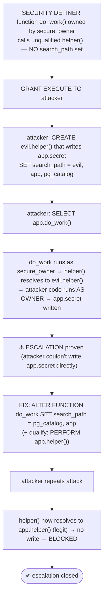

# Lab 47 — `SET ROLE` / `SECURITY DEFINER` Functions; Privilege-Escalation Risk and the `search_path` Fix

> **Track A · DBA · A6 Security & Access Control · Lab 7 of 9 (Lab 47/222)**
> Teaching package: concept → diagram → steps → verify → quick-ref → self-test → video script.
> **Depends on:** Labs 41–44 (roles, privileges, schemas). One of PostgreSQL's most important security topics.

---

## 0. Lab Card (at a glance)

| Field | Value |
|---|---|
| **Objective** | Build a `SECURITY DEFINER` function, demonstrate a real privilege-escalation attack via `search_path`, then block it with the function-level `search_path` fix and schema qualification. |
| **Success criterion** | The vulnerable function lets a low-privilege role run code as the owner; after the fix, the same attack fails. |
| **Scope boundary** | SECURITY DEFINER safety + search_path. Auditing is Lab 48. |
| **Prereqs** | Labs 41–44 (secdb, app schema, roles) |
| **Time** | 30–45 min |
| **Difficulty** | ★★★★☆ |
| **Risk** | Low in lab — but the vulnerability is high-severity in production. |

---

## 1. Learning Objectives

1. **DEFINER vs INVOKER** — whose privileges a function runs with.
2. **The escalation vector** — unqualified names + caller-controlled `search_path`.
3. **Build the attack** — see a low-priv role execute as the owner.
4. **The fix** — function-level `SET search_path` + schema qualification.
5. **Defense in depth** — restrict EXECUTE, minimal owner, harden `public`.

---

## 2. Concept Primer — the "why"

**`SECURITY DEFINER` is setuid for the database.**
- **`SECURITY INVOKER`** (default): the function runs with the **caller's** privileges.
- **`SECURITY DEFINER`**: the function runs with the **owner's** privileges, whoever calls it. This enables *controlled elevation* — a low-privilege role can perform one specific, validated privileged action *through* the function without holding the underlying privilege directly.

That power is exactly why it's dangerous.

**The escalation vector — `search_path` hijacking.** Inside a function, an **unqualified** object name (`helper()`, `sometable`) is resolved using the **session's `search_path`** — and by default that's the **caller's** `search_path`. So:
1. A `SECURITY DEFINER` function (owned by a privileged role, maybe superuser) calls `helper()` unqualified and doesn't set its own `search_path`.
2. An attacker who can `EXECUTE` it **creates their own `helper()`** in a schema they control and puts that schema **first** in their `search_path`.
3. When the function runs, `helper()` resolves to the **attacker's** function — which now executes **with the owner's privileges**. The attacker runs arbitrary code as the definer (superuser takeover, if the owner is one).

This is a textbook privilege-escalation bug, and it's common in real code.

**The fix — pin the function's `search_path`.** Set a **fixed, safe** `search_path` on the function so it **ignores the caller's**:
```
CREATE FUNCTION … SECURITY DEFINER SET search_path = pg_catalog, app AS …
-- or: ALTER FUNCTION … SET search_path = pg_catalog, app;
```
Put `pg_catalog` first (built-ins resolve safely) and only trusted schemas after — **never a schema writable by untrusted users** (like `public`, if they can create there). The attacker can no longer inject objects into the resolution path.

**Defense in depth:**
- **Fully schema-qualify** every object reference in the body (`app.helper()`, `app.secret`) — unambiguous regardless of `search_path`.
- **Restrict EXECUTE** to intended roles (not `PUBLIC`).
- **Give the function a minimal-privilege owner**, not a superuser — so even a bypass is bounded.
- **Harden `public`** — PG15+ already removes `CREATE` on `public` from `PUBLIC`, but don't rely on that alone; the `search_path` pin is the real fix. *(Also mind `pg_temp`, which is searched implicitly — a pinned `search_path` plus qualification neutralizes temp-object tricks.)*

**`SET ROLE` (contrast).** `SET ROLE` is *interactive* elevation: a session assumes a role it's a **member of** (Lab 41's `NOINHERIT` used this). `SECURITY DEFINER` is *programmatic*: the function runs as its owner regardless of who calls it. Both change the effective privileges; the risk profiles differ.

---

## 3. Diagrams

### 3.1 Attack then fix



### 3.2 Why it happens

```mermaid
flowchart LR
    CALL["low-priv caller invokes SECURITY DEFINER fn"] --> RES{"unqualified name resolved via WHOSE search_path?"}
    RES -->|caller's (default)| ATT["attacker's object → runs as OWNER (escalation) ✗"]
    RES -->|function's own (SET search_path)| SAFE["intended object → safe ✓"]
    note["DEFINER = runs as owner · unqualified + caller search_path = hijack · pin search_path + qualify = fix"]
```

---

## 4. Prerequisites

```bash
sudo -u postgres psql -d secdb -c "CREATE ROLE secure_owner NOLOGIN;" 2>/dev/null || true
sudo -u postgres psql -d secdb -c "CREATE ROLE attacker LOGIN PASSWORD 'AtkPass!1';" 2>/dev/null || true
sudo -u postgres psql -d secdb -c "GRANT USAGE ON SCHEMA app TO attacker;"
```

---

## 5. Step-by-Step

### Step 1 — A restricted table + a VULNERABLE SECURITY DEFINER function

```bash
sudo -u postgres psql -d secdb <<'SQL'
-- restricted table only secure_owner may write:
SET ROLE secure_owner;   -- (grant membership first if needed)
RESET ROLE;
GRANT secure_owner TO postgres;   -- so we can SET ROLE for setup
SET ROLE secure_owner;
CREATE TABLE app.secret (data text);
CREATE FUNCTION app.helper() RETURNS void LANGUAGE plpgsql AS $$ BEGIN /* legit no-op */ END; $$;
-- VULNERABLE: SECURITY DEFINER, unqualified helper(), NO search_path pinned
CREATE FUNCTION app.do_work() RETURNS void LANGUAGE plpgsql SECURITY DEFINER AS $$
BEGIN
  PERFORM helper();          -- unqualified → resolved via CALLER's search_path
END; $$;
RESET ROLE;
GRANT EXECUTE ON FUNCTION app.do_work() TO attacker;
SQL
```

### Step 2 — Confirm the attacker can't write the table directly

```bash
sudo -u postgres psql -d secdb -c "SET ROLE attacker; INSERT INTO app.secret VALUES('direct');" 2>&1 | tail -1
#   → ERROR: permission denied for table secret
```

### Step 3 — The attack: plant a malicious helper() and hijack search_path

```bash
sudo -u postgres psql -d secdb <<'SQL'
-- give attacker a schema they control (simulates CREATE somewhere they own):
CREATE SCHEMA evil AUTHORIZATION attacker;
SET ROLE attacker;
CREATE FUNCTION evil.helper() RETURNS void LANGUAGE plpgsql AS $$
BEGIN INSERT INTO app.secret VALUES('pwned-by-attacker'); END; $$;
SET search_path = evil, app, pg_catalog;   -- put attacker's schema FIRST
SELECT app.do_work();                        -- runs as secure_owner; helper() → evil.helper() → writes app.secret
RESET ROLE;
SQL
sudo -u postgres psql -d secdb -c "SELECT * FROM app.secret;"   # 'pwned-by-attacker' present → ESCALATION
```

### Step 4 — The fix: pin the function's search_path (+ qualify)

```bash
sudo -u postgres psql -d secdb <<'SQL'
SET ROLE secure_owner;
ALTER FUNCTION app.do_work() SET search_path = pg_catalog, app;   -- ignore caller's search_path
-- belt-and-suspenders: qualify the call
CREATE OR REPLACE FUNCTION app.do_work() RETURNS void LANGUAGE plpgsql SECURITY DEFINER
  SET search_path = pg_catalog, app AS $$
BEGIN
  PERFORM app.helper();     -- fully qualified
END; $$;
RESET ROLE;
SQL
```

### Step 5 — Re-run the attack: now blocked

```bash
sudo -u postgres psql -d secdb -c "TRUNCATE app.secret;"    # clear the earlier proof
sudo -u postgres psql -d secdb <<'SQL'
SET ROLE attacker;
SET search_path = evil, app, pg_catalog;      -- attacker tries the same trick
SELECT app.do_work();                          -- do_work now uses its OWN search_path → app.helper (no-op)
RESET ROLE;
SQL
sudo -u postgres psql -d secdb -c "SELECT count(*) FROM app.secret;"   # 0 → attack BLOCKED
```

### Step 6 — Harden further

```bash
sudo -u postgres psql -d secdb <<'SQL'
REVOKE EXECUTE ON FUNCTION app.do_work() FROM PUBLIC;                 -- least-privilege EXECUTE
REVOKE CREATE ON SCHEMA public FROM PUBLIC;                          -- (default since PG15) no planting in public
SQL
```

---

## 6. Verification Checklist

- [ ] Attacker cannot write `app.secret` directly
- [ ] **Vulnerable** version: the attack writes `app.secret` (escalation proven)
- [ ] Function fixed with `SET search_path = pg_catalog, app`
- [ ] Object references schema-qualified (`app.helper()`)
- [ ] **Fixed** version: the same attack writes nothing (blocked)
- [ ] EXECUTE restricted (not PUBLIC); `public` CREATE revoked from PUBLIC
- [ ] You can explain why a superuser-owned definer function is worst-case

---

## 7. Troubleshooting

| Symptom | Cause | Fix |
|---|---|---|
| Attack still works after "fix" | `search_path` not pinned on the function, or a writable schema still in it | `SET search_path` to trusted schemas only; exclude `public`/writable |
| Function can't find its objects | Pinned `search_path` omits a needed schema | Include the trusted schema (and `pg_catalog`) |
| Names still ambiguous | Body uses unqualified references | Schema-qualify all objects |
| `pg_temp` bypass | Temp objects searched implicitly | Pin `search_path` + qualify (neutralizes it) |
| Anyone can call it | EXECUTE granted to PUBLIC | `REVOKE EXECUTE … FROM PUBLIC`; grant to intended roles |
| Escalation = full takeover | Definer is a superuser | Own definer functions with a **minimal** role |

---

## 8. Quick Reference Card (paste-ready)

```sql
-- SAFE SECURITY DEFINER template:
CREATE FUNCTION app.do_work() RETURNS void
  LANGUAGE plpgsql SECURITY DEFINER
  SET search_path = pg_catalog, app        -- pin it! ignore caller's search_path
AS $$
BEGIN
  PERFORM app.helper();                    -- fully schema-qualified
END; $$;
REVOKE EXECUTE ON FUNCTION app.do_work() FROM PUBLIC;   -- least privilege
GRANT  EXECUTE ON FUNCTION app.do_work() TO intended_role;

-- RULES for every SECURITY DEFINER function:
--  1. SET search_path = pg_catalog, <trusted schemas>  (never a writable schema like public)
--  2. schema-qualify ALL object references
--  3. restrict EXECUTE to intended roles
--  4. own it with a MINIMAL role, not a superuser
-- INVOKER (default) = runs as caller · DEFINER = runs as owner (setuid) · SET ROLE = interactive elevation
```

---

## 9. Self-Check

1. What's the difference between `SECURITY DEFINER` and `SECURITY INVOKER`?
2. Describe the `search_path` privilege-escalation vector.
3. What is the primary fix?
4. Name two additional defenses.
5. Why is a superuser-owned `SECURITY DEFINER` function especially dangerous?
6. How does `SET ROLE` differ from `SECURITY DEFINER`?

<details>
<summary>Answers</summary>

1. `DEFINER` runs with the **owner's** privileges; `INVOKER` (default) runs with the **caller's**.
2. An unqualified name in a definer function resolves via the **caller's `search_path`**; an attacker plants a same-named object in a schema they control, puts it first, and their code then runs with the owner's privileges.
3. Pin the function's own `search_path` (`SET search_path = pg_catalog, <trusted>`) so it ignores the caller's.
4. Fully **schema-qualify** references; **restrict EXECUTE**; use a **minimal-privilege owner**; revoke `CREATE` on `public` from `PUBLIC`.
5. A successful hijack runs arbitrary code as a superuser — full cluster takeover.
6. `SET ROLE` is interactive elevation to a role you're a member of; `SECURITY DEFINER` makes a function run as its owner regardless of who calls it.
</details>

---

## 10. Video / Teaching Script

| # | On screen | Say (narration) |
|---|---|---|
| 1 | Title: "The function that becomes a superuser" | "SECURITY DEFINER is setuid for your database — powerful, and if you're careless, a straight path to full takeover." |
| 2 | vulnerable function | "Here's an innocent-looking function. It calls helper — unqualified. That one word is the whole vulnerability." |
| 3 | attacker can't write directly | "Our attacker can't touch this secret table. Watch how they do it anyway." |
| 4 | plant evil.helper + search_path | "They create their *own* helper, put their schema first in the search path, and call the function." |
| 5 | 'pwned' appears | "And there it is — the attacker's code ran as the owner. They just escalated their privileges." |
| 6 | the fix | "The fix is one line: pin the function's search path so it ignores the caller. And qualify your names." |
| 7 | attack blocked | "Same attack now — nothing. The function resolves to the real helper, every time." |
| 8 | Outro | "Every SECURITY DEFINER function needs a pinned search path and qualified names. No exceptions. Next: auditing who did what, with pgaudit." |

---

## 11. Glossary

- **`SECURITY DEFINER` / `INVOKER`** — run as function owner / as caller.
- **`search_path`** — schema search order for unqualified names.
- **Privilege escalation** — gaining the owner's privileges via a hijacked function.
- **Schema qualification** — naming objects as `schema.object`.
- **`SET search_path` (function-level)** — pins resolution, ignoring the caller.
- **`SET ROLE`** — interactively assume a role you're a member of.
- **`pg_temp`** — implicitly searched temp schema (a hijack surface).

---
*NETAPORT lab series · PostgreSQL 17 on AlmaLinux 9 · Lab 47/222 · A6 Security & Access Control*
