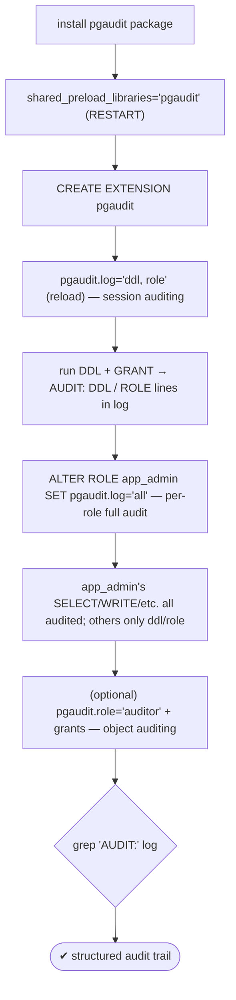
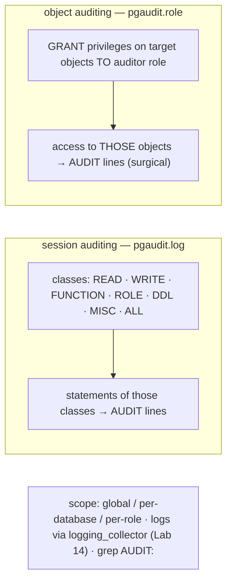

# Lab 48 — Audit Logging with `pgaudit`: Log DDL and Specific Role Activity

> **Track A · DBA · A6 Security & Access Control · Lab 8 of 9 (Lab 48/222)**
> Teaching package: concept → diagram → steps → verify → quick-ref → self-test → video script.
> **Depends on:** Lab 14 (logging_collector) and Lab 41 (roles). **Feeds:** Lab 203 (compliance access review).

---

## 0. Lab Card (at a glance)

| Field | Value |
|---|---|
| **Objective** | Install and configure `pgaudit` to log all DDL, log role/GRANT activity, and fully audit a specific privileged role, then read the structured audit records. |
| **Success criterion** | `AUDIT:` entries appear in the server log for DDL and role changes; a per-role setting fully audits one role while others aren't. |
| **Scope boundary** | pgaudit session + object auditing. General logging config was Lab 14. |
| **Prereqs** | Lab 14 (logging on); Lab 41 (roles); the pgaudit package |
| **Time** | 30–40 min |
| **Difficulty** | ★★★☆☆ |
| **Risk** | Low — additive; `pgaudit.log='all'` can be noisy (scope it). |

---

## 1. Learning Objectives

1. **Why pgaudit** — structured, compliance-grade audit vs coarse `log_statement`.
2. **Install it** — `shared_preload_libraries` + `CREATE EXTENSION`.
3. **Session auditing** — audit classes (`DDL`, `ROLE`, `WRITE`…).
4. **Per-role auditing** — fully audit one role via `ALTER ROLE … SET`.
5. **Object auditing** — surgical per-object logging via `pgaudit.role`.

---

## 2. Concept Primer — the "why"

**`log_statement` is too coarse for compliance.** `log_statement='ddl'` records DDL, but as plain log lines with no structure. **`pgaudit`** produces **structured audit records** — statement class, command, object type/name, the full statement, and (optionally) parameters — the kind of trail auditors expect (**PCI-DSS requirement 10**, **HIPAA** audit controls, SOX). It answers *who did what, when* in a parseable form.

**Two auditing modes:**
1. **Session auditing (`pgaudit.log`)** — logs statements by **class**:
   - `READ` (SELECT, COPY FROM), `WRITE` (INSERT/UPDATE/DELETE/TRUNCATE), `FUNCTION` (calls/DO), `ROLE` (GRANT/REVOKE/CREATE·ALTER·DROP ROLE), `DDL` (other CREATE/ALTER/DROP), `MISC`, `MISC_SET`, or `ALL`.
   - e.g. `pgaudit.log = 'ddl, role'` audits schema changes and privilege changes.
2. **Object auditing (`pgaudit.role`)** — logs access based on **privileges granted to a designated audit role**. Create an `auditor` role, `GRANT SELECT ON sensitive_table TO auditor`, set `pgaudit.role='auditor'`, and pgaudit logs any access to *exactly those objects* — surgical, per-object.

**Scoping — audit what matters, not everything.** `pgaudit.log` can be set:
- **globally** (`ALTER SYSTEM SET pgaudit.log='ddl'`),
- **per-database** (`ALTER DATABASE d SET pgaudit.log='ddl'`),
- **per-role** (`ALTER ROLE app_admin SET pgaudit.log='all'`) — the pattern for *"audit privileged accounts in full, everyone else lightly."*

**Installation reality.** pgaudit is a shared library, so it must be in **`shared_preload_libraries`** (a `postmaster` param → **restart**), then `CREATE EXTENSION pgaudit;` in the database. It writes through the **standard logging facility**, so you need `logging_collector` on (Lab 14) — audit lines land in the log files, greppable for `AUDIT:`.

**Log line shape:**
```
AUDIT: SESSION,1,1,DDL,CREATE TABLE,TABLE,app.foo,"CREATE TABLE app.foo (...)",<params>
```
Fields: audit type (SESSION/OBJECT), statement/substatement id, **class**, **command**, **object type**, **object name**, the **statement**, parameters. `pgaudit.log_parameter=on` adds bound parameter values.

**Cost:** auditing `ALL` everywhere is expensive and noisy — scope narrowly (DDL + ROLE cluster-wide, full audit only for privileged roles/objects).

---

## 3. Diagrams

### 3.1 Setup + audit flow



### 3.2 Session vs object auditing



---

## 4. Prerequisites

```bash
sudo -u postgres psql -c "SHOW logging_collector;"      # on (Lab 14) — pgaudit logs via the collector
sudo dnf install -y pgaudit_17 2>/dev/null || sudo dnf install -y pgaudit17_17    # PGDG name may vary; check: dnf search pgaudit
```

---

## 5. Step-by-Step

### Step 1 — Load the library and create the extension

```bash
sudo -u postgres psql -c "ALTER SYSTEM SET shared_preload_libraries = 'pgaudit';"   # postmaster → RESTART
sudo systemctl restart postgresql-17
sudo -u postgres psql -c "SHOW shared_preload_libraries;"                            # pgaudit
sudo -u postgres psql -d secdb -c "CREATE EXTENSION IF NOT EXISTS pgaudit;"
```

### Step 2 — Session auditing: log DDL and role changes

```bash
sudo -u postgres psql -c "ALTER SYSTEM SET pgaudit.log = 'ddl, role'; SELECT pg_reload_conf();"
sudo -u postgres psql -c "ALTER SYSTEM SET pgaudit.log_parameter = 'on'; SELECT pg_reload_conf();"
# run a DDL and a role change:
sudo -u postgres psql -d secdb -c "CREATE TABLE app.audit_demo (id int);"
sudo -u postgres psql -d secdb -c "GRANT SELECT ON app.audit_demo TO reporter;"
```

### Step 3 — Read the audit trail

```bash
PGDATA=/var/lib/pgsql/17/data
sudo grep "AUDIT:" "$PGDATA"/log/postgresql-$(date +%a).log | tail -10
#   → AUDIT: SESSION,...,DDL,CREATE TABLE,TABLE,app.audit_demo,"CREATE TABLE app.audit_demo (id int)",...
#   → AUDIT: SESSION,...,ROLE,GRANT,,,"GRANT SELECT ON app.audit_demo TO reporter",...
```

### Step 4 — Per-role auditing: fully audit one privileged role

```bash
# audit EVERYTHING app_admin does, while others stay at ddl/role only:
sudo -u postgres psql -c "ALTER ROLE admin_bob SET pgaudit.log = 'all';"
# admin_bob reconnects, then runs a mix — all classes captured:
sudo -u postgres psql -d secdb -c "SET ROLE admin_bob; SET ROLE app_admin; SELECT count(*) FROM app.customers; INSERT INTO app.audit_demo VALUES (1);"
sleep 1
sudo grep "AUDIT:" "$PGDATA"/log/postgresql-$(date +%a).log | grep -E "READ|WRITE" | tail -5
#   → READ (SELECT) and WRITE (INSERT) lines — captured only because admin_bob is fully audited
```

### Step 5 — (Optional) object auditing: audit access to specific objects

```bash
sudo -u postgres psql -d secdb <<'SQL'
CREATE ROLE auditor NOLOGIN;
GRANT SELECT ON app.employees TO auditor;     -- audit reads of this sensitive table only
SQL
sudo -u postgres psql -c "ALTER SYSTEM SET pgaudit.role = 'auditor'; SELECT pg_reload_conf();"
sudo -u postgres psql -d secdb -c "SELECT id, name FROM app.employees;"
sudo grep "AUDIT: OBJECT" "$PGDATA"/log/postgresql-$(date +%a).log | tail -3    # per-object audit lines
```

---

## 6. Verification Checklist

- [ ] `pgaudit` in `shared_preload_libraries`; extension created
- [ ] `logging_collector` on (audit lines reach the log)
- [ ] DDL produces `AUDIT: … DDL …` entries
- [ ] GRANT/role changes produce `AUDIT: … ROLE …` entries
- [ ] Per-role `pgaudit.log='all'` captures READ/WRITE for that role only
- [ ] (Optional) object auditing logs access to the granted objects
- [ ] Statements (and parameters) are captured in the audit records

---

## 7. Troubleshooting

| Symptom | Cause | Fix |
|---|---|---|
| `CREATE EXTENSION pgaudit` fails | Package missing / not preloaded | Install `pgaudit_17`; add to `shared_preload_libraries` + restart |
| No `AUDIT:` lines | `logging_collector` off / `pgaudit.log` empty | Enable logging (Lab 14); set `pgaudit.log` |
| Too much log volume | `pgaudit.log='all'` globally | Scope to `ddl,role` globally; `all` per privileged role/object |
| Per-role setting not applied | `ALTER ROLE … SET` applies on next connection | Reconnect the role |
| Object auditing silent | `pgaudit.role` unset / auditor lacks grants | Set `pgaudit.role`; grant privileges to the audit role |
| Parameters not shown | `pgaudit.log_parameter` off | `ALTER SYSTEM SET pgaudit.log_parameter='on'` |
| Preload change ignored | `shared_preload_libraries` needs restart | Restart (postmaster context) |

---

## 8. Quick Reference Card (paste-ready)

```bash
# install + load (RESTART for shared_preload_libraries)
sudo dnf install -y pgaudit_17
sudo -u postgres psql -c "ALTER SYSTEM SET shared_preload_libraries='pgaudit';" && sudo systemctl restart postgresql-17
sudo -u postgres psql -d secdb -c "CREATE EXTENSION IF NOT EXISTS pgaudit;"

# session auditing: DDL + role changes (reload)
sudo -u postgres psql -c "ALTER SYSTEM SET pgaudit.log='ddl, role'; ALTER SYSTEM SET pgaudit.log_parameter='on'; SELECT pg_reload_conf();"

# per-role FULL audit (privileged accounts)
sudo -u postgres psql -c "ALTER ROLE admin_bob SET pgaudit.log='all';"        # reconnect to apply

# object auditing (surgical, per-object)
sudo -u postgres psql -d secdb -c "CREATE ROLE auditor NOLOGIN; GRANT SELECT ON app.employees TO auditor;"
sudo -u postgres psql -c "ALTER SYSTEM SET pgaudit.role='auditor'; SELECT pg_reload_conf();"

# read the trail:
sudo grep "AUDIT:" /var/lib/pgsql/17/data/log/postgresql-$(date +%a).log

# classes: READ WRITE FUNCTION ROLE DDL MISC MISC_SET ALL · scope: system/database/role
# for compliance (PCI req 10 / HIPAA): DDL+ROLE cluster-wide, ALL for privileged roles/objects
```

---

## 9. Self-Check

1. What does pgaudit give you over `log_statement`?
2. How is pgaudit loaded and enabled?
3. What's the difference between session and object auditing?
4. How do you fully audit a single privileged role but not others?
5. Which audit classes cover DDL and role/privilege changes?
6. Where do audit records go, and how do you read them?

<details>
<summary>Answers</summary>

1. **Structured, compliance-grade** audit records — class, command, object, full statement, parameters — vs coarse by-type lines.
2. Add `pgaudit` to `shared_preload_libraries` (restart) and `CREATE EXTENSION pgaudit`.
3. Session auditing (`pgaudit.log`) logs statements by **class**; object auditing (`pgaudit.role` + grants) logs access to **specific objects**.
4. `ALTER ROLE <role> SET pgaudit.log='all'` — scoped to that role; others keep the global/lighter setting.
5. `DDL` (schema changes) and `ROLE` (GRANT/REVOKE, CREATE/ALTER/DROP ROLE).
6. Into the server log via `logging_collector` — `grep "AUDIT:"` the log files.
</details>

---

## 10. Video / Teaching Script

| # | On screen | Say (narration) |
|---|---|---|
| 1 | Title: "Who did what: audit logging with pgaudit" | "For compliance, 'we log statements' isn't enough. Auditors want structured records of who did what. That's pgaudit." |
| 2 | preload + extension | "It's a shared library, so it loads at startup — one restart — then create the extension." |
| 3 | `pgaudit.log='ddl, role'` | "Start with the essentials: every schema change, every grant. Run one — and there's the audit line, fully structured." |
| 4 | grep AUDIT | "Command, object, the full statement. That's an audit trail, not a log smear." |
| 5 | per-role 'all' | "Now the surgical part: audit *everything* a privileged admin does — while ordinary roles stay light. One line, scoped to the role." |
| 6 | object auditing | "Or go the other way: audit access to one sensitive table, whoever touches it. Grant it to an audit role, and pgaudit watches it." |
| 7 | Outro | "A compliance-grade trail, scoped to what matters. Next, the last security lab: safely retiring a role that owns things." |

---

## 11. Glossary

- **pgaudit** — extension for structured audit logging.
- **Session auditing (`pgaudit.log`)** — audit by statement class.
- **Object auditing (`pgaudit.role`)** — audit by grants to an audit role.
- **Audit classes** — READ / WRITE / FUNCTION / ROLE / DDL / MISC / ALL.
- **`shared_preload_libraries`** — where pgaudit must be loaded (restart).
- **`AUDIT:` line** — the structured audit record in the server log.
- **`pgaudit.log_parameter`** — include bound parameter values.

---
*NETAPORT lab series · PostgreSQL 17 on AlmaLinux 9 · Lab 48/222 · A6 Security & Access Control*
